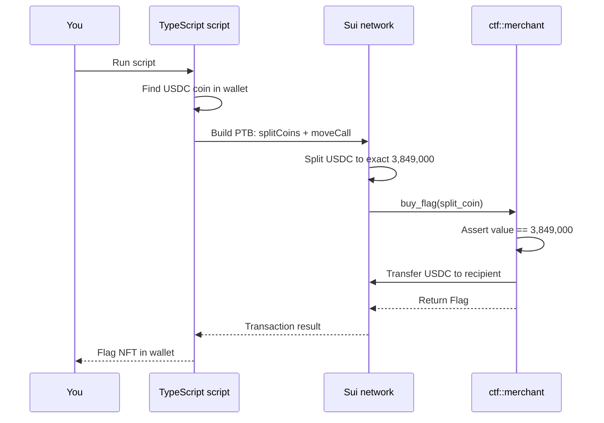

The Merchant CTF Challenge is a Capture the Flag exercise where you buy a flag from a Move contract that accepts exactly 3,849,000 USDC units as payment. The contract itself has no vulnerability. The challenge tests whether you can acquire a non-native token on Testnet, split it to the exact amount, and build a [programmable transaction block (PTB)](/develop/transactions/ptbs/building-ptb) that calls a Move function with the correct [coin](/onchain-finance/fungible-tokens/coin) argument. The challenge runs on Testnet against a [deployed contract](https://github.com/MystenLabs/CTF).

## When to use this pattern

Use this pattern when you need to:

- Build transactions that pass `Coin<T>` arguments with exact amounts to Move functions.

- Learn how to acquire, split, and manage non-SUI tokens (like USDC) on Testnet.

- Understand the `Coin` type and how `splitCoins` works in a programmable transaction block (PTB).

- Practice the end-to-end flow of building, signing, and executing a Sui transaction with the TypeScript SDK.

## What you learn

This example teaches:

- **Exact coin payments:** The `buy_flag` function asserts the payment coin has exactly `3,849,000` units. You must split your USDC coin to this precise value before calling the function. Passing a coin with more or less aborts the transaction.

- **Coin splitting in PTBs:** The `tx.splitCoins` command creates a new coin with the specified amount from an existing coin. The new coin can be passed as an argument to a subsequent `tx.moveCall` in the same PTB.

- **Non-SUI token handling:** USDC is a `Coin<USDC>` type, not `Coin<SUI>`. You cannot split it from gas. You must own a USDC coin object and reference it by ID in the transaction.

- **Move function calls from TypeScript:** The TS SDK's `tx.moveCall` takes a `target` string (`package::module::function`), type arguments, and regular arguments. The return value can be captured and transferred or used in subsequent PTB commands.

## Architecture

The challenge has 1 Move function and 1 TypeScript script. The TypeScript script builds a PTB that splits your USDC coin to exactly 3,849,000 units, calls `ctf::merchant::buy_flag` with the split coin, and receives a `Flag` NFT in return. The contract transfers the USDC to a fixed recipient address.

The diagram below traces the transaction.



The following steps walk through the transaction:

1. The script queries your wallet for a `Coin<USDC>` object with at least 3,849,000 units.

2. The script builds a PTB with 2 commands: `splitCoins` to create a coin with exactly 3,849,000 units, and `moveCall` to call `buy_flag` with the split coin.

3. The chain executes the PTB. The `buy_flag` function asserts the coin value matches `COST_PER_FLAG`, transfers the USDC to the recipient, and returns a `Flag`.

4. The flag is transferred to your address. The remaining USDC (original minus 3,849,000) stays in your wallet.

## Prerequisites

<Tabs className="tabsHeadingCentered--small">
<TabItem value="prereq" label="Prerequisites">
- [x] [Install the latest version of Sui](/getting-started/onboarding/sui-install).

- [x] [Configure the Sui client](/getting-started/onboarding/configure-sui-client).

- [x] [Create a Sui address](/getting-started/onboarding/get-address).

- [x] [Get SUI Testnet tokens](/getting-started/onboarding/get-coins).

- [x] Download and install an IDE. The following are recommended, as they offer Move extensions:

    - [VSCode](https://code.visualstudio.com/), corresponding [Move extension](https://marketplace.visualstudio.com/items?itemName=mysten.move)

    - [Emacs](https://www.gnu.org/software/emacs/), corresponding [Move extension](https://github.com/amnn/move-mode)

    - [Vim](https://www.vim.org/download.php), corresponding [Move extension](https://github.com/yanganto/move.vim)

    - [Zed](https://zed.dev/), corresponding [Move extension](https://github.com/Tzal3x/move-zed-extension)
    
        Alternatively, you can use the [Move web IDE](https://www.playmove.dev/), which does not require a download. It does not support all functions necessary for this guide, however.

- [x] [Download and install Git](https://git-scm.com/downloads).

- [x] [Node.js](https://nodejs.org/) 18 or later

- [x] A Sui wallet ([Slush Wallet](https://slush.app/) or another compatible wallet)

</TabItem>
</Tabs>

## Setup

Follow these steps to set up the challenge locally.

##### Step 1: Clone the repo

```bash
$ git clone https://github.com/MystenLabs/CTF.git
$ cd CTF/scripts
```

##### Step 2: Install dependencies and generate a key pair

```bash
$ pnpm install
$ pnpm init-keypair
```

Fund the generated address with Testnet SUI and USDC. For Testnet SUI, visit the [SUI Faucet](https://faucet.sui.io/). For USDC, use a faucet such as [Circle's USDC faucet](https://faucet.circle.com/) and select **Sui Testnet** as the network.

You need at least 3,849,000 USDC units (3.849 USDC with 6 decimals). 

##### Step 3: Create the merchant script

Open `scripts/src/merchant.ts` and replace the existing content with the following:

```ts
import { SuiGrpcClient } from "@mysten/sui/grpc";
import { Ed25519Keypair } from "@mysten/sui/keypairs/ed25519";
import { coinWithBalance, Transaction } from "@mysten/sui/transactions";
import keyPairJson from "../keypair.json" with { type: "json" };

// --- Stub: client and key pair already configured ---
const keypair = Ed25519Keypair.fromSecretKey(keyPairJson.privateKey);
const client = new SuiGrpcClient({
  network: "testnet",
  baseUrl: "https://fullnode.testnet.sui.io:443",
});

const address = keypair.getPublicKey().toSuiAddress();

// --- Constants ---
const PACKAGE_ID =
  "0x936313e502e9cbf6e7a04fe2aeb4c60bc0acd69729acc7a19921b33bebf72d03";
const USDC_TYPE =
  "0xa1ec7fc00a6f40db9693ad1415d0c193ad3906494428cf252621037bd7117e29::usdc::USDC";
const BUY_AMOUNT = 3_849_000;

(async () => {
  // 1. coinWithBalance intent automatically finds, merges, and splits USDC coins
  const tx = new Transaction();
  tx.setSender(address);

  // 2. Build a PTB that splits to exactly 3,849,000 units
  const payment = coinWithBalance({ type: USDC_TYPE, balance: BUY_AMOUNT });

  // 3. Call buy_flag with the split coin and transfer the returned object
  const [flag] = tx.moveCall({
    target: `${PACKAGE_ID}::merchant::buy_flag`,
    arguments: [payment],
  });

  tx.transferObjects([flag], address);

  // 4. Sign and execute the transaction
  const result = await client.signAndExecuteTransaction({
    transaction: tx,
    signer: keypair,
  });

  console.log("Transaction digest:", result.digest);
  console.log("Result:", JSON.stringify(result, null, 2));
})();
```

## Run the example

Run your solution:

```bash
$ pnpm merchant
```

If successful, the script buys a `Flag` NFT. Verify:

```bash
$ sui client objects YOUR_ADDRESS
```

You should see a `ctf::flag::Flag` object with `source: "merchant"`.

## Key code highlights

The following snippet is the entire contract. It is intentionally minimal.

### `buy_flag` function

The function takes an exact USDC payment and returns a flag.

<ImportContent source="contracts/sources/merchant.move" mode="code" org="MystenLabs" repo="CTF" fun="buy_flag" />

The function does 3 things: asserts the coin value equals exactly `COST_PER_FLAG` (3,849,000), transfers the coin to a hardcoded recipient address, and mints a `Flag` with source `"merchant"`. There is no access control, no randomness, and no vulnerability. The challenge is purely about building the correct transaction.

## Common modifications

- **Accept a range instead of exact amount:** Change the assertion from `==` to `>=` and return change. This is how most real-world payment contracts work, and it is more user-friendly.

- **Add a price oracle:** Instead of a hardcoded `COST_PER_FLAG`, read the price from a shared `PriceConfig` object that an admin can update. This separates pricing from code.

- **Accept multiple token types:** Use a generic `Coin<T>` parameter with a type whitelist, or accept `SUI` as an alternative payment method with a different price.

- **Add inventory tracking:** Store a counter or supply cap in a shared object. Decrement on each purchase and abort when sold out.

- **Emit a purchase event:** Add an event with the buyer address, amount, and timestamp. This enables analytics and on-explorer visibility of purchases.

## Troubleshooting

The following sections address common issues with this example.
### `EInvalidPaymentAmount` error

**Symptom:** The transaction aborts with error code `0`.

**Cause:** The USDC coin passed to `buy_flag` does not have exactly 3,849,000 units. Common mistakes: passing the entire USDC balance without splitting, or splitting to the wrong amount (for example, using 3,849,000,000 instead of 3,849,000).

**Fix:** Use `tx.splitCoins` to create a coin with exactly `3_849_000` units. USDC has 6 decimals, so 3,849,000 units equals 3.849 USDC.

### No USDC coin found in wallet

**Symptom:** The script fails because it cannot find a `Coin<USDC>` object.

**Cause:** Your wallet does not hold any USDC, or the script queries the wrong address.

**Fix:** Verify your address holds USDC with `sui client objects --address YOUR_ADDRESS`. Look for objects of type `0x...::usdc::USDC`. If none exist, acquire Testnet USDC per the setup instructions.

### Cannot pass the split coin to `moveCall`

**Symptom:** The PTB fails with a type error or missing argument.

**Cause:** The `splitCoins` result is not captured correctly, or the result is passed as a raw value instead of a transaction argument reference.

**Fix:** Capture the result with destructuring: `const [payment] = tx.splitCoins(coin, [amount])`. Pass `payment` (not `[payment]`) to the `arguments` array in `tx.moveCall`.

### Transaction succeeds but flag is not in wallet

**Symptom:** The transaction completes with no errors but you do not see a `Flag` object.

**Cause:** The PTB did not transfer the `Flag` return value from `buy_flag` to your address. Move functions return objects, but the PTB must explicitly transfer them.

**Fix:** Add `tx.transferObjects([flag], keypair.toSuiAddress())` after the `moveCall` to transfer the returned flag to your address.
