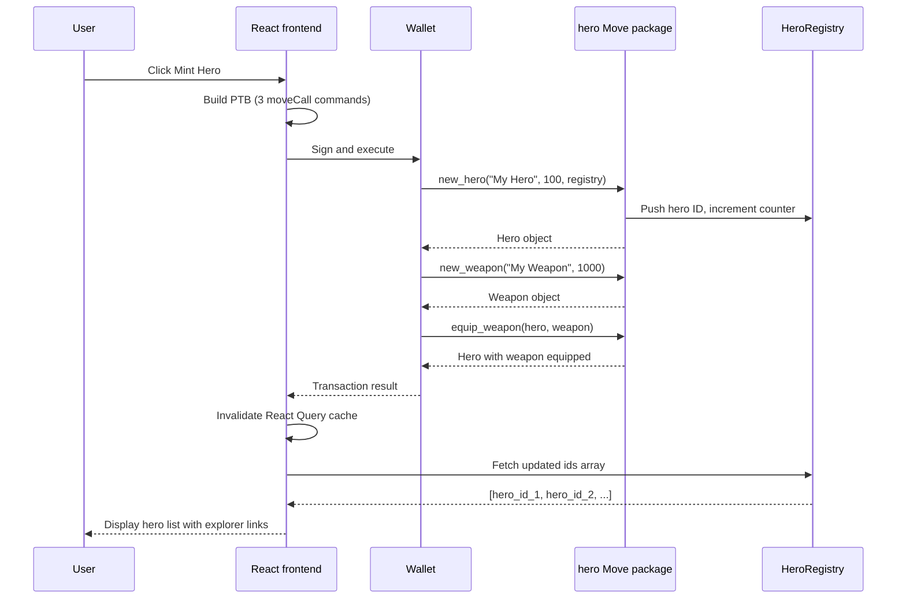

In this example, the Move package defines `Hero` and `Weapon` NFTs with equip and unequip mechanics and a shared `HeroRegistry` that tracks minted NFTs in the heroes collection. The React frontend connects a wallet, builds a multi-step [programmable transaction block (PTB)](/develop/transactions/ptbs/prog-txn-blocks) that mints a hero, creates a weapon, and equips it in a single transaction, then queries the registry to display all heroes. 

## When to use this pattern

Use this pattern when you need to:

- Track a collection of objects through a shared registry that any user can query.

- Set up a Sui dApp Kit project with wallet connection, transaction signing, and onchain queries.

## What you learn

This example teaches:

- **Multi-step PTBs:** The mint flow calls `new_hero`, `new_weapon`, and `equip_weapon` in a single PTB. The hero and weapon objects returned from the first 2 calls become arguments to the third. This is the core pattern for composing onchain operations.

- **Optional object fields:** The `Hero` struct stores `weapon: Option<Weapon>`. Equipping fills the option, unequipping extracts it. Error constants (`EAlreadyEquippedWeapon`, `ENotEquippedWeapon`) guard both paths.

- **Shared registry:** The `HeroRegistry` is a shared object that stores a vector of hero IDs and a counter. Every `new_hero` call appends the new ID and increments the counter. Any client can read the registry to discover all heroes.

- **dApp Kit integration:** The frontend uses `DAppKitProvider` for wallet management, `useCurrentClient` for blockchain queries, `useDAppKit().signAndExecuteTransaction` for transaction execution, and React Query for cache management.

## Architecture

The example has 2 components: a Move package with 3 object types and a React frontend that builds transactions and displays data. The React frontend renders a mint button and a heroes list. The diagram below traces 1 mint-and-display cycle.



The following steps walk through the flow:

1. The user clicks **Mint Hero**. The frontend builds a PTB with 3 `moveCall` commands: `new_hero`, `new_weapon`, and `equip_weapon`.

2. The wallet signs and submits the PTB. The chain executes all 3 calls atomically. `new_hero` creates a `Hero`, registers its ID in the shared `HeroRegistry`, and returns the hero object. `new_weapon` creates a `Weapon` and returns it. `equip_weapon` takes both objects and fills the hero's `weapon` option.

3. The hero (with weapon equipped) transfers to the user's address. The frontend waits for the transaction to finalize, then invalidates the React Query cache.

4. The `HeroesList` component refetches the `HeroRegistry` object, extracts the `ids` array, and renders each hero ID as a link to the Testnet explorer.

## Prerequisites

<Tabs className="tabsHeadingCentered--small">
<TabItem value="prereq" label="Prerequisites">
- [x] [Install the latest version of Sui](/getting-started/onboarding/sui-install).

- [x] [Configure the Sui client](/getting-started/onboarding/configure-sui-client).

- [x] [Create a Sui address](/getting-started/onboarding/get-address).

- [x] [Get SUI Testnet tokens](/getting-started/onboarding/get-coins).

- [x] Download and install an IDE. The following are recommended, as they offer Move extensions:

    - [VSCode](https://code.visualstudio.com/), corresponding [Move extension](https://marketplace.visualstudio.com/items?itemName=mysten.move)

    - [Emacs](https://www.gnu.org/software/emacs/), corresponding [Move extension](https://github.com/amnn/move-mode)

    - [Vim](https://www.vim.org/download.php), corresponding [Move extension](https://github.com/yanganto/move.vim)

    - [Zed](https://zed.dev/), corresponding [Move extension](https://github.com/Tzal3x/move-zed-extension)
    
        Alternatively, you can use the [Move web IDE](https://www.playmove.dev/), which does not require a download. It does not support all functions necessary for this guide, however.

- [x] [Download and install Git](https://git-scm.com/downloads).

- [x] [Node.js](https://nodejs.org/) 18 or later

- [x] A Sui wallet ([Slush Wallet](https://slush.app/) or another compatible wallet)

</TabItem>
</Tabs>

## Setup

Follow these steps to set up the example locally.

##### Step 1: Clone the repo

```bash
$ git clone -b solution https://github.com/MystenLabs/sui-move-bootcamp.git
$ cd sui-move-bootcamp/F1
```

##### Step 2: Build and test the Move contract

```bash
$ cd move/hero
$ rm Move.lock
$ sui move build
$ sui move test
```

All 7 tests should pass.

##### Step 3: Publish to Testnet

```bash
$ sui client switch --env testnet
$ sui client publish --gas-budget 200000000
```

Record the package ID and the `HeroRegistry` object ID from the publish output.

```
│  │ ObjectID: 0xd43651436bf53cb244edf16d67a29e44f8b35dddd805770a8d285b237e1b0c6b          <--- HeroRegistry Object ID              │
│  │ Sender: 0x9ac241b2b3cb87ecd2a58724d4d182b5cd897ad307df62be2ae84beddc9d9803                          │
│  │ Owner: Shared( 847518322 )                                                                          │
│  │ ObjectType: 0xb59b97827a00e7a137f07e7a3478d06f423e0d6bc836a566605c37947fcf37a4::hero::HeroRegistry  │
│  │ Version: 847518322   
...
│ Published Objects:                                                                                     │
│  ┌──                                                                                                   │
│  │ PackageID: 0xb59b97827a00e7a137f07e7a3478d06f423e0d6bc836a566605c37947fcf37a4       <--- Package ID                │
│  │ Version: 1                                                                                          │
│  │ Digest: DwE9Hu3GBbmtt7GmGU5U87N2bFkcPvtVH4z5eA8hHd8n                                                │
│  │ Modules: hero 
```

##### Step 4: Configure the frontend

```bash
$ cd ../../app/my-first-sui-dapp
$ pnpm install
$ cp .env.example .env
```

Edit `.env` with the values from the publish step:

```bash title='.env'
VITE_PACKAGE_ID=PACKAGE_ID
VITE_HEROES_REGISTRY_ID=REGISTRY_OBJECT_ID
```

## Run the example

Start the frontend:

```bash
$ pnpm dev
```

Open `http://localhost:5173` in a browser and click **Mint Hero** to create a hero with an equipped weapon in a single transaction. The heroes list updates to show the new hero ID with a link to the Testnet explorer.

## Key code highlights

The following snippets are the parts of the code worth reading carefully.

### Hero with optional weapon

The `Hero` struct stores an optional `Weapon` object. Equipping fills the option, unequipping extracts it.

<ImportContent source="F1/move/hero/sources/hero.move" mode="code" org="MystenLabs" repo="sui-move-bootcamp" branch="solution" struct="Hero" />

The `weapon: Option<Weapon>` field starts as `option::none()` when the hero is created. The `equip_weapon` function fills it with a `Weapon` object, and `unequip_weapon` extracts and returns the weapon. Both functions assert the option is in the expected state.

### Equipping a weapon with error handling

The `equip_weapon` function fills the hero's weapon slot, aborting if a weapon is already equipped.

<ImportContent source="F1/move/hero/sources/hero.move" mode="code" org="MystenLabs" repo="sui-move-bootcamp" branch="solution" fun="equip_weapon" />

The function asserts `hero.weapon.is_none()` before filling. If the hero already has a weapon, the transaction aborts with `EAlreadyEquippedWeapon`. The `option::fill` call moves the weapon into the hero's option field, transferring ownership.

### Shared registry for hero discovery

The `new_hero` function creates a hero and registers its ID in the shared `HeroRegistry`.

<ImportContent source="F1/move/hero/sources/hero.move" mode="code" org="MystenLabs" repo="sui-move-bootcamp" branch="solution" fun="new_hero" />

The function creates the hero, pushes its ID into the registry's `ids` vector, increments the counter, and returns the hero. Because the registry is a shared object, any client can read it to discover all hero IDs without an indexer.

### Multi-step PTB for minting

The `CreateHeroForm` component builds a PTB that creates a hero, creates a weapon, equips the weapon, and transfers the hero in a single transaction.

<ImportContent source="F1/app/my-first-sui-dapp/src/components/ui/CreateHeroForm.tsx" mode="code" org="MystenLabs" repo="sui-move-bootcamp" branch="solution" fun="CreateHeroForm" />

The PTB chains 3 `moveCall` results: `hero` from `new_hero`, `weapon` from `new_weapon`, then both passed to `equip_weapon`. The `transferObjects` call at the end moves the hero to the user's address. After execution, the component invalidates the React Query cache so the heroes list refetches.

### Querying the shared registry

The `HeroesList` component fetches the `HeroRegistry` shared object and displays its `ids` array.

<ImportContent source="F1/app/my-first-sui-dapp/src/components/ui/HeroesList.tsx" mode="code" org="MystenLabs" repo="sui-move-bootcamp" branch="solution" fun="HeroesList" />

The component uses the gRPC client to call `getObject` with `include: { json: true }`, extracts the `ids` field from the JSON content, and maps each ID to a Testnet explorer link. React Query handles caching and refetching.

## Common modifications

- **Add hero stats display:** After fetching the registry IDs, call `multiGetObjects` to fetch each hero's full content (name, stamina, weapon). Render each hero as a card with its stats instead of a raw ID.

- **Add user input for hero name and stamina:** Replace the hardcoded `"My Hero"` and `100` with form inputs. Pass user-provided values to `tx.pure.string()` and `tx.pure.u64()`.

- **Filter heroes by owner:** Instead of showing all heroes from the registry, use `getOwnedObjects` with a `StructType` filter for `hero::Hero` to show only the connected wallet's heroes.

- **Add a weapon marketplace:** Create a shared `Marketplace` object where users list unequipped weapons. Other users can buy and equip them. This extends the pattern to multi-user interaction.

## Troubleshooting

The following sections address common issues with this example.
### `EAlreadyEquippedWeapon` when equipping

**Symptom:** The `equip_weapon` call aborts with error code `0`.

**Cause:** The hero already has a weapon equipped. The default mint flow equips a weapon, so calling equip again on the same hero fails.

**Fix:** Call `unequip_weapon` first to remove the current weapon, then equip the new one. Or check `hero_weapon` before equipping.

### Heroes list shows 0 heroes after minting

**Symptom:** The mint transaction succeeds but the heroes list does not update.

**Cause:** The React Query cache is stale. The `queryKey` for the heroes list does not match the invalidation key, or `waitForTransaction` did not complete before invalidation.

**Fix:** Verify the `queryKey` in both the fetch (`["getObject"]`) and the invalidation match exactly. Ensure `await suiClient.waitForTransaction({ digest })` completes before calling `invalidateQueries` when the next read uses a separately indexed source. If you use GraphQL execution-attached selections, you can often select transaction effects and related execution data in the same request without waiting for a later indexed query.

### `VITE_PACKAGE_ID` is undefined

**Symptom:** The `moveCall` target resolves to `undefined::hero::new_hero` and the transaction fails.

**Cause:** The `.env` file is missing or the `VITE_PACKAGE_ID` variable is not set.

**Fix:** Copy `.env.example` to `.env` and set both `VITE_PACKAGE_ID` and `VITE_HEROES_REGISTRY_ID` to the values from the publish output. Restart the Vite dev server after editing `.env`.

### Wallet shows `object not found` for the registry

**Symptom:** The `getObject` call for the registry ID returns null or an error.

**Cause:** The `VITE_HEROES_REGISTRY_ID` points to the wrong object, or you published the package on a different network than the frontend targets.

**Fix:** Verify the registry ID from the publish transaction output. Confirm the frontend's `defaultNetwork` in `dApp-kit.ts` matches the network you published the package on.
