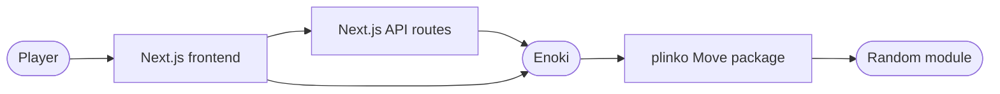
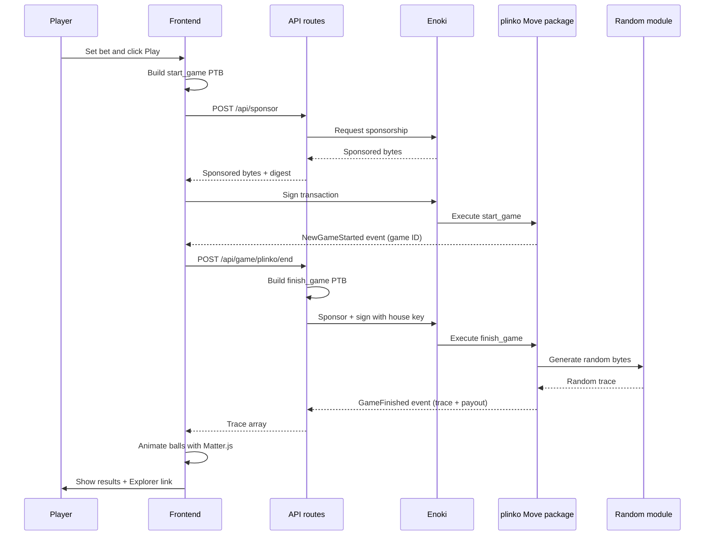

Plinko is a provably fair casino-style game built on Sui that demonstrates onchain randomness and gasless transactions. Players bet SUI tokens and drop balls through a pin board, where each ball lands in a multiplier bucket determined entirely by Sui's onchain random number generator. The example targets Testnet and suits readers who already know the basics of Move modules, Next.js, and the Sui TypeScript SDK (TS SDK).

## What you learn

By the end of this page, you can:

- Use Sui's `Random` module to generate verifiable random outcomes in a Move contract.
- Implement the house pattern with a shared `HouseData` treasury that holds funds and pays winners.
- Store active game state as dynamic object fields on the house object.
- Build a gasless game flow using Enoki-sponsored transactions and zkLogin.
- Connect onchain randomness results to a frontend physics simulation.

This example teaches:

- **Onchain randomness:** Sui's `Random` module provides verifiable, unbiasable random numbers that the contract consumes directly. No external oracle is needed.
- **House pattern:** A shared `HouseData` object acts as the treasury. It holds the house balance, enforces stake limits, tracks fees, and stores the multiplier table.
- **Dynamic object fields:** Each active game is a `Game` object attached to `HouseData` as a dynamic object field, which ties game lifecycle to the house.
- **Sponsored transactions:** The backend sponsors both the player's `start_game` transaction and the house's `finish_game` transaction through Enoki, so players pay no gas.
- **Events:** The contract emits `NewGameStarted` and `GameFinished` events. The frontend reads the `GameFinished` event to extract the random trace that drives the ball animation.

## Prerequisites

<Tabs className="tabsHeadingCentered--small">
<TabItem value="prereq" label="Prerequisites">
- [x] Sui CLI installed and configured for Testnet
- [x] Node.js 18 or later, with pnpm or npm installed
- [x] A Google account (for Enoki zkLogin authentication)
- [x] An Enoki project with a Google OAuth client ID and API keys (see [Enoki documentation](https://docs.enoki.mystenlabs.com))
</TabItem>
</Tabs>

## Architecture

The example has 3 actors and 1 onchain package. The diagram below shows the components and the calls between them.



The **Next.js frontend** renders the Plinko board using a Matter.js physics simulation and handles wallet connection through Enoki zkLogin. The **Next.js API routes** act as the backend, sponsoring transactions through Enoki and executing the house-side `finish_game` call with the house key pair. The **plinko Move package** manages game state, enforces betting rules, and computes payouts. The **Random module** is a Sui framework object that provides verifiable random bytes the contract uses to determine ball paths.

## How onchain randomness works

Sui provides a built-in `Random` shared object that any Move function can consume. The contract calls `random.new_generator(ctx)` to create a generator scoped to the current transaction, then calls methods like `generate_u8_in_range` to produce random values. The randomness is:

- **Verifiable:** Any observer can confirm the random output matches the onchain state.
- **Unbiasable:** Neither the player nor the house can influence the outcome after the transaction starts.
- **Transaction-scoped:** Each generator produces a unique sequence tied to the transaction context.

In Plinko, the `finish_game` function generates 12 random bytes per ball. Each byte is checked for evenness. The count of even bytes determines which multiplier bucket the ball lands in. This maps to the 13-bucket layout on the board (0 through 12 even bytes out of 12 total).

For more details on the randomness API, see [Onchain Randomness](/develop/smart-contracts/randomness).

## Setup

Follow these steps to set up the example locally.

##### Step 1: Clone the repo

```bash
$ git clone https://github.com/MystenLabs/plinko-poc.git
$ cd plinko-poc
```

##### Step 2: Publish the Move package

```bash
$ cd plinko
$ sui client switch --env testnet
$ sui move build
$ sui client publish --gas-budget 200000000
```

Record the package ID and the `HouseCap` object ID from the publish output.

##### Step 3: Configure the setup script

```bash
$ cd ../setup
$ npm install
$ cp .env.example .env
```

Edit `.env` with the values from the publish step:

```bash title='.env'
SUI_NETWORK=https://rpc.testnet.sui.io:443
PACKAGE_ADDRESS=PACKAGE_ID_FROM_STEP_2
HOUSE_ADDRESS=YOUR_WALLET_ADDRESS
HOUSE_PRIVATE_KEY=YOUR_BASE64_PRIVATE_KEY
HOUSE_CAP=HOUSE_CAP_OBJECT_ID_FROM_STEP_2
```

##### Step 4: Initialize the house

```bash
$ npm run setup
```

This calls `initialize_house_data`, which creates the shared `HouseData` object with an initial balance of 40 SUI and the default multiplier table. Record the `HouseData` object ID from the output.

##### Step 5: Configure the frontend

```bash
$ cd ../app
$ npm install
$ cp .env.example .env
```

Edit `.env` with your Enoki and package details:

```bash title='.env'
NEXT_PUBLIC_SUI_NETWORK=https://rpc.testnet.sui.io:443
NEXT_PUBLIC_SUI_NETWORK_NAME=testnet
NEXT_PUBLIC_ENOKI_API_KEY=YOUR_ENOKI_API_KEY
NEXT_PUBLIC_GOOGLE_CLIENT_ID=YOUR_GOOGLE_CLIENT_ID
NEXT_PUBLIC_HOUSE_DATA_ID=HOUSE_DATA_ID_FROM_STEP_4
NEXT_PUBLIC_PACKAGE_ADDRESS=PACKAGE_ID_FROM_STEP_2
PLINKO_HOUSE_PRIVATE_KEY=YOUR_BASE64_PRIVATE_KEY
ENOKI_SECRET_KEY=YOUR_ENOKI_SECRET_KEY
```

## Run the example

Start the frontend:

```bash
$ npm run dev
```

Open `http://localhost:3000` in a browser. Sign in with Google through Enoki. Set a bet size and number of balls, then click **Play**. The balls drop through the pin board, each following a path determined by the onchain random trace. After all balls land, the game card shows your total winnings and a link to the transaction on Sui Explorer.

## Key code highlights

The following snippets are the parts of the code worth reading carefully.

### Move: starting a game

The `start_game` function validates the bet, creates a `Game` object, and attaches it to `HouseData` as a dynamic object field.

<ImportContent source="plinko/sources/plinko.move" mode="code" org="MystenLabs" repo="plinko-poc" fun="start_game" />

The function checks that the stake falls within the house's min and max limits, and that the house has enough balance to cover a maximum payout. It stores the `Game` as a dynamic object field on `HouseData` keyed by the game ID, which ties the game lifecycle to the house object. The function emits a `NewGameStarted` event with the game ID and stake.

### Move: finishing a game with onchain randomness

The `finish_game` entry function consumes the `Random` module to generate the ball trace and compute the payout.

<ImportContent source="plinko/sources/plinko.move" mode="code" org="MystenLabs" repo="plinko-poc" fun="finish_game" />

For each ball, the function generates 12 random bytes and counts how many are even. This count (0 through 12) indexes into the multiplier table. The total payout across all balls is summed, the house fee is deducted, and the winnings transfer to the player. The function emits a `GameFinished` event containing the random trace, which the frontend uses to animate the ball paths.

### Move: house data management

The `HouseData` struct holds the shared treasury, stake limits, fee configuration, and multiplier table.

<ImportContent source="plinko/sources/house_data.move" mode="code" org="MystenLabs" repo="plinko-poc" struct="HouseData" />

The house address is the only account authorized to withdraw funds, claim fees, and update configuration. Anyone can call `top_up` to add funds to the house balance.

### Frontend: creating a game with sponsored transactions

The `useCreateGame` hook builds the `start_game` transaction, sponsors it through Enoki, and then calls the backend to finish the game.

<ImportContent source="app/src/hooks/moveTransactionCalls.ts/useCreateGame.ts" mode="code" org="MystenLabs" repo="plinko-poc" fun="useCreateGame" />

The hook follows a 7-step flow: build the transaction, request sponsorship from the `/api/sponsor` endpoint, sign with the player's wallet, execute through `/api/execute`, extract the game ID from the `NewGameStarted` event, call `/api/game/plinko/end` to trigger `finish_game` on the backend, and normalize the returned trace into ball paths for the physics simulation.

### Backend: finishing the game server-side

The `PlinkoGameService` executes `finish_game` using the house key pair and extracts the random trace from the emitted event.

<ImportContent source="app/src/app/api/services/PlinkoGameService.ts" mode="code" org="MystenLabs" repo="plinko-poc" fun="finishGame" />

The backend signs `finish_game` with the house key pair because only the house can call this entry function (it requires access to `HouseData`). The function extracts the trace from the `GameFinished` event, which encodes 12 bytes per ball. The frontend converts each byte to a left-or-right direction to animate the physics simulation.

### Frontend: converting the trace to ball paths

The `splitIntoPathsAndNormalize` utility converts the flat trace array from the `GameFinished` event into per-ball direction arrays.

<ImportContent source="app/src/helpers/traceFromTheEventToPathsForBalls.ts" mode="code" org="MystenLabs" repo="plinko-poc" fun="splitIntoPathsAndNormalize" />

Each ball has 12 values in the trace. The function splits the trace into chunks of 12 and maps each value: even numbers become 0 (left), odd numbers become 1 (right). The Matter.js physics engine uses these direction arrays to apply forces that steer each ball through the pin board.

## Data flow

The diagram below traces 1 full game from bet to payout.



The following steps walk through the flow:

1. The player sets a bet size and number of balls, then clicks **Play**. The frontend builds a `start_game` transaction that splits the bet amount from the player's gas coins.
2. The frontend sends the transaction bytes to `/api/sponsor`, which requests sponsorship from Enoki. The player's wallet signs the sponsored transaction, and Enoki executes it.
3. The Move package validates the bet, creates a `Game` object attached to `HouseData`, and emits `NewGameStarted`. The frontend extracts the game ID from this event.
4. The frontend calls `/api/game/plinko/end` with the game ID and ball count. The backend builds a `finish_game` transaction, sponsors it through Enoki, and signs it with the house key pair.
5. The Move package generates 12 random bytes per ball using the `Random` module, computes the payout from the multiplier table, transfers winnings to the player, and emits `GameFinished` with the trace.
6. The backend extracts the trace from the event and returns it to the frontend. The frontend converts the trace to per-ball direction arrays and feeds them to the Matter.js physics engine, which animates each ball bouncing through the pin board to its final bucket.

Errors can occur at the sponsorship step (Enoki unreachable or rate-limited), the `start_game` step (bet outside stake limits or insufficient house balance), or the `finish_game` step (game ID not found). The frontend surfaces errors through a modal with a retry option.

## Troubleshooting

### Bet rejected as too low or too high

**Symptom:** The `start_game` transaction aborts with `EStakeTooLow` or `EStakeTooHigh`.

**Cause:** The bet amount falls outside the range the house configured. The default minimum is 1 SUI and the default maximum is 10 SUI.

**Fix:** Adjust the bet to fall within the limits. Check the current limits with `sui client object HOUSE_DATA_ID` and inspect the `min_stake` and `max_stake` fields.

### Insufficient house balance

**Symptom:** The `start_game` transaction aborts with `EInsufficientHouseBalance`.

**Cause:** The house does not hold enough SUI to cover the maximum possible payout for the bet.

**Fix:** Top up the house by calling `house_data::top_up` with additional SUI. Use the setup script or build the transaction manually.

### Game ID not found on finish

**Symptom:** The `/api/game/plinko/end` endpoint returns an error, or the `finish_game` transaction aborts with `EGameDoesNotExist`.

**Cause:** The game was already finished, the game ID is wrong, or the `start_game` transaction did not complete.

**Fix:** Verify the game ID from the `NewGameStarted` event. Check the transaction status on Sui Explorer. If the game was already finished, the trace is available in the `GameFinished` event on the original finish transaction.

### Enoki sponsorship fails

**Symptom:** The `/api/sponsor` endpoint returns a 500 error or the frontend shows a network error.

**Cause:** The Enoki API key is invalid, the Enoki secret key on the backend is wrong, or Enoki rate limits the request.

**Fix:** Verify `NEXT_PUBLIC_ENOKI_API_KEY` and `ENOKI_SECRET_KEY` in the `.env` files. Check the Enoki dashboard for rate limit status. If rate-limited, wait and retry.

### Google sign-in fails

**Symptom:** Clicking **Sign In with Google** does nothing or the OAuth popup closes immediately.

**Cause:** The Google Client ID is misconfigured, the redirect URI does not match the app URL, or the browser blocks third-party cookies.

**Fix:** Verify `NEXT_PUBLIC_GOOGLE_CLIENT_ID` matches the credentials in your Google Cloud Console. Check that `http://localhost:3000` is listed as an authorized redirect URI. Try a different browser or disable cookie-blocking extensions.
