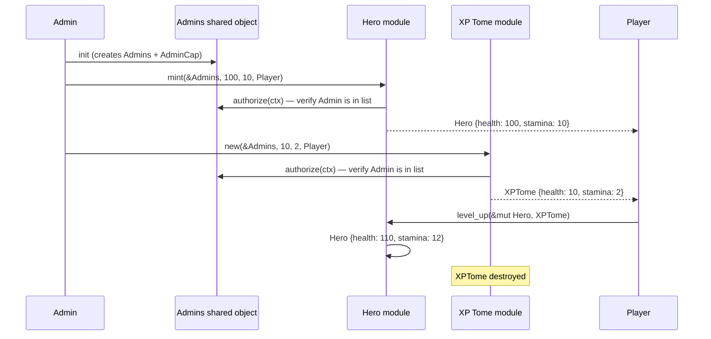

This scenario testing example builds a small game system (heroes, XP tomes, and an access control list) and tests it end-to-end using Sui's [`test_scenario`](/develop/testing-debugging/) module. Each test simulates multiple transactions from different accounts, tracks object creation and transfer, and validates state changes across modules. 

## When to use this pattern

Use this pattern when you need to:

- Test multi-step flows where 1 transaction creates an object and a later transaction from a different account uses it.

- Verify access control across transactions (for example, an admin mints an item, a non-admin tries to mint, and the test confirms the second call fails).

- Track which objects a transaction created, shared, or transferred, and assert on those effects.

- Simulate the full lifecycle of an NFT or game item: mint, transfer, consume, and verify final state.

- Test interactions between multiple modules (access control, game logic, item consumption) in a single scenario.

## What you learn

This example teaches:

- **`test_scenario` module:** A testing framework that simulates a global object pool and multiple transaction contexts. Each `next_tx` call advances the scenario to a new transaction with a specified sender.

- **Transaction effects inspection:** After `next_tx`, you can query which objects the previous transaction created, shared, or transferred. This lets you assert on the exact side effects of each step.

- **Shared object testing:** The `Admins` object is shared. Tests use `take_shared` to borrow it and `return_shared` to put it back, mirroring how shared objects work in real transactions.

- **Cross-module authorization:** The `hero::mint` and `xp_tome::new` functions call `admins.authorize(ctx)` which checks the sender's address against the shared `Admins` list. Tests verify this works across transaction boundaries.

- **Object consumption:** The `level_up` function takes an `XPTome` by value (consuming it) and adds its stats to a `Hero`. The test verifies the tome is destroyed and the hero's stats increase.

## Architecture

The example has 3 Move modules that form a small game system. The ACL module manages a shared `Admins` object and an `AdminCap` capability. The `AdminCap` holder can add or remove addresses from the admin list. The Hero module mints `Hero` NFTs with health and stamina stats. Only addresses in the `Admins` list can mint. The XP Tome module creates consumable `XPTome` items that boost hero stats when consumed. The `level_up` function on `Hero` takes an `XPTome` by value, adds its stats, and destroys the tome.

The diagram below traces 1 full scenario: admin mints a hero and a tome, transfers both to a player, and the player levels up.



The following steps walk through the flow:

1. The admin publishes the module. The `init` function creates a shared `Admins` object (with the admin's address in the list), an `AdminCap`, and claims the `Publisher`.

2. The admin calls `hero::mint` with the shared `Admins` object, health and stamina values, and the player's address. The function calls `admins.authorize(ctx)` to verify the sender is in the admin list, then creates and transfers the `Hero` to the player.

3. The admin calls `xp_tome::new` with the same pattern to create an `XPTome` and transfer it to the player.

4. The player calls `hero.level_up(xp_tome)`. The function destructs the tome, extracts its health and stamina values, and adds them to the hero's stats. The tome object no longer exists.

## Prerequisites

<Tabs className="tabsHeadingCentered--small">
<TabItem value="prereq" label="Prerequisites">
- [x] [Install the latest version of Sui](/getting-started/onboarding/sui-install).

- [x] [Configure the Sui client](/getting-started/onboarding/configure-sui-client).

- [x] [Create a Sui address](/getting-started/onboarding/get-address).

- [x] [Get SUI Testnet tokens](/getting-started/onboarding/get-coins).

- [x] Download and install an IDE. The following are recommended, as they offer Move extensions:

    - [VSCode](https://code.visualstudio.com/), corresponding [Move extension](https://marketplace.visualstudio.com/items?itemName=mysten.move)

    - [Emacs](https://www.gnu.org/software/emacs/), corresponding [Move extension](https://github.com/amnn/move-mode)

    - [Vim](https://www.vim.org/download.php), corresponding [Move extension](https://github.com/yanganto/move.vim)

    - [Zed](https://zed.dev/), corresponding [Move extension](https://github.com/Tzal3x/move-zed-extension)
    
        Alternatively, you can use the [Move web IDE](https://www.playmove.dev/), which does not require a download. It does not support all functions necessary for this guide, however.

- [x] [Download and install Git](https://git-scm.com/downloads).

- [x] [Node.js](https://nodejs.org/) 18 or later

- [x] A Sui wallet ([Slush Wallet](https://slush.app/) or another compatible wallet)

</TabItem>
</Tabs>

## Setup

Follow these steps to set up the example locally.

##### Step 1: Clone the repo

```bash
$ git clone -b solution https://github.com/MystenLabs/sui-move-bootcamp.git
$ cd sui-move-bootcamp/G1/scenario
```

##### Step 2: Build and test

```bash
$ rm Move.lock
$ sui move build
$ sui move test
```

All tests (unit tests in the source files and scenario tests in the `tests/` directory) should pass.

## Run the example

This example is test-only. Run the full test suite:

```bash
$ sui move test --statistics
```

The output shows each test function, its pass/fail status, and gas usage. The scenario tests exercise the complete flow across all 3 modules.

## Key code highlights

The following snippets are the parts of the code worth reading carefully.

### Shared admin list with capability gating

The `Admins` shared object holds the list of authorized addresses. The `AdminCap` gates who can modify the list.

<ImportContent source="G1/scenario/sources/acl.move" mode="code" org="MystenLabs" repo="sui-move-bootcamp" branch="solution" struct="Admins" />

The `authorize` function is `public(package)`, meaning only modules in the same package can call it. This prevents external packages from bypassing access control. The `Hero` and `XPTome` modules call `admins.authorize(ctx)` before minting.

### Admin-gated minting with stat-based NFTs

The `mint` function creates a `Hero` NFT and transfers it to a recipient. Only addresses in the `Admins` list can call it.

<ImportContent source="G1/scenario/sources/hero.move" mode="code" org="MystenLabs" repo="sui-move-bootcamp" branch="solution" fun="mint" />

The first line calls `admins.authorize(ctx)`, which checks that `ctx.sender()` is in the admin list. If not, the transaction aborts with `ENotAuthorized`. The function then creates a `Hero` with the given stats and transfers it to the recipient.

### Consuming an item to level up

The `level_up` function takes an `XPTome` by value (consuming it) and adds its stats to the hero.

<ImportContent source="G1/scenario/sources/hero.move" mode="code" org="MystenLabs" repo="sui-move-bootcamp" branch="solution" fun="level_up" />

The `tome.destroy()` call destructs the `XPTome`, deletes its UID, and returns the health and stamina values. The function adds these to the hero's existing stats. After this call, the tome object no longer exists onchain.

### Multi-transaction scenario for minting and leveling up

The `test_level_up` scenario test simulates 3 transactions: init, mint hero + tome, and level up.

<ImportContent source="G1/scenario/tests/hero_tests.move" mode="code" org="MystenLabs" repo="sui-move-bootcamp" branch="solution" fun="test_level_up" />

The test uses `test_scenario::begin(admin)` to start as the admin, then `scenario.next_tx(admin)` to advance to a new transaction where the admin mints both items. The next `next_tx(hero_owner)` switches to the player's perspective, takes the hero and tome from the scenario, calls `level_up`, and asserts the stats increased correctly.

### Inspecting transaction effects

The `test_add_admin` scenario test inspects the effects of each transaction to verify exactly what was created, shared, and transferred.

<ImportContent source="G1/scenario/tests/acl_tests.move" mode="code" org="MystenLabs" repo="sui-move-bootcamp" branch="solution" fun="test_add_admin" />

After `next_tx`, the test calls `begin_effects.created()`, `begin_effects.shared()`, and `begin_effects.transferred_to_account()` to inspect exactly which objects the `init` transaction produced. It verifies that the init transaction created 3 objects (the `Publisher`, the `AdminCap`, and the `Admins`), shared 1, and transferred 2. This level of inspection catches bugs where a function creates the right object but fails to share or transfer it.

## Common modifications

- **Add role-based permissions:** Replace the single `Admins` list with a map of address-to-role. Check for specific roles (minter, admin, moderator) in each function instead of a single `authorize` call.

- **Make heroes transferable by players:** The current `Hero` struct has `key` but not `store`. Add `store` so players can transfer heroes to other players or wrap them in marketplace listings.

- **Add XP tome rarity tiers:** Add a `rarity` field to `XPTome` and validate that only tomes of a minimum rarity can level up heroes past certain thresholds.

- **Test failure cases:** Add `#[expected_failure]` tests that verify a non-admin address cannot mint heroes, and that `level_up` correctly handles edge cases like zero-stat tomes.

## Troubleshooting

The following sections address common issues with this example.
### `authorize` fails with `ENotAuthorized`

**Symptom:** A test or transaction aborts with error code `2` (`ENotAuthorized`).

**Cause:** The sender address is not in the `Admins` list. In tests, this happens when `next_tx` uses a different address than the one added during `init`.

**Fix:** Verify the test uses the same address constant for both `test_scenario::begin` (which runs `init`) and the minting transaction. If testing with a second admin, call `add_admin` first.

### `take_from_sender` fails because the object is not available

**Symptom:** The test aborts with an error about no object of the expected type being available for the sender.

**Cause:** The previous transaction transferred the object to a different address, or the test did not call `next_tx` to advance the scenario before taking.

**Fix:** Check that the previous transaction transfers the object to the same address passed to `next_tx`. Call `next_tx` between creating an object and taking it.

### Shared object not returned after use

**Symptom:** The test aborts with an error about a shared object not being returned.

**Cause:** After calling `take_shared<Admins>()`, the test did not call `test_scenario::return_shared(admins)` before ending the scope or calling `next_tx`.

**Fix:** Always pair `take_shared` with `return_shared` in the same block. Similarly, pair `take_from_sender` with `return_to_sender`.
