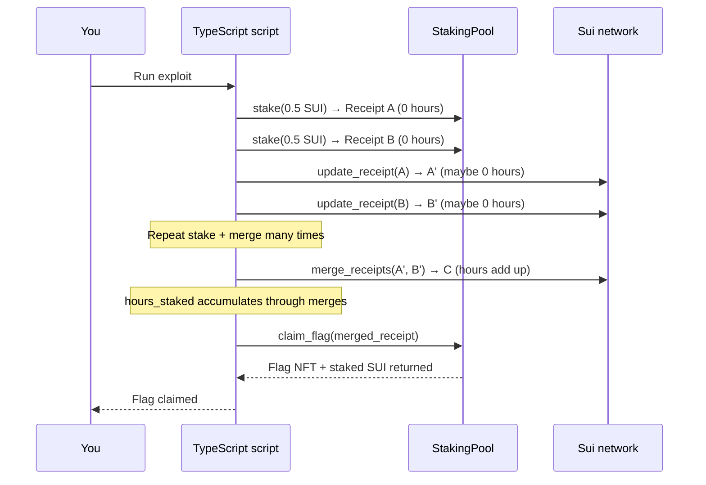

This capture the flag example allows you to analyze a staking contract, find the vulnerability in its time-tracking logic, and exploit it to claim a flag NFT. The contract requires 168 hours (1 week) of staking and a minimum of 1 SUI to claim, but a flaw in how receipts merge their `hours_staked` values lets you reach the threshold instantly. 

## When to use this pattern

Study this challenge when you need to:

- Audit Move contracts for logic vulnerabilities before deploying to production (see [security best practices](https://move-book.com/guides/code-quality-checklist)).

- Understand how time-based access control can go wrong when the client controls time accumulation.

- Learn how object consumption and reconstruction in Move can introduce state manipulation opportunities.

- Practice building exploit transactions with the Sui TypeScript SDK against a live Testnet contract.

- Teach or learn secure staking patterns by first understanding what makes an insecure one exploitable.

## What you learn

This example teaches:

- **Receipt-based staking:** The contract tracks staking state in a `StakeReceipt` object with `amount`, `hours_staked`, and `last_update_timestamp` fields. The receipt is an owned object the staker controls.

- **Object destruction and reconstruction:** The `update_receipt` and `merge_receipts` functions destroy the old receipt(s) and create a new one. This pattern is where the vulnerability lives.

- **Time manipulation through merging:** `merge_receipts` adds the `hours_staked` values of 2 receipts together without validating that the hours represent real elapsed time. Merging `N` receipts that each have `H` hours produces a single receipt with `N*H` hours.

## Architecture

The challenge has 2 components: the deployed Move contract on Testnet and the TypeScript script you write locally to exploit it. The `StakingPool` is a shared object that holds all staked SUI balances. When you call `stake`, it returns a `StakeReceipt` owned by your address. The exploit creates multiple receipts, merges them to accumulate `hours_staked` values, and calls `claim_flag` with the merged receipt that meets the 168-hour threshold.

The diagram below traces the exploit flow.



The following steps walk through the exploit:

1. You run the TypeScript script. It creates multiple `stake` calls, each returning a `StakeReceipt` with `hours_staked: 0`.

2. The script calls `update_receipt` on each receipt. If any real time has passed since staking (even milliseconds), the receipt accumulates a small number of hours.

3. The script calls `merge_receipts` repeatedly. Each merge adds the `hours_staked` of 2 receipts together into a new receipt. The total is the sum of all merged receipts' hours.

4. After enough merges, the combined receipt has `hours_staked >= 168` and `amount >= 1_000_000_000` (1 SUI total across all merged stakes).

5. The script calls `claim_flag` with the merged receipt. The contract verifies the threshold, mints a `Flag` NFT, and returns the staked SUI.

### How the vulnerability works

The vulnerability is in step 3: `merge_receipts` does not validate that the hours represent actual elapsed time. It sums them without validation.

The `merge_receipts` function destructs 2 `StakeReceipt` objects and creates a new one with `hours_staked: hours1 + hours2`. There is no check that the combined hours correspond to real wall-clock time. The function also resets `last_update_timestamp` to the current time, erasing any evidence of how the hours accumulated.

A secure implementation would either:

- **Enforce monotonic timestamps:** Validate that each receipt's `last_update_timestamp` is earlier than the current time by at least the claimed hours.

- **Use onchain time only:** Compute elapsed hours entirely from `clock.timestamp_ms()` at claim time, rather than storing a client-updatable `hours_staked` field.

- **Prevent receipt merging:** Remove `merge_receipts` entirely, or restrict it so merged hours cannot exceed the time between the earliest stake and the current clock.

## Prerequisites

<Tabs className="tabsHeadingCentered--small">
<TabItem value="prereq" label="Prerequisites">

- [x] [Install the latest version of Sui](/getting-started/onboarding/sui-install).

- [x] [Configure the Sui client](/getting-started/onboarding/configure-sui-client).

- [x] [Create a Sui address](/getting-started/onboarding/get-address).

- [x] [Get SUI Testnet tokens](/getting-started/onboarding/get-coins).

- [x] Download and install an IDE. The following are recommended, as they offer Move extensions:

    - [VSCode](https://code.visualstudio.com/), corresponding [Move extension](https://marketplace.visualstudio.com/items?itemName=mysten.move)

    - [Emacs](https://www.gnu.org/software/emacs/), corresponding [Move extension](https://github.com/amnn/move-mode)

    - [Vim](https://www.vim.org/download.php), corresponding [Move extension](https://github.com/yanganto/move.vim)

    - [Zed](https://zed.dev/), corresponding [Move extension](https://github.com/Tzal3x/move-zed-extension)
    
        Alternatively, you can use the [Move web IDE](https://www.playmove.dev/), which does not require a download. It does not support all functions necessary for this guide, however.

- [x] [Download and install Git](https://git-scm.com/downloads).

- [x] [Node.js](https://nodejs.org/) 18 or later

- [x] [Rust toolchain](https://rustup.rs/) (for the relayer service)

- [x] A Sui wallet ([Slush Wallet](https://slush.app/) or another compatible wallet)

</TabItem>
</Tabs>

## Setup

Follow these steps to set up the challenge locally.

##### Step 1: Clone the repo

```bash
$ git clone https://github.com/MystenLabs/CTF.git
$ cd CTF/scripts
```

##### Step 2: Install dependencies

```bash
$ pnpm install
```

##### Step 3: Generate a key pair

```bash
$ pnpm init-keypair
```

This creates a `keypair.json` file with a fresh Ed25519 key pair. [Fund this new address with Testnet SUI](https://faucet.sui.io/).

##### Step 4: Write your exploit

Open `scripts/src/staking.ts`. The file has a stub with the client and key pair already configured. Insert your exploit logic into the file.

The deployed contract address is `0x936313e502e9cbf6e7a04fe2aeb4c60bc0acd69729acc7a19921b33bebf72d03`.

## Run the example

Run your exploit script:

```bash
$ pnpm staking
```

If successful, the script claims a `Flag` NFT and returns your staked SUI. Verify the flag in your wallet:

```bash
$ sui client objects YOUR_ADDRESS
```

You should see a `flag::Flag` object with `source: "staking"`.

## Key code highlights

The following snippets are the parts of the code worth reading carefully.

### `StakeReceipt` struct

The receipt tracks staking state as an owned object the staker controls.

<ImportContent source="contracts/sources/staking.move" mode="code" org="MystenLabs" repo="CTF" struct="StakeReceipt" />

The `hours_staked` field is the vulnerability target. It starts at `0` when the receipt is created and accumulates through `update_receipt` and `merge_receipts` calls. Because the receipt has `store` ability, it can be transferred and wrapped.

### `merge_receipts` function

This function adds the `hours_staked` of 2 receipts together without validating the sum.

<ImportContent source="contracts/sources/staking.move" mode="code" org="MystenLabs" repo="CTF" fun="merge_receipts" />

The function destructs both receipts, sums their `amount` and `hours_staked` fields, and creates a new receipt with `last_update_timestamp` set to the current clock time. The new receipt has no link to the original stake times. This is where the exploit happens: merge enough receipts and the `hours_staked` exceeds 168 without any real time passing.

### `claim_flag` guard

The `claim_flag` function checks the time and amount thresholds before minting the flag.

<ImportContent source="contracts/sources/staking.move" mode="code" org="MystenLabs" repo="CTF" fun="claim_flag" />

The function computes `total_hours = receipt.hours_staked + hours_passed` (where `hours_passed` is the time since the last update). It asserts `total_hours >= 168` and `receipt.amount >= 1_000_000_000`. If both pass, it splits the staked amount from the pool, destroys the receipt, and mints a `Flag`.

### Staking to create a receipt

The `stake` function deposits SUI into the pool and returns a fresh receipt.

<ImportContent source="contracts/sources/staking.move" mode="code" org="MystenLabs" repo="CTF" fun="stake" />

Each call creates a new `StakeReceipt` with `hours_staked: 0` and `last_update_timestamp` set to the current clock. The `amount` field records how much SUI the receipt represents. The exploit creates multiple receipts with small amounts that sum to at least 1 SUI when merged.

## Common modifications

- **Fix the vulnerability:** Replace `merge_receipts` with a version that computes `hours_staked` from the earliest `last_update_timestamp` across the merged receipts rather than summing. Or remove merging entirely and compute elapsed time in `claim_flag` from the original stake timestamp.

- **Add a lock period:** Store the original `stake_timestamp` (not just `last_update_timestamp`) on the receipt and enforce the 168-hour requirement against it in `claim_flag`. This prevents any time manipulation.

- **Make receipts non-mergeable:** Remove the `merge_receipts` function. Each receipt stands alone and can only be claimed individually. This eliminates the accumulation vector.

- **Use a single receipt per address:** Store the stake state on the `StakingPool` as a dynamic field keyed by the staker's address, rather than as a separate owned object. This prevents multiple-receipt attacks.

- **Add a reward rate:** Instead of a flat flag, calculate rewards proportional to `amount * hours_staked` and distribute them from a reward pool. Apply the same timing fixes.

## Troubleshooting

The following sections address common issues with this example.
### `ENotEnoughStakingTime` when claiming

**Symptom:** The `claim_flag` transaction aborts with error code `0`.

**Cause:** The merged receipt's `hours_staked` plus any hours since the last update does not reach 168.

**Fix:** Merge more receipts or let more time pass before claiming. Each `update_receipt` call captures elapsed hours, and each merge sums them.

### `EInsufficientStakeAmount` when claiming

**Symptom:** The `claim_flag` transaction aborts with error code `1`.

**Cause:** The merged receipt's `amount` is below 1,000,000,000 (1 SUI).

**Fix:** Ensure the total staked across all merged receipts equals at least 1 SUI. Each `stake` call's coin value adds to the merged total.

### Insufficient gas or SUI balance

**Symptom:** The exploit script fails with an `InsufficientGas` or balance error.

**Cause:** The wallet does not have enough SUI for both the stake amount (minimum 1 SUI) and gas fees.

**Fix:** Request more Testnet SUI from the faucet. You need at least 2 SUI (1 for staking, 1 for gas across multiple transactions).

### Key pair file not found

**Symptom:** The script fails with a file-not-found error for `keypair.json`.

**Cause:** You did not run `pnpm init-keypair` before running the exploit.

**Fix:** Run `pnpm init-keypair` from the `scripts/` directory. Fund the generated address before running the exploit.
