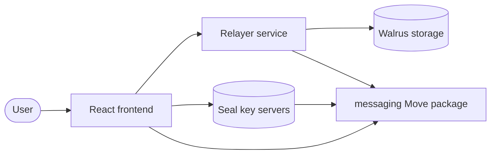
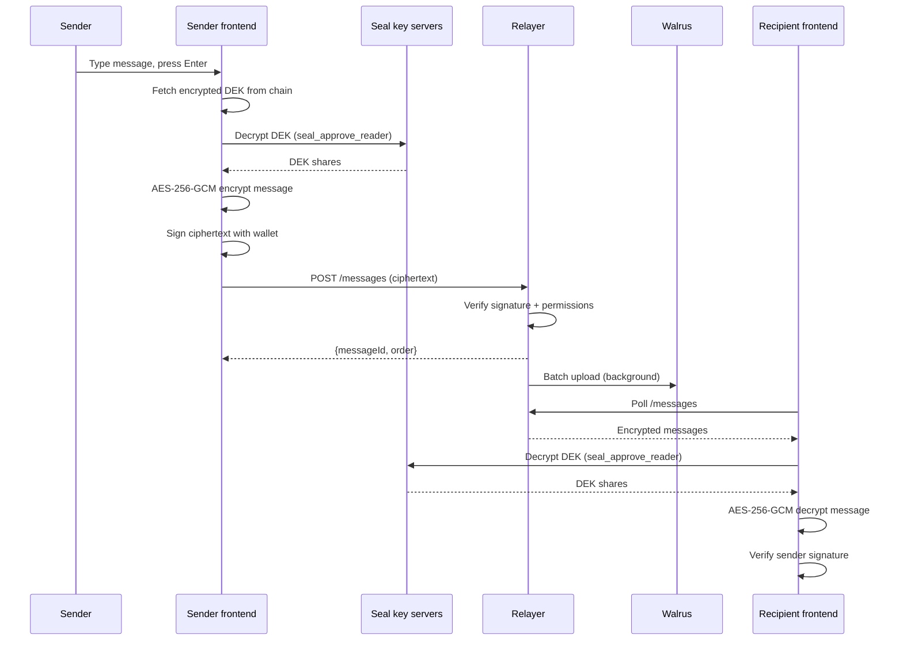

Sui Stack Messaging is an end-to-end encrypted group chat app built on Sui. Messages are encrypted client-side with AES-256-GCM before leaving the browser, routed through an offchain relayer that never sees plaintext, and archived to Walrus for decentralized persistence. Onchain Move contracts manage group membership, 7 granular permission types, and versioned encryption keys through Seal threshold encryption. The example targets Testnet and suits readers who know Move, React, and the Sui TypeScript SDK (TS SDK).

## What you learn

By the end of this page, you can:

- Design a permissioned group system in Move with 7 distinct permission types.
- Implement envelope encryption where Seal manages Data Encryption Keys (DEKs) and AES-256-GCM encrypts message content.
- Build a Seal access-control policy (`seal_approve_reader`) that gates decryption on onchain group membership.
- Connect a frontend to an offchain relayer that routes encrypted messages and syncs them to Walrus.
- Manage encryption key rotation so removed members lose access to future messages.

This example teaches:

- **Permissioned groups:** A `PermissionedGroup<Messaging>` shared object tracks members and their permissions onchain. The relayer caches these permissions and enforces them on every API call.
- **Envelope encryption:** The client generates a random AES-256-GCM key (the DEK), encrypts it with Seal, and stores the encrypted DEK onchain in an `EncryptionHistory` object. Messages are encrypted with the DEK locally. Seal key servers release the DEK only to members with `MessagingReader` permission.
- **Key rotation:** When a member is removed, the admin atomically revokes permissions and rotates the DEK in a single transaction. The removed member can no longer decrypt new messages.
- **Relayer pattern:** An offchain Rust service accepts encrypted messages, verifies sender signatures, checks onchain permissions through a cached membership store, and batches messages to Walrus for archival.
- **File attachments:** Each file is individually encrypted with the group DEK, uploaded to Walrus through the publisher API, and referenced by a `quiltPatchId` in the message metadata.

## Prerequisites

<Tabs className="tabsHeadingCentered--small">
<TabItem value="prereq" label="Prerequisites">
- [x] Sui CLI installed and configured for Testnet
- [x] Node.js 18 or later
- [x] Rust toolchain (for the relayer service)
- [x] A Sui wallet (Slush Wallet or another compatible wallet)
</TabItem>
</Tabs>

## Architecture

The example has 3 layers and 5 actors. The diagram below shows the components and the data flow between them.



The **React frontend** handles wallet connection, message composition, client-side encryption and decryption, and group management. The **relayer service** is a Rust/Axum HTTP server that stores encrypted messages in memory, verifies sender signatures, checks onchain permissions through a cached membership store, and batches messages to Walrus for archival. The **messaging Move package** manages group creation, member permissions, encryption key history, and the Seal access-control gate. **Seal key servers** hold threshold encryption keys and release DEK shares only when the `seal_approve_reader` function confirms the caller has `MessagingReader` permission. **Walrus** stores encrypted message quilts for decentralized persistence.

## How the encryption works

The app uses a 2-layer encryption scheme called envelope encryption:

1. **DEK layer (Seal):** When a group is created, the SDK generates a random AES-256 key called the Data Encryption Key (DEK). The SDK encrypts the DEK with Seal and stores the encrypted DEK onchain in an `EncryptionHistory` object. Each key rotation appends a new version.

2. **Message layer (AES-256-GCM):** To send a message, the client fetches the current encrypted DEK from the chain, decrypts it through Seal (which verifies `MessagingReader` permission), and uses the plaintext DEK to encrypt the message content with AES-256-GCM. The relayer only ever sees the ciphertext.

This design means Seal handles key management and access control, while the actual message encryption uses fast symmetric crypto. The relayer, Walrus, and anyone observing the network can see encrypted bytes but never the plaintext.

## Setup

Follow these steps to set up the example locally.

##### Step 1: Clone the repo

```bash
$ git clone https://github.com/MystenLabs/sui-stack-messaging.git
$ cd sui-stack-messaging
```

##### Step 2: Build the TypeScript SDK

The chat app depends on the local `@mysten/sui-stack-messaging` package:

```bash
$ cd ts-sdks
$ pnpm install
$ pnpm build
$ cd ..
```

##### Step 3: Start the relayer

```bash
$ cd relayer
$ cargo run
```

The relayer starts on `http://localhost:3000` by default. Leave it running in a separate terminal.

##### Step 4: Configure the frontend

```bash
$ cd chat-app
$ npm install
$ cp .env.example .env
```

Edit `.env` with your network and service configuration:

```bash title='.env'
VITE_SUI_NETWORK=testnet
VITE_SUI_RPC_URL=https://fullnode.testnet.sui.io:443
VITE_SUI_GRAPHQL_URL=https://sui-testnet.mystenlabs.com/graphql
VITE_RELAYER_URL=http://localhost:3000
VITE_WALRUS_PUBLISHER_URL=https://publisher.walrus-testnet.walrus.space
VITE_WALRUS_AGGREGATOR_URL=https://aggregator.walrus-testnet.walrus.space
VITE_WALRUS_EPOCHS=5
VITE_SEAL_KEY_SERVER_OBJECT_IDS=COMMA_SEPARATED_SEAL_SERVER_IDS
```

##### Step 5: Start the frontend

```bash
$ npm run dev
```

## Run the example

Open `http://localhost:5173` in a browser and connect your wallet. Click **+ New** in the sidebar to create a group. Enter a group name and optionally add member addresses. The app creates a `PermissionedGroup<Messaging>` onchain, generates an encrypted DEK through Seal, and stores the encryption history onchain.

Select the group from the sidebar to open the chat. Type a message and press **Enter**. The frontend encrypts the message with the group DEK, signs it with your wallet, and sends the ciphertext to the relayer. Other group members see the message appear in real time through polling, and their clients decrypt it locally.

To test file attachments, click **Attach files** and select up to 10 files (5MB each). The frontend encrypts each file individually and uploads the ciphertext to Walrus before sending the message.

## Key code highlights

The following snippets are the parts of the code worth reading carefully.

### Move: Seal access-control policy

The `seal_approve_reader` function is the onchain gate that Seal key servers call before releasing DEK shares. It checks that the caller has `MessagingReader` permission in the group.

<ImportContent source="move/packages/sui_stack_messaging/sources/seal_policies.move" mode="code" org="MystenLabs" repo="sui-stack-messaging" fun="seal_approve_reader" />

The function validates the 40-byte identity (32-byte group ID + 8-byte key version), confirms the encryption history belongs to the correct group, and verifies the caller holds `MessagingReader` permission. If any check fails, the transaction aborts and Seal denies the key shares.

### Move: encryption key rotation

The `rotate_encryption_key` function appends a new encrypted DEK version to the onchain history. It requires `EncryptionKeyRotator` permission.

<ImportContent source="move/packages/sui_stack_messaging/sources/messaging.move" mode="code" org="MystenLabs" repo="sui-stack-messaging" fun="rotate_encryption_key" />

Key rotation creates a new DEK version. Future messages encrypt with the new version. Removed members can still decrypt old messages (they had the old DEK cached) but cannot access the new DEK because Seal checks their permission at decryption time.

### Move: encryption history storage

The `EncryptionHistory` struct stores versioned encrypted DEKs as a `TableVec` on a shared object.

<ImportContent source="move/packages/sui_stack_messaging/sources/encryption_history.move" mode="code" org="MystenLabs" repo="sui-stack-messaging" struct="EncryptionHistory" />

Each entry in the `deks` table is an encrypted DEK blob (up to 1024 bytes). The key version is the index into this table. The identity format `[group_id (32 bytes)][key_version (8 bytes)]` ensures each DEK maps to exactly 1 group and version.

### Frontend: messaging client setup

The `MessagingClientProvider` initializes the SDK client with Seal, Walrus, and relayer configuration.

<ImportContent source="chat-app/src/providers/MessagingClientContext.tsx" mode="code" org="MystenLabs" repo="sui-stack-messaging" fun="MessagingClientProvider" />

The provider creates a `SuiStackMessagingClient` that composes the Sui client with Seal (for DEK encryption and decryption), a Walrus storage adapter (for file attachments), and an HTTP relayer transport. The `DappKitSigner` bridges the wallet's signing capability to the SDK's signer interface.

### Frontend: sending and receiving messages

The `useMessages` hook manages the full message lifecycle: fetching history, subscribing for updates, sending, editing, and deleting.

<ImportContent source="chat-app/src/hooks/useMessages.ts" mode="code" org="MystenLabs" repo="sui-stack-messaging" fun="useMessages" />

The hook calls `client.sendMessage()` which encrypts the text with AES-256-GCM using the group DEK, signs the ciphertext, and POSTs it to the relayer. For real-time updates, it calls `client.subscribe()` which polls the relayer and automatically decrypts incoming messages using the cached DEK.

### Frontend: group creation

The `CreateGroupModal` builds the onchain group creation transaction and persists the group to local storage for instant sidebar rendering.

<ImportContent source="chat-app/src/components/CreateGroupModal.tsx" mode="code" org="MystenLabs" repo="sui-stack-messaging" fun="CreateGroupModal" />

The component calls `client.createAndShareGroup()` which builds a PTB that creates a `PermissionedGroup<Messaging>`, generates and encrypts the initial DEK through Seal, stores the `EncryptionHistory` onchain, and grants the creator all 7 permissions. Initial members receive `MessagingReader` permission.

## Data flow

The diagram below traces 1 message from composition to delivery.



The following steps walk through the flow:

1. The sender types a message and presses **Enter**. The frontend fetches the current encrypted DEK from the `EncryptionHistory` object onchain.
2. The frontend sends the encrypted DEK to Seal key servers along with a `seal_approve_reader` transaction. Seal dry-runs the transaction, confirms the sender has `MessagingReader` permission, and returns key shares. The frontend combines the shares to recover the plaintext DEK.
3. The frontend encrypts the message text with AES-256-GCM using the DEK and a random 12-byte nonce. It signs the ciphertext with the wallet and POSTs the encrypted payload to the relayer.
4. The relayer verifies the sender's signature, checks `MessagingSender` permission against its cached membership store, assigns a message order number, and stores the ciphertext in memory. A background service batches pending messages to Walrus as encrypted quilts.
5. The recipient's frontend polls the relayer for new messages. It receives the ciphertext, fetches the DEK through the same Seal flow (with its own `MessagingReader` permission check), decrypts the message locally, and verifies the sender's signature.

Errors can occur at the Seal step (session key expired, permission revoked), the relayer step (signature invalid, permission denied), or the Walrus step (upload timeout). The SDK retries transient failures and surfaces persistent errors through the `useMessages` hook's error state.

## Troubleshooting

### Relayer connection fails

**Symptom:** The frontend shows a network error or messages do not send.

**Cause:** The relayer is not running, `VITE_RELAYER_URL` points to the wrong address, or the Vite dev proxy is misconfigured.

**Fix:** Confirm the relayer is running on `http://localhost:3000` with `curl http://localhost:3000/health_check`. Verify `VITE_RELAYER_URL` in `.env` matches the relayer address. Restart the Vite dev server after changing `.env`.

### Permission denied on send or read

**Symptom:** The relayer returns a 403 error when sending or fetching messages.

**Cause:** The relayer's membership cache does not include the caller's permissions, or the caller's permissions were revoked onchain.

**Fix:** Verify your membership with `sui client object GROUP_ID` and check the permissions for your address. If recently added, the relayer's membership sync might have a delay. Restart the relayer to force a cache refresh.

### Decryption fails

**Symptom:** Messages appear as encrypted blobs instead of readable text, or the SDK throws a decryption error.

**Cause:** The session key expired (default TTL is 10 minutes), the caller lost `MessagingReader` permission, or the Seal key servers are unreachable.

**Fix:** Refresh the page to generate a new session key. Verify your permissions are still active. Check that the Seal key server object IDs in `.env` are correct and the servers are reachable.

### Group does not appear in sidebar

**Symptom:** After creating a group or being added to one, it does not show in the sidebar.

**Cause:** The group discovery hook queries `MemberAdded` events through GraphQL. The event indexer might lag behind the chain, or the GraphQL endpoint is unreachable.

**Fix:** Wait a few seconds and refresh. Verify `VITE_SUI_GRAPHQL_URL` is correct. The group is also cached in localStorage, so clearing `chat-app-groups` from localStorage and refreshing forces a fresh query.

### File attachment upload fails

**Symptom:** Sending a message with attachments fails or shows "uploading files" indefinitely.

**Cause:** The file exceeds the 5MB per-file or 50MB total limit, the Walrus publisher is unreachable, or the publisher URL is misconfigured.

**Fix:** Check file sizes (max 5MB each, 10 files, 50MB total). Verify `VITE_WALRUS_PUBLISHER_URL` is correct and reachable with `curl PUBLISHER_URL/v1/health`. Increase `VITE_WALRUS_EPOCHS` if storage duration is too short.
