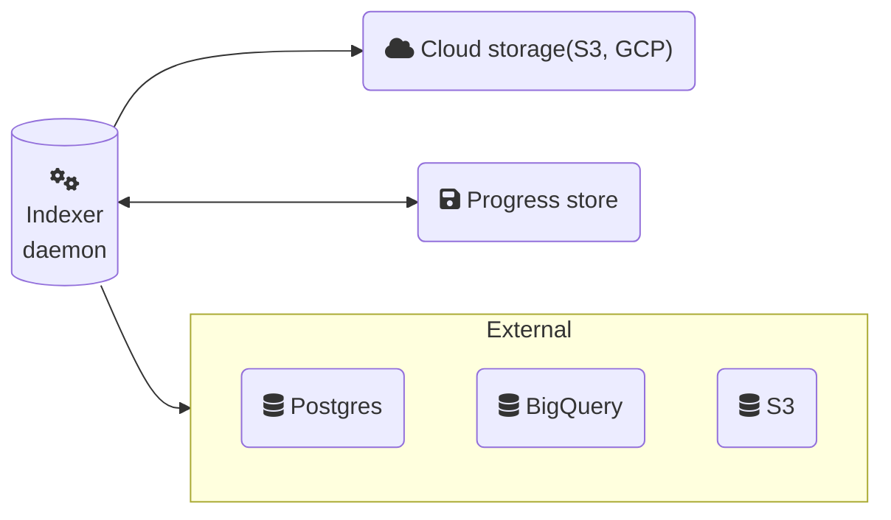
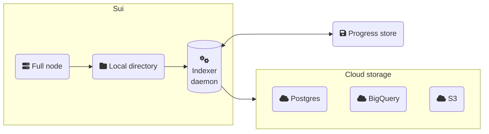

:::info

{@include: ../../../snippets/data-serving-msg.mdx}

:::

You can build custom indexers using the Sui micro-data ingestion framework. To create an indexer, you subscribe to a checkpoint stream with full checkpoint content. This stream can be one of the publicly available streams from Mysten Labs, one that you set up in your local environment, or a combination of the two.  

Establishing a custom indexer helps improve latency, allows pruning the data of your Sui Full node, and provides efficient assemblage of checkpoint data.

## Interface and data format

To use the framework, implement a basic interface:

```rust
#[async_trait]
trait Worker: Send + Sync {
    async fn process_checkpoint(&self, checkpoint: &CheckpointData) -> Result<()>;
}
```

In this example, the `CheckpointData` struct represents full checkpoint content. The struct contains checkpoint summary and contents, as well as detailed information about each individual transaction. The individual transaction data includes events and input/output objects. The full definition for this content is in the [full_checkpoint_content.rs](https://github.com/MystenLabs/sui/blob/releases/sui-graphql-rpc-v2024.1.0-release/crates/sui-types/src/full_checkpoint_content.rs) file of the `sui-types` crate.

:::tip

See the [Source code for an implementation](#source-code) section for a complete code example.

:::

## Checkpoint stream sources

Data ingestion for your indexer supports several checkpoint stream sources.

### Remote reader

The most straightforward stream source is to subscribe to a remote store of checkpoint contents. Mysten Labs provides the following buckets:

- Testnet: `https://checkpoints.testnet.sui.io`
- Mainnet: `https://checkpoints.mainnet.sui.io`

The checkpoint files are stored in the following format: `https://checkpoints.testnet.sui.io/<checkpoint_id>.chk`. You can download the checkpoint file by sending an HTTP GET request to the relevant URL. Try it yourself for checkpoint 1 at [https://checkpoints.testnet.sui.io/1.chk](https://checkpoints.testnet.sui.io/1.chk).



The Sui data ingestion framework provides a helper function to quickly bootstrap an indexer workflow.

{@inject: examples/custom-indexer/rust/remote_reader.rs}

This is suitable for setups with a single ingestion pipeline where progress tracking is managed outside of the framework.

### Local reader

Colocate the data ingestion daemon with a Full node and enable checkpoint dumping on the latter to set up a local stream source. After enabling, the Full node starts dumping executed checkpoints as files to a local directory, and the data ingestion daemon subscribes to changes in the directory through an inotify-like mechanism. This approach allows minimizing ingestion latency (checkpoint are processed immediately after a checkpoint executor on a Full node) and getting rid of dependency on an externally managed bucket.

To enable, add the following to your [Full node configuration](../../operator/sui-full-node.mdx) file:

```yaml
checkpoint-executor-config:
  checkpoint-execution-max-concurrency: 200
  local-execution-timeout-sec: 30
  data-ingestion-dir: <path to a local directory>
```



{@inject: examples/custom-indexer/rust/local_reader.rs}

Let's highlight a couple lines of code:

```rust
let worker_pool = WorkerPool::new(CustomWorker, "local_reader".to_string(), concurrency);
executor.register(worker_pool).await?;
```

The data ingestion executor can run multiple workflows simultaneously. For each workflow, you need to create a separate worker pool and register it in the executor. The `WorkerPool` requires an instance of the `Worker` trait, the name of the workflow (which is used for tracking the progress of the flow in the progress store and metrics), and concurrency.

The concurrency parameter specifies how many threads the workflow uses. Having a concurrency value greater than 1 is helpful when tasks are idempotent and can be processed in parallel and out of order. The executor only updates the progress/watermark to a certain checkpoint when all preceding checkpoints are processed.

### Hybrid mode

Specify both a local and remote store as a fallback to ensure constant data flow. The framework always prioritizes locally available checkpoint data over remote data. It's useful when you want to start utilizing your own Full node for data ingestion but need to partially backfill historical data or just have a failover. 

```rust
executor.run(
    PathBuf::from("./chk".to_string()), // path to a local directory
    Some("https://checkpoints.testnet.sui.io".to_string()), // Remote Checkpoint Store
    vec![], // optional remote store access options
    ReaderOptions::default(),
    exit_receiver,
    ).await?;
```


### Manifest 

Code for the cargo.toml manifest file for the custom indexer.

{@inject: examples/custom-indexer/rust/Cargo.toml}

## Source code for an implementation {#source-code}

Find the following source code in the [Sui repo](https://github.com/mystenlabs/sui/tree/main/examples/custom-indexer/rust). 

{@inject: examples/custom-indexer/rust/Cargo.toml}

{@inject: examples/custom-indexer/rust/local_reader.rs}

{@inject: examples/custom-indexer/rust/remote_reader.rs}


## Related links

- [Sui internal example](https://github.com/MystenLabs/sui/tree/main/crates/sui-data-ingestion/src/): Sui data ingestion daemon that runs internal pipelines.
- [Production example](https://github.com/MystenLabs/sui/tree/main/crates/suins-indexer/src): Sui Name Service custom indexer.
- [Using Events](../sui-101/using-events.mdx): Events in Sui enable you to monitor on-chain activity in near-real time when coupled with a custom indexer.

