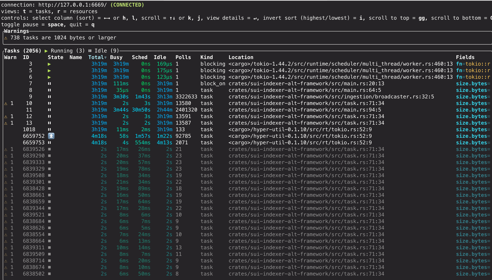

Proper configuration and resource monitoring delivers the most performant custom indexer possible. For example:

- Runtime configuration options for ingestion, database connections, and pipeline selection, as well as purposeful use of debugging tools like `tokio_console` help dial in your indexer performance. 

- A sensible strategy targeting efficient data pruning for your tables keeps them performant over time. 

- Following best practices for exposing and extending Prometheus metrics helps you keep track of indexer performance. 

Together, these techniques help you run indexers that are fast, resource-efficient, and easier to monitor in both development and production.

## Fine-tuning configurations

The indexing framework provides multiple levels of configuration to optimize performance for different use cases. This section covers basic configuration options, while complex pipeline-specific tuning is covered in [Indexer Pipeline Architecture](/concepts/data-access/pipeline-architecture.mdx).

### Ingestion layer configuration

Control how checkpoint data is fetched and distributed:

```rust
let ingestion_config = IngestionConfig {
    // Buffer size across all downstream workers (default: 5000)
    checkpoint_buffer_size: 10000,
    
    // Concurrent checkpoint fetches (default: 200)
    ingest_concurrency: 500,
    
    // Retry interval for missing checkpoints in ms (default: 200)
    retry_interval_ms: 100,
};
```

**Tuning guidelines:**

- `checkpoint_buffer_size`: Increase for high-throughput scenarios, decrease to reduce memory usage.
- `ingest_concurrency`: Higher values improve ingestion speed but increase network/storage load.
- `retry_interval_ms`: Lower values reduce latency for live data, higher values reduce unnecessary retries.

### Database connection configuration

```rust
let db_args = DbArgs {
    // Connection pool size (default: 100)
    db_connection_pool_size: 200,
    
    // Connection timeout in ms (default: 60,000)
    db_connection_timeout_ms: 30000,
    
    // Statement timeout in ms (default: None)
    db_statement_timeout_ms: Some(120000),
};
```

**Tuning guidelines:**

- `db_connection_pool_size`: Size based on `write_concurrency` across all pipelines.
- `db_connection_timeout_ms`: Reduce for faster failure detection in high-load scenarios.
- `db_statement_timeout_ms`: Set based on expected query complexity and database performance.

### Command-line arguments

Include the following command-line arguments to help focus processing. These values are for demonstration. Use values that make sense to your environment and goals. 

```sh
# Checkpoint range control
--first-checkpoint 1000000     # Start from specific checkpoint
--last-checkpoint 2000000      # Stop at specific checkpoint

# Pipeline selection
--pipeline "tx_counts"          # Run specific pipeline only
--pipeline "events"             # Can specify multiple pipelines

# Watermark behavior
--skip-watermark  
```

**Use cases:**

- **Checkpoint range:** Essential for backfills and historical data processing.
- **Pipeline selection:** Useful for selective reprocessing or testing.
- **Skip watermark:** Enables faster backfills when watermark consistency isn't required.

### Pipeline-specific advanced tuning

For complex configuration scenarios requiring deep understanding of pipeline internals:

- [Sequential pipeline architecture](/concepts/data-access/pipeline-architecture.mdx#sequential-pipeline-architecture)
- [Concurrent pipeline architecture](/concepts/data-access/pipeline-architecture.mdx#concurrent-pipeline-architecture)

## Tokio runtime debugging

For performance-sensitive pipelines or when troubleshooting async runtime issues, the `sui-indexer-alt-framework` integrates with `tokio-console`, a powerful debugger for async Rust applications. This tool provides real-time insights into task execution, helping identify performance bottlenecks, stuck tasks, and memory issues.

[GitHub repo for `tokio-console`](https://github.com/tokio-rs/console)

### When to use Tokio console

The Tokio console is particularly useful for:

- **Performance debugging:** Identifying slow or blocking tasks.
- **Memory analysis:** Finding tasks consuming excessive memory.
- **Concurrency issues:** Detecting tasks that never yield or wake themselves excessively.
- **Runtime behavior:** Understanding task scheduling and execution patterns.

### Setup instructions

Consult the [README](https://github.com/tokio-rs/console/blob/main/README.md) in the Tokio GitHub repo for additional information.

1. Add dependencies

    Add the `telemetry_subscribers` dependency to your `Cargo.toml`:

    ```rust
    [dependencies]
    telemetry_subscribers = { git = "https://github.com/MystenLabs/sui.git", branch = "main" }
    ```

1. Initialize telemetry

    Add telemetry initialization at the beginning of your `main` function:

    ```rust
    #[tokio::main]
    async fn main() -> Result<()> {
        // Enable tracing, configured by environment variables
        let _guard = telemetry_subscribers::TelemetryConfig::new()
            .with_env()
            .init();

        // Your indexer code here...
    }
    ```

1. Run with console enabled

    Start your indexer with the required flags:

    ```bash
    RUSTFLAGS="--cfg tokio_unstable" TOKIO_CONSOLE=1 cargo run
    ```

    **Flag explanations:**

    - `TOKIO_CONSOLE=1`: Enables `tokio-console` integration in `telemetry_subscribers`.
    - `RUSTFLAGS="--cfg tokio_unstable"`: Required by `tokio-console` to collect task instrumentation data.

1. Launch the console dashboard

    ```sh
    # Install tokio-console if not already installed
    cargo install tokio-console

    # Connect to your running indexer (default: localhost:6669)
    tokio-console
    ```

    If successful, the dashboard appears with information about every running Tokio task:

    

### Console features

For detailed information about the console dashboard, available views, warnings, and diagnostic capabilities, refer to the official [`tokio-console` documentation](https://github.com/tokio-rs/console)

### Production considerations

`tokio-console` introduces runtime overhead and should be used carefully in production. While it's safe to use regularly during development and staging, production usage requires careful evaluation. Before enabling in production, you should run performance benchmarks with and without Tokio console enabled to measure the impact on your specific workload. Consider enabling only during maintenance windows or targeted troubleshooting sessions while monitoring system resources.

## Metrics

The `sui-indexer-alt-framework` provides built-in Prometheus metrics for monitoring indexer performance and health. All metrics are automatically exposed via HTTP and can be extended with custom metrics.

### Built-in metrics

The framework tracks extensive metrics across ingestion, pipeline processing, database operations, and watermark management. For a complete list of available metrics with descriptions, refer to the `IndexerMetrics` struct in `sui-indexer-alt-framework/src/metrics.rs`.

<ImportContent source="crates/sui-indexer-alt-framework/src/metrics.rs" mode="code" struct="IndexerMetrics" />

Key metric categories include:

- **Ingestion metrics:** Global checkpoint and transaction processing stats.
- **Pipeline metrics:** Per-pipeline processing performance (labeled by pipeline name).
- **Database metrics:** Batch processing, commit latency, and failure rates.
- **Watermark metrics:** Progress tracking and lag measurements.

### Accessing metrics

By default, metrics are served on `0.0.0.0:9184/metrics` in [Prometheus format](https://prometheus.io/docs/concepts/data_model/). You can override this address:

- Via the command line:

    ```sh
    $ cargo run --metrics-address "0.0.0.0:8080"
    ```

- Or, via the builder configuration:

    ```rust
    let cluster = IndexerCluster::builder()
        .with_metrics_args(MetricsArgs {
            metrics_address: "0.0.0.0:8080".parse().unwrap(),
        })
    ```

### Adding metric labels

It's highly recommended to add a metric label prefix to differentiate between different indexer instances:

```rust
let cluster = IndexerCluster::builder()
    .with_metric_label("my_custom_indexer")
```

This prefixes all default metrics (for example, `my_custom_indexer_indexer_total_ingested_checkpoints`).

### Adding custom metrics

You can register custom metrics using the shared `Registry`:

```rust
use prometheus::{IntCounter, register_int_counter_with_registry}

// Get the metrics registry before running the cluster
let cluster = IndexerCluster::builder()
    .with_database_url(database_url)
    .with_args(args)
    .build()
    .await?;

// Register custom metrics
let custom_counter = register_int_counter_with_registry!(
    "my_custom_metric_total",
    "Description of my custom metric",
    cluster.metrics().registry(),
)?;
```

### Metrics collection and visualization

The framework only exposes metrics via HTTP, and you're responsible for collection and storage. For example, some indexers use the Alloy agent to scrape the `/metrics` endpoint and write to a metrics database for visualization and alerting.

See [Collect Prometheus metrics](https://grafana.com/docs/alloy/latest/collect/prometheus-metrics/) on the Grafana Labs website.

## Pruning best practices

If your table prunes data in checkpoint order, you can improve efficiency by partitioning the table, so that you can prune by just dropping whole partitions. This usually requires only a single pruner task, avoiding the need for concurrent batched `DELETE` queries.

Partition size is the key tradeoff: you need `N` full partitions plus one trailing _active_ partition that cannot be dropped until it falls outside the read window. Larger partitions mean fewer total partitions to scan, reducing read amplification. Smaller partitions reduce retention overhead but increase the number of partitions queried. For example, keeping 10M checkpoints could use a 10M partition plus 1 active partition (querying at most 2 partitions) or 10 1M partitions plus 1 active partition (querying 11 partitions). In practice, per-epoch partitioning tends to produce too many small partitions, and not partitioning at all leads to performance degradation from repeated `DELETE`s creating dead tuples and fragmentation.

Pipelines with more complex pruning rules can still benefit. For example, in consistent pipelines, a record can only be pruned if there is a newer record for the same key or if it is a sentinel row. A separate, leaner table can track deletable records and be partitioned by checkpoint to make pruning efficient.

### Implementation

You can use `pg_partman` to simplify partition management. Configure a partitioned table with `create_parent`, followed by a cron job to periodically `run_maintenance`. You might need to iterate to determine the correct frequency of `run_maintenance`. 

:::info

Tables with primary key or unique constraints must additionally include all columns used in the partitioning scheme.

:::

```sql
CREATE EXTENSION pg_partman;

SELECT create_parent(
    p_parent_table := 'public.tx_calls',
    p_control := 'cp_sequence_number',
    p_type := 'range',
    p_interval := '10000000',
    p_start_partition := '70000000',
    p_premake := 5,
);

-- Create a maintenance job to run every hour
SELECT cron.schedule('0 * * * *', $$SELECT run_maintenance(p_analyze := false)$$);
```

This can be included as a migration:

```sql
CREATE EXTENSION IF NOT EXISTS pg_partman;
CREATE EXTENSION IF NOT EXISTS pg_cron;

-- Function to safely set up partitioning for a table
CREATE OR REPLACE FUNCTION safe_create_parent(
    p_schema text,
    p_table text,
    p_control text,
    p_type text,
    p_interval text,
    p_start_partition text,
    p_premake int
) RETURNS text AS $$
DECLARE
    full_table_name text := p_schema || '.' || p_table;
    result_message text;
BEGIN
    -- Check if the table is already managed by pg_partman
    IF NOT EXISTS (
        SELECT 1 FROM part_config
        WHERE parent_table = full_table_name
    ) THEN
        -- If not managed, set up partitioning
        PERFORM create_parent(
            p_parent_table := full_table_name,
            p_control := p_control,
            p_type := p_type,
            p_interval := p_interval,
            p_start_partition := p_start_partition,
            p_premake := p_premake
        );
        result_message := 'CREATED: Partitioning set up for ' || full_table_name;
    ELSE
        -- Table is already managed
        result_message := 'EXISTS: Table ' || full_table_name || ' is already managed by pg_partman';
    END IF;
    
    RETURN result_message;
END;
$$ LANGUAGE plpgsql;

SELECT safe_create_parent('public', 'tx_affected_objects', 'cp_sequence_number', 'range', '10000000', '70000000', 1);

SELECT cron.schedule('0 * * * *', 'SELECT run_maintenance()');
```

The accompanying `down.sql` looks like the following:

```sql
-- Remove the scheduled job
DELETE FROM cron.job WHERE command = 'SELECT run_maintenance()';

-- Undo partitioning for all tables
SELECT undo_partition('public.tx_affected_objects', p_keep_table := true);
```

You can confirm that the partitioned table and cron job are set up correctly with the following SQL queries:

```sql
SELECT parent_table, partition_type, control, interval_val
FROM part_config
ORDER BY parent_table;

-- Check maintenance job is scheduled
SELECT jobid, schedule, command, nodename, database, username 
FROM cron.job
WHERE command = 'SELECT run_maintenance()';
```

## Related links

<RelatedLink to="/concepts/data-access/custom-indexing-framework.mdx" />
<RelatedLink to="/guides/developer/advanced/custom-indexer.mdx" />
