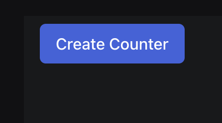
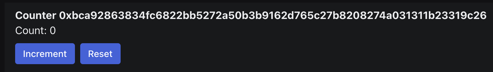

This example walks you through building a basic distributed counter app, covering the full end-to-end flow of building your Sui Move module and connecting it to your React Sui dApp. The app allows users to create counters that anyone can increment, but only the owner can reset. 

The guide is split into two parts:

1. [Smart Contracts](#smart-contracts): The Move code that sets up the `Counter` structure and logic.
1. [Frontend](#frontend): A UI that enables users to create, increment, and reset `Counter` objects.

:::tip Additional resources

[Example source code](https://github.com/MystenLabs/sui/blob/60bb8bdc274b9e5706fd916cd84c13f81e832529/sdk/create-dapp/templates/react-e2e-counter)

:::

## What the guide teaches

- **Shared objects:** The guide teaches you how to use [shared objects](../../../concepts/object-ownership/shared.mdx), in this case to create globally accessible `Counter` objects.
- **Programmable transaction blocks (PTBs):** You learn how to use PTBs to interact with your Move module from your frontend.

## What you need

Before getting started, make sure you have:

- [Installed the latest version of Sui](../getting-started/sui-install.mdx).

## Directory structure

To begin, create a new folder on your system titled `react-e2e-counter` to hold all your project files. You can name this directory differently, but the rest of the guide references this file structure. Inside that folder, create two more folders: `move` and `src`. Inside the `move` folder, create a `counter` directory. Finally, create a `sources` folder inside `counter`. Different projects have their own directory structure, but it's common to split code into functional groups to help with maintenance. See [Write a Move Package](../first-app/write-package.mdx) to learn more about package structure and how to use the Sui CLI to scaffold a new project.

:::checkpoint

- You have the latest version of Sui installed. If you run `sui --version` in your terminal or console, it responds with the currently installed version.
- Your active environment is pointing to the expected network. Run `sui client active-env` to make sure. If you receive a warning about a client and server API version mismatch, update Sui using the version in the relevant branch (`mainnet`, `testnet`, `devent`) of the Sui repo.
- Your active address has SUI. Run `sui client balance` in your terminal or console. If there is no balance, [acquire SUI](../getting-started/get-coins.mdx) from the faucet (not available in Mainnet).
- You have a directory to place the files you create in. The top-level directory is named `react-e2e-counter` if you want to match the directory structure in this guide. 

:::

:::tip
    
{@include: ../../../snippets/faucet-online.mdx}

:::

## Smart contracts {#smart-contracts}

In this part of the guide, you write the Move contracts that create, increment, and reset counters.

### Move.toml

To begin writing your smart contracts, create a file inside `react-e2e-counter/move/counter` named `Move.toml` and copy the following code into it. This is the package manifest file. If you want to learn more about the structure of the file, see [Package Manifest](https://move-book.com/concepts/manifest.html) in The Move Book.

:::info

If you are targeting a network other than Testnet, be sure to update the `rev` value for the Sui dependency.

:::

{@inject: github:MystenLabs/ts-sdks/packages/create-dapp/templates/react-e2e-counter/move/counter/Move.toml}

### `Counter` struct

To begin creating the smart contract that defines the on-chain counter, create a `counter.move` file inside your `react-e2e-counter/move/counter` folder. Define the module that holds your smart contract logic.

```move
module counter::counter {
  // Code goes here
}
```

Add the `Counter` struct and elements described in the following sections to the module. 

{@inject: github:MystenLabs/ts-sdks/packages/create-dapp/templates/react-e2e-counter/move/counter/sources/counter.move#struct=Counter noComments}

- The `Counter` type stores the address of its `owner`, its current `value`, and its own `id`.

### Creating `Counter`

{@inject: github:MystenLabs/ts-sdks/packages/create-dapp/templates/react-e2e-counter/move/counter/sources/counter.move#fun=create noComments}

In the `create` function, a new `Counter` object is created and [shared](../../../concepts/object-ownership/shared.mdx). 

### Incrementing and resetting `Counter`

{@inject: github:MystenLabs/ts-sdks/packages/create-dapp/templates/react-e2e-counter/move/counter/sources/counter.move#fun=increment noComments}

The `increment` function accepts a mutable reference to any shared `Counter` object and increments its `value` field.

{@inject: github:MystenLabs/ts-sdks/packages/create-dapp/templates/react-e2e-counter/move/counter/sources/counter.move#fun=set_value noComments}

The `set_value` function accepts a mutable reference to any shared `Counter` object, the `value` to set its `value` field, and the `ctx` which contains the `sender` of the transaction. The `Counter` `owner` is the only one that can run this function.

:::tip Additional resources

Learn more about taking [object references as input](../../../concepts/sui-move-concepts.mdx#entry-points)

:::

## Finished package

The final module should look like this

{@inject: github:MystenLabs/ts-sdks/packages/create-dapp/templates/react-e2e-counter/move/counter/sources/counter.move noComments}

:::checkpoint

Your smart contract is complete. You should be able to run the `sui move build` command from `react-e2e-counter/move/counter` and receive a response similar to the following:
```sh
UPDATING GIT DEPENDENCY https://github.com/MystenLabs/sui.git
INCLUDING DEPENDENCY Sui
INCLUDING DEPENDENCY MoveStdlib
BUILDING counter
```
You always run `sui move build` at the same level as your `Move.toml` file. After a successful build, you now have a `build` folder inside `react-e2e-counter/move/counter`.

:::

### Deployment {#deployment}

{@include: ../../../snippets/initialize-sui-client-cli.mdx}

Next, configure the Sui CLI to use `testnet` as the active environment, as well. If you haven't already set up a `testnet` environment, do so by running the following command in a terminal or console:

```sh
$ sui client new-env --alias testnet --rpc https://fullnode.testnet.sui.io:443
```

Run the following command to activate the `testnet` environment:

```sh
$ sui client switch --env testnet
```

{@include: ../../../snippets/publish-to-devnet-with-coins.mdx}

The output of this command contains a `packageID` value that you need to save to use the package.

Partial snippet of CLI deployment output.

```sh
╭──────────────────────────────────────────────────────────────────────────────────────────────────╮
│ Object Changes                                                                                   │
├──────────────────────────────────────────────────────────────────────────────────────────────────┤
│ Created Objects:                                                                                 │
│  ┌──                                                                                             │
│  │ ObjectID: 0x7530c33e4cf3345236601d69303e3fab84efc294194a810dc1cfea13c009e77f                  │
│  │ Sender: 0x8e8cae7791a93778800b88b6a274de5c32a86484593568d38619c7ea71999654                    │
│  │ Owner: Account Address ( 0x8e8cae7791a93778800b88b6a274de5c32a86484593568d38619c7ea71999654 ) │
│  │ ObjectType: 0x2::package::UpgradeCap                                                          │
│  │ Version: 47482286                                                                             │
│  │ Digest: 5aEez7HkJ82Xs5ZArPHJF6Ty38UtprsCvEiyy22hBVRE                                          │
│  └──                                                                                             │
│ Mutated Objects:                                                                                 │
│  ┌──                                                                                             │
│  │ ObjectID: 0x0fcc6d770d80aa409a9645e78ac4810be6400919ac7f507bddd2f9d279da509f                  │
│  │ Sender: 0x8e8cae7791a93778800b88b6a274de5c32a86484593568d38619c7ea71999654                    │
│  │ Owner: Account Address ( 0x8e8cae7791a93778800b88b6a274de5c32a86484593568d38619c7ea71999654 ) │
│  │ ObjectType: 0x2::coin::Coin<0x2::sui::SUI>                                                    │
│  │ Version: 47482286                                                                             │
│  │ Digest: A6TH6ja5TM4S6nZBwB14AB17ZgixCijYX1aNMGHF3syv                                          │
│  └──                                                                                             │
│ Published Objects:                                                                               │
│  ┌──                                                                                             │
│  │ PackageID: 0x7b6a8f5782e57cd948dc75ee098b73046a79282183d51eefb83d31ec95c312aa                 │
│  │ Version: 1                                                                                    │
│  │ Digest: FKAZc1cmQ9FUYudDQBjZPTb1uXDnekKRUbAALuVnwURC                                          │
│  │ Modules: counter                                                                              │
│  └──                                                                                             │
╰──────────────────────────────────────────────────────────────────────────────────────────────────╯
```

Store the `PackageID` value you receive in your own response to [connect to your frontend](#connecting-your-package).

### Next steps

Well done. You have written and deployed the Move package! 🚀

To turn this into a complete dApp, you need to [create a frontend](#frontend).


## Frontend {#frontend}

In this final part of the app example, you build a frontend (UI) that allows end users to create, increment, and reset `Counter` objects.


:::info

To skip building the frontend and test out your newly deployed package, create this example using the following template and follow the instructions in the template's `README.md` file: 

<Tabs groupId="packagemanager">
  <TabItem label="PNPM" value="pnpm">
    ```sh
    $ pnpm create @mysten/dapp --template react-e2e-counter
    ```
  </TabItem>
  <TabItem label="Yarn" value="yarn">
    ```sh
    $ yarn create @mysten/dapp --template react-e2e-counter
    ```
  </TabItem>
</Tabs>

:::

### Prerequisites

Before getting started, make sure you have:

- [Deployed the complete `counter` Move module](#smart-contracts) and understand its design.
- Installed [`pnpm`](https://pnpm.io/installation) or [`yarn`](https://classic.yarnpkg.com/lang/en/docs/install/#mac-stable) to use as the package manager.

:::tip Additional resources

- Tooling: [Sui Typescript SDK](https://sdk.mystenlabs.com/typescript) for basic usage on how to interact with Sui using Typescript.
- Tooling: [Sui dApp Kit](https://sdk.mystenlabs.com/dapp-kit) to learn basic building blocks for developing a dApp in the Sui ecosystem with React.js.
- Tooling: [`@mysten/dapp`](https://sdk.mystenlabs.com/dapp-kit/create-dapp), used within this project to quickly scaffold a React-based Sui dApp.

:::

### Overview

The UI design consists of two parts:

- A button for users to create new `Counter` objects
- A `Counter` UI for users to view the `value`, and to increment and reset the `Counter` object.


### Scaffold a new app

The first step is to set up the client app. Run the following command to scaffold a new app.

<Tabs groupId="packagemanager">
  <TabItem label="PNPM" value="pnpm">
    ```sh
    $ pnpm create @mysten/dapp --template react-client-dapp
    ```
  </TabItem>
  <TabItem label="Yarn" value="yarn">
    ```sh
    $ yarn create @mysten/dapp --template react-client-dapp
    ```
  </TabItem>
</Tabs>

### Install new dependencies

This app uses the `react-spinners` package for icons. Install it by running the following command:

<Tabs groupId="packagemanager">
  <TabItem label="PNPM" value="pnpm">
    ```sh
    $ pnpm add react-spinners
    ```
  </TabItem>
  <TabItem label="Yarn" value="yarn">
    ```sh
    $ yarn add react-spinners
    ```
  </TabItem>
</Tabs>

### Connecting your deployed package {#connecting-your-package}

<details>
  <summary>
    Add the `packageId` value you saved from [deploying your package](#deployment) to a new `src/constants.ts` file in your project:
  </summary>
  ```ts
    export const DEVNET_COUNTER_PACKAGE_ID = "0xTODO";
    export const TESTNET_COUNTER_PACKAGE_ID = "0x7b6a8f5782e57cd948dc75ee098b73046a79282183d51eefb83d31ec95c312aa";
    export const MAINNET_COUNTER_PACKAGE_ID = "0xTODO";
  ```
</details>

<details>
  <summary>
    Update the `src/networkConfig.ts` file to include the `packageID` constants.
  </summary>
  {@inject: github:MystenLabs/ts-sdks/packages/create-dapp/templates/react-e2e-counter/src/networkConfig.ts noComments}
</details>

### Creating `Counter`

You need a way to create a new `Counter` object. 

<details>
  <summary>
    Create `src/CreateCounter.tsx` and add the following code:
  </summary>
  ```tsx
    import { Button, Container } from "@radix-ui/themes";
    import { useState } from "react";
    import ClipLoader from "react-spinners/ClipLoader";

    export function CreateCounter({
      onCreated,
    }: {
      onCreated: (id: string) => void;
    }) {
      const [waitingForTxn, setWaitingForTxn] = useState(false);

      function create() {
        // TODO
      }

      return (
        <Container>
          <Button
            size="3"
            onClick={() => {
              create();
            }}
            disabled={waitingForTxn}
          >
            {waitingForTxn ? <ClipLoader size={20} /> : "Create Counter"}
          </Button>
        </Container>
      );
    }
  ```
</details>

This component renders a button that enables the user to create a counter. Now, update your `create` function so that it calls the `create` function from your Move module.

<details>
  <summary>
    Update the `create` function in the `src/CreateCounter.tsx` file:
  </summary>
  {@inject: github:MystenLabs/ts-sdks/packages/create-dapp/templates/react-e2e-counter/src/CreateCounter.tsx noComments}
</details>

The `create` function now creates a new Sui `Transaction` and calls the `create` function from your Move module. The PTB is then signed and executed via the `useSignAndExecuteTransaction` hook. The `onCreated` callback is called with the new counter's ID when the transaction is successful.

### Set up routing

Now that your users can create counters, you need a way to route to them. Routing in a React app can be complex, but this example keeps it basic. 

<details>
  <summary>
    Set up your `src/App.tsx` file so that you render the `CreateCounter` component by default, and if you want to display a specific counter you can put its ID into the hash portion of the URL.
  </summary>
  ```tsx
    import { ConnectButton, useCurrentAccount } from "@mysten/dapp-kit";
    import { isValidSuiObjectId } from "@mysten/sui/utils";
    import { Box, Container, Flex, Heading } from "@radix-ui/themes";
    import { useState } from "react";
    import { CreateCounter } from "./CreateCounter";

    function App() {
      const currentAccount = useCurrentAccount();
      const [counterId, setCounter] = useState(() => {
        const hash = window.location.hash.slice(1);
        return isValidSuiObjectId(hash) ? hash : null;
      });

      return (
        <>
          <Flex
            position="sticky"
            px="4"
            py="2"
            justify="between"
            style={{
              borderBottom: "1px solid var(--gray-a2)",
            }}
          >
            <Box>
              <Heading>dApp Starter Template</Heading>
            </Box>

            <Box>
              <ConnectButton />
            </Box>
          </Flex>
          <Container>
            <Container
              mt="5"
              pt="2"
              px="4"
              style={{ background: "var(--gray-a2)", minHeight: 500 }}
            >
              {currentAccount ? (
                counterId ? (
                  null
                ) : (
                  <CreateCounter
                    onCreated={(id) => {
                      window.location.hash = id;
                      setCounter(id);
                    }}
                  />
                )
              ) : (
                <Heading>Please connect your wallet</Heading>
              )}
            </Container>
          </Container>
        </>
      );
    }

    export default App;
  ```
</details>

This sets up your app to read the hash from the URL, and get the counter's ID if the hash is a valid object ID. Then, if you have a counter ID, it renders a `Counter` (which you define in the next step). If you don't have a counter ID, then it renders the `CreateCounter` button from the previous step. When a counter is created, you update the URL, and set the counter ID.

Currently, the `Counter` component doesn't exist, so the app displays an empty page if you navigate to a counter ID.

:::checkpoint

At this point, you have a basic routing setup. Run your app and ensure you can:

- Create a new counter.
- See the counter ID in the URL.

The `create counter` button should look like this: 



:::

### Building your counter user interface

Create a new file: `src/Counter.tsx`.

For your counter, you want to display three elements:

- The current count, which you fetch from the object using the `getObject` RPC method.
- An increment button, which calls the `increment` Move function.
- A reset button, which calls the `set_value` Move function with `0`. This is only shown if the current user owns the counter.

<details>
  <summary>
    Add the following code to your `src/Counter.tsx` file:
  </summary>
  ```tsx
    import {
      useCurrentAccount,
      useSuiClientQuery,
    } from "@mysten/dapp-kit";
    import { SuiObjectData } from "@mysten/sui/client";
    import { Button, Flex, Heading, Text } from "@radix-ui/themes";
    import { useState } from "react";
    import ClipLoader from "react-spinners/ClipLoader";


    export function Counter({ id }: { id: string }) {
      const currentAccount = useCurrentAccount();
      const { data, isPending, error, refetch } = useSuiClientQuery("getObject", {
        id,
        options: {
          showContent: true,
          showOwner: true,
        },
      });

      const [waitingForTxn, setWaitingForTxn] = useState("");

      const executeMoveCall = (method: "increment" | "reset") => {
        // TODO
      };

      if (isPending) return <Text>Loading...</Text>;

      if (error) return <Text>Error: {error.message}</Text>;

      if (!data.data) return <Text>Not found</Text>;

      const ownedByCurrentAccount =
        getCounterFields(data.data)?.owner === currentAccount?.address;

      return (
        <>
          <Heading size="3">Counter {id}</Heading>

          <Flex direction="column" gap="2">
            <Text>Count: {getCounterFields(data.data)?.value}</Text>
            <Flex direction="row" gap="2">
              <Button
                onClick={() => executeMoveCall("increment")}
                disabled={waitingForTxn !== ""}
              >
                {waitingForTxn === "increment" ? (
                  <ClipLoader size={20} />
                ) : (
                  "Increment"
                )}
              </Button>
              {ownedByCurrentAccount ? (
                <Button
                  onClick={() => executeMoveCall("reset")}
                  disabled={waitingForTxn !== ""}
                >
                  {waitingForTxn === "reset" ? (
                    <ClipLoader size={20} />
                  ) : (
                    "Reset"
                  )}
                </Button>
              ) : null}
            </Flex>
          </Flex>
        </>
      );
    }
    function getCounterFields(data: SuiObjectData) {
      if (data.content?.dataType !== "moveObject") {
        return null;
      }

      return data.content.fields as { value: number; owner: string };
    }
  ```
</details>

This snippet has a few new concepts to examine. It uses the `useSuiClientQuery` hook to make the `getObject` RPC call. This returns a data object representing your counter. dApp Kit doesn't know which fields your counter object has, so define a `getCounterFields` helper that gets the counter fields, and adds a type-cast so that you can access the expected `value` and `owner` fields in your component.

The code also adds an `executeMoveCall` function that still needs implementing. This works just like the `create` function you used to create the counter. Instead of using a callback prop like you did for `CreateCounter`, you can use the refetch provided by `useSuiClientQuery` to reload your `Counter` object after you've executed your PTB.

<details>
  <summary>
    Update the `executeMoveCall` function in the `src/Counter.tsx` file:
  </summary>
  {@inject: github:MystenLabs/ts-sdks/packages/create-dapp/templates/react-e2e-counter/src/Counter.tsx noComments}
</details>

### Updating the routing

Now that you have a `Counter` component, you need to update your `App` component to render it when you have a counter ID.

<details>
  <summary>
    Update the `src/App.tsx` file to render the `Counter` component when you have a counter ID:
  </summary>
  {@inject: github:MystenLabs/ts-sdks/packages/create-dapp/templates/react-e2e-counter/src/App.tsx noComments}
</details>

:::checkpoint

At this point, you have the complete app! Run it and ensure you can:

- Create counters
- Increment and reset counters

The `Counter` component should look like this:



:::