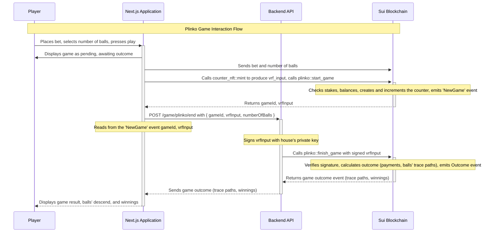

Plinko is an example implementation of the popular casino game. The Plinko game on Sui incorporates advanced cryptographic techniques to ensure fairness and transparency. Players drop Plinko balls onto a pegged board, where they randomly fall into slots representing different multipliers. This document details the game's mechanics, cryptographic features, and the methodology for calculating trace paths and verifying signatures.

Building an on-chain Plinko game shares a lot of similarities with the [Coin Flip](./coin-flip.mdx) game and [Blackjack](./blackjack.mdx) game. For that reason, this example covers only the smart contracts (Move modules) and frontend logic.

:::info

You can find the source files for this example in the [Plinko repo](https://github.com/MystenLabs/plinko-poc/tree/main) on GitHub.

A version of the game is also deployed at [Mysten Plinko](https://plinko-poc.vercel.app/).

:::

## Gameplay

The Plinko game, implemented through smart contracts on the Sui blockchain, incorporates cryptographic techniques to ensure fairness and transparency. Utilizing a blend of BLS signatures, hash functions, and verifiable random function (VRF) inputs, the game calculates the trace path for each ball, determining the game's outcome based on the number of Plink balls a player chooses to drop.

The game mechanics involve a player starting a game by specifying the number of balls and staking a certain amount. The backend generates a BLS signature for the game's randomness source, which is verified on-chain to ensure it's untampered. The game uses a Counter NFT for each round to generate a unique VRF input, ensuring each game's randomness is distinct and cannot be predicted or repeated. The number of Plinko balls, chosen by the player, directly influences the game's complexity and potential payout, as each ball's final position is determined by traversing a cryptographic trace path generated from the hashed BLS signature extended to accommodate the total number of balls.

## Sequence diagram



## Move modules

Follow the comments in each module's code to understand the logic each creates.

### plinko::plinko

The `plinko::plinko` module combines various Sui blockchain features, such as coin handling, event emissions, and dynamic object fields, to create on-chain Plinko games.

```move title="plinko.move"
module plinko::plinko {
// === Imports ===
use sui::coin::{Self, Coin};
use sui::balance::Balance;
use sui::sui::SUI;
use sui::bls12381::bls12381_min_pk_verify;
use sui::event::emit;
use sui::hash::{blake2b256};
use sui::dynamic_object_field::{Self as dof};

// Import Counter NFT module
use plinko::counter_nft::Counter;

// Import HouseData module
use plinko::house_data::HouseData;

// === Errors ===
const EStakeTooLow: u64 = 0;
const EStakeTooHigh: u64 = 1;
const EInvalidBlsSig: u64 = 2;
const EInsufficientHouseBalance: u64 = 5;
const EGameDoesNotExist: u64 = 6;

// === Structs ===

/// Represents a game and holds the accrued stake.
public struct Game has key, store {
    id: UID,
    game_start_epoch: u64,
    stake: Balance<SUI>,
    player: address,
    // The VRF input used to generate the extended beacon
    vrf_input: vector<u8>,
    fee_bp: u16
}

// === Events ===

/// Emitted when a new game has started.
public struct NewGame has copy, drop {
    game_id: ID,
    player: address,
    vrf_input: vector<u8>,
    user_stake: u64,
    fee_bp: u16
}

/// Emitted when a game has finished.
public struct Outcome has copy, drop {
    game_id: ID,
    result: u64,
    player: address,
    // The trace path of the extended beacon
    trace: vector<u8>
}

// === Public Functions ===

/// Function used to create a new game. The player must provide a Counter NFT and the number of balls.
public fun start_game(counter: &mut Counter, num_balls: u64, coin: Coin<SUI>, house_data: &mut HouseData, ctx: &mut TxContext): ID {
    let fee_bp = house_data.base_fee_in_bp();
    let (id, new_game) = internal_start_game(counter, num_balls, coin, house_data, fee_bp, ctx);
    dof::add(house_data.borrow_mut(), id, new_game);
    id
}

/// finish_game Completes the game by calculating the outcome and transferring the funds to the player.
/// The player must provide a BLS signature of the VRF input and the number of balls to calculate the outcome.
/// It emits an Outcome event with the game result and the trace path of the extended beacon.
public fun finish_game(game_id: ID, bls_sig: vector<u8>, house_data: &mut HouseData, num_balls: u64, ctx: &mut TxContext): (u64, address, vector<u8>) {
    // Ensure that the game exists.
    assert!(game_exists(house_data, game_id), EGameDoesNotExist);

    // Retrieves and removes the game from HouseData, preparing for outcome calculation.
    let Game {
        id,
        game_start_epoch: _,
        stake,
        player,
        vrf_input,
        fee_bp: _
    } = dof::remove<ID, Game>(house_data.borrow_mut(), game_id);

    object::delete(id);

    // Validates the BLS signature against the VRF input.
    let is_sig_valid = bls12381_min_pk_verify(&bls_sig, &house_data.public_key(), &vrf_input);
    assert!(is_sig_valid, EInvalidBlsSig);

    // Initialize the extended beacon vector and a counter for hashing.
    let mut extended_beacon = vector[];
    let mut counter: u8 = 0;

    // Extends the beacon until it has enough data for all ball outcomes.
    while (extended_beacon.length() < (num_balls * 12)) {
        // Create a new vector combining the original BLS signature with the current counter value.
        let mut hash_input = vector[];
        hash_input.append(bls_sig);
        hash_input.push_back(counter);
        // Generate a new hash block from the unique hash input.
        let block = blake2b256(&hash_input);
        // Append the generated hash block to the extended beacon.
        extended_beacon.append(block);
        // Increment the counter for the next iteration to ensure a new unique hash input.
        counter = counter + 1;
    };

    // Initializes variables for calculating game outcome.
    let mut trace = vector[];
    // Calculate the stake amount per ball
    let stake_per_ball = stake.value<SUI>() / num_balls;
    let mut total_funds_amount: u64 = 0;

    // Calculates outcome for each ball based on the extended beacon.
    let mut ball_index = 0;
    while (ball_index < num_balls) {
        let mut state: u64 = 0;
        let mut i = 0;
        while (i < 12) {
            // Calculate the byte index for the current ball and iteration.
            let byte_index = (ball_index * 12) + i;
            // Retrieve the byte from the extended beacon.
            let byte = extended_beacon[byte_index];
            // Add the byte to the trace vector
            trace.push_back<u8>(byte);
            // Count the number of even bytes
            // If even, add 1 to the state
            // Odd byte -> 0, Even byte -> 1
            // The state is used to calculate the multiplier index
            state = if (byte % 2 == 0) { state + 1 } else { state };
            i = i + 1;
        };

    // Calculate multiplier index based on state
    let multiplier_index = state % house_data.multiplier().length();
    // Retrieve the multiplier from the house data
    let result = house_data.multiplier()[multiplier_index];

    // Calculate funds amount for this particular ball
    // Divide by 100 to adjust for multiplier scale and SUI units
    let funds_amount_per_ball = (result * stake_per_ball)/100;
    // Add the funds amount to the total funds amount
    total_funds_amount = total_funds_amount + funds_amount_per_ball;
    ball_index = ball_index + 1;
};

// Processes the payout to the player and returns the game outcome.
let payout_balance_mut = house_data.borrow_balance_mut();
let payout_coin: Coin<SUI> = coin::take(payout_balance_mut, total_funds_amount, ctx);

payout_balance_mut.join(stake);

// transfer the payout coins to the player
transfer::public_transfer(payout_coin, player);
// Emit the Outcome event
emit(Outcome {
    game_id,
    result: total_funds_amount,
    player,
    trace
});

// return the total amount to be sent to the player, (and the player address)
(total_funds_amount, player, trace)


// === Public-View Functions ===

/// Returns the epoch in which the game started.
public fun game_start_epoch(game: &Game): u64 {
    game.game_start_epoch
}

/// Returns the total stake.
public fun stake(game: &Game): u64 {
    game.stake.value()
}

/// Returns the player's address.
public fun player(game: &Game): address {
    game.player
}

/// Returns the player's vrf_input bytes.
public fun vrf_input(game: &Game): vector<u8> {
    game.vrf_input
}

/// Returns the fee of the game.
public fun fee_in_bp(game: &Game): u16 {
    game.fee_bp
}

// === Admin Functions ===

/// Helper function to check if a game exists.
public fun game_exists(house_data: &HouseData, game_id: ID): bool {
    dof::exists_(house_data.borrow(), game_id)
}

/// Helper function to check that a game exists and return a reference to the game Object.
/// Can be used in combination with any accessor to retrieve the desired game field.
public fun borrow_game(game_id: ID, house_data: &HouseData): &Game {
    assert!(game_exists(house_data, game_id), EGameDoesNotExist);
    dof::borrow(house_data.borrow(), game_id)
}

// === Private Functions ===

/// Internal helper function used to create a new game.
/// The player must provide a guess and a Counter NFT.
/// Stake is taken from the player's coin and added to the game's stake.
fun internal_start_game(counter: &mut Counter, num_balls: u64, coin: Coin<SUI>, house_data: &HouseData, fee_bp: u16, ctx: &mut TxContext): (ID, Game) {
    let user_stake = coin.value();
    // Ensure that the stake is not higher than the max stake.
    assert!(user_stake <= house_data.max_stake(), EStakeTooHigh);
    // Ensure that the stake is not lower than the min stake.
    assert!(user_stake >= house_data.min_stake(), EStakeTooLow);
    // Ensure that the house has enough balance to play for this game.
    assert!(house_data.balance() >= (user_stake*(house_data.multiplier()[0]))/100, EInsufficientHouseBalance);

    // Get the VRF input and increment the counter
    let vrf_input = counter.get_vrf_input_and_increment(num_balls);

    let id = object::new(ctx);
    let game_id = object::uid_to_inner(&id);

    // Create a new game object and emit a NewGame event.
    let new_game = Game {
        id,
        game_start_epoch: ctx.epoch(),
        stake: coin.into_balance<SUI>(),
        player: ctx.sender(),
        vrf_input,
        fee_bp
    };
    // Emit a NewGame event
    emit(NewGame {
        game_id,
        player: ctx.sender(),
        vrf_input,
        user_stake,
        fee_bp
    });

    (game_id, new_game)
}
}
```

#### Error codes

Error handling is integral to the module, with specific codes indicating various failure states or invalid operations:

- `EStakeTooLow`: Indicates that the stake provided is below the minimum threshold.
- `EStakeTooHigh`: Indicates that the stake exceeds the maximum allowed limit.
- `EInvalidBlsSig`: Denotes an invalid BLS signature.
- `EInsufficientHouseBalance`: Indicates the house does not have enough balance to cover the game's outcome.
- `EGameDoesNotExist`: Used when a referenced game cannot be found.

#### Events

- `NewGame`: Emitted when a new game starts, capturing essential details like game ID, player address, VRF input, stake, and fee basis points.
- `Outcome`: Emitted upon the conclusion of a game, detailing the outcome, including the game ID, result, player address, and a trace of the game's execution.

#### Structures

- `Game`: Represents an individual game session, holding information such as the game ID, epoch of game start, stake amount, player address, VRF input, and the fee basis points.

#### Entry functions

- `start_game`: Initiates a new Plinko game session, accepting parameters like a counter NFT, the number of balls selected by the player, stake, house data, and transaction context.
- `finish_game`: Calculates and finalizes the game outcome, traces the path the balls travel, and distributes the total funds to the player based on outcomes.

#### Accessors

Provide read-only access to the game's properties, such as:

- `game_start_epoch`
- `stake`
- `player`
- `vrf_input`
- `fee_in_bp`

#### Public helper functions

Include utilities like:

- `fee_amount`: Calculates the fee amount based on the stake and fee basis points.
- `game_exists`: Checks if a game exists within the house data.
- `borrow_game`: Retrieves a reference to a game object for further processing.

#### Internal helper functions

- `internal_start_game`: A core utility that facilitates the creation of a new game, ensuring compliance with stake limits, house balance sufficiency, and the generation of a unique game ID.

### plinko::house_data

The `plinko::house_data` module in the Plinko game is designed to manage the game's treasury and configurations. It's responsible for storing the house funds, setting the game parameters (like maximum and minimum stakes), and handling game fees. It also stores the house public key for verifying game outcomes. The module provides functions to adjust game settings, manage the house funds, and ensure the integrity and fairness of the game through cryptographic verification.

```move title="house_data.move"
module plinko::house_data {
// === Imports ===
use sui::balance::{Self, Balance};
use sui::sui::SUI;
use sui::coin::{Self, Coin};
use sui::package::{Self};

// === Errors ===
const ECallerNotHouse: u64 = 0;
const EInsufficientBalance: u64 = 1;


// === Structs ===

/// Configuration and Treasury shared object, managed by the house.
public struct HouseData has key {
    id: UID,
    // House's balance which also contains the accrued winnings of the house.
    balance: Balance<SUI>,
    // Address of the house or the game operator.
    house: address,
    // Public key used to verify the beacon produced by the back-end.
    public_key: vector<u8>,
    // Maximum stake amount a player can bet in a single game.
    max_stake: u64,
    // Minimum stake amount required to play the game.
    min_stake: u64,
    // The accrued fees from games played.
    fees: Balance<SUI>,
    // The default fee in basis points. 1 basis point = 0.01%.
    base_fee_in_bp: u16,
    // Multipliers used to calculate winnings based on the game outcome.
    multiplier: vector<u64>
}

/// A one-time use capability to initialize the house data;
/// created and sent to sender in the initializer.
public struct HouseCap has key {
    id: UID
}

/// Used as a one time witness to generate the publisher.
public struct HOUSE_DATA has drop {}

fun init(otw: HOUSE_DATA, ctx: &mut TxContext) {
    // Creating and sending the Publisher object to the sender.
    package::claim_and_keep(otw, ctx);

    // Creating and sending the HouseCap object to the sender.
    let house_cap = HouseCap {
        id: object::new(ctx)
    };

    transfer::transfer(house_cap, ctx.sender());
}

/// Initializer function that should only be called once and by the creator of the contract.
/// Initializes the house data object with the house's public key and an initial balance.
/// It also sets the max and min stake values, that can later on be updated.
/// Stores the house address and the base fee in basis points.
/// This object is involved in all games created by the same instance of this package.
public fun initialize_house_data(house_cap: HouseCap, coin: Coin<SUI>, public_key: vector<u8>, multiplier: vector<u64>, ctx: &mut TxContext) {
    assert!(coin.value() > 0, EInsufficientBalance);

    let mut house_data = HouseData {
        id: object::new(ctx),
        balance: coin.into_balance(),
        house: ctx.sender(),
        public_key,
        max_stake: 10_000_000_000, // 10 SUI = 10^9.
        min_stake: 1_000_000_000, // 1 SUI.
        fees: balance::zero(),
        base_fee_in_bp: 100, // 1% in basis points.
        multiplier: vector[]
    };

    house_data.set_multiplier_vector(multiplier);

    let HouseCap { id } = house_cap;
    object::delete(id);

    transfer::share_object(house_data);
}

// === Public-Mutative Functions ===

public fun update_multiplier_vector(house_data: &mut HouseData, v: vector<u64>, ctx: &mut TxContext) {
    assert!(ctx.sender() == house_data.house(), ECallerNotHouse);
    house_data.multiplier = vector[];
    house_data.set_multiplier_vector(v);
}

/// Function used to top up the house balance. Can be called by anyone.
/// House can have multiple accounts so giving the treasury balance is not limited.
public fun top_up(house_data: &mut HouseData, coin: Coin<SUI>, _: &mut TxContext) {
    coin::put(&mut house_data.balance, coin)
}

/// A function to withdraw the entire balance of the house object.
/// It can be called only by the house
public fun withdraw(house_data: &mut HouseData, ctx: &mut TxContext) {
    // Only the house address can withdraw funds.
    assert!(ctx.sender() == house_data.house(), ECallerNotHouse);

    let total_balance = house_data.balance();
    let coin = coin::take(&mut house_data.balance, total_balance, ctx);
    transfer::public_transfer(coin, house_data.house());
}

/// House can withdraw the accumulated fees of the house object.
public fun claim_fees(house_data: &mut HouseData, ctx: &mut TxContext) {
    // Only the house address can withdraw fee funds.
    assert!(ctx.sender() == house_data.house(), ECallerNotHouse);

    let total_fees = house_data.fees();
    let coin = coin::take(&mut house_data.fees, total_fees, ctx);
    transfer::public_transfer(coin, house_data.house());
}

/// House can update the max stake. This allows larger stake to be placed.
public fun update_max_stake(house_data: &mut HouseData, max_stake: u64, ctx: &mut TxContext) {
    // Only the house address can update the base fee.
    assert!(ctx.sender() == house_data.house(), ECallerNotHouse);

    house_data.max_stake = max_stake;
}

/// House can update the min stake. This allows smaller stake to be placed.
public fun update_min_stake(house_data: &mut HouseData, min_stake: u64, ctx: &mut TxContext) {
    // Only the house address can update the min stake.
    assert!(ctx.sender() == house_data.house(), ECallerNotHouse);

    house_data.min_stake = min_stake;
}

// === Public-View Functions ===

/// Returns the balance of the house.
public fun balance(house_data: &HouseData): u64 {
    house_data.balance.value()
}

/// Returns the address of the house.
public fun house(house_data: &HouseData): address {
    house_data.house
}

/// Returns the public key of the house.
public fun public_key(house_data: &HouseData): vector<u8> {
    house_data.public_key
}

/// Returns the max stake of the house.
public fun max_stake(house_data: &HouseData): u64 {
    house_data.max_stake
}

/// Returns the min stake of the house.
public fun min_stake(house_data: &HouseData): u64 {
    house_data.min_stake
}

/// Returns the fees of the house.
public fun fees(house_data: &HouseData): u64 {
    house_data.fees.value()
}

/// Returns the base fee.
public fun base_fee_in_bp(house_data: &HouseData): u16 {
    house_data.base_fee_in_bp
}

/// Returns the multiplier vector
public fun multiplier(house_data: &HouseData): vector<u64> {
    house_data.multiplier
}

// === Public-Friend Functions ===

/// Returns a reference to the house id.
public(package) fun borrow(house_data: &HouseData): &UID {
    &house_data.id
}

    /// Returns a mutable reference to the balance of the house.
public(package) fun borrow_balance_mut(house_data: &mut HouseData): &mut Balance<SUI> {
    &mut house_data.balance
}

/// Returns a mutable reference to the fees of the house.
public(package) fun borrow_fees_mut(house_data: &mut HouseData): &mut Balance<SUI> {
    &mut house_data.fees
}

/// Returns a mutable reference to the house id.
public(package) fun borrow_mut(house_data: &mut HouseData): &mut UID {
    &mut house_data.id
}

// === Private Functions ===

fun set_multiplier_vector(house_data: &mut HouseData, v: vector<u64>) {
    house_data.multiplier.append(v);
}

// === Test Functions ===

#[test_only]
public fun init_for_testing(ctx: &mut TxContext) {
    init(HOUSE_DATA {}, ctx);
}
}
```

#### Error codes

The module defines specific error codes to handle exceptional scenarios:

- `ECallerNotHouse`: Ensures that only the house (game operator) can perform certain operations.
- `EInsufficientBalance`: Indicates an insufficient balance for operations requiring a minimum fund level.

#### Structures

- `HouseData`: A key configuration object storing the house's operational parameters, including its balance, public key, stake limits, accumulated fees, base fee rate, and multiplier settings for game outcomes.
- `HouseCap`: A unique capability indicating the authority to initialize the house data.
- `HOUSE_DATA`: A one time witness for initializing house data, used once during the setup phase.

#### Initialization function

- `init`: Prepares the environment for the house, generating essential capabilities and objects for house data management.

#### Public functions

- `initialize_house_data`: Sets up the initial configuration for the house, including balance, public key, stake limits, and multipliers.
- `top_up`: Allows adding funds to the house's balance to support game operations.
- `withdraw`: Enables the house to withdraw its balance, a critical function with implications for the house's operational capacity.
- `claim_fees`: Permits the house to collect accumulated fees from game activities.
- `update_max_stake`: Adjusts the maximum stake limit for games.
- `update_min_stake`: Modifies the minimum stake requirement.
- `update_multiplier_vector`: Updates the multiplier vector used to calculate game outcomes.

#### Internal helper functions

- `set_multiplier_vector`: Internally used to set the initial multiplier vector.

#### Accessors

Provide read-only and mutable access to house data properties, enabling operations like querying balance, stake limits, fees, and modifying configurations within authorized contexts:

- `balance`: Returns the house's current balance.
- `house`: Retrieves the house's address.
- `public_key`: Fetches the public key associated with the house.
- `max_stake`, min_stake: Access the current stake limits.
- `fees`: Shows the accumulated fees from game operations.
- `base_fee_in_bp`: Provides the base fee rate in basis points.
- `multiplier`: Returns the multiplier vector used in game outcome calculations.

#### Test utilities

- `init_for_testing`: A utility function facilitating module testing by initializing house data within a test environment.

### plinko::counter_nft

The `plinko::counter_nft` module introduces a unique, non-transferable Counter NFT. This Counter object is pivotal for generating a distinct VRF input for each round of the game, thereby ensuring the randomness and fairness of game outcomes. It includes functionalities to create, increment, and destroy these Counter objects. Each Counter is tied to a unique game round and increments its count with each use, providing a fresh input for the game's randomness mechanism.

Unlike traditional NFTs, the Counter NFT is non-transferable, ensuring it remains tied to its original owner and serves its purpose without the risk of duplication or unauthorized transfer.

```move title="counter_nft.move"
module plinko::counter_nft {
// === Imports ===
use sui::bcs::{Self};

// === Structs ===

/// A Counter object serves as a unique, NFT
/// that increments with each use. It's designed to provide a unique
/// Verifiable Random Function (VRF) input for each round of the game,
/// ensuring the randomness and fairness of game outcomes.
public struct Counter has key {
    id: UID,
    // A numerical value that increments with each use of the Counter.
    // This incrementing behavior is critical for ensuring that each game round
    // receives a fresh, unique input for randomness generation.
    count: u64,
}

/// Deletes a counter object.
entry fun burn(self: Counter) {
    let Counter { id, count: _ } = self;
    object::delete(id);
}

/// Creates a new counter object. Used in combination with the transfer_to_sender method to provide the same
/// UX when creating a Counter NFT for the first time.
public fun mint(ctx: &mut TxContext): Counter {
    Counter {
        id: object::new(ctx),
        count: 0
    }
}

/// Transfers a counter object to the sender.
public fun transfer_to_sender(counter: Counter, ctx: &mut TxContext) {
    transfer::transfer(counter, ctx.sender());
}

/// Generates a unique VRF input by concatenating the Counter's ID, its current count, and the number of balls
/// selected by the player. This composite input ensures each game round has a distinct random seed.
/// The count is incremented after use to maintain uniqueness for subsequent rounds.
public fun get_vrf_input_and_increment(self: &mut Counter, num_balls: u64): vector<u8> {
    let mut vrf_input = object::id_bytes(self);
    let count_to_bytes = bcs::to_bytes(&self.count());
    let num_balls_to_bytes = bcs::to_bytes(&num_balls);
    vrf_input.append(count_to_bytes);
    vrf_input.append(num_balls_to_bytes);
    self.increment();
    vrf_input
}

/// Returns the current count of the counter object.
public fun count(self: &Counter): u64 {
    self.count
}

/// Internal function to increment the counter by 1.
fun increment(self: &mut Counter) {
    self.count = self.count + 1;
}

// === Test Functions ===

#[test_only]
public fun burn_for_testing(self: Counter) {
    self.burn();
}

#[test_only]
public fun get_vrf_input_for_testing(self: &mut Counter): vector<u8> {
    let vrf_input: vector<u8> = self.get_vrf_input_and_increment(1);
    vrf_input
}
}
```

#### Structures

- `Counter`: The core structure representing the Counter NFT, which includes a unique identifier (ID) and a `count` attribute. The count is instrumental in generating a unique VRF input for each game round, incrementing with each use to maintain uniqueness.

#### Key functions

- `mint`: Creates a new Counter NFT with an initial `count` of zero. This function is crucial for players initiating their first game, enabling the generation of a fresh VRF input.
- `transfer_to_sender`: Facilitates the transfer of a newly minted Counter NFT to the player's account, ensuring the player has control over their unique game input.
- `get_vrf_input_and_increment`: Generates the VRF input by combining the Counter NFT's ID and current count into a byte vector, then increments the count to prepare for the next game round. This function is central to the game's randomness mechanism, providing a dynamic and unpredictable input for each round.
- `burn`: Allows for the deletion of a Counter NFT. Use this function to remove a Counter NFT from the game ecosystem, ensuring that its unique contribution to game randomness is conclusively retired.

#### Internal functions

- `increment`: A helper function that increments the count of a Counter NFT by one. This internal mechanism ensures that each Counter NFT's count is always moving forward, reinforcing the uniqueness of each VRF input generated.

#### Testing utilities

- `burn_for_testing`: A test-only function that facilitates the burning of a Counter NFT within test environments. This utility supports the testing framework by allowing the simulation of Counter NFT lifecycle events without affecting the production environment.

## Deployment

Navigate to the [setup folder](https://github.com/MystenLabs/plinko-poc/tree/main/setup) of the Plinko repository and execute the `publish.sh` script. Refer to the [README instructions](https://github.com/MystenLabs/plinko-poc/blob/main/README.md) for deploying the smart contracts and testing them locally.


## Frontend

The `Plinko` component, a central element of the Plinko game's frontend module, is structured to create an interactive and responsive gaming experience. Written in React, it integrates several features and functions to handle the game's logic and user interactions effectively.

## State management and setup

- State hooks: The module uses React's `useState` to manage various game states, including `finalPaths`, `isPlaying`, `totalWon`, and more. These states are vital for tracking the current game status and updating the UI accordingly.

- Modal for game initialization: A modal is implemented to facilitate the creation of a new game. It captures the randomness and uses `handlePlayClick` to initiate the game with the backend.

## UI components and styling

The `MatterSim` and `PlinkoSettings` components are the foundation for the Plinko frontend. To see code for all components and source files, see the [Plinko repo](https://github.com/MystenLabs/plinko-poc/tree/main/app/src).  

### Simulation component

The [`MatterSim` component](https://github.com/MystenLabs/plinko-poc/blob/main/app/src/components/MatterSim.tsx) plays a pivotal role in the Plinko game by rendering the game board with a realistic physical representation of the dropping Plinko balls. It leverages the robust capabilities of [Matter.js](https://brm.io/matter-js/), a renowned physics engine, to simulate the intricate dynamics of the Plinko game's environment. 

```ts
...
import Matter, {
  Engine,
  Render,
  Runner,
  Bodies,
  Composite,
  Vector,
  Events,
  Body,
  Common,
} from "matter-js";
...
```

The randomness integral to the game's fairness and unpredictability, as detailed in the [`counter_nft` module](https://github.com/MystenLabs/plinko-poc/blob/main/plinko/sources/counter_nft.move), dictates the path of each ball dropped by the player. To align the Plinko balls' movement with the predetermined paths derived from on-chain data, `MatterSim` applies physics principles, such as gravity, to ensure natural ball descent. Additionally, to accurately guide the balls along these specific trajectories, `MatterSim` introduces subtle, custom forces. These adjustments are calibrated to not only ensure compliance with the paths determined by the game's underlying blockchain mechanics but also to maintain a visually coherent and physically plausible ball movement, to better simulate realism.

## Plinko settings component

The [`PlinkoSettings` component](https://github.com/MystenLabs/plinko-poc/blob/main/app/src/components/PlinkoSettings.tsx) is an integral part of the user interface in the Plinko game, enabling players to customize their gameplay experience according to their preferences. This React component allows users to select the number of Plinko balls they want to drop, set the bet size for each ball, and initiate the game round by pressing the **Play** button.

### Customization options

- `betSize` (per ball): Players can specify the amount they want to bet on each ball. This is a crucial feature that allows users to manage their risk and potential rewards.
- `numberOfBalls`: This setting lets players choose how many balls they want to play in a single round, adding a strategic layer to the game as the total bet size is a multiplication of the bet size per ball and the number of balls.

## User interaction and feedback

Game Initiation: After selecting the desired number of balls and setting the bet size for each, players can initiate a new game by pressing the **Play** button. This action starts the game, with the button becoming disabled during gameplay to prevent new games from being initiated until the current game concludes and the last ball has reached the end. Links are also provided for players to view game details on a Sui network explorer for transparency and engagement.

## Related links

- [Plinko repository](https://github.com/MystenLabs/plinko-poc/tree/main): The Plinko GitHub repository contains all the source files for this example.
- [Mysten Plinko](https://plinko-poc.vercel.app/): A hosted version of the Plinko game.
