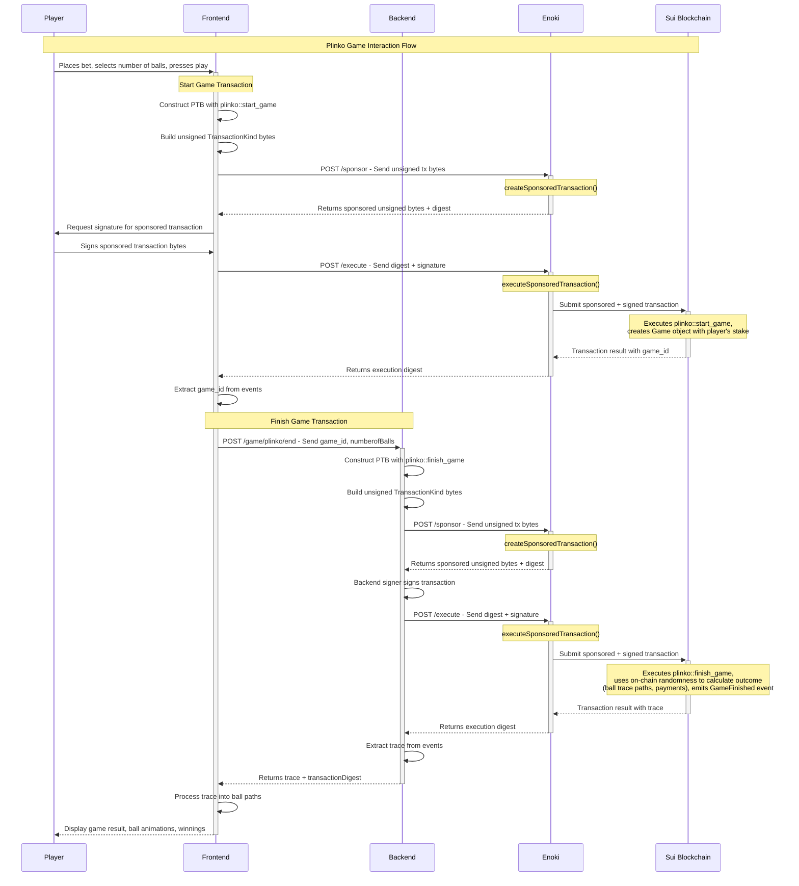

Plinko is an example implementation of the popular casino game. The Plinko game on Sui leverages on-chain randomness to ensure fairness and transparency. Players drop Plinko balls onto a pegged board, where they randomly fall into slots representing different multipliers. This document details the game's mechanics, on-chain randomness implementation, sponsored transactions through Enoki, and TypeScript integration using codegen.

Building an on-chain Plinko game shares a lot of similarities with the [Coin Flip](./coin-flip.mdx) game and [Blackjack](./blackjack.mdx) game. For that reason, this example covers only the smart contracts (Move modules) and frontend logic.

<ImportContent source="prerequisites.mdx" mode="snippet" />

:::info

You can find the source files for this example in the [Plinko repo](https://github.com/MystenLabs/plinko-poc/tree/main) on GitHub.

A version of the game is also deployed at [Mysten Plinko](https://plinko-poc.vercel.app/).

:::

## Gameplay

The Plinko game, implemented through smart contracts on the Sui blockchain, leverages Sui's native on-chain randomness to ensure fairness and transparency. The game calculates the trace path for each ball using secure random values generated directly on-chain, determining the game's outcome based on the number of Plinko balls a player chooses to drop.

The game mechanics involve a player starting a game by specifying the number of balls and staking a certain amount. The on-chain randomness is provided through Sui's Move randomness framework, which ensures each game's randomness is cryptographically secure and cannot be predicted or manipulated. The number of Plinko balls, chosen by the player, directly influences the game's complexity and potential payout, as each ball's final position is determined by the on-chain random values that dictate the ball's path through the pegged board.

## Sequence diagram



## Move modules

Follow the comments in each module's code to understand the logic each creates.

### `plinko::plinko`

The `plinko::plinko` module combines various Sui blockchain features, such as coin handling, event emissions, on-chain randomness, and game logic, to create fair and transparent on-chain Plinko games.

<details>
<summary>
`plinko.move`
</summary>

```move title="plinko.move"
module plinko::plinko;
use plinko::house_data::{Self as hd, HouseData};
use sui::balance::Balance;
use sui::coin::{Self, Coin};
use sui::dynamic_object_field as dof;
use sui::event::emit;
use sui::random::Random;
use sui::sui::SUI;

// === Errors ===
const EStakeTooLow: u64 = 0;
const EStakeTooHigh: u64 = 1;
const EInsufficientHouseBalance: u64 = 5;
const EGameDoesNotExist: u64 = 6;
const ENumberOfBallsNotAllowed: u64 = 7;

// === Structs ===

/// Represents a game and holds the accrued stake.
public struct Game has key, store {
    id: UID,
    game_start_epoch: u64,
    stake: Balance<SUI>,
    player: address,
    fee_bp: u16,
}

// === Events ===

/// Emitted when a new game has started.
public struct NewGameStarted has copy, drop {
    game_id: ID,
    player: address,
    user_stake: u64,
    fee_bp: u16,
}

/// Emitted when a game has finished.
public struct GameFinished has copy, drop {
    game_id: ID,
    result: u64,
    player: address,
    // The trace path representing each ball's journey
    trace: vector<u8>,
}

// === Public Functions ===

/// Function used to create a new game.
public fun start_game(coin: Coin<SUI>, house_data: &mut HouseData, ctx: &mut TxContext): ID {
    let fee_bp = house_data.base_fee_in_bp();
    let (id, new_game) = internal_start_game(coin, house_data, fee_bp, ctx);
    dof::add(house_data.borrow_mut(), id, new_game);
    id
}

/// finish_game Completes the game by calculating the outcome using on-chain randomness
/// and transferring the funds to the player.
/// It emits a GameFinished event with the game result and the trace path.
entry fun finish_game(
    game_id: ID,
    random: &Random,
    house_data: &mut HouseData,
    num_balls: u64,
    ctx: &mut TxContext,
): (u64, address, vector<u8>) {
    // Ensure that the game exists.
    assert!(game_exists(house_data, game_id), EGameDoesNotExist);

    // Ensure that the player selected at least one ball and no more than 100 balls.
    assert!(num_balls > 0 && num_balls <= 100, ENumberOfBallsNotAllowed);

    // Retrieves and removes the game from HouseData, preparing for outcome calculation.
    let Game {
        id,
        game_start_epoch: _,
        stake,
        player,
        fee_bp: _,
    } = dof::remove<ID, Game>(house_data.borrow_mut(), game_id);

    id.delete();

    // Initialize random generator and variables
    let mut random_generator = random.new_generator(ctx);
    let mut trace = vector[];

    // Calculate the stake amount per ball
    let stake_per_ball = stake.value<SUI>() / num_balls;
    let mut total_funds_amount: u64 = 0;

    // Calculate outcome for each ball using native randomness
    let mut ball_index = 0;
    while (ball_index < num_balls) {
        let mut state: u64 = 0;

        // Generate 12 random bytes for this ball and process them directly
        let mut i = 0;
        while (i < 12) {
            let byte = random_generator.generate_u8_in_range(0, 255);
            // Add the byte to the trace vector
            trace.push_back<u8>(byte);
            // Count the number of even bytes
            // If even, add 1 to the state
            // Odd byte -> 0, Even byte -> 1
            // The state is used to calculate the multiplier index
            state = if (byte % 2 == 0) { state + 1 } else { state };
            i = i + 1;
        };

        // Calculate multiplier index based on state
        let multiplier_index = state % house_data.multiplier().length();
        // Retrieve the multiplier from the house data
        let result = house_data.multiplier()[multiplier_index];

        // Calculate funds amount for this particular ball
        // Divide by 100 to adjust for multiplier scale and SUI units
        let funds_amount_per_ball = (result * stake_per_ball) / 100;
        // Add the funds amount to the total funds amount
        total_funds_amount = total_funds_amount + funds_amount_per_ball;
        ball_index = ball_index + 1;
    };

    // Processes the payout to the player and returns the game outcome.
    // Read available balance and fail early if insufficient.
    let available: u64 = hd::balance(house_data);
    assert!(available >= total_funds_amount, EInsufficientHouseBalance);
    let payout_balance_mut = house_data.borrow_balance_mut();
    let payout_coin: Coin<SUI> = coin::take(payout_balance_mut, total_funds_amount, ctx);

    payout_balance_mut.join(stake);

    // transfer the payout coins to the player
    transfer::public_transfer(payout_coin, player);
    // Emit the GameFinished event
    emit(GameFinished {
        game_id,
        result: total_funds_amount,
        player,
        trace,
    });

    // return the total amount to be sent to the player, (and the player address)
    (total_funds_amount, player, trace)
}


// === Public-View Functions ===

/// Returns the epoch in which the game started.
public fun game_start_epoch(game: &Game): u64 {
    game.game_start_epoch
}

/// Returns the total stake.
public fun stake(game: &Game): u64 {
    game.stake.value()
}

/// Returns the player's address.
public fun player(game: &Game): address {
    game.player
}

/// Returns the fee of the game.
public fun fee_in_bp(game: &Game): u16 {
    game.fee_bp
}

// === Admin Functions ===

/// Helper function to check if a game exists.
public fun game_exists(house_data: &HouseData, game_id: ID): bool {
    dof::exists_(house_data.borrow(), game_id)
}

/// Helper function to check that a game exists and return a reference to the game Object.
/// Can be used in combination with any accessor to retrieve the desired game field.
public fun borrow_game(game_id: ID, house_data: &HouseData): &Game {
    assert!(game_exists(house_data, game_id), EGameDoesNotExist);
    dof::borrow(house_data.borrow(), game_id)
}

// === Private Functions ===

/// Internal helper function used to create a new game.
/// Stake is taken from the player's coin and added to the game's stake.
fun internal_start_game(
    coin: Coin<SUI>,
    house_data: &HouseData,
    fee_bp: u16,
    ctx: &mut TxContext,
): (ID, Game) {
    let user_stake = coin.value();
    // Ensure that the stake is not higher than the max stake.
    assert!(user_stake <= house_data.max_stake(), EStakeTooHigh);
    // Ensure that the stake is not lower than the min stake.
    assert!(user_stake >= house_data.min_stake(), EStakeTooLow);
    // Ensure that the house has enough balance to play for this game.
    assert!(
        house_data.balance() >= (user_stake * (house_data.multiplier()[0])) / 100,
        EInsufficientHouseBalance,
    );

    let id = object::new(ctx);
    let game_id = object::uid_to_inner(&id);

    // Create a new game object and emit a NewGameStarted event.
    let new_game = Game {
        id,
        game_start_epoch: ctx.epoch(),
        stake: coin.into_balance<SUI>(),
        player: ctx.sender(),
        fee_bp,
    };
    // Emit a NewGameStarted event
    emit(NewGameStarted {
        game_id,
        player: ctx.sender(),
        user_stake,
        fee_bp,
    });

    (game_id, new_game)
}
```

</details>

#### Error codes

Error handling is integral to the module, with specific codes indicating various failure states or invalid operations:

- `EStakeTooLow`: Indicates that the stake provided is below the minimum threshold.
- `EStakeTooHigh`: Indicates that the stake exceeds the maximum allowed limit.
- `EInsufficientHouseBalance`: Indicates the house does not have enough balance to cover the game's outcome.
- `EGameDoesNotExist`: Used when a referenced game cannot be found.
- `ENumberOfBallsNotAllowed`: Indicates the player selected an invalid number of balls (must be between 1 and 100).

#### Events

- `NewGameStarted`: Emitted when a new game starts, capturing essential details like game ID, player address, stake, and fee basis points.
- `GameFinished`: Emitted upon the conclusion of a game, detailing the outcome, including the game ID, result, player address, and a trace of each ball's path through the Plinko board.

#### Structures

- `Game`: Represents an individual game session, holding information such as the game ID, epoch of game start, stake amount, player address, and the fee basis points.

#### Key functions

- `start_game`: Initiates a new Plinko game session, accepting the player's stake coin, house data, and transaction context. Returns the game ID.
- `finish_game`: Completes the game using on-chain randomness to calculate outcomes, traces the path each ball travels, and distributes the total winnings to the player. This is an entry function that takes the Random object from Sui's randomness framework.

#### Accessors

Provide read-only access to the game's properties:

- `game_start_epoch`: Returns the epoch when the game started
- `stake`: Returns the total stake amount
- `player`: Returns the player's address
- `fee_in_bp`: Returns the fee in basis points

#### Public helper functions

- `game_exists`: Checks if a game exists within the house data.
- `borrow_game`: Retrieves a reference to a game object for further processing.

#### Internal helper functions

- `internal_start_game`: A core utility that facilitates the creation of a new game, ensuring compliance with stake limits, house balance sufficiency, and the generation of a unique game ID.

### `plinko::house_data`

The `plinko::house_data` module manages the game's treasury and configurations. It stores the house funds, sets game parameters (like maximum and minimum stakes), handles game fees, and manages the multiplier vector used to calculate winnings. The module provides functions to adjust game settings and manages the house funds.

<details>
<summary>
`house_data.move`
</summary>

```move title="house_data.move"
module plinko::house_data;
use sui::balance::{Self, Balance};
use sui::coin::{Self, Coin};
use sui::package;
use sui::sui::SUI;

// === Errors ===
const ECallerNotHouse: u64 = 0;
const EInsufficientBalance: u64 = 1;

// === Structs ===

/// Configuration and Treasury shared object, managed by the house.
public struct HouseData has key {
    id: UID,
    // House's balance which also contains the accrued winnings of the house.
    balance: Balance<SUI>,
    // Address of the house or the game operator.
    house: address,
    // Maximum stake amount a player can bet in a single game.
    max_stake: u64,
    // Minimum stake amount required to play the game.
    min_stake: u64,
    // The accrued fees from games played.
    fees: Balance<SUI>,
    // The default fee in basis points. 1 basis point = 0.01%.
    base_fee_in_bp: u16,
    // Multipliers used to calculate winnings based on the game outcome.
    multiplier: vector<u64>,
}

/// A one-time use capability to initialize the house data;
/// created and sent to sender in the initializer.
public struct HouseCap has key {
    id: UID,
}

/// Used as a one time witness to generate the publisher.
public struct HOUSE_DATA has drop {}

fun init(otw: HOUSE_DATA, ctx: &mut TxContext) {
    // Creating and sending the Publisher object to the sender.
    package::claim_and_keep(otw, ctx);

    // Creating and sending the HouseCap object to the sender.
    let house_cap = HouseCap {
        id: object::new(ctx),
    };

    transfer::transfer(house_cap, ctx.sender());
}

/// Initializer function that should only be called once and by the creator of the contract.
/// Initializes the house data object with an initial balance.
/// It also sets the max and min stake values, that can later on be updated.
/// Stores the house address and the base fee in basis points.
/// This object is involved in all games created by the same instance of this package.
public fun initialize_house_data(
    house_cap: HouseCap,
    coin: Coin<SUI>,
    multiplier: vector<u64>,
    ctx: &mut TxContext,
) {
    assert!(coin.value() > 0, EInsufficientBalance);

    let mut house_data = HouseData {
        id: object::new(ctx),
        balance: coin.into_balance(),
        house: ctx.sender(),
        max_stake: 10_000_000_000, // 10 SUI = 10^9.
        min_stake: 100_000_000, // 0.1 SUI.
        fees: balance::zero(),
        base_fee_in_bp: 100, // 1% in basis points.
        multiplier: vector[],
    };

    house_data.set_multiplier_vector(multiplier);

    let HouseCap { id } = house_cap;
    id.delete();

    transfer::share_object(house_data);
}

// === Public-Mutative Functions ===

public fun update_multiplier_vector(
    house_data: &mut HouseData,
    v: vector<u64>,
    ctx: &mut TxContext,
) {
    assert!(ctx.sender() == house_data.house(), ECallerNotHouse);
    house_data.multiplier = vector[];
    house_data.set_multiplier_vector(v);
}

/// Function used to top up the house balance. Can be called by anyone.
/// House can have multiple accounts so giving the treasury balance is not limited.
public fun top_up(house_data: &mut HouseData, coin: Coin<SUI>, _: &mut TxContext) {
    coin::put(&mut house_data.balance, coin)
}

/// A function to withdraw the entire balance of the house object.
/// It can be called only by the house
public fun withdraw(house_data: &mut HouseData, ctx: &mut TxContext) {
    // Only the house address can withdraw funds.
    assert!(ctx.sender() == house_data.house(), ECallerNotHouse);

    let total_balance = house_data.balance();
    let coin = coin::take(&mut house_data.balance, total_balance, ctx);
    transfer::public_transfer(coin, house_data.house());
}

/// House can withdraw the accumulated fees of the house object.
public fun claim_fees(house_data: &mut HouseData, ctx: &mut TxContext) {
    // Only the house address can withdraw fee funds.
    assert!(ctx.sender() == house_data.house(), ECallerNotHouse);

    let total_fees = house_data.fees();
    let coin = coin::take(&mut house_data.fees, total_fees, ctx);
    transfer::public_transfer(coin, house_data.house());
}

/// House can update the max stake. This allows larger stake to be placed.
public fun update_max_stake(house_data: &mut HouseData, max_stake: u64, ctx: &mut TxContext) {
    // Only the house address can update the base fee.
    assert!(ctx.sender() == house_data.house(), ECallerNotHouse);

    house_data.max_stake = max_stake;
}

/// House can update the min stake. This allows smaller stake to be placed.
public fun update_min_stake(house_data: &mut HouseData, min_stake: u64, ctx: &mut TxContext) {
    // Only the house address can update the min stake.
    assert!(ctx.sender() == house_data.house(), ECallerNotHouse);

    house_data.min_stake = min_stake;
}

// === Public-View Functions ===

/// Returns the balance of the house.
public fun balance(house_data: &HouseData): u64 {
    house_data.balance.value()
}

/// Returns the address of the house.
public fun house(house_data: &HouseData): address {
    house_data.house
}

/// Returns the max stake of the house.
public fun max_stake(house_data: &HouseData): u64 {
    house_data.max_stake
}

/// Returns the min stake of the house.
public fun min_stake(house_data: &HouseData): u64 {
    house_data.min_stake
}

/// Returns the fees of the house.
public fun fees(house_data: &HouseData): u64 {
    house_data.fees.value()
}

/// Returns the base fee.
public fun base_fee_in_bp(house_data: &HouseData): u16 {
    house_data.base_fee_in_bp
}

/// Returns the multiplier vector
public fun multiplier(house_data: &HouseData): vector<u64> {
    house_data.multiplier
}

// === Public-Friend Functions ===

/// Returns a reference to the house ID.
public(package) fun borrow(house_data: &HouseData): &UID {
    &house_data.id
}

/// Returns a mutable reference to the balance of the house.
public(package) fun borrow_balance_mut(house_data: &mut HouseData): &mut Balance<SUI> {
    &mut house_data.balance
}

/// Returns a mutable reference to the fees of the house.
public(package) fun borrow_fees_mut(house_data: &mut HouseData): &mut Balance<SUI> {
    &mut house_data.fees
}

/// Returns a mutable reference to the house ID.
public(package) fun borrow_mut(house_data: &mut HouseData): &mut UID {
    &mut house_data.id
}

// === Private Functions ===

fun set_multiplier_vector(house_data: &mut HouseData, v: vector<u64>) {
    house_data.multiplier.append(v);
}

// === Test Functions ===

#[test_only]
public fun init_for_testing(ctx: &mut TxContext) {
    init(HOUSE_DATA {}, ctx);
}
```
</details>

#### Error codes

The module defines specific error codes to handle exceptional scenarios:

- `ECallerNotHouse`: Ensures that only the house (game operator) can perform certain operations.
- `EInsufficientBalance`: Indicates an insufficient balance for operations requiring a minimum fund level.

#### Structures

- `HouseData`: A key configuration object storing the house's operational parameters, including its balance, stake limits, accumulated fees, base fee rate, and multiplier settings for game outcomes.
- `HouseCap`: A unique capability indicating the authority to initialize the house data.
- `HOUSE_DATA`: A one time witness for initializing house data, used once during the setup phase.

#### Initialization function

- `init`: Prepares the environment for the house, generating essential capabilities and objects for house data management.

#### Public functions

- `initialize_house_data`: Sets up the initial configuration for the house, including balance, stake limits, and multipliers.
- `top_up`: Allows adding funds to the house's balance to support game operations.
- `withdraw`: Enables the house to withdraw its balance, a critical function with implications for the house's operational capacity.
- `claim_fees`: Permits the house to collect accumulated fees from game activities.
- `update_max_stake`: Adjusts the maximum stake limit for games.
- `update_min_stake`: Modifies the minimum stake requirement.
- `update_multiplier_vector`: Updates the multiplier vector used to calculate game outcomes.

#### Internal helper functions

- `set_multiplier_vector`: Internally used to set the initial multiplier vector.

#### Accessors

Provide read-only and mutable access to house data properties, enabling operations like querying balance, stake limits, fees, and modifying configurations within authorized contexts:

- `balance`: Returns the house's current balance.
- `house`: Retrieves the house's address.
- `max_stake`, `min_stake`: Access the current stake limits.
- `fees`: Shows the accumulated fees from game operations.
- `base_fee_in_bp`: Provides the base fee rate in basis points.
- `multiplier`: Returns the multiplier vector used in game outcome calculations.

#### Test utilities

- `init_for_testing`: A utility function facilitating module testing by initializing house data within a test environment.

## Enoki sponsorship

The Plinko game demonstrates a frictionless user experience by leveraging [Enoki](https://docs.enoki.mystenlabs.com/) for transaction sponsorship. This allows players to interact with the game without needing to hold SUI tokens for gas fees, significantly reducing barriers to entry.

### How sponsorship works

The sponsorship flow is split into two backend API endpoints that work with the Enoki client:

1. **`/sponsor` endpoint**: Receives unsigned transaction bytes from the frontend and calls `enokiClient.createSponsoredTransaction()` to sponsor them. Returns the sponsored (but still unsigned) transaction bytes and digest.

2. **`/execute` endpoint**: Receives the transaction digest and user signature, then calls `enokiClient.executeSponsoredTransaction()` to submit the sponsored and signed transaction to the blockchain.

The complete flow works as follows:

1. **Frontend constructs transaction**: The UI builds a programmable transaction block (PTB) with the necessary Move calls (such as, `plinko::start_game`) and serializes it to `TransactionKind` bytes.

2. **Request sponsorship**: The unsigned transaction bytes are sent to `/sponsor`, which returns sponsored unsigned bytes.

3. **User signs**: The player signs the sponsored transaction bytes through their wallet.

4. **Execute transaction**: The signed transaction is sent to `/execute`, which submits it to the blockchain.

This two-step process ensures that:
- Players only need to sign transactions (proving ownership)
- The game operator covers all gas fees through Enoki
- The user experience is seamless and Web2-like
- **Important:** Set `useGasCoin: false` when creating coins for sponsored transactions

### Implementation Example

#### Backend: `/sponsor` endpoint

```typescript
import { enokiClient } from "../EnokiClient";

export const POST = async (req: NextRequest) => {
  try {
    const { transactionKindBytes, sender } = await req.json();
    const sponsored = await enokiClient.createSponsoredTransaction({
      network: process.env.NEXT_PUBLIC_SUI_NETWORK_NAME as
        | "mainnet"
        | "testnet"
        | "devnet",
      transactionKindBytes,
      sender,
      allowedAddresses: [sender],
    });

    return NextResponse.json(
      { bytes: sponsored.bytes, digest: sponsored.digest },
      { status: 200 }
    );
  } catch (error) {
    console.error("Sponsorship failed:", error);
    return NextResponse.json({ error: "Sponsorship failed" }, { status: 500 });
  }
};
```

#### Backend: `/execute` endpoint

```typescript
import { enokiClient } from "../EnokiClient";

export const POST = async (req: NextRequest) => {
  try {
    const { digest, signature } = await req.json();
    const executionResult = await enokiClient.executeSponsoredTransaction({
      digest,
      signature,
    });
    return NextResponse.json(
      { digest: executionResult.digest },
      { status: 200 }
    );
  } catch (error) {
    console.error("Execution failed:", error);
    return NextResponse.json({ error: "Execution failed" }, { status: 500 });
  }
};
```

#### Frontend: Complete sponsorship flow

```typescript
// 1) Create the tx and get TransactionKind bytes
const tx = new Transaction();
tx.setSender(sender);
const betCoin = coinWithBalance({
  type: "0x2::sui::SUI",
  balance: betInMist,
  useGasCoin: false, // important for sponsorship
})(tx);
tx.add(
  plinko.startGame({
    package: process.env.NEXT_PUBLIC_PACKAGE_ADDRESS,
    arguments: [betCoin, `${process.env.NEXT_PUBLIC_HOUSE_DATA_ID}`],
  })
);

const txBytes = await tx.build({
  client,
  onlyTransactionKind: true,
});

// 2) Sponsor the unsigned TxBytes
const sponsorResp = await fetch("/api/sponsor", {
  method: "POST",
  headers: { "Content-Type": "application/json" },
  body: JSON.stringify({
    transactionKindBytes: toBase64(txBytes),
    sender,
  }),
});

if (!sponsorResp.ok) {
  console.error("Failed to sponsor transaction:", sponsorResp.status);
  showError("Failed to sponsor transaction. Please try again.");
  return;
}

const { bytes: sponsoredBytes, digest: sponsoredDigest } =
  (await sponsorResp.json()) as { bytes: string; digest: string };

// 3) Sign the sponsored TxBytes
const { signature } = await signTransaction({
  transaction: sponsoredBytes,
});

// 4) Execute the sponsored + signed TxBytes
const execResp = await fetch("/api/execute", {
  method: "POST",
  headers: { "Content-Type": "application/json" },
  body: JSON.stringify({ digest: sponsoredDigest, signature }),
});
```

## TypeScript Integration with Codegen

The Plinko frontend uses [Mysten's codegen tool](https://www.npmjs.com/package/@mysten/codegen?activeTab=readme) to automatically generate TypeScript bindings from the Move smart contracts. This provides several advantages:

### Usage example

Instead of manually building transaction blocks, you can use generated functions:

```typescript
import { plinko } from './generated/plinko';

// Type-safe function call with autocomplete
const tx = plinko.startGame({
  coin: coinObject,
  houseData: houseDataId,
});
```

## Deployment

Navigate to the [setup folder](https://github.com/MystenLabs/plinko-poc/tree/main/setup) of the Plinko repository and execute the `publish.sh` script. Refer to the [README instructions](https://github.com/MystenLabs/plinko-poc/blob/main/README.md) for deploying the smart contracts and testing them locally.


## Frontend

The Plinko frontend is built with React and integrates with the Sui blockchain using sponsored transactions through Enoki. The application provides an interactive and responsive gaming experience while abstracting away blockchain complexity from end users.

### State management and setup

- **State hooks:** The application uses React's `useState` to manage game states, including `finalPaths`, `isPlaying`, `totalWon`, and more. These states track the current game status and update the UI in real-time.

- **Sponsored transactions:** The frontend leverages Enoki's `/sponsor` and `/execute` APIs to create a gasless experience. Players can interact with the game without needing SUI tokens, as the backend sponsors all transaction fees.

- **TypeScript integration:** Generated TypeScript bindings from codegen provide type-safe contract interactions, reducing errors, and improving developer experience.

## UI components and styling

The `MatterSim` and `PlinkoSettings` components are the foundation for the Plinko frontend. To see code for all components and source files, see the [Plinko repo](https://github.com/MystenLabs/plinko-poc/tree/main/app/src).  

### Simulation component

The [`MatterSim` component](https://github.com/MystenLabs/plinko-poc/blob/main/app/src/components/MatterSim.tsx) renders the game board with realistic physics for the dropping Plinko balls. It uses [Matter.js](https://brm.io/matter-js/), a 2D physics engine, to simulate the game dynamics.

```ts
import Matter, {
  Engine,
  Render,
  Runner,
  Bodies,
  Composite,
  Vector,
  Events,
  Body,
  Common,
} from "matter-js";
```

The component receives ball paths (trace data) generated from on-chain randomness, emitted in the `GameFinished` event. Each path consists of 12 bytes per ball, where each byte determines whether the ball moves left (odd) or right (even) at each peg. `MatterSim` applies physics principles like gravity for natural ball descent while using custom forces to guide balls along their predetermined paths. The physics simulation provides smooth, realistic movement that matches the on-chain outcomes, creating an engaging visual experience where fairness is guaranteed by blockchain randomness.

## Plinko settings component

The [`PlinkoSettings` component](https://github.com/MystenLabs/plinko-poc/blob/main/app/src/components/PlinkoSettings.tsx) is an integral part of the user interface in the Plinko game, enabling players to customize their gameplay experience according to their preferences. This React component allows users to select the number of Plinko balls they want to drop, set the bet size for each ball, and initiate the game round by pressing the **Play** button.

### Customization options

- `betSize` (per ball): Players can specify the amount they want to bet on each ball. This is a crucial feature that allows users to manage their risk and potential rewards.
- `numberOfBalls`: This setting lets players choose how many balls they want to play in a single round, adding a strategic layer to the game as the total bet size is a multiplication of the bet size per ball and the number of balls.

## User interaction and feedback

Game Initiation: After selecting the desired number of balls and setting the bet size for each, players can initiate a new game by pressing the **Play** button. This action starts the game, with the button becoming disabled during gameplay to prevent new games from being initiated until the current game concludes and the last ball has reached the end. Links are also provided for players to view game details on a Sui network explorer for transparency and engagement.

## Related links

<RelatedLink href="https://github.com/MystenLabs/plinko-poc/tree/main" label="Plinko repository" desc="The Plinko GitHub repository contains all the source files for this example." />
<RelatedLink href="https://plinko-poc.vercel.app/" label="Mysten Plinko" desc="A hosted version of the Plinko game." />
