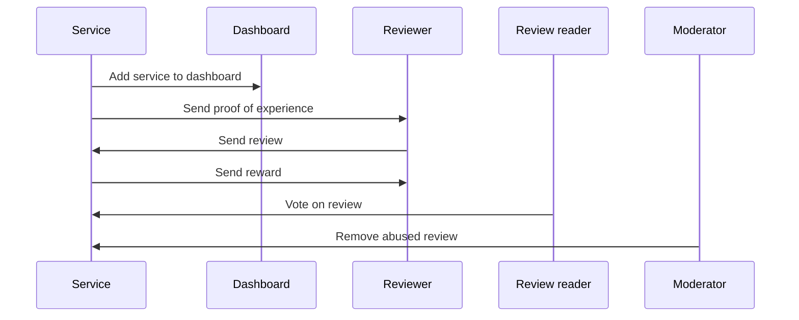

The following documentation goes through an example implementation of a review rating platform for the food service industry on Sui.
Unlike traditional review rating platforms that often do not disclose the algorithm used to rate reviews, this example uses an algorithm that is published on-chain for everyone to see and verify. The low gas cost of computation on Sui make it financially feasible to submit, score, and order all reviews on-chain.

## Personas

There are four actors in the typical workflow of the Reviews Rating example.

- Service: Review requester.
- Dashboard: Review hub.
- Reviewer: Review creator.
- Moderator: Review list editor.



### Service owners

Service owners are entities like restaurants that list their services on the platform. They want to attract more customers by receiving high-rated reviews for their services.

Service owners allocate a specific amount of SUI as a reward pool. Assets from the pool are used to provide rewards for high-rated reviews. A proof of experience (PoE) NFT confirms a reviewer used the service, which the reviewer can burn later to provide a verified review. Service owners provide their customers with unique identifiers (perhaps using QR codes) to identify individual reviewers.

### Reviewers

Reviewers are consumers of services that use the review system. Reviewers provide feedback in the form of comments that detail specific aspects of the service as well as a star rating to inform others. The reviews are rated, with the most effective reviews getting the highest rating. Service owners award the 10 highest rated reviews for their service. How often the rewards are distributed is up to the service owner's discretion; for example, the rewards can be distributed once a week or once a month.

### Review readers

Review readers access reviews to make informed decisions on selecting services. Readers rate reviews by casting votes. The review readers' ratings are factored into the algorithm that rates the reviews, with the authors of the highest-rated reviews getting rewarded. Although it is not implemented as part of this guide, this example could be extended to award review readers a portion of the rewards for casting votes for reviews.

### Moderators

Moderators monitor content of the reviews and can delete any reviews that contain inappropriate content.

The incentive mechanism for moderators is not implemented for this guide, but service owners can all pay into a pool that goes to moderators on a rolling basis. People can stake moderators to influence what portion of the reward each moderator gets, up to a limit (similar to how validators are staked on chain), and moderator decisions are decided by quorum of stake weight. This process installs incentives for moderators to perform their job well.

## How reviews are scored

The reviews are scored on chain using the following criteria:

- Intrinsic score (IS): Length of review content.
- Extrinsic score (ES): Number of votes a review receives.
- Verification multiplier (VM): Reviews with PoE receive a multiplier to improve rating.

```
Total Score = (IS + ES) * VM
```

## Smart contracts

There are several modules that create the backend logic for the example.

### dashboard.move

The `dashboard.move` module defines the `Dashboard` struct that groups services.

```move
/// Dashboard is a collection of services
public struct Dashboard has key, store {
    id: UID,
    service_type: String
}
```

The services are grouped by attributes, which can be cuisine type, geographical location, operating hours, Google Maps ID, and so on. To keep it basic, the example stores only `service_type` (for example, fast food, Chinese, Italian).

```move
/// Creates a new dashboard
public fun create_dashboard(
    service_type: String,
    ctx: &mut TxContext,
) {
    let db = Dashboard {
        id: object::new(ctx),
        service_type
    };
    transfer::share_object(db);
}

/// Registers a service to a dashboard
public fun register_service(db: &mut Dashboard, service_id: ID) {
    df::add(&mut db.id, service_id, service_id);
}
```

A `Dashboard` is a [shared object](../../../concepts/object-ownership/shared.mdx), so any service owner can register their service to a dashboard.
A service owner should look for dashboards that best match their service attribute and register.
A [dynamic field](../../../concepts/dynamic-fields.mdx) stores the list of services that are registered to a dashboard.
A service may be registered to multiple dashboards at the same time. For example, a Chinese-Italian fusion restaurant may be registered to both the Chinese and Italian dashboards.

:::info

See [Shared versus Owned Objects](../sui-101/shared-owned.mdx) for more information on the differences between object types.

:::

### review.move

This module defines the `Review` struct.

```move
/// Represents a review of a service
public struct Review has key, store {
    id: UID,
    owner: address,
    service_id: ID,
    content: String,
    // intrinsic score
    len: u64,
    // extrinsic score
    votes: u64,
    time_issued: u64,
    // proof of experience
    has_poe: bool,
    total_score: u64,
    overall_rate: u8,
}

/// Updates the total score of a review
fun update_total_score(rev: &mut Review) {
    rev.total_score = rev.calculate_total_score();
}

/// Calculates the total score of a review
fun calculate_total_score(rev: &Review): u64 {
    let mut intrinsic_score: u64 = rev.len;
    intrinsic_score = math::min(intrinsic_score, 150);
    let extrinsic_score: u64 = 10 * rev.votes;
    // VM = either 1.0 or 2.0 (if user has proof of experience)
    let vm: u64 = if (rev.has_poe) { 2 } else { 1 };
    (intrinsic_score + extrinsic_score) * vm
}
```

In addition to the content of a review, all the elements that are required to compute total score are stored in a `Review` object.

A `Review` is a [shared object](../../../concepts/object-ownership/shared.mdx), so anyone can cast a vote on a review and update its `total_score` field.
After `total_score` is updated, the [`update_top_reviews`](#casting-votes) function can be called to update the `top_reviews` field of the `Service` object.

### service.move

This module defines the `Service` struct that service owners manage.

```move
const MAX_REVIEWERS_TO_REWARD: u64 = 10;

/// Represents a service
public struct Service has key, store {
    id: UID,
    reward_pool: Balance<SUI>,
    reward: u64,
    top_reviews: vector<ID>,
    reviews: ObjectTable<ID, Review>,
    overall_rate: u64,
    name: String
}
```

#### Reward distribution

The same amount is rewarded to top reviewers, and the reward is distributed to 10 participants at most.
The pool of `SUI` tokens to be distributed to reviewers is stored in the `reward_pool` field, and the amount of `SUI` tokens awarded to each participant is configured in `reward` field.

#### Storage for reviews

Because anyone can submit a review for a service, `Service` is defined as a shared object. All the reviews are stored in the `reviews` field, which has `ObjectTable<ID, Review>` type. The `reviews` are stored as children of the shared object, but they are still accessible by their `ID`. See [Dynamic Collections](https://move-book.com/programmability/dynamic-collections.html#objecttable) in The Move Book for more information on `ObjectTables`.

In other words, anyone can go to a transaction explorer and find a review object by its object ID, but they won't be able to use a review as an input to a transaction by its object ID.

:::info

See [Table and Bag](../../../concepts/dynamic-fields/tables-bags.mdx) for more information on the differences between `Table` and `ObjectTable`.

:::

The top rated reviews are stored in `top_reviews` field, which has `vector<ID>` type. A simple vector can store the top rated reviews because the maximum number of reviews that can be rewarded is 10.
The elements of `top_reviews` are sorted by the `total_score` of the reviews, with the highest rated reviews coming first. The vector contains the `ID` of the reviews, which can be used to retrieve content and vote count from the relevant `reviews`.

#### Casting votes

A reader can cast a vote on a review to rate it as follows:

```move
/// Upvotes a review and reorders top_reviews
public fun upvote(service: &mut Service, review_id: ID) {
    let review = &mut service.reviews[review_id];
    review.upvote();
    service.reorder(review_id, review.get_total_score());
}

/// Reorders top_reviews after a review is updated
/// If the review is not in top_reviews, it will be added if it is in the top 10
/// Otherwise, it will be reordered
fun reorder(
    service: &mut Service,
    review_id: ID,
    total_score: u64
) {
    let (contains, idx) = service.top_reviews.index_of(&review_id);
    if (!contains) {
        service.update_top_reviews(review_id, total_score);
    } else {
        service.top_reviews.remove(idx);
        let idx = service.find_idx(total_score);
        service.top_reviews.insert(review_id, idx);
    }
}

/// Updates top_reviews if necessary
fun update_top_reviews(
    service: &mut Service,
    review_id: ID,
    total_score: u64
) {
    if (service.should_update_top_reviews(total_score)) {
        let idx = service.find_idx(total_score);
        service.top_reviews.insert(review_id, idx);
        service.prune_top_reviews();
    };
}

/// Finds the index of a review in top_reviews
fun find_idx(service: &Service, total_score: u64): u64 {
    let mut i = service.top_reviews.length();
    while (0 < i) {
        let review_id = service.top_reviews[i - 1];
        if (service.get_total_score(review_id) > total_score) {
            break
        };
        i = i - 1;
    };
    i
}

/// Prunes top_reviews if it exceeds MAX_REVIEWERS_TO_REWARD
fun prune_top_reviews(
    service: &mut Service
) {
    let len = service.top_reviews.length();
    if (len > MAX_REVIEWERS_TO_REWARD) {
        service.top_reviews.pop_back();
    };
}
```

Whenever someone casts a vote on a review, the `total_score` of the review is updated and the `update_top_reviews` function updates the `top_reviews` field, as needed.
Casting a vote also triggers a reordering of the `top_reviews` field to ensure that the top rated reviews are always at the top.

#### Authorization

```move
/// A capability that can be used to perform admin operations on a service
struct AdminCap has key, store {
    id: UID,
    service_id: ID
}

/// Represents a moderator that can be used to delete reviews
struct Moderator has key {
    id: UID,
}
```

This example follows a capabilities pattern to manage authorizations.
For example, `SERVICE OWNERS` are given `AdminCap` and `MODERATORS` are given `Moderator` such that only they are allowed to perform privileged operations.

To learn more about the capabilities pattern, see [The Move Book](https://move-book.com/programmability/capability.html).

## Deployment

Navigate to the [setup folder](https://github.com/MystenLabs/reviews-ratings-poc/tree/main/setup) of the repository and execute the `publish.sh` script. Refer to the [README instructions](https://github.com/MystenLabs/reviews-ratings-poc/blob/main/README.md) for deploying the smart contracts.

## Frontend

The frontend module is written in React, and is structured to provide a responsive user experience for interacting with a review rating platform. The [`page` component](https://github.com/MystenLabs/reviews-ratings-poc/blob/main/app/src/app/page.tsx) supports user log in as a `SERVICE OWNER`, a `MODERATOR`, or a `REVIEWER`. A `REVIEW READER` role is not implemented for this example, but a `REVIEWER` can also read reviews and cast votes.

### Directories structure

The frontend is a NextJS project, that follows the NextJS App Router [project structure](https://nextjs.org/docs/app/building-your-application/routing).
The main code of the frontend is located in the [app/src/](https://github.com/MystenLabs/reviews-ratings-poc/blob/main/app/src/app/) directory.

The main sub-directories are:

- [app/](https://github.com/MystenLabs/reviews-ratings-poc/blob/main/app/src/app/): The main code of the pages and the global styles.
- [components/](https://github.com/MystenLabs/reviews-ratings-poc/blob/main/app/src/components): The reusable components of the app, organized in sub-directories.
- [hooks/](https://github.com/MystenLabs/reviews-ratings-poc/blob/main/app/src/hooks): The custom hooks used in the app.
- [moderator/](https://github.com/MystenLabs/reviews-ratings-poc/blob/main/app/src/moderator): The pages for `MODERATOR`.
- [serviceOwner/](https://github.com/MystenLabs/reviews-ratings-poc/blob/main/app/src/serviceOwner): The pages for `SERVICE OWNER`.
- [types/](https://github.com/MystenLabs/reviews-ratings-poc/blob/main/app/src/types): The types/interfaces used in the app.
- [user/](https://github.com/MystenLabs/reviews-ratings-poc/blob/main/app/src/user): The pages for `REVIEWER`.

### Connect button

The Wallet Kit comes with a pre-built React.js component called `ConnectButton` that displays a button to connect and disconnect a wallet. The component handles connecting and disconnecting wallet logic.

Place the `ConnectButton` in the navigation bar for users to connect their wallets:

```ts title='src/app/components/navbar/Navbar.tsx'
import { ConnectButton } from '@mysten/wallet-kit';
import { usePathname } from 'next/navigation';

import { useAuthentication } from '@/app/hooks/useAuthentication';

export const Navbar = () => {
	const pathname = usePathname();
	console.log(pathname);
	const { user, handleLogout } = useAuthentication();

	return (
		<div
			className="grid grid-cols-12 w-full items-center p-[8px] h-[80px] border-b-gray-400 border-b-[1px] sticky top-0"
			style={{
				background: 'white',
			}}
		>
			<div className="col-span-3 flex space-x-3 items-center">
				<div className="text-red-600 text-2xl font-bold cursor-pointer" onClick={handleLogout}>
					Restaurant Reviews
				</div>
			</div>

			<div className="col-span-6 flex space-x-3 justify-center">
				{pathname !== '/' && (
					<h6 className="mb-4 text-2xl leading-none tracking-tight text-gray-400">
						logged in as{' '}
						<span className="underline underline-offset-3 decoration-8 decoration-blue-400 dark:decoration-blue-600">
							{user.role === 'user' && 'USER'}
							{user.role === 'serviceOwner' && 'SERVICE OWNER'}
							{user.role === 'moderator' && 'MODERATOR'}
						</span>
					</h6>
				)}
			</div>

			<div className="col-span-3 flex justify-end gap-[14px]">
				<ConnectButton />
			</div>
		</div>
	);
};
```

### Type definitions

All the type definitions are in `src/app/types/`.

`Review` and `Service` represent the review and service objects.

```ts title='src/app/types/Review.ts'
export interface Review {
	id: string;
	owner: string;
	service_id: string;
	content: string;
	len: number;
	votes: number;
	time_issued: number;
	has_poe: boolean;
	total_score: number;
}
```

```ts title='src/app/types/Service.ts'
export interface Service {
	id: string;
	name: string;
	stars: number;
	reward?: number;
	pool?: number;
}
```

### Execute transaction hook

In the frontend, you might need to execute a transaction block in multiple places, hence it's better to extract the transaction execution logic and reuse it everywhere. Let's examine the execute transaction hook.

```ts title='src/app/hooks/useSignAndExecuteTransaction.ts'
import { Transaction } from '@mysten/sui/transactions';
import { useWalletKit } from '@mysten/wallet-kit';
import { toast } from 'react-hot-toast';

import { useSui } from './useSui';

export const useSignAndExecuteTransaction = () => {
	const { executeSignedTransaction } = useSui();
	const { signTransaction } = useWalletKit();
	const handleSignAndExecuteTransaction = async (
		tx: Transaction,
		operation: String,
		setIsLoading: any,
	) => {
		return signTransaction({
			transaction: tx,
		})
			.then((signedTx: any) => {
				return executeSignedTransaction({
					signedTx,
					requestType: 'WaitForLocalExecution',
					options: {
						showEffects: true,
						showEvents: true,
					},
				})
					.then((resp) => {
						setIsLoading(false);
						console.log(resp);
						if (resp.effects?.status.status === 'success') {
							console.log(`${operation} operation successful`);
							toast.success(`${operation} operation successful`);
							return;
						} else {
							console.log(`${operation} operation failed`);
							toast.error(`${operation} operation failed.`);
							return;
						}
					})
					.catch((err) => {
						setIsLoading(false);
						console.log(`${operation} operation failed`);
						console.log(`${operation} error : `, err);
						toast.error(`Something went wrong, ${operation} operation failed.`);
					});
			})
			.catch((err) => {
				setIsLoading(false);
				console.log(`signing goes wrong ${operation} error : `, err);
				toast.error(`signing goes wrong, ${operation} operation failed.`);
			});
	};
	return { handleSignAndExecuteTransaction };
};
```

A `Transaction` is the input, sign it with the current connected wallet account, execute the transaction block, return the execution result, and finally display a basic toast message to indicate whether the transaction is successful or not.

Use the `useWalletKit()` hook from the Wallet Kit to retrieve the Sui client instance configured in `WalletKitProvider`. The `signTransaction()` function is another hook that helps to sign the transaction block using the currently connected wallet. It displays the UI for users to review and sign their transactions with their selected wallet. To execute a transaction block, the `executeSignedTransaction()` on the Sui client instance of the Sui TypeScript SDK. Use `react-hot-toast` as another dependency to toast transaction status to users.

### Components and custom hooks for state management

- Custom hooks: To keep the code as structured as possible, multiple custom hooks are utilized to manage the list of reviews associated with a service. The [useGetReviews](https://github.com/MystenLabs/reviews-ratings-poc/blob/main/app/src/app/hooks/useGetReviews.ts)
  custom hook encapsulates the service, exposing all the required information (with fields such as `nameOfService`, `listOfReviews`, `listOfStars`) to display the reviews in a table.
  Multiple additional custom hooks, such as [useDashboardCreation](https://github.com/MystenLabs/reviews-ratings-poc/blob/main/app/src/app/hooks/useDashboardCreation.ts), and [useServiceReview](https://github.com/MystenLabs/reviews-ratings-poc/blob/main/app/src/app/hooks/useServiceReview.ts) are encapsulating their own piece of state and logic to make the code readable and maintainable.

- Component for adding a new review: The [AddReview](https://github.com/MystenLabs/reviews-ratings-poc/blob/main/app/src/app/components/review/AddReview.tsx) component is implemented to facilitate the creation of a new review. It is rendered by the [servicePage](https://github.com/MystenLabs/reviews-ratings-poc/blob/main/app/src/app/service/[id]/page.tsx) to collect a review entry from a `USER` and uses the `signAndExecuteTransaction` function of the [useWalletKit] hook to execute the transaction.

- Proof of experience generation: PoE is an NFT that is minted by `SERVICE OWNER` for customers after they dine at the restaurant; customers can then burn the PoE to write a high-rated review later. Minting an NFT is facilitated by the [ownedServicePage](https://github.com/MystenLabs/reviews-ratings-poc/blob/main/app/src/app/serviceOwner/ownedServices/page.tsx) component. This component is using the [useServicePoEGeneration](https://github.com/MystenLabs/reviews-ratings-poc/blob/main/app/src/app/hooks/useServicePoeGeneration.ts) custom hook.

- Delete a review: The moderator can delete a review that contains inappropriate content. [moderatorRemovePage](https://github.com/MystenLabs/reviews-ratings-poc/blob/main/app/src/app/moderator/remove/[id]/[nft]/page.tsx) component is used to delete a review.

## Related links

[Reviews Rating repository](https://github.com/MystenLabs/sui/tree/main/examples/move/reviews_rating).
