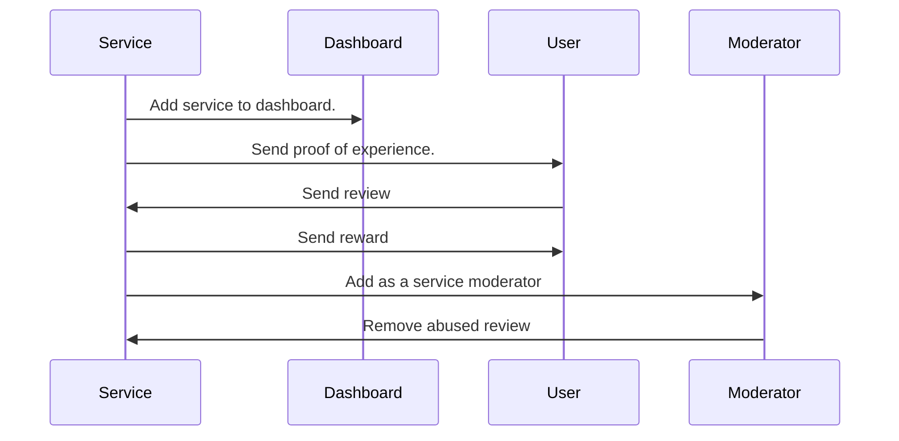

The following documentation goes through an example implementation of a review rating platform for the food service industry on Sui. By leveraging blockchain to allow reviewers to own and monetize their feedback, the on-chain platform ensures transparency and temper-proof ratings.

## Personas

There are four actors in the typical workflow of the reviews rating example.  



### Service owners

Service owners are entities like restaurants that list their services on the platform. Service owners allocate a specific amount of SUI as a reward pool. Assets from the pool are used to provide rewards for honest reviews. A Proof of Experience (PoE) NFT confirms the reviewer used the service, which they burn to provide a verified review. Service owners can provide their customers with unique identifiers, perhaps using QR codes, to identify individual reviewers.

### Reviewers

Reviewers are consumers of services that use the review system. Reviewers provide feedback in the form of comments that detail specific aspects of the service as well as a star rating to inform others. The reviews are rated, with the most effective reviews getting the highest rating. Service owners award the 10 highest rated reviews for their service. 

### Review readers

Review readers access reviews to make informed decisions on selecting services. Readers rate reviews by casting up or down votes. The review readers' ratings are factored into the algorithm that rates the reviews, with the authors of the highest-rated reviews getting awarded. 

### Moderator

The moderator monitors content of the reviews and can delete any reviews that contain inappropriate content.

## How reviews are rated

The reviews are rated (scored) on-chain using following criteria
- Intrinsic score (IS)
  - Length of content
- Extrinsic score (ES)
  - Number of votes received
- Verification multiplier (VM)
  - Reviews with PoE get a multiplier to improve rating

```
Total Score = (IS + ES) * VM
```

## Backend

There are several modules that create the backend logic for the example. 

### dashboard.move

The `dashboard.move` module defines the `Dashboard` struct that is used to group services.

```move
struct Dashboard has key, store {
  id: UID,
  set: VecSet<ID>,
  service_type: String
}
```

The services are grouped by attributes, which can be cuisine type, geographical location, operating hours, google maps ID, and so on. To keep it basic, the example stores only `service_type` (for example, fast food, Chinese, Italian).

### service.move

This module defines the `Services` struct, which service owners manage.

```move
struct Service has key, store {
  id: UID,
  reward_pool: Balance<SUI>,
  reward: u64,
  reviews: MultiMap<ID>,
  moderators: VecSet<address>,
  overall_rate: u64,
  name: String
}
```

All the submitted reviews are stored in `reviews` field, which has `MultiMap<ID>` type. The [multimap module](#multimap) defines the type. 

The `reward_pool` and `reward` fields store the avaialable reward information.  

### multimap.move {#multimap}

`MultiMap` is an implementation of the `multimap` data structure (https://en.wikipedia.org/wiki/Multimap), which keeps all the reviews sorted. Using `MultiMap`, all the reviews are ordered by rating, with the highest rated reviews coming first.

```move
struct MultiMap<K: copy> has copy, drop, store {
  contents: vector<Entry<K>>,
}
```

### review.move

This module defines the `Review` struct.

```move
struct Review has key, store {
  id: UID,
  owner: address,
  service_id: ID,
  content: String,
  // is
  len: u64,
  // es
  votes: u64,
  time_issued: u64,
  // vm: proof of experience
  has_poe: bool,
  // total score
  ts: u64,
  overall_rate: u8,
}
```

In addition to the content of a review, all the elements that are required to compute total score are stored in a `Review` object.

## Frontend

A React frontend is implemented and is available at https://github.com/MystenLabs/reviews-ratings-poc
