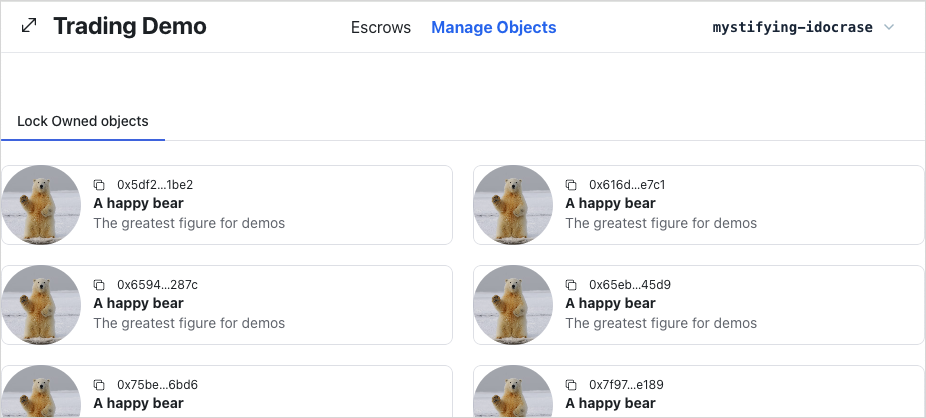
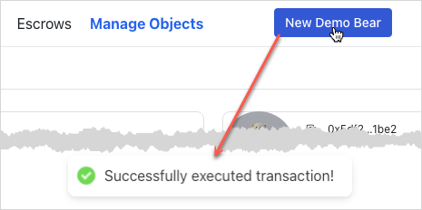
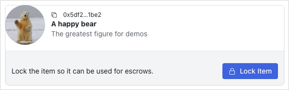
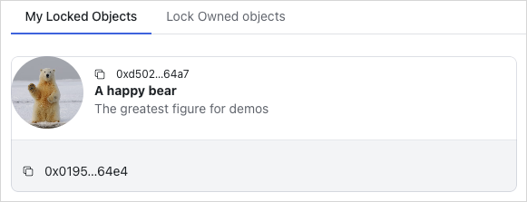
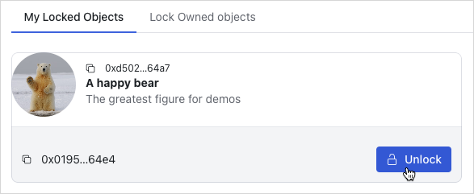
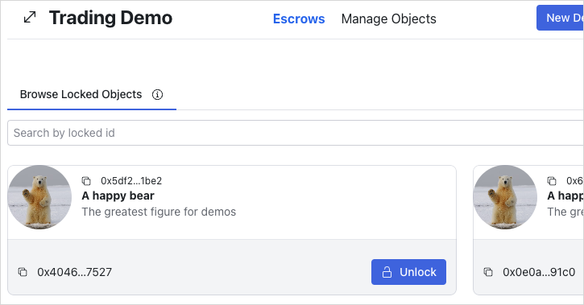
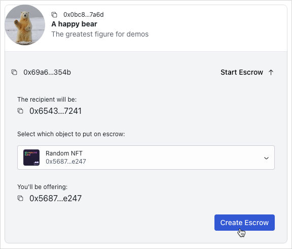
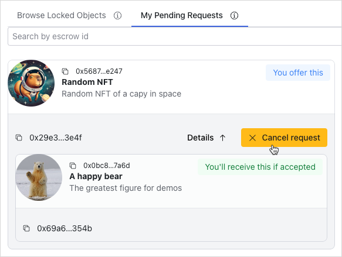
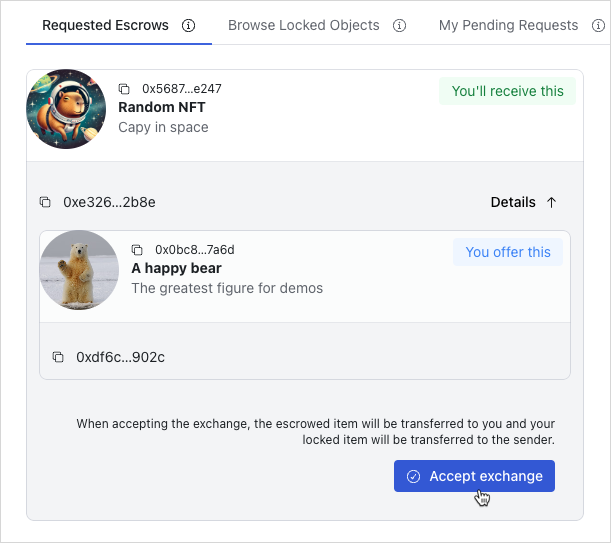

In this guide, you build a frontend (UI) that allows end users to discover trades and interact with listed escrows. This is the second part of the Trustless Swap example. If you have not completed the first part, see [Trustless Swap: Contracts and Indexer](/guides/developer/app-examples/trustless-swap.mdx) to set up the smart contracts and backend.

<Tabs className="tabsHeadingCentered--small">
<TabItem value="prereq" label="Prerequisites">

- [x] [Install the latest version of Sui](/guides/developer/getting-started/sui-install).

- [x] [Complete the smart contracts](/guides/developer/app-examples/trustless-swap.mdx#smart-contracts) and understand their design.

- [x] [Implement the backend](/guides/developer/app-examples/trustless-swap.mdx#backend) to learn how to index onchain data and expose it through an API.

- [x] [Deploy your smart contracts and started the backend indexer](/guides/developer/app-examples/trustless-swap.mdx#deployment).

- [x] Install [`pnpm`](https://pnpm.io/installation) or [`yarn`](https://classic.yarnpkg.com/lang/en/docs/install/#mac-stable) to use as the package manager.

</TabItem>
</Tabs>

<ImportContent source="app-examples-swap-source.mdx" mode="snippet" />

:::tip Additional resources

- [Sui TypeScript SDK](https://sdk.mystenlabs.com/typescript). For basic usage on how to interact with Sui with TypeScript.
- [Sui dApp Kit](https://sdk.mystenlabs.com/dapp-kit). To learn basic building blocks for developing an app in the Sui ecosystem with React.js.
- [`@mysten/dapp`](https://sdk.mystenlabs.com/dapp-kit/create-dapp). This is used within this project to quickly scaffold a React-based Sui app.

:::

## Overview

The UI design consists of three parts:

- A header containing the button allowing users to connect their wallet and navigate to other pages.
- A place for users to manage their owned objects to be ready for escrow trading called `Manage Objects`.
- A place for users to discover, create, and execute trades called `Escrows`.

## Scaffold a new app

The first step is to set up the client app. Run the following command to scaffold a new app from your `frontend` folder.

<Tabs groupId="packagemanager">

<TabItem label="PNPM" value="pnpm">

```sh
$ pnpm create @mysten/dapp --template react-client-dapp
```

</TabItem>

<TabItem label="Yarn" value="yarn">

```sh
$ yarn create @mysten/dapp --template react-client-dapp
```

</TabItem>

</Tabs>

When asked for a name for your app, provide one of your liking. The app scaffold gets created in a new directory with the name you provide. This is convenient to keep your working code separate from the example source code that might already populate this folder. The codeblocks that follow point to the code in the default example location. Be aware the path to your own code includes the app name you provide.

## Setting up import aliases

First, set up import aliases to make the code more readable and maintainable. This allows you to import files using `@/` instead of relative paths.

<details>

<summary>

Replace the content of `tsconfig.json` with the following:

</summary>

<ImportContent source="examples/trading/frontend/tsconfig.json" mode="code" />

</details>

The paths option under `compilerOptions` is what defines the aliasing for TypeScript. Here, the alias `@/*` is mapped to the `./src/*` directory, meaning that any time you use `@/`, TypeScript resolves it as a reference to the `src` folder. This setup reduces the need for lengthy relative paths when importing files in your project.

<details>

<summary>

Replace the content of `vite.config.ts` with the following:

</summary>

<ImportContent source="examples/trading/frontend/vite.config.ts" mode="code" />

</details>

Vite also needs to be aware of the aliasing to resolve imports correctly during the build process. In the `resolve.alias` configuration of `vite.config.ts`, map the alias `@` to the `/src` directory.

## Adding Tailwind CSS

To streamline the styling process and keep the codebase clean and maintainable, this guide uses Tailwind CSS, which provides utility-first CSS classes to rapidly build custom designs. Run the following command from the base of your app project to add Tailwind CSS and its dependencies:

<Tabs groupId="packagemanager">
<TabItem label="PNPM" value="pnpm">

```sh
$ pnpm add tailwindcss@latest postcss@latest autoprefixer@latest
```

</TabItem>
<TabItem label="Yarn" value="yarn">

```sh
$ yarn add tailwindcss@latest postcss@latest autoprefixer@latest
```

</TabItem>
</Tabs>

Next, generate the Tailwind CSS configuration file by running the following:

```sh
$ npx tailwindcss init -p
```

<details>

<summary>

Replace the content of `tailwind.config.js` with the following:

</summary>

<ImportContent source="examples/trading/frontend/tailwind.config.js" mode="code" />

</details>

<details>

<summary>

Add the `src/styles/` directory and add `base.css`:

</summary>

<ImportContent source="examples/trading/frontend/src/styles/base.css" mode="code" />

</details>

## Connecting your deployed package

First, deploy your package through the [scripts in the api directory](/guides/developer/app-examples/trustless-swap.mdx#deployment).

<details>

<summary>

Then, create a `src/constants.ts` file and fill it with the following:

</summary>

<ImportContent source="examples/trading/frontend/src/constants.ts" mode="code" />

</details>

:::warning

If you create an app using a project name so that your `src` files are in a subfolder of `frontend`, be sure to add another nesting level (`../`) to the import statements.

:::

## Add helper functions and UI components

<details>

<summary>

Create a `src/utils/` directory and add the following file:

</summary>

<ImportContent source="examples/trading/frontend/src/utils/helpers.ts" mode="code" />

</details>

Create a `src/components/` directory and add the following components:

<details>

<summary>

`ExplorerLink.tsx`

</summary>

<ImportContent source="examples/trading/frontend/src/components/ExplorerLink.tsx" mode="code" />

</details>

<details>

<summary>

`InfiniteScrollArea.tsx`

</summary>

<ImportContent
	source="examples/trading/frontend/src/components/InfiniteScrollArea.tsx"
	mode="code"
/>

</details>

<details>

<summary>

`Loading.tsx`

</summary>

<ImportContent source="examples/trading/frontend/src/components/Loading.tsx" mode="code" />

</details>

<details>

<summary>

`SuiObjectDisplay.tsx`

</summary>

<ImportContent source="examples/trading/frontend/src/components/SuiObjectDisplay.tsx" mode="code" />

</details>

Install the necessary dependencies:

<Tabs groupId="packagemanager">
<TabItem label="PNPM" value="pnpm">

```sh
$ pnpm add react-hot-toast
```

</TabItem>
<TabItem label="Yarn" value="yarn">

```sh
$ yarn add react-hot-toast
```

</TabItem>
</Tabs>

## Set up routing {#routing}

The imported template only has a single page. To add more pages, you need to set up routing.

First, install the necessary dependencies:

<Tabs groupId="packagemanager">
<TabItem label="PNPM" value="pnpm">

```sh
$ pnpm add react-router-dom
```

</TabItem>
<TabItem label="Yarn" value="yarn">

```sh
$ yarn add react-router-dom
```

</TabItem>
</Tabs>

<details>

<summary>

Then, create a `src/routes/` directory and add `index.tsx`. This file contains the routing configuration:

</summary>

<ImportContent source="examples/trading/frontend/src/routes/index.tsx" mode="code" />

</details>

Add the following respective files to the `src/routes/` directory:

<details>

<summary>

`root.tsx`. This file contains the root component that is rendered on every page:

</summary>

<ImportContent source="examples/trading/frontend/src/routes/root.tsx" mode="code" />

</details>

<details>

<summary>

`LockedDashboard.tsx`. This file contains the component for the `Manage Objects` page.

</summary>

```tsx
export function LockedDashboard() {
	return (
		<div>
			<h1>Locked Dashboard</h1>
		</div>
	);
}
```

</details>

<details>

<summary>

`EscrowDashboard.tsx`. This file contains the component for the `Escrows` page.

</summary>

```tsx
export function EscrowDashboard() {
	return (
		<div>
			<h1>Escrow Dashboard</h1>
		</div>
	);
}
```

</details>

<details>

<summary>

Update `src/main.tsx` by replacing the `App` component with the `RouterProvider` and replace `"dark"` with `"light"` in the `Theme` component:

</summary>

<ImportContent source="examples/trading/frontend/src/main.tsx" mode="code" />

</details>

The dApp Kit provides a set of hooks for making query and mutation calls to the Sui blockchain. These hooks are thin wrappers around query and mutation hooks from `@tanstack/react-query`.

:::tip Additional resources

- Docs: [React Router](https://reactrouter.com/en/main). Used to navigate between different routes in the website.
- Docs: [TanStack Query](https://tanstack.com/query/latest/docs/framework/react/overview).

:::

<details>

<summary>

Create `src/components/Header.tsx`. This file contains the navigation links and the connect wallet button:

</summary>

```tsx
import { ConnectButton } from '@mysten/dapp-kit-react';
import { SizeIcon } from '@radix-ui/react-icons';
import { Box, Container, Flex, Heading } from '@radix-ui/themes';
import { NavLink } from 'react-router-dom';

const menu = [
	{
		title: 'Escrows',
		link: '/escrows',
	},
	{
		title: 'Manage Objects',
		link: '/locked',
	},
];

export function Header() {
	return (
		<Container>
			<Flex position="sticky" px="4" py="2" justify="between" className="border-b flex flex-wrap">
				<Box>
					<Heading className="flex items-center gap-3">
						<SizeIcon width={24} height={24} />
						Trading Demo
					</Heading>
				</Box>

				<Box className="flex gap-5 items-center">
					{menu.map((item) => (
						<NavLink
							key={item.link}
							to={item.link}
							className={({ isActive, isPending }) =>
								`cursor-pointer flex items-center gap-2 ${
									isPending ? 'pending' : isActive ? 'font-bold text-blue-600' : ''
								}`
							}
						>
							{item.title}
						</NavLink>
					))}
				</Box>

				<Box className="connect-wallet-wrapper">
					<ConnectButton />
				</Box>
			</Flex>
		</Container>
	);
}
```

</details>

The dApp Kit comes with a pre-built React.js component called `ConnectButton` displaying a button to connect and disconnect a wallet. The connecting and disconnecting wallet logic is handled seamlessly so you do not need to worry about repeating yourself doing the same logic all over again.

:::checkpoint

At this point, you have a basic routing setup. Run your app and ensure you can:

- Navigate between the `Manage Objects` and `Escrows` pages.
- Connect and disconnect your wallet.

The styles should be applied. The `Header` component should look like this:


:::

## Type definitions

<details>

<summary>

All the type definitions are in `src/types/types.ts`. Create this file and add the following:

</summary>

<ImportContent source="examples/trading/frontend/src/types/types.ts" mode="code" />

</details>

`ApiLockedObject` and `ApiEscrowObject` represent the `Locked` and `Escrow` indexed data model the indexing and API service return.

`EscrowListingQuery` and `LockedListingQuery` are the query parameters model to provide to the API service to fetch from the endpoints `/escrow` and `/locked` accordingly.

## Display owned objects

Now, display the objects owned by the connected wallet address. This is the `Manage Objects` page.

<details>

<summary>

First add this file `src/components/locked/LockOwnedObjects.tsx`:

</summary>

```tsx
import { useCurrentAccount, useCurrentClient } from '@mysten/dapp-kit-react';
import { useInfiniteQuery } from '@tanstack/react-query';

import { InfiniteScrollArea } from '@/components/InfiniteScrollArea';
import { SuiObjectDisplay } from '@/components/SuiObjectDisplay';

/**
 * A component that fetches all the objects owned by the connected wallet address
 * and allows the user to lock them, so they can be used in escrow.
 */
export function LockOwnedObjects() {
	const account = useCurrentAccount();
	const client = useCurrentClient();

	const { data, fetchNextPage, isFetchingNextPage, hasNextPage, refetch } = useInfiniteQuery({
		queryKey: ['listOwnedObjects', account?.address],
		queryFn: async ({ pageParam }) => {
			const result = await client.core.listOwnedObjects({
				owner: account?.address!,
				cursor: pageParam ?? undefined,
			});
			return result;
		},
		initialPageParam: null as string | null,
		getNextPageParam: (lastPage) => (lastPage.hasNextPage ? lastPage.cursor : null),
		enabled: !!account,
		select: (data) => data.pages.flatMap((page) => page.objects),
	});

	return (
		<InfiniteScrollArea
			loadMore={() => fetchNextPage()}
			hasNextPage={hasNextPage}
			loading={isFetchingNextPage}
		>
			{data?.map((obj) => (
				<SuiObjectDisplay key={obj.objectId} object={obj}></SuiObjectDisplay>
			))}
		</InfiniteScrollArea>
	);
}
```

</details>

Fetch the owned objects directly from the Sui blockchain using `useInfiniteQuery` from TanStack Query with the `useCurrentClient()` hook from dApp Kit. The `useCurrentClient()` hook returns the configured Sui client, and you use its `core.listOwnedObjects()` method to fetch paginated owned objects. Supply the connected wallet account as the `owner`. The returned data is stored inside the cache at query key `getOwnedObjects`. In a future step you invalidate this cache after a mutation succeeds, so the data is re-fetched automatically.

<details>

<summary>

Next, update `src/routes/LockedDashboard.tsx` to include the `LockOwnedObjects` component:

</summary>

```tsx
import { Tabs } from '@radix-ui/themes';
import { useState } from 'react';

import { LockOwnedObjects } from '@/components/locked/LockOwnedObjects';

export function LockedDashboard() {
	const tabs = [
		{
			name: 'Lock Owned objects',
			component: () => <LockOwnedObjects />,
		},
	];

	const [tab, setTab] = useState(tabs[0].name);

	return (
		<Tabs.Root value={tab} onValueChange={setTab}>
			<Tabs.List>
				{tabs.map((tab, index) => {
					return (
						<Tabs.Trigger key={index} value={tab.name} className="cursor-pointer">
							{tab.name}
						</Tabs.Trigger>
					);
				})}
			</Tabs.List>
			{tabs.map((tab, index) => {
				return (
					<Tabs.Content key={index} value={tab.name}>
						{tab.component()}
					</Tabs.Content>
				);
			})}
		</Tabs.Root>
	);
}
```

</details>

:::checkpoint

Run your app and ensure you can:

- View the owned objects of the connected wallet account.

If you do not see any objects, you might need to create some demo data or connect your wallet. You can mint objects after completing the next steps.



:::

## Execute transaction hook {#execute-transaction-hook}

In the frontend, you might need to execute a transaction in multiple places. Extract the transaction execution logic and reuse it everywhere. Create and examine the execute transaction hook.

<details>

<summary>

Create `src/hooks/useTransactionExecution.ts`:

</summary>

<ImportContent
	source="examples/trading/frontend/src/hooks/useTransactionExecution.ts"
	mode="code"
/>

</details>

A `Transaction` is the input. Sign it with the current connected wallet account, execute the transaction, return the execution result, and finally display a basic toast message to indicate whether the transaction is successful or not.

Use the `useCurrentClient()` hook from dApp Kit to retrieve the Sui client instance configured in `src/main.tsx`. The `useSignTransaction()` function is another hook from dApp kit that helps to sign the transaction using the currently connected wallet. It displays the UI for users to review and sign their transactions with their selected wallet. To execute a transaction, use the `executeTransaction()` on the client instance of the Sui TypeScript SDK.

## Generate demo data

:::info

The full source code of the demo bear smart contract is available at [Trading Contracts Demo directory](https://github.com/MystenLabs/sui/tree/main/examples/trading/contracts/demo)

:::

You need a utility function to create a dummy object representing a real world asset so you can use it to test and demonstrate escrow users flow on the UI directly.

<details>

<summary>

Create `src/mutations/demo.ts`:

</summary>

<ImportContent source="examples/trading/frontend/src/mutations/demo.ts" mode="code" />

</details>

This example uses `@tanstack/react-query` to query, cache, and mutate server state. Server state is data only available on remote servers, and the only way to retrieve or update this data is by interacting with these remote servers. In this case, it could be from an API or directly from Sui blockchain RPC.

When you execute a transaction call to mutate data on the Sui blockchain, use the `useMutation()` hook. The `useMutation()` hook accepts several inputs. However, you only need 2 of them for this example. The first parameter, `mutationFn`, accepts the function to execute the main mutating logic, while the second parameter, `onSuccess`, is a callback that runs when the mutating logic succeeds.

The main mutating logic includes executing a Move call of a package named `demo_bear::new` to create a dummy bear object and transferring it to the connected wallet account, all within the same `Transaction`. This example reuses the `executeTransaction()` hook from the [Execute Transaction Hook](#execute-transaction-hook) step to execute the transaction.

Another benefit of wrapping the main mutating logic inside `useMutation()` is that you can access and manipulate the cache storing server state. This example fetches the cache from remote servers by using query call in an appropriate callback. In this case, it is the `onSuccess` callback. When the transaction succeeds, invalidate the cache data at the cache key called `getOwnedObjects`, then `@tanstack/react-query` handles the re-fetching mechanism for the invalidated data automatically. Do this by using `invalidateQueries()` on the `@tanstack/react-query` configured client instance retrieved by `useQueryClient()` hook in the [Set up Routing](#routing) step.

Now the logic to create a dummy bear object exists. You just need to attach it into the button in the header.

<details>

<summary>

`Header.tsx`

</summary>

<ImportContent source="examples/trading/frontend/src/components/Header.tsx" mode="code" />

</details>

:::checkpoint

Run your app and ensure you can:

- Mint a demo bear object and view it in the `Manage Objects` tab.



:::

## Locking owned objects

To lock the object, execute the `lock` Move function identified by `{PACKAGE_ID}::lock::lock`. The implementation is similar to previous mutation functions. Use `useMutation()` from `@tanstack/react-query` to wrap the main logic inside it. The lock function requires an object to be locked and its type because the smart contract `lock` function is generic and requires type parameters. After creating a `Locked` object and its `Key` object, transfer them to the connected wallet account within the same transaction.

Extract logic of locking owned objects into a separated mutating function to enhance discoverability and encapsulation.

<details>

<summary>

Create `src/mutations/locked.ts`:

</summary>

```tsx
import { useCurrentAccount } from '@mysten/dapp-kit-react';
import { SuiObjectData } from '@mysten/sui/jsonRpc';
import { Transaction } from '@mysten/sui/transactions';
import { useMutation } from '@tanstack/react-query';

import { CONSTANTS } from '@/constants';
import { useTransactionExecution } from '@/hooks/useTransactionExecution';

/**
 * Builds and executes the PTB to lock an object.
 */
export function useLockObjectMutation() {
	const account = useCurrentAccount();
	const executeTransaction = useTransactionExecution();

	return useMutation({
		mutationFn: async ({ object }: { object: SuiObjectData }) => {
			if (!account?.address) throw new Error('You need to connect your wallet!');
			const txb = new Transaction();

			const [locked, key] = txb.moveCall({
				target: `${CONSTANTS.escrowContract.packageId}::lock::lock`,
				arguments: [txb.object(object.objectId)],
				typeArguments: [object.type!],
			});

			txb.transferObjects([locked, key], txb.pure.address(account.address));

			return executeTransaction(txb);
		},
	});
}
```

</details>

Update `src/components/locked/LockOwnedObjects.tsx` to include the `useLockObjectMutation` hook:

<details>

<summary>

`LockOwnedObjects.tsx`

</summary>

<ImportContent
	source="examples/trading/frontend/src/components/locked/LockOwnedObjects.tsx"
	mode="code"
/>

</details>

:::checkpoint

Run your app and ensure you can:

- Lock an owned object.

The object should disappear from the list of owned objects. You view and unlock locked objects in later steps.



:::

## Display owned locked objects

Take a look at the **My Locked Objects** tab by examining `src/components/locked/OwnedLockedList.tsx`. Focus on the logic on how to retrieve this list.

<details>

<summary>

`OwnedLockedList.tsx`

</summary>

<ImportContent
	source="examples/trading/frontend/src/components/locked/OwnedLockedList.tsx"
	mode="code"
/>

</details>

This query pattern is similar to the one in the `LockOwnedObjects` component. The difference is that it fetches the locked objects instead of the owned objects. The `Locked` object is a struct type in the smart contract, so you need to supply the struct type to the query call as a `filter`. The struct type is usually identified by the format of `{PACKAGE_ID}::{MODULE_NAME}::{STRUCT_TYPE}`.

### `LockedObject` and `Locked` component

The `<LockedObject />` (`src/components/locked/LockedObject.tsx`) component is mainly responsible for mapping an onchain `SuiObjectData` `Locked` object to its corresponding `ApiLockedObject`, which is finally delegated to the `<Locked />` component for rendering. The `<LockedObject />` fetches the locked item object ID if the prop `itemId` is not supplied by using TanStack Query's `useQuery` hook with the `useCurrentClient()` hook to call the `getDynamicFieldObject` RPC endpoint. Recall that in this smart contract, the locked item is put into a [dynamic object field](/guides/developer/objects/dynamic-fields.mdx).

<details>

<summary>

`LockedObject.tsx`

</summary>

<ImportContent
	source="examples/trading/frontend/src/components/locked/LockedObject.tsx"
	mode="code"
/>

</details>

The `<Locked />` (`src/components/locked/partials/Locked.tsx`) component is mainly responsible for rendering the `ApiLockedObject`. Later on, it also consists of several onchain interactions: unlock the locked objects and create an escrow out of the locked object.

<details>

<summary>

`Locked.tsx`

</summary>

```tsx
import { useCurrentAccount, useCurrentClient } from '@mysten/dapp-kit-react';
import { useQuery } from '@tanstack/react-query';

import { SuiObjectDisplay } from '@/components/SuiObjectDisplay';
import { ApiLockedObject } from '@/types/types';

import { ExplorerLink } from '../../ExplorerLink';

/**
 * Prefer to use the `Locked` component only through `LockedObject`.
 *
 * This can also render data directly from the API, but we prefer
 * to also validate ownership from onchain state (as objects are transferable)
 * and the API cannot track all the ownership changes.
 */
export function Locked({
	locked,
	hideControls,
}: {
	locked: ApiLockedObject;
	hideControls?: boolean;
}) {
	const account = useCurrentAccount();
	const client = useCurrentClient();

	const suiObject = useQuery({
		queryKey: ['getObject', locked.itemId],
		queryFn: async () => {
			const { object } = await client.core.getObject({
				objectId: locked.itemId,
			});
			return object;
		},
	});

	const getLabel = () => {
		if (locked.deleted) return 'Deleted';
		if (hideControls) {
			if (locked.creator === account?.address) return 'You offer this';
			return "You'll receive this if accepted";
		}
		return undefined;
	};

	const getLabelClasses = () => {
		if (locked.deleted) return 'bg-red-50 rounded px-3 py-1 text-sm text-red-500';
		if (hideControls) {
			if (!!locked.creator && locked.creator === account?.address)
				return 'bg-blue-50 rounded px-3 py-1 text-sm text-blue-500';
			return 'bg-green-50 rounded px-3 py-1 text-sm text-green-700';
		}
		return undefined;
	};

	return (
		<SuiObjectDisplay object={suiObject.data!} label={getLabel()} labelClasses={getLabelClasses()}>
			<div className="p-4 pt-1 text-right flex flex-wrap items-center justify-between">
				{
					<p className="text-sm flex-shrink-0 flex items-center gap-2">
						<ExplorerLink id={locked.objectId} isAddress={false} />
					</p>
				}
			</div>
		</SuiObjectDisplay>
	);
}
```

</details>

Update `src/routes/LockedDashboard.tsx` to include the `OwnedLockedList` component:

<details>

<summary>

`LockedDashboard.tsx`

</summary>

<ImportContent source="examples/trading/frontend/src/routes/LockedDashboard.tsx" mode="code" />

</details>

:::checkpoint

Run your app and ensure you can:

- View the locked objects of the connected wallet account.



:::

## Unlocking owned objects

To unlock the object, execute the `unlock` Move function identified by `{PACKAGE_ID}::lock::unlock`. Call the `unlock` function supplying the `Locked` object, its corresponding `Key`, the struct type of the original object, and transfer the unlocked object to the current connected wallet account. Also, implement the `onSuccess` callback to invalidate the cache data at query key `locked` after one second to force `react-query` to re-fetch the data at corresponding query key automatically.

Unlocking owned objects is another crucial and complex onchain action in this application. Extract its logic into separated mutating functions to enhance discoverability and encapsulation.

<details>

<summary>

`src/mutations/locked.ts`

</summary>

<ImportContent source="examples/trading/frontend/src/mutations/locked.ts" mode="code" />

</details>

Update `src/components/locked/partials/Locked.tsx` to include the `useUnlockObjectMutation` hook:

<details>

<summary>

`Locked.tsx`

</summary>

```tsx
import { useCurrentAccount, useCurrentClient } from '@mysten/dapp-kit-react';
import { ArrowDownIcon, ArrowUpIcon, LockOpen1Icon } from '@radix-ui/react-icons';
import { Button } from '@radix-ui/themes';
import { useQuery } from '@tanstack/react-query';
import { useState } from 'react';

import { SuiObjectDisplay } from '@/components/SuiObjectDisplay';
import { useUnlockMutation } from '@/mutations/locked';
import { ApiLockedObject } from '@/types/types';

import { ExplorerLink } from '../../ExplorerLink';

export function Locked({
	locked,
	hideControls,
}: {
	locked: ApiLockedObject;
	hideControls?: boolean;
}) {
	const [isToggled, setIsToggled] = useState(false);
	const account = useCurrentAccount();
	const client = useCurrentClient();
	const { mutate: unlockMutation, isPending } = useUnlockMutation();

	const suiObject = useQuery({
		queryKey: ['getObject', locked.itemId],
		queryFn: async () => {
			const { object } = await client.core.getObject({
				objectId: locked.itemId,
			});
			return object;
		},
	});

	const isOwner = () => {
		return !!locked.creator && account?.address === locked.creator;
	};

	const getLabel = () => {
		if (locked.deleted) return 'Deleted';
		if (hideControls) {
			if (locked.creator === account?.address) return 'You offer this';
			return "You'll receive this if accepted";
		}
		return undefined;
	};

	const getLabelClasses = () => {
		if (locked.deleted) return 'bg-red-50 rounded px-3 py-1 text-sm text-red-500';
		if (hideControls) {
			if (!!locked.creator && locked.creator === account?.address)
				return 'bg-blue-50 rounded px-3 py-1 text-sm text-blue-500';
			return 'bg-green-50 rounded px-3 py-1 text-sm text-green-700';
		}
		return undefined;
	};

	return (
		<SuiObjectDisplay object={suiObject.data!} label={getLabel()} labelClasses={getLabelClasses()}>
			<div className="p-4 pt-1 text-right flex flex-wrap items-center justify-between">
				{
					<p className="text-sm flex-shrink-0 flex items-center gap-2">
						<ExplorerLink id={locked.objectId} isAddress={false} />
					</p>
				}
				{!hideControls && isOwner() && (
					<Button
						className="ml-auto cursor-pointer"
						disabled={isPending}
						onClick={() => {
							unlockMutation({
								lockedId: locked.objectId,
								keyId: locked.keyId,
								suiObject: suiObject.data!,
							});
						}}
					>
						<LockOpen1Icon /> Unlock
					</Button>
				)}
			</div>
		</SuiObjectDisplay>
	);
}
```

</details>

:::checkpoint

Run your app and ensure you can:

- Unlock a locked object.



:::

## Display locked objects to escrow

Update `src/routes/EscrowDashboard.tsx` to include the `LockedList` component:

<details>

<summary>

`EscrowDashboard.tsx`

</summary>

```tsx
import { InfoCircledIcon } from '@radix-ui/react-icons';
import { Tabs, Tooltip } from '@radix-ui/themes';
import { useState } from 'react';

import { LockedList } from '../components/locked/ApiLockedList';

export function EscrowDashboard() {
	const tabs = [
		{
			name: 'Browse Locked Objects',
			component: () => (
				<LockedList
					params={{
						deleted: 'false',
					}}
					enableSearch
				/>
			),
			tooltip: 'Browse locked objects you can trade for.',
		},
	];

	const [tab, setTab] = useState(tabs[0].name);

	return (
		<Tabs.Root value={tab} onValueChange={setTab}>
			<Tabs.List>
				{tabs.map((tab, index) => {
					return (
						<Tabs.Trigger key={index} value={tab.name} className="cursor-pointer">
							{tab.name}
							<Tooltip content={tab.tooltip}>
								<InfoCircledIcon className="ml-3" />
							</Tooltip>
						</Tabs.Trigger>
					);
				})}
			</Tabs.List>
			{tabs.map((tab, index) => {
				return (
					<Tabs.Content key={index} value={tab.name}>
						{tab.component()}
					</Tabs.Content>
				);
			})}
		</Tabs.Root>
	);
}
```

</details>

Add `src/components/locked/ApiLockedList.tsx`:

<details>

<summary>

`ApiLockedList.tsx`

</summary>

<ImportContent
	source="examples/trading/frontend/src/components/locked/ApiLockedList.tsx"
	mode="code"
/>

</details>

This hook fetches all the non-deleted system `Locked` objects from the API in a paginated fashion. Then, it proceeds into fetching the onchain state, to ensure the latest state of the object is displayed.

<details>

<summary>

Add `src/hooks/useGetLockedObject.ts`

</summary>

<ImportContent source="examples/trading/frontend/src/hooks/useGetLockedObject.ts" mode="code" />

</details>

:::checkpoint

Run your app and ensure you can:

- View the locked objects in the `Browse Locked Objects` tab in the `Escrows` page.



:::

## Create escrows

To create escrows, include a mutating function through the `useCreateEscrowMutation` hook in `src/mutations/escrow.ts`. It accepts the escrowed item to be traded and the `ApiLockedObject` from another party as parameters. Then, call the `{PACKAGE_ID}::shared::create` Move function and provide the escrowed item, the key ID of the locked object to exchange, and the recipient of the escrow (locked object's owner).

<details>

<summary>

`escrow.ts`

</summary>

```tsx
import { useCurrentAccount } from '@mysten/dapp-kit-react';
import { SuiObjectData } from '@mysten/sui/jsonRpc';
import { Transaction } from '@mysten/sui/transactions';
import { useMutation } from '@tanstack/react-query';

import { CONSTANTS } from '@/constants';
import { useTransactionExecution } from '@/hooks/useTransactionExecution';
import { ApiLockedObject } from '@/types/types';

/**
 * Builds and executes the PTB to create an escrow.
 */
export function useCreateEscrowMutation() {
	const currentAccount = useCurrentAccount();
	const executeTransaction = useTransactionExecution();

	return useMutation({
		mutationFn: async ({ object, locked }: { object: SuiObjectData; locked: ApiLockedObject }) => {
			if (!currentAccount?.address) throw new Error('You need to connect your wallet!');

			const txb = new Transaction();
			txb.moveCall({
				target: `${CONSTANTS.escrowContract.packageId}::shared::create`,
				arguments: [
					txb.object(object.objectId!),
					txb.pure.id(locked.keyId),
					txb.pure.address(locked.creator!),
				],
				typeArguments: [object.type!],
			});

			return executeTransaction(txb);
		},
	});
}
```

</details>

<details>

<summary>

Update `src/components/locked/partials/Locked.tsx` to include the `useCreateEscrowMutation` hook

</summary>

<ImportContent
	source="examples/trading/frontend/src/components/locked/partials/Locked.tsx"
	mode="code"
/>

</details>

<details>

<summary>

Add `src/components/escrows/CreateEscrow.tsx`

</summary>

<ImportContent
	source="examples/trading/frontend/src/components/escrows/CreateEscrow.tsx"
	mode="code"
/>

</details>

:::checkpoint

Run your app and ensure you can:

- Create an escrow.

The object should disappear from the list of locked objects in the `Browse Locked Objects` tab in the `Escrows` page. You view and accept or cancel escrows in later steps.



:::

## Cancel and accept escrows

To cancel an escrow, create a mutation through the `useCancelEscrowMutation` hook. The cancel function accepts the escrow `ApiEscrowObject` and its onchain data. Execute `{PACKAGE_ID}::shared::return_to_sender` and transfer the returned escrowed object to the creator of the escrow.

To accept an escrow, create a mutation through the `useAcceptEscrowMutation` hook. The accept function accepts the escrow `ApiEscrowObject` and the locked object `ApiLockedObject`. Query the object details using `multiGetObjects` on the Sui client instance. Execute `{PACKAGE_ID}::shared::swap` and transfer the returned escrowed item to the connected wallet account.

<details>

<summary>

`escrow.ts`

</summary>

<ImportContent source="examples/trading/frontend/src/mutations/escrow.ts" mode="code" />

</details>

<details>

<summary>

Add `src/components/escrows/Escrow.tsx`

</summary>

<ImportContent source="examples/trading/frontend/src/components/escrows/Escrow.tsx" mode="code" />

</details>

<details>

<summary>

Add `src/components/escrows/EscrowList.tsx`

</summary>

<ImportContent
	source="examples/trading/frontend/src/components/escrows/EscrowList.tsx"
	mode="code"
/>

</details>

<details>

<summary>

Update `src/routes/EscrowDashboard.tsx` to include all escrow tabs

</summary>

<ImportContent source="examples/trading/frontend/src/routes/EscrowDashboard.tsx" mode="code" />

</details>

:::checkpoint

Run your app and ensure you can:

- View the escrows in the `My Pending Requests` tab in the `Escrows` page.
- Cancel an escrow that you requested.
- Accept an escrow that someone else requested.





:::

## Finished frontend

At this point, you have a fully functional frontend that allows users to discover trades and interact with listed escrows. The UI is designed to be user-friendly and intuitive, allowing users to easily navigate and interact with the application.
