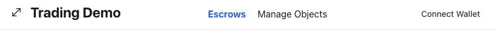

This guide demonstrates how to make an app that performs atomic swaps on Sui. Atomic swaps are similar to escrows but without requiring a trusted third party.

There are three main sections to this guide:

1. [Smart Contracts](#smart-contracts): The Move code that holds the state and perform the swaps.
1. [Backend](#backend): A service that indexes chain state to discover trades, and an API service to read this data.
1. [Frontend](#frontend): A UI that enables users to list objects for sale and to accept trades.

## What the guide teaches

- **Shared objects:** The guide teaches you how to use [shared objects](../../../concepts/object-ownership/shared.mdx), in this case to act as the escrow between two Sui users wanting to trade. Shared objects are a unique concept to Sui. Any transaction and any signer can modify it, given the changes meet the requirements set forth by the package that defined the type.
- **Composability:** The guide teaches you how to design your Move code in a way that enables full composability. In this app, the Move code that handles trading is completely unaware of the code that defines the objects it is trading and vice versa.

The guide also shows how to build an app that:

- **Is trustless:** Users do not have to trust (or pay) any third parties; the chain manages the swap.
- **Avoids rug-pulls:** Guarantees that the object a user wants to trade for isn't tampered with after initiating the trade.
- **Preserves liveness:** Users are able to pull out of the trade and reclaim their object at any time, in case the other party stops responding.

## What you need

{@include: ../../../snippets/app-examples-swap-source.mdx}

Before getting started, make sure you have:

- [Installed the latest version of Sui](../getting-started/sui-install.mdx).
- [Configured a valid network environment](../../../references/cli/client.mdx#set-current-environment), as the guide has you deploy the module on Testnet.
- [Acquired Devnet or Testnet](../getting-started/get-coins.mdx) tokens for development purposes.
- Read the basics of [shared versus owned objects](../sui-101/shared-owned.mdx).

## Smart contracts {#smart-contracts}

In this part of the guide, you write the Move contracts that perform the trustless swaps. The first step is to [set up a Move package](../first-app/write-package.mdx) for storing your Move modules.

### `Locked` and `Key`

After a trade is initiated, you don't want the trading party to modify the object they agreed to trade. Imagine you're trading in-game items and you agree to trade a weapon with all its attachments, and its owner strips all its attachments just before the trade.

In a traditional trade, a third party typically holds the items in escrow to make sure they are not tampered with before the trade completes. This requires either trust that the third party won't tamper with it themselves, paying the third party to ensure that doesn't happen, or both.

In a trustless swap, however, you can use the safety properties of Move to force an item's owner to prove that they have not tampered with the version of the object that you agreed to trade, without involving anyone else.

This is done by requiring that an object that is available for trading is **locked** with a **single-use key**, and asking the owner to supply the key when finalizing the trade.

To tamper with the object would require unlocking it, which consumes the key. Consequently, there would no longer be a key to finish the trade.

{@inject: examples/trading/contracts/escrow/sources/lock.move#struct=Locked,Key noComments}

```move
use sui::object::{ID, UID};

struct Locked<T: store> has key, store {
    id: UID,
    key: ID,
    obj: T,
}

struct Key has key, store {
    id: UID
}
```

- The `Locked<T>` type stores the locked `obj`, the `ID` of the key that unlocks it, and its own `id`.
- The corresponding `Key` type only stores its own `id`.

The lock and key are made single-use by the signatures of the `lock` and `unlock` functions. `lock` accepts any object of type `T: store` (the `store` ability is necessary for storing it inside a `Locked<T>`), and creates both the `Locked<T>` and its corresponding `Key`:

{@inject: examples/trading/contracts/escrow/sources/lock.move#fun=lock noComments}

```move
use sui::object;
use sui::tx_context::TxContext;

public fun lock<T: store>(obj: T, ctx: &mut TxContext): (Locked<T>, Key) {
    let key = Key { id: object::new(ctx) };
    let locked = Locked {
        id: object::new(ctx),
        key: object::id(&key),
        obj,
    };

    (locked, key)
}
```

The `unlock` function accepts the `Locked<T>` and `Key` by value (which consumes them), and returns the underlying `T` as long as the correct key has been supplied for the lock:

```move
/// The key does not match this lock.
const ELockKeyMismatch: u64 = 0;

public fun unlock<T: store>(locked: Locked<T>, key: Key): T {
    assert!(locked.key == object::id(&key), ELockKeyMismatch);
    let Key { id } = key;
    object::delete(id);

    let Locked { id, key: _, obj } = locked;
    object::delete(id);
    obj
}
```

Together, they ensure that a lock and key cannot have existed before the lock operation, and will not exist after a successful unlock – it is single use.

:::tip Additional resources

- [Full source code](https://github.com/MystenLabs/sui/blob/705ee1ed3ce8cfadc4597c6facb6769d7dfb5896/examples/trading/contracts/escrow/sources/lock.move)
- Concepts: [Wrapped Objects](../../../concepts/versioning.mdx#wrapped-objects)

:::

### Testing `Locked` and `Key`

Move's type system guarantees that a given `Key` cannot be re-used (because `unlock` accepts it by value), but there are some properties that need to be confirmed with tests:

- A locked object can be unlocked with its key.
- Trying to lock an object with the wrong key will fail.

The test starts with a helper function for creating an object, it doesn't matter what kind of object it is, as long as it has the `store` ability. The test uses `Coin<SUI>`, because it comes with a `#[test_only]` function for minting:

{@inject: examples/trading/contracts/escrow/sources/lock.move#fun=test_coin noComments}

```move
#[test_only] use sui::coin::{Self, Coin};
#[test_only] use sui::sui::SUI;
#[test_only] use sui::test_scenario::{Self as ts, Scenario};

#[test_only]
fun test_coin(ts: &mut Scenario): Coin<SUI> {
    coin::mint_for_testing<SUI>(42, ts::ctx(ts))
}
```

- All test-related functions and imports are annotated with `#[test_only]` to make sure they don't show up in the published package. This can also be done by separating tests into their own module – e.g. `lock_tests.move` – and marking that module as `#[test_only]`.
- The `test_scenario` module is used to provide access to a `&mut TxContext` in the test (necessary for creating new objects). Tests that don't need to simulate multiple transactions but still need access to a `TxContext` can use `sui::tx_context::dummy` to create a test context instead.

The first test works by creating an object to test, locking it and unlocking it – this should finish executing without aborting.
The last two lines exist to keep the Move compiler happy by cleaning up the test coin and test scenario objects, because values in Move will not be implicitly cleaned up unless they have the `drop` ability.

{@inject: examples/trading/contracts/escrow/sources/lock.move#fun=test_lock_unlock noComments}
```move
#[test]
fun test_lock_unlock() {
    let ts = ts::begin(@0xA);
    let coin = test_coin(&mut ts);

    let (lock, key) = lock(coin, ts::ctx(&mut ts));
    let coin = unlock(lock, key);

    coin::burn_for_testing(coin);
    ts::end(ts);
}
```

The other test is testing a failure scenario – that an abort happens. It creates two locked objects (this time the values are just `u64`s), and use the key from one to try and unlock the other, which should fail (specified using the `expected_failure` attribute).

Unlike the previous test, the same clean-up is not needed, because the code is expected to abort. Instead, add another abort after the code that you expect to abort (making sure to use a different code for this second abort).

{@inject: examples/trading/contracts/escrow/sources/lock.move#fun=test_lock_key_mismatch noComments}

```move
#[test]
#[expected_failure(abort_code = ELockKeyMismatch)]
fun test_lock_key_mismatch() {
    let ts = ts::begin(@0xA);
    let (l, _k) = lock(42, ts::ctx(&mut ts));
    let (_l, k) = lock(43, ts::ctx(&mut ts));

    unlock(l, k);
    abort 1337
}
```

:::tip Additional resources

- [Full source code](https://github.com/MystenLabs/sui/blob/705ee1ed3ce8cfadc4597c6facb6769d7dfb5896/examples/trading/contracts/escrow/sources/lock.move)
- Concepts: [Test Scenario](../first-app/build-test.mdx#testing-a-package)

:::

### The `Escrow` protocol {#escrow}

Trading proceeds in three steps:

1. The first party locks the object they want to trade – this is already handled by the `lock` module you wrote earlier.
1. The second party puts their object up for escrow and registers their interest in the first party's object. This will be handled by a new module – `escrow`.
1. The first party completes the trade by providing their locked object and the key to unlock it. Assuming all checks pass, this transfers their object to the second party and makes the second party's object available to them.

You can start by implementing steps two and three, by defining a new type to hold the escrowed object. It holds the `escrowed` object and an `id: UID` (because it's an object in its own right), but it also records the `sender` and intended `recipient` (to confirm they match when the trade happens), and it registers interest in the first party's object by recording the `ID` of the key that unlocks the `Locked<U>` that contains the object.

{@inject: examples/trading/contracts/escrow/sources/owned.move#struct=Escrow noComments}
```move
use sui::object::{ID, UID};

struct Escrow<T: key + store> has key, store {
    id: UID,
    sender: address,
    recipient: address,
    exchange_key: ID,
    escrowed: T,
}
```

You also need to create a function for creating the `Escrow` object. The object is shared because it needs to be accessed by the address that created it (in case the object needs to be returned) and by the intended recipient (to complete the swap).

{@inject: examples/trading/contracts/escrow/sources/owned.move#fun=create noComments}
```move
use sui::object;
use sui::transfer;
use sui::tx_context::{Self, TxContext};

public fun create<T: key + store>(
    escrowed: T,
    exchange_key: ID,
    recipient: address,
    ctx: &mut TxContext
) {
    let escrow = Escrow {
        id: object::new(ctx),
        sender: tx_context::sender(ctx),
        recipient,
        exchange_key,
        escrowed,
    };

    transfer::public_share_object(escrow);
}
```

If the second party stops responding, the first party can unlock their object. You need to create a function so the second party can recover their object in the symmetric case as well.

- It needs to check that the caller matches `sender`, because `Escrow` objects are shared and anybody can access them.
- It accepts the `Escrow` by value so that it can clean it up after extracting the `escrowed` object, reclaiming the storage rebate for the sender and cleaning up an unused object on chain.

{@inject: examples/trading/contracts/escrow/sources/owned.move#fun=return_to_sender noComments}

```move
/// The `sender` and `recipient` of the two escrowed objects do not match
const EMismatchedSenderRecipient: u64 = 0;

public fun return_to_sender<T: key + store>(
    escrow: Escrow<T>,
    ctx: &TxContext
): T {
    let Escrow {
        id,
        sender,
        recipient: _,
        exchange_key: _,
        escrowed,
    } = escrow;

    assert!(sender == tx_context::sender(ctx), EMismatchedSenderRecipient);
    object::delete(id);
    escrowed
}
```

Finally, you need to add a function to allow the first party to complete the trade.

- This function also accepts the `Escrow` by value because it will consume it once the swap is complete.
- It checks that the sender of the transaction is the intended recipient (the first party), and that the ID of the key they provided matches the key specified when the object was escrowed. This is what ensures no tampering occurs, because this key can only be provided if it had not been used to unlock the object, which proves the object has not left its `Locked<U>` between the call to `create` and to `swap`, and you can tell by inspecting the `lock` module that it cannot be modified while in there.
- The call to `unlock` further checks that the key matches the locked object that was provided.
- Instead of transferring the escrowed object to the recipient address, it is returned by the `swap` function. You can do this because you checked that the transaction sender is the recipient, and it makes this API more composable. Programmable Transaction Blocks give us the flexibility to decide whether to transfer the object as it is received or do something else with it.

{@inject: examples/trading/contracts/escrow/sources/owned.move#fun=swap noComments}

```move
/// The `exchange_for` fields of the two escrowed objects do not match
const EMismatchedExchangeObject: u64 = 1;

public fun swap<T: key + store, U: key + store>(
    escrow: Escrow<T>,
    key: Key,
    locked: Locked<U>,
    ctx: &TxContext,
): T {
    let Escrow {
        id,
        sender,
        recipient,
        exchange_key,
        escrowed: escrowed1,
    } = escrow;

    assert!(recipient == tx_context::sender(ctx), EMismatchedSenderRecipient);
    assert!(exchange_key == object::id(&key), EMismatchedExchangeObject);
    let escrowed2 = lock::unlock(locked, key);

    transfer::public_transfer(escrowed2, sender);
    object::delete(id);
    escrowed1
}
```

:::tip Additional resources

- [Full source code](https://github.com/MystenLabs/sui/blob/705ee1ed3ce8cfadc4597c6facb6769d7dfb5896/examples/trading/contracts/escrow/sources/shared.move)
- Concepts: [Shared Objects](../../../concepts/object-ownership/shared)
- Concepts: [Shared Object Deletion](https://blog.sui.io/ephemeral-shared-objects/)
- Concepts: [PTBs](../../../concepts/transactions/prog-txn-blocks)

:::

### Testing

Tests for the `escrow` module will be more involved than for `lock` – you will take advantage of `test_scenario`'s ability to simulate multiple transactions from different senders, and interact with shared objects.

You will focus on the test for a successful swap, but a link to all the tests can be found later on.

As with the lock test, start by creating a function to mint a test coin. You also create some constants to represent our transaction senders, `ALICE` and `BOB`.

{@inject: examples/trading/contracts/escrow/sources/lock.move#fun=test_coin noComments}

```move
#[test_only] use sui::coin::{Self, Coin};
#[test_only] use sui::sui::SUI;
#[test_only] use sui::test_scenario::{Self as ts, Scenario};

#[test_only] const ALICE: address = @0xA;
#[test_only] const BOB: address = @0xB;

#[test_only]
fun test_coin(ts: &mut Scenario): Coin<SUI> {
    coin::mint_for_testing<SUI>(42, ts::ctx(ts))
}
```

The test body starts with a call to `test_scenario::begin` and ends with a call to `test_scenario::end`. It doesn't matter which address you pass to `begin`, because you will pick one of `ALICE` or `BOB` at the start of each new transaction you write, so set it to `@0x0`:

{@inject: examples/trading/contracts/escrow/sources/shared.move#test}

```move
#[test]
fun test_successful_swap() {
    let ts = ts::begin(@0x0);

    // Rest of the test ...

    ts::end(ts);
}
```

The first transaction is from `BOB` who creates a coin and locks it. You may remember the ID of the coin and the ID of the key, which you will need later, but now you transfer the locked object and the key itself to `BOB`, because this is what would happen with a real transaction: When simulating transactions in a test, you should only keep around primitive values, not whole objects, which would need to be written to chain between transactions.

Write these transactions inside the `test_successful_swap` function, between the call to `begin` and `end`.

{@inject: examples/trading/contracts/escrow/sources/shared.move#variable=i2 noComments}
```move
let (i2, ik2) = {
    ts::next_tx(&mut ts, BOB);
    let c = test_coin(&mut ts);
    let cid = object::id(&c);
    let (l, k) = lock::lock(c, ts::ctx(&mut ts));
    let kid = object::id(&k);
    transfer::public_transfer(l, BOB);
    transfer::public_transfer(k, BOB);
    (cid, kid)
};
```

Next, `ALICE` comes along and sets up the `Escrow`, which locks their coin. They register their interest for `BOB'`s coin by referencing `BOB`'s key's ID (`ik2`):

{@inject: examples/trading/contracts/escrow/sources/shared.move#variable=i1 noComments}
```move
let i1 = {
    ts::next_tx(&mut ts, ALICE);
    let c = test_coin(&mut ts);
    let cid = object::id(&c);
    create(c, ik2, BOB, ts::ctx(&mut ts));
    cid
};
```

Finally, `BOB` completes the trade by calling `swap`. The `take_shared` function is used to simulate accepting a shared input. It uses type inference to know that the object must be an `Escrow`, and finds the last object of this type that was shared (by `ALICE` in the previous transaction). Similarly, use `take_from_sender` to simulate accepting owned inputs (in this case, `BOB`'s lock and key). The coin returned by `swap` is transferred back to `BOB`, as if it was called as part of a PTB, followed by a transfer command.

```move
{
    ts::next_tx(&mut ts, BOB);
    let escrow = ts::take_shared(&ts);
    let k2: Key = ts::take_from_sender(&ts);
    let l2: Locked<Coin<SUI>> = ts::take_from_sender(&ts);
    let c = swap<Coin<SUI>, Coin<SUI>>(
        escrow,
        k2,
        l2,
        ts::ctx(&mut ts),
    );

    transfer::public_transfer(c, BOB);
};
```

The rest of the test is designed to check that `ALICE` has `BOB`'s coin and vice versa. It starts by calling `next_tx` to make sure the effects of the previous transaction have been committed, before running the necessary checks.

```move
ts::next_tx(&mut ts, @0x0);

{
    let c: Coin<SUI> = ts::take_from_address_by_id(&ts, ALICE, i2);
    ts::return_to_address(ALICE, c);
};

{
    let c: Coin<SUI> = ts::take_from_address_by_id(&ts, BOB, i1);
    ts::return_to_address(BOB, c);
};
```

:::tip Additional resources

- [Full source code](https://github.com/MystenLabs/sui/blob/705ee1ed3ce8cfadc4597c6facb6769d7dfb5896/examples/trading/contracts/escrow/sources/shared.move)
- Guides: [Test Scenario](../../../guides/developer/first-app/build-test#testing-a-package)

:::

### Observability

The `escrow` Move package is now functional: You could publish it on chain and perform trustless swaps by creating transactions. Creating those transactions requires knowing the IDs of `Locked`, `Key`, and `Escrow` objects.

`Locked` and `Key` objects are typically owned by the transaction sender, and so can be queried through the Sui RPC, but `Escrow` objects are shared, and it is useful to be able to query them by their sender and recipient (so that users can see the trades they have offered and received).

Querying `Escrow` objects by their sender or recipient will require custom indexing, and to make it easy for the indexer to spot relevant transactions you will add the following **events** to `escrow.move`:

{@inject: examples/trading/contracts/escrow/sources/shared.move#struct=EscrowCreated,EscrowSwapped,EscrowCancelled noComments}

```move
struct EscrowCreated has copy, drop {
    escrow_id: ID,
    key_id: ID,
    sender: address,
    recipient: address,
    item_id: ID,
}

struct EscrowSwapped has copy, drop {
    escrow_id: ID
}

struct EscrowCancelled has copy, drop {
    escrow_id: ID
}
```

Functions responsible for various aspects of the escrow's lifecycle emit these events. The custom indexer can then subscribe to transactions that emit these events and process only those, rather than the entire chain state:

{@inject: examples/trading/contracts/escrow/sources/shared.move#fun=create,swap,return_to_sender noComments}

```move
use sui::event;

public fun create<T: key + store>(
    escrowed: T,
    exchange_key: ID,
    recipient: address,
    ctx: &mut TxContext
) {
    let escrow = Escrow<T> { /* ... */ };

    event::emit(EscrowCreated {
        escrow_id: object::id(&escrow),
        key_id: exchange_key,
        sender: escrow.sender,
        recipient,
        item_id: object::id(&escrowed),
    });

    /* ... */
}

public fun swap<T: key + store, U: key + store>(
    escrow: Escrow<T>,
    key: Key,
    locked: Locked<U>,
    ctx: &TxContext,
): T {
    let Escrow {
        id,
        sender,
        recipient,
        exchange_key,
    } = escrow;

    /* ... */

    event::emit(EscrowSwapped {
        escrow_id: object::uid_to_inner(&id),
    });

    /* ... */
}

public fun return_to_sender<T: key + store>(
    escrow: Escrow<T>,
    ctx: &TxContext
): T {

    event::emit(EscrowCancelled {
        escrow_id: object::id(&escrow)
    });

    /* ... */
}
```

:::tip Additional resources

- Concepts: [Events](../../../concepts/events)

:::


### Next steps

Well done. You have written the Move package! 🚀

To turn this into a complete dApp, you need to create a frontend. However, for the frontend to be updated, it has to listen to the blockchain as escrows are made and swaps are fulfilled.

To achieve this, in the next step you [create an indexing service](#backend).

## Backend indexer {#backend}

With the contract adapted to emit events, you can now write an indexer that keeps track of all active `Escrow` objects and exposes an API for querying objects by sender or recipient. The indexer will be backed by a Prisma DB with the following schema:

{@inject: examples/trading/api/prisma/schema.prisma}

```ts
// prisma/schema.prisma
generator client {
  provider = "prisma-client-js"
}

datasource db {
  provider = "sqlite"
  url      = "file:./dev.db"
}

/// Our swap objects list
model Escrow {
  // Keeping an ID so we can use as a pagination cursor
  // There's an issue with BigInt for sqlite, so we're using a plain ID.
  id Int @id @default(autoincrement())
  objectId String @unique
  sender String?
  recipient String?
  keyId String?
  itemId String?
  swapped Boolean @default(false)
  cancelled Boolean @default(false)

  @@index([recipient])
  @@index([sender])
}

/// Saves the latest cursor for a given key.
model Cursor {
  id String @id
  eventSeq String
  txDigest String
}
```

The core of the indexer is an event loop, initialised in a function called `setupListeners`.

```ts
// indexer.ts
import { setupListeners } from './indexer/event-indexer';

setupListeners();
```

The indexer queries events related to the `escrow` module, using a `queryEvent` filter, and keeps track of a cursor representing the latest event it has processed so it can resume indexing from the right place even if it is restarted. The filter is looking for any events whose type is from the `escrow` module of our Move package:

```ts
// indexer/event-indexer.ts
import { SuiEventFilter, SuiEvent } from  '@mysten/sui.js/client';
import { CONFIG } from '../config';
import { prisma } from '../db';
import { getClient } from '../sui-utils';
import { handleEscrowObjects } from './escrow-handler';

type EventTracker = {
  type: string;
  filter: SuiEventFilter;
  callback: (events: SuiEvent[], type: string) => any;
};

const EVENTS_TO_TRACK: EventTracker[] = [
  {
    type: `${CONFIG.SWAP_CONTRACT.packageId}::escrow`,
    filter: {
      MoveEventModule: {
        module: 'escrow',
        package: CONFIG.SWAP_CONTRACT.packageId,
      },
    },
    callback: handleEscrowObjects,
  },
];

const getLatestCursor = async (tracker: EventTracker) => {
  const cursor = await prisma.cursor.findUnique({
    where: {
      id: tracker.type,
    },
  });

  return cursor || undefined;
};

export const setupListeners = async () => {
  for (const event of EVENTS_TO_TRACK) {
    runEventJob(getClient(CONFIG.NETWORK), event, await getLatestCursor(event));
  }
};
```

The core event job works by polling: It queries RPC for events following its latest cursor and sends them to a callback for processing. If it detects more than one page of new events, it will make an immediate subsequent request for the next page, otherwise it waits for the next polling interval before checking again:

```ts
// indexer/event-indexer.ts
import { EventId, SuiClient } from '@mysten/sui.js/client';

type SuiEventsCursor = EventId | null | undefined;

const executeEventJob = async (
  client: SuiClient,
  tracker: EventTracker,
  cursor: SuiEventsCursor,
): Promise<EventExecutionResult> => {
  try {
    // get the events from the chain.
    // For this implementation, we are going from start to finish.
    // This will also allow filling in a database from scratch!
    const { data, hasNextPage, nextCursor } = await client.queryEvents({
      query: tracker.filter,
      cursor,
      order: 'ascending',
    });

    // handle the data transformations defined for each event
    await tracker.callback(data, tracker.type);

    // We only update the cursor if we fetched extra data (which means there was a change).
    if (nextCursor && data.length > 0) {
      await saveLatestCursor(tracker, nextCursor);

      return {
        cursor: nextCursor,
        hasNextPage,
      };
    }
  } catch (e) {
    console.error(e);
  }
  // By default, we return the same cursor as passed in.
  return {
    cursor,
    hasNextPage: false,
  };
};

const runEventJob = async (client: SuiClient, tracker: EventTracker, cursor: SuiEventsCursor) => {
  const result = await executeEventJob(client, tracker, cursor);

  // Trigger a timeout. Depending on the result, we either wait 0ms or the polling interval.
  setTimeout(
    () => {
      runEventJob(client, tracker, result.cursor);
    },
    result.hasNextPage ? 0 : CONFIG.POLLING_INTERVAL_MS,
  );
};
```

The callback that gets called is responsible for reading the event and updating the database accordingly. For demo purposes, SQLite is being used, and so you need to issue a separate `UPSERT` to the database for each escrowed object, but in a production setting, requests to the database should be batched to minimise round-trips to the database.

```ts
// indexer/escrow-handler.ts
import { SuiEvent } from '@mysten/sui.js/client';
import { Prisma } from '@prisma/client';

import { prisma } from '../db';

type EscrowEvent = EscrowCreated | EscrowCancelled | EscrowSwapped;

type EscrowCreated = {
  sender: string;
  recipient: string;
  escrow_id: string;
  key_id: string;
  item_id: string;
};

type EscrowSwapped = {
  escrow_id: string;
};

type EscrowCancelled = {
  escrow_id: string;
};

export const handleEscrowObjects = async (events: SuiEvent[], type: string) => {
  const updates: Record<string, Prisma.EscrowCreateInput> = {};

  for (const event of events) {
    if (!event.type.startsWith(type)) throw new Error('Invalid event module origin');
    const data = event.parsedJson as EscrowEvent;

    if (!Object.hasOwn(updates, data.escrow_id)) {
      updates[data.escrow_id] = {
        objectId: data.escrow_id,
      };
    }

    // Escrow cancellation case
    if (event.type.endsWith('::EscrowCancelled')) {
      const data = event.parsedJson as EscrowCancelled;
      updates[data.escrow_id].cancelled = true;
      continue;
    }

    // Escrow swap case
    if (event.type.endsWith('::EscrowSwapped')) {
      const data = event.parsedJson as EscrowSwapped;
      updates[data.escrow_id].swapped = true;
      continue;
    }

    const creationData = event.parsedJson as EscrowCreated;

    // Handle creation event
    updates[data.escrow_id].sender = creationData.sender;
    updates[data.escrow_id].recipient = creationData.recipient;
    updates[data.escrow_id].keyId = creationData.key_id;
    updates[data.escrow_id].itemId = creationData.item_id;
  }

  const promises = Object.values(updates).map((update) =>
    prisma.escrow.upsert({
      where: {
        objectId: update.objectId,
      },
      create: update,
      update,
    }),
  );
  await Promise.all(promises);
};
```

:::tip Additional resources

- [Full source code](https://github.com/MystenLabs/sui/tree/705ee1ed3ce8cfadc4597c6facb6769d7dfb5896/examples/trading/api)
- Reference: [JSON-RPC](https://docs.sui.io/sui-api-ref)

:::


### API service

The data that is captured by our indexer can then be served over an API, so that a front-end can read it. You will now implement the API in TypeScript, to run on Node, using Express.

#### API design

##### Query parameters

You want your API to accept the query string in the URL as the parameters for database `WHERE` query. Hence, you want a utility that can extract and parse the URL query string into valid query parameters for Prisma. With the `parseWhereStatement()` function, the callers filter the set of keys from the URL query string and transforms those corresponding key-value pairs into the correct format for Prisma.

```ts title='utils/api-queries.ts'
export enum WhereParamTypes {
	STRING,
	NUMBER,
	BOOLEAN,
}

export type WhereParam = {
	key: string;
	type: WhereParamTypes;
};

/** Parses a where statement based on the query params. */
export const parseWhereStatement = (query: Record<string, any>, acceptedParams: WhereParam[]) => {
	const params: Record<string, any> = {};
	for (const key of Object.keys(query)) {
		const whereParam = acceptedParams.find((x) => x.key === key);
		if (!whereParam) continue;

		const value = query[key];
		if (whereParam.type === WhereParamTypes.STRING) {
			params[key] = value;
		}
		if (whereParam.type === WhereParamTypes.NUMBER) {
			const number = Number(value);
			if (isNaN(number)) throw new Error(`Invalid number for ${key}`);

			params[key] = number;
		}

		// Handle boolean expected values.
		if (whereParam.type === WhereParamTypes.BOOLEAN) {
			let boolValue;
			if (value === 'true') boolValue = true;
			else if (value === 'false') boolValue = false;
			else throw new Error(`Invalid boolean for ${key}`);

			params[key] = boolValue;
		}
	}
	return params;
};
```

##### Query pagination

Pagination is another crucial part to ensure your API returns sufficient and/or ordered chunk of information instead of all the data that might be the vector for a DDOS attack. Similar to **WHERE parameters**, define a set of keys in the URL query string to be accepted as valid pagination parameters. The `parsePaginationForQuery()` utility function helps to achieve this by filtering the pre-determined keys `sort`, `limit`, `cursor` and parsing corresponding key-value pairs into `ApiPagination` that Prisma can consume.

In this example, the `id` field of the model in the database as the cursor that allows clients to continue subsequent queries with the next page.

```ts title='utils/api-queries.ts'
export type ApiPagination = {
	take?: number;
	orderBy: {
		id: 'asc' | 'desc';
	};
	cursor?: {
		id: number;
	};
	skip?: number;
};

/**
 * A helper to prepare pagination based on `req.query`.
 * Only primary key cursor + ordering for this example.
 */
export const parsePaginationForQuery = (body: Record<string, any>) => {
	const pagination: ApiPagination = {
		orderBy: {
			id: Object.hasOwn(body, 'sort') && ['asc', 'desc'].includes(body.sort) ? body.sort : 'desc',
		},
	};

	// Prepare pagination limit (how many items to return)
	if (Object.hasOwn(body, 'limit')) {
		const requestLimit = Number(body.limit);

		if (isNaN(requestLimit)) throw new Error('Invalid limit value');

		pagination.take = requestLimit > CONFIG.DEFAULT_LIMIT ? CONFIG.DEFAULT_LIMIT : requestLimit;
	} else {
		pagination.take = CONFIG.DEFAULT_LIMIT;
	}

	// Prepare cursor pagination (which page to return)
	if (Object.hasOwn(body, 'cursor')) {
		const cursor = Number(body.cursor);
		if (isNaN(cursor)) throw new Error('Invalid cursor');
		pagination.skip = 1;
		pagination.cursor = {
			id: cursor,
		};
	}

	return pagination;
};
```

#### API endpoints

All the endpoints are defined in `server.ts`, particularly, there are two endpoints:

- `/locked` to query `Locked` objects.
- `/escrows` to query `Escrow` objects.

You define a list of valid query keys, such as `deleted`, `creator`, `keyId`, and `objectId` for `Locked` data and `cancelled`, `swapped`, `recipient`, and `sender` for `Escrow` data. Pass the URL query string into the pre-defined utilities to output the correct parameters that Prisma can use.

```ts title='server.ts'
import { prisma } from './db';
import {
	formatPaginatedResponse,
	parsePaginationForQuery,
	parseWhereStatement,
	WhereParam,
	WhereParamTypes,
} from './utils/api-queries';

app.get('/locked', async (req, res) => {
	const acceptedQueries: WhereParam[] = [
		{
			key: 'deleted',
			type: WhereParamTypes.BOOLEAN,
		},
		{
			key: 'creator',
			type: WhereParamTypes.STRING,
		},
		{
			key: 'keyId',
			type: WhereParamTypes.STRING,
		},
		{
			key: 'objectId',
			type: WhereParamTypes.STRING,
		},
	];

	try {
		const locked = await prisma.locked.findMany({
			where: parseWhereStatement(req.query, acceptedQueries)!,
			...parsePaginationForQuery(req.query),
		});

		return res.send(formatPaginatedResponse(locked));
	} catch (e) {
		console.error(e);
		return res.status(400).send(e);
	}
});

app.get('/escrows', async (req, res) => {
	const acceptedQueries: WhereParam[] = [
		{
			key: 'cancelled',
			type: WhereParamTypes.BOOLEAN,
		},
		{
			key: 'swapped',
			type: WhereParamTypes.BOOLEAN,
		},
		{
			key: 'recipient',
			type: WhereParamTypes.STRING,
		},
		{
			key: 'sender',
			type: WhereParamTypes.STRING,
		},
	];

	try {
		const escrows = await prisma.escrow.findMany({
			where: parseWhereStatement(req.query, acceptedQueries)!,
			...parsePaginationForQuery(req.query),
		});

		return res.send(formatPaginatedResponse(escrows));
	} catch (e) {
		console.error(e);
		return res.status(400).send(e);
	}
});
```

### Deployment {#deployment}

Now that you have an indexer and an API service, you can deploy your move package and start the indexer and API service.

1. Install dependencies by running `pnpm install --ignore-workspace` or `yarn install --ignore-workspace`.

2. Setup the database by running `pnpm db:setup:dev` or `yarn db:setup:dev`.

3. Deploy the Sui package

  <details>
    <summary>
      Deployment instructions
    </summary>
    {@include: ../../../snippets/initialize-sui-client-cli.mdx}

  Next, configure the Sui CLI to use `testnet` as the active environment. 

  Use the following command to list your available environments:

  ```bash
  sui client envs
  ```

  If you haven't already set up a `testnet` environment, do so by running the following command in a terminal or console:

  ```bash
  sui client new-env --alias testnet --rpc https://fullnode.testnet.sui.io:443
  ```

  Run the following command to activate the `testnet` environment:

  ```bash
  sui client switch --env testnet
  ```

  Before being able to publish your package to Testnet, you need Testnet SUI tokens. To get some, run the following command: 

  ```bash
  sui client faucet
  ```

  For other ways to get SUI in your Testnet account, see [Get SUI Tokens](/guides/developer/getting-started/get-coins).

  Now that you have an account with some Testnet SUI, you can deploy your contracts. 

  There are some helper functions to publish the smart contract so you can create some demo data (for Testnet).

  To publish the smart contract and produce demo data: 

  1. Publish the smart contract by running: 

      ```
      npx ts-node helpers/publish-contracts.ts
      ```

      If successful, `demo-contract.json` and `escrow-contract.json` will be created in the backend's root directory. These files contain the contract addresses and are used by the backend and frontend to interact with the contracts.

  2. Produce demo non-locked and locked objects

      ```
      npx ts-node helpers/create-demo-data.ts
      ```

  3. Produce demo escrows

      ```
      npx ts-node helpers/create-demo-escrows.ts
      ```

  If you want to reset the database (for a clean demo, etc.), run `pnpm db:reset:dev && pnpm db:setup:dev` or `yarn db:reset:dev && yarn db:setup:dev`.
</details>

4. Run both the API and the indexer by running `pnpm dev` or `yarn dev`.

5. Visit [http://localhost:3000/escrows](http://localhost:3000/escrows) or [http://localhost:3000/locked](http://localhost:3000/locked)

### Next steps

With the code successfully deployed on Testnet, you can now [create a frontend](#frontend) to display the trading data and to allow users to interact with the Move modules.

## Frontend {#frontend}

In this final part of the app example, you build a frontend (UI) that allows end-users to discover trades and interact with listed escrows.

### Prerequisites

{@include: ../../../snippets/app-examples-swap-source.mdx}

Before getting started, make sure you have:

- [Completed the smart contracts](#smart-contracts) and understand their design.
- [Implemented the backend](#backend) to learn how to index on-chain data and expose it through an API.
- [Deployed your smart contracts and started the backend indexer](#deployment).
- Installed [`pnpm`](https://pnpm.io/installation) or [`yarn`](https://classic.yarnpkg.com/lang/en/docs/install/#mac-stable) to use as the package manager.

:::tip Additional resources

- Tooling: [Sui Typescript SDK](https://sdk.mystenlabs.com/typescript). For basic usage on how to interact with Sui with Typescript.
- Tooling: [Sui dApp Kit](https://sdk.mystenlabs.com/dapp-kit). To learn basic building blocks for developing a dApp in the Sui ecosystem with React.js.
- Tooling: [`@mysten/dapp`](https://sdk.mystenlabs.com/dapp-kit/create-dapp). This is used within this project to quickly scaffold a React-based Sui dApp.

:::

### Overview

The UI design consists of three parts:

- A header containing the button allowing users to connect their wallet and navigate to other pages.
- A place for users to manage their owned objects to be ready for escrow trading called `Manage Objects`.
- A place for users to discover, create, and execute trades called `Escrows`.

### Scaffold a new app

The first step is to set up the client app. Run the following command to scaffold a new app.

<Tabs groupId="packagemanager">
  <TabItem label="PNPM" value="pnpm">
    ```bash
    pnpm create @mysten/dapp --template react-client-dapp
    ```
  </TabItem>
  <TabItem label="Yarn" value="yarn">
    ```bash
    yarn create @mysten/dapp --template react-client-dapp
    ```
  </TabItem>
</Tabs>

### Setting up import aliases

First, set up import aliases to make the code more readable and maintainable. This allows you to import files using `@/` instead of relative paths.

<details>
  <summary>
    Replace the content of `tsconfig.json` with the following:
  </summary>
  {@inject: examples/trading/frontend/tsconfig.json}
</details>

The paths option under `compilerOptions` is what defines the aliasing for TypeScript. Here, the alias `@/*` is mapped to the `./src/*` directory, meaning that any time you use `@/`, TypeScript will resolve it as a reference to the src folder. This setup reduces the need for lengthy relative paths when importing files in your project.

<details>
  <summary>
    Replace the content of `vite.config.ts` with the following:
  </summary>
  {@inject: examples/trading/frontend/vite.config.ts}
</details>

Vite also needs to be aware of the aliasing to resolve imports correctly during the build process. In the `resolve.alias` configuration of `vite.config.ts`, we map the alias `@` to the `/src` directory.

### Adding Tailwind CSS

To streamline the styling process and keep the codebase clean and maintainable, we’ll be using Tailwind CSS, which provides utility-first CSS classes to rapidly build custom designs. Run the following command to add Tailwind CSS and its dependencies:

<Tabs groupId="packagemanager">
  <TabItem label="PNPM" value="pnpm">
    ```bash
    pnpm add tailwindcss@latest postcss@latest autoprefixer@latest
    ```
  </TabItem>
  <TabItem label="Yarn" value="yarn">
    ```bash
    yarn add tailwindcss@latest postcss@latest autoprefixer@latest
    ```
  </TabItem>
</Tabs>

Next, generate the Tailwind CSS configuration file by running:

```bash
npx tailwindcss init -p
```

<details>
  <summary>
    Replace the content of `tailwind.config.js` with the following:
  </summary>
  {@inject: examples/trading/frontend/tailwind.config.js}
</details>

<details>
  <summary>
    Add the `src/styles/` directory and add `base.css`: 
  </summary>
  {@inject: examples/trading/frontend/src/styles/base.css}
</details>

### Connecting your deployed package

First, deploy your package via the [scripts in the api directory](#deployment).

<details>
  <summary>
    Then, create a `src/constants.ts` file and fill it with the following:
  </summary>
  {@inject: examples/trading/frontend/src/constants.ts}
</details>

### Add helper functions and UI components

<details>
  <summary>
    Create a `src/utils/` directory and add the following file: 
  </summary>
  {@inject: examples/trading/frontend/src/utils/helpers.ts}
</details>

Create a `src/components/` directory and add the following components: 

<details>
  <summary>
    `ExplorerLink.tsx`
  </summary>
  {@inject: examples/trading/frontend/src/components/ExplorerLink.tsx}
</details>

<details>
  <summary>
    `InfiniteScrollArea.tsx`
  </summary>
  {@inject: examples/trading/frontend/src/components/InfiniteScrollArea.tsx}
</details>

<details>
  <summary>
    `Loading.tsx`
  </summary>
  {@inject: examples/trading/frontend/src/components/Loading.tsx}
</details>

<details>
  <summary>
    `SuiObjectDisplay.tsx`
  </summary>
  {@inject: examples/trading/frontend/src/components/SuiObjectDisplay.tsx}
</details>

Install the necessary dependencies:

<Tabs groupId="packagemanager">
  <TabItem label="PNPM" value="pnpm">
    ```bash
    pnpm add react-hot-toast
    ```
  </TabItem>
  <TabItem label="Yarn" value="yarn">
    ```bash
    yarn add react-hot-toast
    ```
  </TabItem>
</Tabs>


### Set up routing {#routing}

The imported template only has a single page. To add more pages, you need to set up routing.

First, install the necessary dependencies:

<Tabs groupId="packagemanager">
  <TabItem label="PNPM" value="pnpm">
    ```bash
    pnpm add react-router-dom
    ```
  </TabItem>
  <TabItem label="Yarn" value="yarn">
    ```bash
    yarn add react-router-dom
    ```
  </TabItem>
</Tabs>

<details>
  <summary>
    Then, create a `src/routes/` directory and add `index.tsx`. This file contains the routing configuration:
  </summary>
  {@inject: examples/trading/frontend/src/routes/index.tsx}
</details>

Add the following respective files to the `src/routes/` directory:

<details>
  <summary>
    `root.tsx`. This file contains the root component that is rendered on every page:
  </summary>
  {@inject: examples/trading/frontend/src/routes/root.tsx}
</details>

<details>
  <summary>
    `LockedDashboard.tsx`. This file contains the component for the `Manage Objects` page.
  </summary>
```tsx
export function LockedDashboard() {
  return (
    <div>
      <h1>Locked Dashboard</h1>
    </div>
  )
}
```
</details>

<details>
  <summary>
    `EscrowDashboard.tsx`. This file contains the component for the `Escrows` page.
  </summary>
```tsx
export function EscrowDashboard() {
  return (
    <div>
      <h1>Escrow Dashboard</h1>
    </div>
  )
}
```
</details>

<details>
  <summary>
  Update `src/main.tsx` by replacing the `App` component with the `RouterProvider` and replace `"dark"` with `"light"` in the `Theme` component:
  </summary>
  {@inject: examples/trading/frontend/src/main.tsx}
</details>

Note that `dApp Kit` provides a set of hooks for making query and mutation calls to the Sui blockchain. These hooks are thin wrappers around query and mutation hooks from `@tanstack/react-query`.

:::tip Additional resources

- Docs: [React Router](https://reactrouter.com/en/main). Used to navigate between different routes in the website.
- Docs: [TanStack Query](https://tanstack.com/query/latest/docs/framework/react/overview).

:::

<details>
  <summary>
    Create `src/components/Header.tsx`. This file contains the navigation links and the connect wallet button:
  </summary>
```tsx
import { ConnectButton } from "@mysten/dapp-kit";
import { SizeIcon } from "@radix-ui/react-icons";
import { Box, Container, Flex, Heading } from "@radix-ui/themes";
import { NavLink } from "react-router-dom";

const menu = [
  {
    title: "Escrows",
    link: "/escrows",
  },
  {
    title: "Manage Objects",
    link: "/locked",
  },
];

export function Header() {
  return (
    <Container>
      <Flex
        position="sticky"
        px="4"
        py="2"
        justify="between"
        className="border-b flex flex-wrap"
      >
        <Box>
          <Heading className="flex items-center gap-3">
            <SizeIcon width={24} height={24} />
            Trading Demo
          </Heading>
        </Box>

        <Box className="flex gap-5 items-center">
          {menu.map((item) => (
            <NavLink
              key={item.link}
              to={item.link}
              className={({ isActive, isPending }) =>
                `cursor-pointer flex items-center gap-2 ${
                  isPending
                    ? "pending"
                    : isActive
                      ? "font-bold text-blue-600"
                      : ""
                }`
              }
            >
              {item.title}
            </NavLink>
          ))}
        </Box>

        <Box className="connect-wallet-wrapper">
          <ConnectButton />
        </Box>
      </Flex>
    </Container>
  );
}
```
</details>

The dApp Kit comes with a pre-built React.js component called `ConnectButton` displaying a button to connect and disconnect a wallet. The connecting and disconnecting wallet logic is handled seamlessly so you don't need to worry about repeating yourself doing the same logic all over again.

:::danger[Checkpoint]

At this point, you have a basic routing setup. Run your app and ensure you can:

- Navigate between the `Manage Objects` and `Escrows` pages.
- Connect and disconnect your wallet.

Note, the styles should be applied. The `Header` component should look like this: 



:::

### Type definitions

<details>
  <summary>
    All the type definitions are in `src/types/types.ts`. Create this file and add the following:
  </summary>
  {@inject: examples/trading/frontend/src/types/types.ts}
</details>

`ApiLockedObject` and `ApiEscrowObject` represent the `Locked` and `Escrow` indexed data model the indexing and API service return.

`EscrowListingQuery` and `LockedListingQuery` are the query parameters model to provide to the API service to fetch from the endpoints `/escrow` and `/locked` accordingly.

### Display owned objects

Now, display the objects owned by the connected wallet address. This is the `Manage Objects` page.

<details>
  <summary>
    First add this file `src/components/locked/LockOwnedObjects.tsx`: 
  </summary>
```tsx
import { useCurrentAccount, useSuiClientInfiniteQuery } from "@mysten/dapp-kit";
import { SuiObjectDisplay } from "@/components/SuiObjectDisplay";
import { InfiniteScrollArea } from "@/components/InfiniteScrollArea";

/**
 * A component that fetches all the objects owned by the connected wallet address
 * and allows the user to lock them, so they can be used in escrow.
 */
export function LockOwnedObjects() {
  const account = useCurrentAccount();

  const { data, fetchNextPage, isFetchingNextPage, hasNextPage, refetch } =
    useSuiClientInfiniteQuery(
      "getOwnedObjects",
      {
        owner: account?.address!,
        options: {
          showDisplay: true,
          showType: true,
        },
      },
      {
        enabled: !!account,
        select: (data) =>
          data.pages
            .flatMap((page) => page.data)
            .filter(
              // we're filtering out objects that don't have Display or image_url
              // for demo purposes. The Escrow contract works with all objects.
              (x) => !!x.data?.display && !!x.data?.display?.data?.image_url,
            ),
      },
    );

  return (
    <InfiniteScrollArea
      loadMore={() => fetchNextPage()}
      hasNextPage={hasNextPage}
      loading={isFetchingNextPage}
    >
      {data?.map((obj) => (
        <SuiObjectDisplay object={obj.data!}>
        </SuiObjectDisplay>
      ))}
    </InfiniteScrollArea>
  );
}
```
</details>

Fetch the owned objects directly from Sui blockchain using the `useSuiClientInfiniteQuery()` hook from `dApp Kit`. This hook is a thin wrapper around Sui blockchain RPC calls, reference the documentation to learn more about these [RPC hooks](https://sdk.mystenlabs.com/dapp-kit/rpc-hooks). Basically, supply the RPC endpoint you want to execute, in this case it's the [`getOwnedObjects` endpoint](https://docs.sui.io/sui-api-ref#suix_getownedobjects). Supply the connected wallet account and the `Locked` object struct type to the call. The struct type is usually identified by the format of `{PACKAGE_ID}::{MODULE_NAME}::{STRUCT_TYPE}`. The returned data is stored inside the cache at query key `getOwnedObjects`. In a future step you invalidate this cache after a mutation succeeds, so the data will be re-fetched automatically.


<details>
  <summary>
    Next, update `src/routes/LockedDashboard.tsx` to include the `LockOwnedObjects` component:
  </summary>
```tsx
import { useState } from "react";
import { Tabs } from "@radix-ui/themes";
import { LockOwnedObjects } from "@/components/locked/LockOwnedObjects";

export function LockedDashboard() {
  const tabs = [
    {
      name: "Lock Owned objects",
      component: () => <LockOwnedObjects />,
    },
  ];

  const [tab, setTab] = useState(tabs[0].name);

  return (
    <Tabs.Root value={tab} onValueChange={setTab}>
      <Tabs.List>
        {tabs.map((tab, index) => {
          return (
            <Tabs.Trigger
              key={index}
              value={tab.name}
              className="cursor-pointer"
            >
              {tab.name}
            </Tabs.Trigger>
          );
        })}
      </Tabs.List>
      {tabs.map((tab, index) => {
        return (
          <Tabs.Content key={index} value={tab.name}>
            {tab.component()}
          </Tabs.Content>
        );
      })}
    </Tabs.Root>
  );
}
```
</details>

:::danger[Checkpoint]

Run your app and ensure you can:

- View the owned objects of the connected wallet account.

Note, if you don't see any objects, you may need to create some demo data. You'll be able to mint objects after completing the next steps.

:::

### Execute transaction hook {#execute-transaction-hook}

In the frontend, you might need to execute a transaction block in multiple places, hence it's better to extract the transaction execution logic and reuse it everywhere. Let's create and examine the execute transaction hook.


<details>
  <summary>
    Create `src/hooks/useTransactionExecution.ts`:
  </summary>
  {@inject: examples/trading/frontend/src/hooks/useTransactionExecution.ts}
</details>

A `Transaction` is the input, sign it with the current connected wallet account, execute the transaction block, return the execution result, and finally display a basic toast message to indicate whether the transaction is successful or not.

Use the `useSuiClient()` hook from `dApp Kit` to retrieve the Sui client instance configured in `src/main.tsx`. The `useSignTransaction()` function is another hook from `dApp kit` that helps to sign the transaction block using the currently connected wallet. It displays the UI for users to review and sign their transactions with their selected wallet. To execute a transaction block, use the `executeTransaction()` on the Sui client instance of the Sui TypeScript SDK.

### Generate demo data

:::info

The full source code of the demo bear smart contract is available at [Trading Contracts Demo directory](https://github.com/MystenLabs/sui/tree/main/examples/trading/contracts/demo)

:::

You need a utility function to create a dummy object representing a real world asset so you can use it to test and demonstrate escrow users flow on the UI directly.

<details>
  <summary>
    Create `src/mutations/demo.ts`:
  </summary>
  {@inject: examples/trading/frontend/src/mutations/demo.ts}
</details>

As previously mentioned, this example uses `@tanstack/react-query` to query, cache, and mutate server state. Server state is data only available on remote servers, and the only way to retrieve or update this data is by interacting with these remote servers. In this case, it could be from an API or directly from Sui blockchain RPC.

When you execute a transaction call to mutate data on the Sui blockchain, use the `useMutation()` hook. The `useMutation()` hook accepts several inputs, however, you only need two of them for this example. The first parameter, `mutationFn`, accepts the function to execute the main mutating logic, while the second parameter, `onSuccess`, is a callback that runs when the mutating logic succeeds.

The main mutating logic includes executing a Move call of a package named `demo_bear::new` to create a dummy bear object and transfering it to the connected wallet account, all within the same `Transaction`. This example reuses the `executeTransaction()` hook from the [Execute Transaction Hook](#execute-transaction-hook) step to execute the transaction.

Another benefit of wrapping the main mutating logic inside `useMutation()` is that you can access and manipulate the cache storing server state. This example fetches the cache from remote servers by using query call in an appropriate callback. In this case, it is the `onSuccess` callback. When the transaction succeeds, invalidate the cache data at the cache key called `getOwnedObjects`, then `@tanstack/react-query` handles the re-fetching mechanism for the invalidated data automatically. Do this by using `invalidateQueries()` on the `@tanstack/react-query` configured client instance retrieved by `useQueryClient()` hook in the [Set up Routing](#routing) step.

Now the logic to create a dummy bear object exists. You just need to attach it into the button in the header.

<details>
  <summary>
    `Header.tsx`
  </summary>
  {@inject: examples/trading/frontend/src/components/Header.tsx}
</details>

:::danger[Checkpoint]

Run your app and ensure you can:

- Mint a demo bear object and view it in the `Manage Objects` tab.

:::

### Locking owned objects

To lock the object, execute the `lock` Move function identified by `{PACKAGE_ID}::lock::lock`. The implementation is similar to what's in previous mutation functions, use `useMutation()` from `@tanstack/react-query` to wrap the main logic inside it. The lock function requires an object to be locked and its type because our smart contract `lock` function is generic and requires type parameters. After creating a `Locked` object and its `Key` object, transfer them to the connected wallet account within the same transaction block.

It's beneficial to extract logic of locking owned objects into a separated mutating function to enhance discoverability and encapsulation.

<details>
  <summary>
    Create `src/mutations/locked.ts`:
  </summary>
```tsx
import { CONSTANTS } from "@/constants";
import { useTransactionExecution } from "@/hooks/useTransactionExecution";
import { useCurrentAccount } from "@mysten/dapp-kit";
import { SuiObjectData } from "@mysten/sui/client";
import { Transaction } from "@mysten/sui/transactions";
import { useMutation } from "@tanstack/react-query";
/**
 * Builds and executes the PTB to lock an object.
 */
export function useLockObjectMutation() {
  const account = useCurrentAccount();
  const executeTransaction = useTransactionExecution();

  return useMutation({
    mutationFn: async ({ object }: { object: SuiObjectData }) => {
      if (!account?.address)
        throw new Error("You need to connect your wallet!");
      const txb = new Transaction();

      const [locked, key] = txb.moveCall({
        target: `${CONSTANTS.escrowContract.packageId}::lock::lock`,
        arguments: [txb.object(object.objectId)],
        typeArguments: [object.type!],
      });

      txb.transferObjects([locked, key], txb.pure.address(account.address));

      return executeTransaction(txb);
    },
  });
}
```
</details>

Update `src/components/locked/LockOwnedObjects.tsx` to include the `useLockObjectMutation` hook:

<details>
  <summary>
    `LockOwnedObjects.tsx`
  </summary>
  {@inject: examples/trading/frontend/src/components/locked/LockOwnedObjects.tsx}
</details>

:::danger[Checkpoint]

Run your app and ensure you can:

- Lock an owned object. 

Note, the object should disappear from the list of owned objects. You will be able to view and unlock locked objects in later steps.

:::

### Display owned locked objects

Let's take a look at the **My Locked Objects** tab by examining `src/components/locked/OwnedLockedList.tsx`. Focus on the logic on how to retrieve this list.

<details>
  <summary>
    `OwnedLockedList.tsx`
  </summary>
  {@inject: examples/trading/frontend/src/components/locked/OwnedLockedList.tsx}
</details>

Fetch the owned `Locked` objects directly from Sui blockchain using the `useSuiClientInfiniteQuery()` hook from `dApp Kit`.

##### `LockedObject` and `Locked` component

The `<LockedObject />` (`src/components/locked/LockedObject.tsx`) component is mainly responsible for mapping an on-chain `SuiObjectData` `Locked` object to its corresponding `ApiLockedObject`, which is finally delegated to the `<Locked />` component for rendering. The `<LockedObject />` fetches the locked item object ID if the prop `itemId` is not supplied by using `dApp Kit` `useSuiClientQuery()` hook to call the `getDynamicFieldObject` RPC endpoint. Recalling that in this smart contract, the locked item is put into a dynamic object field.

<details>
  <summary>
    `LockedObject.tsx`
  </summary>
  {@inject: examples/trading/frontend/src/components/locked/LockedObject.tsx}
</details>

The `<Locked />` (`src/components/locked/partials/Locked.tsx`) component is mainly responsible for rendering the `ApiLockedObject`. Later on, it will also consists of several on-chain interactions: unlock the locked objects and create an escrow out of the locked object.

<details>
  <summary>
    `Locked.tsx`
  </summary>
```tsx
import { useCurrentAccount, useSuiClientQuery } from "@mysten/dapp-kit";
import { SuiObjectDisplay } from "@/components/SuiObjectDisplay";
import { ExplorerLink } from "../../ExplorerLink";
import { ApiLockedObject } from "@/types/types";

/**
 * Prefer to use the `Locked` component only through `LockedObject`.
 *
 * This can also render data directly from the API, but we prefer
 * to also validate ownership from on-chain state (as objects are transferrable)
 * and the API cannot track all the ownership changes.
 */
export function Locked({
  locked,
  hideControls,
}: {
  locked: ApiLockedObject;
  hideControls?: boolean;
}) {
  const account = useCurrentAccount();

  const suiObject = useSuiClientQuery(
    "getObject",
    {
      id: locked.itemId,
      options: {
        showDisplay: true,
        showType: true,
        showOwner: true,
      },
    },
    {
      select: (data) => data.data,
    },
  );

  const getLabel = () => {
    if (locked.deleted) return "Deleted";
    if (hideControls) {
      if (locked.creator === account?.address) return "You offer this";
      return "You'll receive this if accepted";
    }
    return undefined;
  };

  const getLabelClasses = () => {
    if (locked.deleted)
      return "bg-red-50 rounded px-3 py-1 text-sm text-red-500";
    if (hideControls) {
      if (!!locked.creator && locked.creator === account?.address)
        return "bg-blue-50 rounded px-3 py-1 text-sm text-blue-500";
      return "bg-green-50 rounded px-3 py-1 text-sm text-green-700";
    }
    return undefined;
  };

  return (
    <SuiObjectDisplay
      object={suiObject.data!}
      label={getLabel()}
      labelClasses={getLabelClasses()}
    >
      <div className="text-right flex flex-wrap items-center justify-between">
        {
          <p className="text-sm flex-shrink-0 flex items-center gap-2">
            <ExplorerLink id={locked.objectId} isAddress={false} />
          </p>
        }
      </div>
    </SuiObjectDisplay>
  );
}
```
</details>

Update `src/routes/LockedDashboard.tsx` to include the `OwnedLockedList` component:

<details>
  <summary>
    `LockedDashboard.tsx`
  </summary>
  {@inject: examples/trading/frontend/src/routes/LockedDashboard.tsx}
</details>

:::danger[Checkpoint]

Run your app and ensure you can:

- View the locked objects of the connected wallet account.

:::

### Unlocking owned objects

To unlock the object, execute the `unlock` Move function identified by `{PACKAGE_ID}::lock::unlock`. Call the `unlock` function supplying the `Locked` object, its corresponding `Key`, the struct type of the original object, and transfer the unlocked object to the current connected wallet account. Also, implement the `onSuccess` callback to invalidate the cache data at query key `locked` after one second to force `react-query` to re-fetch the data at corresponding query key automatically.

Unlocking owned objects is another crucial and complex on-chain action in this application. Hence, it's beneficial to extract its logic into separated mutating functions to enhance discoverability and encapsulation.

<details>
  <summary>
    `src/mutations/locked.ts`
  </summary>
  {@inject: examples/trading/frontend/src/mutations/locked.ts}
</details>

Update `src/components/locked/partials/Locked.tsx` to include the `useUnlockObjectMutation` hook:

<details>
  <summary>
    `Locked.tsx`
  </summary>
```tsx
import { useCurrentAccount, useSuiClientQuery } from "@mysten/dapp-kit";
import { SuiObjectDisplay } from "@/components/SuiObjectDisplay";
import { Button } from "@radix-ui/themes";
import {
  ArrowDownIcon,
  ArrowUpIcon,
  LockOpen1Icon,
} from "@radix-ui/react-icons";
import { ExplorerLink } from "../../ExplorerLink";
import { useState } from "react";
import { ApiLockedObject } from "@/types/types";
import { useUnlockMutation } from "@/mutations/locked";

/**
 * Prefer to use the `Locked` component only through `LockedObject`.
 *
 * This can also render data directly from the API, but we prefer
 * to also validate ownership from on-chain state (as objects are transferrable)
 * and the API cannot track all the ownership changes.
 */
export function Locked({
  locked,
  hideControls,
}: {
  locked: ApiLockedObject;
  hideControls?: boolean;
}) {
  const [isToggled, setIsToggled] = useState(false);
  const account = useCurrentAccount();
  const { mutate: unlockMutation, isPending } = useUnlockMutation();

  const suiObject = useSuiClientQuery(
    "getObject",
    {
      id: locked.itemId,
      options: {
        showDisplay: true,
        showType: true,
        showOwner: true,
      },
    },
    {
      select: (data) => data.data,
    },
  );

  const isOwner = () => {
    return !!locked.creator && account?.address === locked.creator;
  };

  const getLabel = () => {
    if (locked.deleted) return "Deleted";
    if (hideControls) {
      if (locked.creator === account?.address) return "You offer this";
      return "You'll receive this if accepted";
    }
    return undefined;
  };

  const getLabelClasses = () => {
    if (locked.deleted)
      return "bg-red-50 rounded px-3 py-1 text-sm text-red-500";
    if (hideControls) {
      if (!!locked.creator && locked.creator === account?.address)
        return "bg-blue-50 rounded px-3 py-1 text-sm text-blue-500";
      return "bg-green-50 rounded px-3 py-1 text-sm text-green-700";
    }
    return undefined;
  };

  return (
    <SuiObjectDisplay
      object={suiObject.data!}
      label={getLabel()}
      labelClasses={getLabelClasses()}
    >
      <div className="text-right flex flex-wrap items-center justify-between">
        {
          <p className="text-sm flex-shrink-0 flex items-center gap-2">
            <ExplorerLink id={locked.objectId} isAddress={false} />
          </p>
        }
        {!hideControls && isOwner() && (
          <Button
            className="ml-auto cursor-pointer"
            disabled={isPending}
            onClick={() => {
              unlockMutation({
                lockedId: locked.objectId,
                keyId: locked.keyId,
                suiObject: suiObject.data!,
              });
            }}
          >
            <LockOpen1Icon /> Unlock
          </Button>
        )}
      </div>
    </SuiObjectDisplay>
  );
}
```
</details>

:::danger[Checkpoint]

Run your app and ensure you can:

- Unlock a locked object.

:::

### Display locked objects to escrow

Update `src/routes/EscrowDashboard.tsx` to include the `LockedList` component:

<details>
  <summary>
    `EscrowDashboard.tsx`
  </summary>
```tsx
import { useState } from "react";
import { Tabs, Tooltip } from "@radix-ui/themes";
import { LockedList } from "../components/locked/ApiLockedList";
import { InfoCircledIcon } from "@radix-ui/react-icons";

export function EscrowDashboard() {
  const tabs = [
    {
      name: "Browse Locked Objects",
      component: () => (
        <LockedList
          params={{
            deleted: "false",
          }}
          enableSearch
        />
      ),
      tooltip: "Browse locked objects you can trade for.",
    },
  ];

  const [tab, setTab] = useState(tabs[0].name);

  return (
    <Tabs.Root value={tab} onValueChange={setTab}>
      <Tabs.List>
        {tabs.map((tab, index) => {
          return (
            <Tabs.Trigger
              key={index}
              value={tab.name}
              className="cursor-pointer"
            >
              {tab.name}
              <Tooltip content={tab.tooltip}>
                <InfoCircledIcon className="ml-3" />
              </Tooltip>
            </Tabs.Trigger>
          );
        })}
      </Tabs.List>
      {tabs.map((tab, index) => {
        return (
          <Tabs.Content key={index} value={tab.name}>
            {tab.component()}
          </Tabs.Content>
        );
      })}
    </Tabs.Root>
  );
}
```
</details>

Add `src/components/locked/ApiLockedList.tsx`:

<details>
  <summary>
    `ApiLockedList.tsx`
  </summary>
  {@inject: examples/trading/frontend/src/components/locked/ApiLockedList.tsx}
</details>

:::danger[Checkpoint]

Run your app and ensure you can:

- View the locked objects in the `Browse Locked Objects` tab in the `Escrows` page.

:::

### Create escrows

To create escrows, include a mutating function through the `useCreateEscrowMutation` hook in `src/mutations/escrow.ts`. It accepts the escrowed item to be traded and the `ApiLockedObject` from another party as parameters. Then, call the `{PACKAGE_ID}::shared::create` Move function and provide the escrowed item, the key id of the locked object to exchange, and the recipient of the escrow (locked object's owner).

<details>
  <summary>
    `escrow.ts`
  </summary>
```tsx
import { CONSTANTS } from "@/constants";
import { useTransactionExecution } from "@/hooks/useTransactionExecution";
import { ApiLockedObject } from "@/types/types";
import { useCurrentAccount } from "@mysten/dapp-kit";
import { SuiObjectData } from "@mysten/sui/client";
import { Transaction } from "@mysten/sui/transactions";
import { useMutation } from "@tanstack/react-query";

/**
 * Builds and executes the PTB to create an escrow.
 */
export function useCreateEscrowMutation() {
  const currentAccount = useCurrentAccount();
  const executeTransaction = useTransactionExecution();

  return useMutation({
    mutationFn: async ({
      object,
      locked,
    }: {
      object: SuiObjectData;
      locked: ApiLockedObject;
    }) => {
      if (!currentAccount?.address)
        throw new Error("You need to connect your wallet!");

      const txb = new Transaction();
      txb.moveCall({
        target: `${CONSTANTS.escrowContract.packageId}::shared::create`,
        arguments: [
          txb.object(object.objectId!),
          txb.pure.id(locked.keyId),
          txb.pure.address(locked.creator!),
        ],
        typeArguments: [object.type!],
      });

      return executeTransaction(txb);
    },
  });
}
```
</details>

Update `src/components/locked/partials/Locked.tsx` to include the `useCreateEscrowMutation` hook:

<details>
  <summary>
    `Locked.tsx`
  </summary>
  {@inject: examples/trading/frontend/src/components/locked/partials/Locked.tsx}
</details>

Add `src/components/escrows/CreateEscrow.tsx`:

<details>
  <summary>
    `CreateEscrow.tsx`
  </summary>
  {@inject: examples/trading/frontend/src/components/escrows/CreateEscrow.tsx}
</details>

:::danger[Checkpoint]

Run your app and ensure you can:

- Create an escrow.

Note, the object should disappear from the list of locked objects in the `Browse Locked Objects` tab in the `Escrows` page. You will be able to view and accept/cancel escrows in later steps.

:::

### Cancel escrows

To cancel the escrow, create a mutation through the `useCancelEscrowMutation` hook in `src/mutations/escrow.ts`. The cancel function accepts the escrow `ApiEscrowObject` and its on-chain data. The `{PACKAGE_ID}::shared::return_to_sender` Move call is generic, thus it requires the type parameters of the escrowed object. Next, execute `{PACKAGE_ID}::shared::return_to_sender` and transfer the returned escrowed object to the creator of the escrow.

<details>
  <summary>
    `escrow.ts`
  </summary>
```tsx
import { CONSTANTS, QueryKey } from "@/constants";
import { useTransactionExecution } from "@/hooks/useTransactionExecution";
import { ApiEscrowObject, ApiLockedObject } from "@/types/types";
import { useCurrentAccount } from "@mysten/dapp-kit";
import { SuiObjectData } from "@mysten/sui/client";
import { Transaction } from "@mysten/sui/transactions";
import { useMutation, useQueryClient } from "@tanstack/react-query";

/**
 * Builds and executes the PTB to create an escrow.
 */
export function useCreateEscrowMutation() {
  const currentAccount = useCurrentAccount();
  const executeTransaction = useTransactionExecution();

  return useMutation({
    mutationFn: async ({
      object,
      locked,
    }: {
      object: SuiObjectData;
      locked: ApiLockedObject;
    }) => {
      if (!currentAccount?.address)
        throw new Error("You need to connect your wallet!");

      const txb = new Transaction();
      txb.moveCall({
        target: `${CONSTANTS.escrowContract.packageId}::shared::create`,
        arguments: [
          txb.object(object.objectId!),
          txb.pure.id(locked.keyId),
          txb.pure.address(locked.creator!),
        ],
        typeArguments: [object.type!],
      });

      return executeTransaction(txb);
    },
  });
}

/**
 * Builds and executes the PTB to cancel an escrow.
 */
export function useCancelEscrowMutation() {
  const currentAccount = useCurrentAccount();
  const executeTransaction = useTransactionExecution();
  const queryClient = useQueryClient();

  return useMutation({
    mutationFn: async ({
      escrow,
      suiObject,
    }: {
      escrow: ApiEscrowObject;
      suiObject: SuiObjectData;
    }) => {
      if (!currentAccount?.address)
        throw new Error("You need to connect your wallet!");
      const txb = new Transaction();

      const item = txb.moveCall({
        target: `${CONSTANTS.escrowContract.packageId}::shared::return_to_sender`,
        arguments: [txb.object(escrow.objectId)],
        typeArguments: [suiObject?.type!],
      });

      txb.transferObjects([item], txb.pure.address(currentAccount?.address!));

      return executeTransaction(txb);
    },

    onSuccess: () => {
      setTimeout(() => {
        queryClient.invalidateQueries({ queryKey: [QueryKey.Escrow] });
      }, 1_000);
    },
  });
}
```
</details>

Add `src/components/escrows/Escrow.tsx`:

<details>
  <summary>
    `Escrow.tsx`
  </summary>
```tsx
import { useCurrentAccount, useSuiClientQuery } from "@mysten/dapp-kit";
import { SuiObjectDisplay } from "@/components/SuiObjectDisplay";
import { Button } from "@radix-ui/themes";
import {
  ArrowDownIcon,
  ArrowUpIcon,
  Cross1Icon,
} from "@radix-ui/react-icons";
import { CONSTANTS, QueryKey } from "@/constants";
import { ExplorerLink } from "../ExplorerLink";
import { useQuery } from "@tanstack/react-query";
import { useState } from "react";
import { ApiEscrowObject } from "@/types/types";
import {
  useCancelEscrowMutation,
} from "@/mutations/escrow";
import { useGetLockedObject } from "@/hooks/useGetLockedObject";
import { LockedObject } from "../locked/LockedObject";

/**
 * A component that displays an escrow and allows the user to accept or cancel it.
 * Accepts an `escrow` object as returned from the API.
 */
export function Escrow({ escrow }: { escrow: ApiEscrowObject }) {
  const account = useCurrentAccount();
  const [isToggled, setIsToggled] = useState(true);
  const { mutate: cancelEscrowMutation, isPending: pendingCancellation } =
    useCancelEscrowMutation();

  const suiObject = useSuiClientQuery("getObject", {
    id: escrow?.itemId,
    options: {
      showDisplay: true,
      showType: true,
    },
  });

  const lockedData = useQuery({
    queryKey: [QueryKey.Locked, escrow.keyId],
    queryFn: async () => {
      const res = await fetch(
        `${CONSTANTS.apiEndpoint}locked?keyId=${escrow.keyId}`,
      );
      return res.json();
    },
    select: (data) => data.data[0],
    enabled: !escrow.cancelled,
  });

  const { data: suiLockedObject } = useGetLockedObject({
    lockedId: lockedData.data?.objectId,
  });

  const getLabel = () => {
    if (escrow.cancelled) return "Cancelled";
    if (escrow.swapped) return "Swapped";
    if (escrow.sender === account?.address) return "You offer this";
    if (escrow.recipient === account?.address) return "You'll receive this";
    return undefined;
  };
  const getLabelClasses = () => {
    if (escrow.cancelled) return "text-red-500";
    if (escrow.swapped) return "text-green-500";
    if (escrow.sender === account?.address)
      return "bg-blue-50 rounded px-3 py-1 text-sm text-blue-500";
    if (escrow.recipient === account?.address)
      return "bg-green-50 rounded px-3 py-1 text-sm text-green-700";
    return undefined;
  };

  return (
    <SuiObjectDisplay
      object={suiObject.data?.data!}
      label={getLabel()}
      labelClasses={getLabelClasses()}
    >
      <div className="flex gap-3 flex-wrap">
        {
          <p className="text-sm flex-shrink-0 flex items-center gap-2">
            <ExplorerLink id={escrow.objectId} isAddress={false} />
          </p>
        }
        <Button
          className="ml-auto cursor-pointer bg-transparent text-black"
          onClick={() => setIsToggled(!isToggled)}
        >
          Details
          {isToggled ? <ArrowUpIcon /> : <ArrowDownIcon />}
        </Button>
        {!escrow.cancelled &&
          !escrow.swapped &&
          escrow.sender === account?.address && (
            <Button
              color="amber"
              className="cursor-pointer"
              disabled={pendingCancellation}
              onClick={() =>
                cancelEscrowMutation({
                  escrow,
                  suiObject: suiObject.data?.data!,
                })
              }
            >
              <Cross1Icon />
              Cancel request
            </Button>
          )}
        {isToggled && lockedData.data && (
          <div className="min-w-[340px] w-full justify-self-start text-left">
            {suiLockedObject?.data && (
              <LockedObject
                object={suiLockedObject.data}
                itemId={lockedData.data.itemId}
                hideControls
              />
            )}

            {!lockedData.data.deleted &&
              escrow.recipient === account?.address && (
                <div className="text-right mt-5">
                  <p className="text-xs pb-3">
                    When accepting the exchange, the escrowed item will be
                    transferred to you and your locked item will be transferred
                    to the sender.
                  </p>
                </div>
              )}
            {lockedData.data.deleted &&
              !escrow.swapped &&
              escrow.recipient === account?.address && (
                <div>
                  <p className="text-red-500 text-sm py-2 flex items-center gap-3">
                    <Cross1Icon />
                    The locked object has been deleted so you can't accept this
                    anymore.
                  </p>
                </div>
              )}
          </div>
        )}
      </div>
    </SuiObjectDisplay>
  );
}
```
</details>

Add `src/components/escrows/EscrowList.tsx`:

<details>
  <summary>
    `EscrowList.tsx`
  </summary>
  {@inject: examples/trading/frontend/src/components/escrows/EscrowList.tsx}
</details>

Update `src/routes/EscrowDashboard.tsx` to include the `EscrowList` component:

<details>
  <summary>
    `EscrowDashboard.tsx`
  </summary>
```tsx
import { useState } from "react";
import { Tabs, Tooltip } from "@radix-ui/themes";
import { LockedList } from "../components/locked/ApiLockedList";
import { EscrowList } from "../components/escrows/EscrowList";
import { InfoCircledIcon } from "@radix-ui/react-icons";
import { useCurrentAccount } from "@mysten/dapp-kit";

export function EscrowDashboard() {
  const account = useCurrentAccount();
  const tabs = [
    {
      name: "Browse Locked Objects",
      component: () => (
        <LockedList
          params={{
            deleted: "false",
          }}
          enableSearch
        />
      ),
      tooltip: "Browse locked objects you can trade for.",
    },
    {
      name: "My Pending Requests",
      component: () => (
        <EscrowList
          params={{
            sender: account?.address,
            swapped: "false",
            cancelled: "false",
            
          }}
          enableSearch
        />
      ),
      tooltip: "Escrows you have initiated for third party locked objects.",
    },
  ];

  const [tab, setTab] = useState(tabs[0].name);

  return (
    <Tabs.Root value={tab} onValueChange={setTab}>
      <Tabs.List>
        {tabs.map((tab, index) => {
          return (
            <Tabs.Trigger
              key={index}
              value={tab.name}
              className="cursor-pointer"
            >
              {tab.name}
              <Tooltip content={tab.tooltip}>
                <InfoCircledIcon className="ml-3" />
              </Tooltip>
            </Tabs.Trigger>
          );
        })}
      </Tabs.List>
      {tabs.map((tab, index) => {
        return (
          <Tabs.Content key={index} value={tab.name}>
            {tab.component()}
          </Tabs.Content>
        );
      })}
    </Tabs.Root>
  );
}
```
</details>

:::danger[Checkpoint]

Run your app and ensure you can:

- View the escrows in the `My Pending Requests` tab in the `Escrows` page.
- Cancel an escrow that you requested.

:::

### Accept escrows

To accept the escrow, create a mutation through the `useAcceptEscrowMutation` hook in `src/mutations/escrow.ts`. The implementation should be fairly familiar to you now. The accept function accepts the escrow `ApiEscrowObject` and the locked object `ApiLockedObject`. The `{PACKAGE_ID}::shared::swap` Move call is generic, thus it requires the type parameters of the escrowed and locked objects. Query the objects details by using `multiGetObjects` on Sui client instance. Lastly, execute the `{PACKAGE_ID}::shared::swap` Move call and transfer the returned escrowed item to the connected wallet account. When the mutation succeeds, invalidate the cache to allow automatic re-fetch of the data.

<details>
  <summary>
    `escrow.ts`
  </summary>
```tsx
import { CONSTANTS, QueryKey } from "@/constants";
import { useTransactionExecution } from "@/hooks/useTransactionExecution";
import { ApiEscrowObject, ApiLockedObject } from "@/types/types";
import { useCurrentAccount, useSuiClient } from "@mysten/dapp-kit";
import { SuiObjectData } from "@mysten/sui/client";
import { Transaction } from "@mysten/sui/transactions";
import { useMutation, useQueryClient } from "@tanstack/react-query";

/**
 * Builds and executes the PTB to create an escrow.
 */
export function useCreateEscrowMutation() {
  const currentAccount = useCurrentAccount();
  const executeTransaction = useTransactionExecution();

  return useMutation({
    mutationFn: async ({
      object,
      locked,
    }: {
      object: SuiObjectData;
      locked: ApiLockedObject;
    }) => {
      if (!currentAccount?.address)
        throw new Error("You need to connect your wallet!");

      const txb = new Transaction();
      txb.moveCall({
        target: `${CONSTANTS.escrowContract.packageId}::shared::create`,
        arguments: [
          txb.object(object.objectId!),
          txb.pure.id(locked.keyId),
          txb.pure.address(locked.creator!),
        ],
        typeArguments: [object.type!],
      });

      return executeTransaction(txb);
    },
  });
}

/**
 * Builds and executes the PTB to cancel an escrow.
 */
export function useCancelEscrowMutation() {
  const currentAccount = useCurrentAccount();
  const executeTransaction = useTransactionExecution();
  const queryClient = useQueryClient();

  return useMutation({
    mutationFn: async ({
      escrow,
      suiObject,
    }: {
      escrow: ApiEscrowObject;
      suiObject: SuiObjectData;
    }) => {
      if (!currentAccount?.address)
        throw new Error("You need to connect your wallet!");
      const txb = new Transaction();

      const item = txb.moveCall({
        target: `${CONSTANTS.escrowContract.packageId}::shared::return_to_sender`,
        arguments: [txb.object(escrow.objectId)],
        typeArguments: [suiObject?.type!],
      });

      txb.transferObjects([item], txb.pure.address(currentAccount?.address!));

      return executeTransaction(txb);
    },

    onSuccess: () => {
      setTimeout(() => {
        queryClient.invalidateQueries({ queryKey: [QueryKey.Escrow] });
      }, 1_000);
    },
  });
}

/**
 * Builds and executes the PTB to accept an escrow.
 */
export function useAcceptEscrowMutation() {
  const currentAccount = useCurrentAccount();
  const client = useSuiClient();
  const executeTransaction = useTransactionExecution();
  const queryClient = useQueryClient();

  return useMutation({
    mutationFn: async ({
      escrow,
      locked,
    }: {
      escrow: ApiEscrowObject;
      locked: ApiLockedObject;
    }) => {
      if (!currentAccount?.address)
        throw new Error("You need to connect your wallet!");
      const txb = new Transaction();

      const escrowObject = await client.multiGetObjects({
        ids: [escrow.itemId, locked.itemId],
        options: {
          showType: true,
        },
      });

      const escrowType = escrowObject.find(
        (x) => x.data?.objectId === escrow.itemId,
      )?.data?.type;

      const lockedType = escrowObject.find(
        (x) => x.data?.objectId === locked.itemId,
      )?.data?.type;

      if (!escrowType || !lockedType) {
        throw new Error("Failed to fetch types.");
      }

      const item = txb.moveCall({
        target: `${CONSTANTS.escrowContract.packageId}::shared::swap`,
        arguments: [
          txb.object(escrow.objectId),
          txb.object(escrow.keyId),
          txb.object(locked.objectId),
        ],
        typeArguments: [escrowType, lockedType],
      });

      txb.transferObjects([item], txb.pure.address(currentAccount.address));

      return executeTransaction(txb);
    },

    onSuccess: () => {
      setTimeout(() => {
        queryClient.invalidateQueries({ queryKey: [QueryKey.Escrow] });
      }, 1_000);
    },
  });
}
```
</details>

Update `src/components/escrows/Escrow.tsx` to include the `useAcceptEscrowMutation` hook:

<details>
  <summary>
    `Escrow.tsx`
  </summary>
  {@inject: examples/trading/frontend/src/components/escrows/Escrow.tsx}
</details>

Update `src/routes/EscrowDashboard.tsx` to include the `EscrowList` component:

<details>
  <summary>
    `EscrowDashboard.tsx`
  </summary>
  {@inject: examples/trading/frontend/src/routes/EscrowDashboard.tsx}
</details>

:::danger[Checkpoint]

Run your app and ensure you can:

- Accept an escrow that someone else requested.

:::

### Finished frontend

At this point, you have a fully functional frontend that allows users to discover trades and interact with listed escrows. The UI is designed to be user-friendly and intuitive, allowing users to easily navigate and interact with the application. Have fun exploring the app and testing out the different features!

