To integrate zkLogin with your app, you need an OAuth client from at least one of the [available providers](#openid-providers). You use the Client ID and redirect URI from those providers in your zkLogin project. For example, the following TypeScript code constructs a Google login URL for testing.

```typescript
const REDIRECT_URI = '<YOUR_SITE_URL>';

const params = new URLSearchParams({
	// Configure client ID and redirect URI with an OpenID provider
	client_id: $CLIENT_ID,
	redirect_uri: $REDIRECT_URI,
	response_type: 'id_token',
	scope: 'openid',
	// See below for details about generation of the nonce
	nonce: nonce,
});

const loginURL = `https://accounts.google.com/o/oauth2/v2/auth?${params}`;
```

## OpenID providers

{@include: ../../../../snippets/openid-providers.mdx}

## Configuring an OpenID provider

Select a tab for instruction on configuring the client ID (`$CLIENT_ID` in the previous example) and redirect URI (`$REDIRECT_URI` in the previous example) with the relevant provider.

<Tabs groupId="oauth-providers">

<TabItem label="Google" value="google">

1. Navigate a browser to the [Google Cloud dashboard](https://console.cloud.google.com/home/dashboard). Either sign in or register for a Google Cloud account.
1. Open **APIs & Services** > **Credentials** using the Google Cloud dashboard navigation. 

    

1. On the Credentials page, select **CREATE CREDENTIALS** > **OAuth client ID**.

    

1. Set the **Application type** and **Name** of your application.

    

1. In the **Authorized redirect URIs** section, click the **ADD URI** button. Set the value for your redirect URI in the field. This should be the wallet or application frontend.

    

1. Click **Create**. If successful, Google Cloud displays the **OAuth client created** dialog with metadata, including your **Client ID**. Click **OK** to dismiss the dialog. 

Your new OAuth client should now appear in the **OAuth 2.0 Client IDs** section of the Credentials page. Click the **Client ID** that appears next to the client to copy the value to your clipboard. Click the client name to access the redirect URI and other client data.

</TabItem>

<TabItem label="Facebook" value="facebook">

1. Register for a Facebook developer account and access the [dashboard](https://developers.facebook.com/apps/).

1. Select "Build your app" then "Products" then "Facebook Login" where you can find the client ID. Set the redirect URL. This should be the wallet or application frontend.


_Sign up for Facebook developer account_


_Go to Settings_

</TabItem>

<TabItem label="Twitch" value="twitch">

1. Register for a Twitch developer account. Access the [dashboard](https://dev.twitch.tv/console).

1. Go to "Register Your Application" then "Application" where you can find the client ID. Set the redirect URL. This should be the wallet or application frontend.

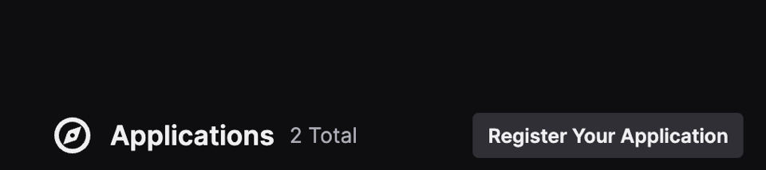

*Sign up for Twitch developer account*

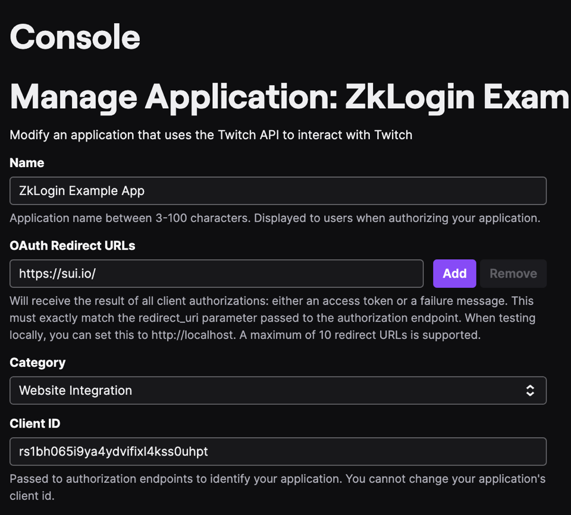

*Go to Console*

</TabItem>

<TabItem label="Kakao" value="kakao">

1. Register for a Kakao developer account. Access the [dashboard](https://developers.kakao.com/console/app) and add an application.

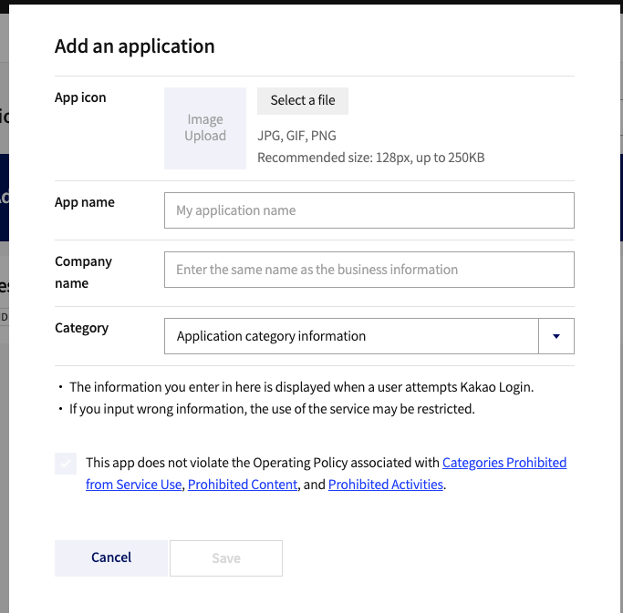

*Add applications to Kakao*

1. Go to "App Keys" where you can find the corresponding client ID for different platforms.

- Native app key: Used to call APIs through the Android or iOS SDK.
- JavaScript key: Used to call APIs through the JavaScript SDK.
- REST API key: Used to call APIs through the REST API.

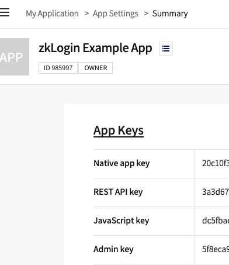

*Find client ID*

1. Toggle on "Kakao Login Activation" and "OpenID Connect Activation". Set the redirect URL in "Kakao Login" under "Product Settings". This should be the wallet or application frontend.

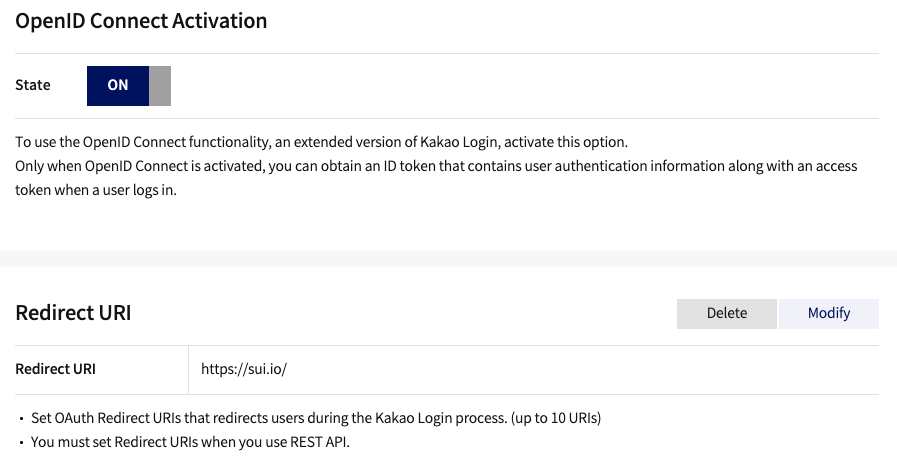

*Set redirect URL*

</TabItem>

<TabItem label="Slack" value="slack">

1. Register for a Slack developer account. Access the [dashboard](https://api.slack.com/apps) and go to "Create New App" then choose "From scratch".

	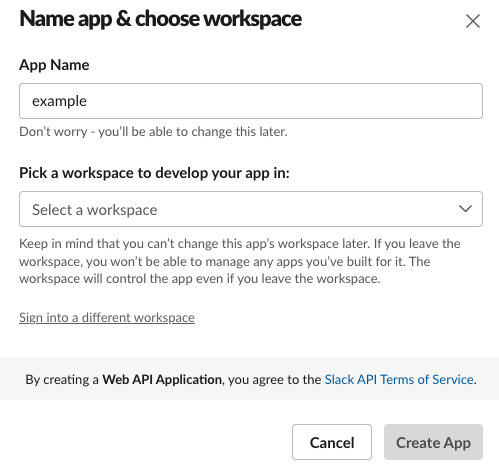

	*Create app in Slack*

1. Find the Client ID and Client Secret under "App Credentials".

	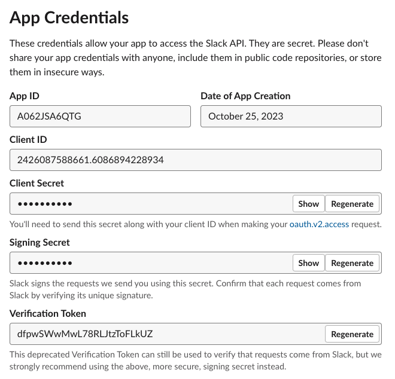

	*Find Client ID and Client Secret*

1. Set Redirect URL in "OAuth & Permissions" under "Features". This should be the wallet or application frontend.

	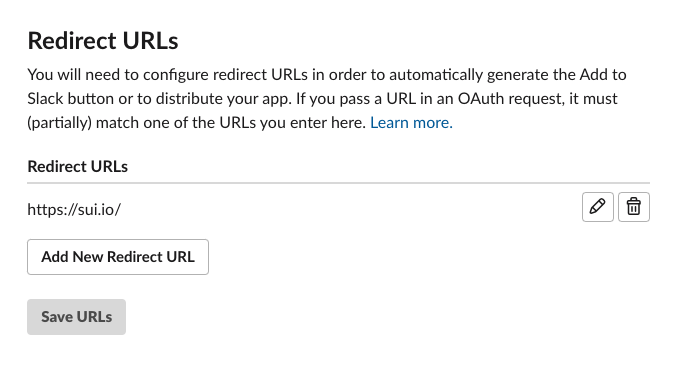

	*Set Redirect URL*

</TabItem>

<TabItem label="Apple" value="apple">

1. Register for an [Apple developer account](https://developer.apple.com/). Go to the **Certificates, Identifiers and Profiles** section.

	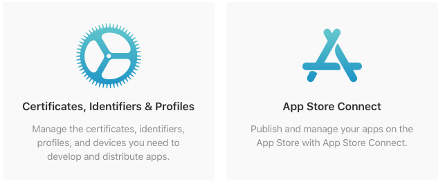
	
	*This is where you can create Certificates, Identifiers and Profiles*

1. Create an App ID
    - From the sidebar, select **Identifiers** and click the blue plus icon to create a new one.
    - Choose **App IDs** as the identifier type and click **Continue**.
    - In the next screen, enter a descriptive name for your App ID and a unique Bundle ID in reverse-dns format (for example, `com.example.app`).
    - Scroll down to the list of capabilities and enable **Sign In with Apple** by checking the box next to it.

	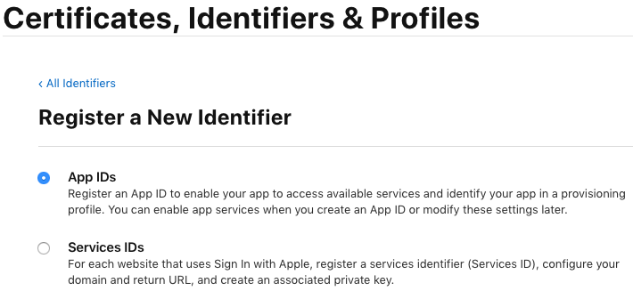
	
	*This is how you can enable Sign In with Apple for your App ID*

1. Create a Services ID

	A Services ID identifies a specific instance of your app and is used as the OAuth `client_id`. You need a Services ID if you want to use **Sign In with Apple** for your web app.

	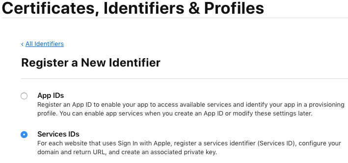

	*This is where you Create a Services ID*

1. Create a new identifier and select **Services IDs** as the identifier type.

    - In the next step, enter a name for your app that will be displayed to the users during the sign-in process and a unique identifier that will be used as the OAuth `client_id`. Make sure to enable **Sign In with Apple** by checking the box next to it.
	- Click the **Configure** button next to **Sign In with Apple** to set up the domain and redirect URLs for your app. You need to specify the domain name where your app is hosted and the redirect URL that will handle the OAuth response from Apple.

	Select the App ID that you created in the previous step as the Primary App ID. This will associate your Services ID with your App ID.

	Enter the domain name of your app (for example, example-app.com) and the redirect URL that will receive the authorization code from Apple (for example, https://example-app.com/redirect). Note that Apple does not allow localhost or IP addresses as valid domains or redirect URLs.

	Click **Save** and then **Continue** and **Register** until you complete this step.

	You have now created an App ID and a Services ID for your app. The identifier of your Services ID is your OAuth `client_id`. In my example, that is com.example.client.

	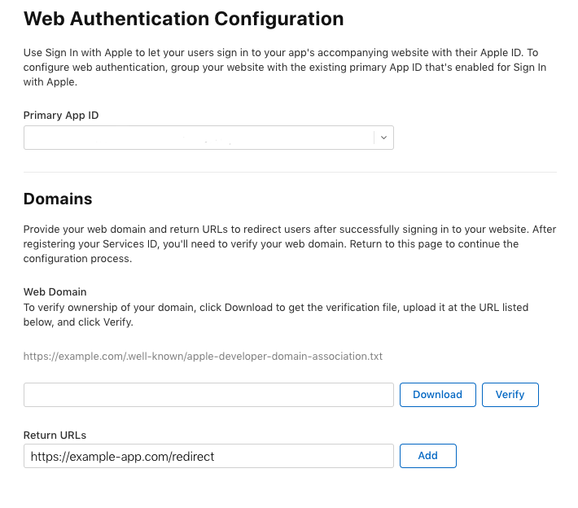
	
	*This is where you Set Redirect URL*

</TabItem>

<TabItem label="Microsoft" value="microsoft">

1. Register and sign in to the [Microsoft Entra admin center](https://entra.microsoft.com/). 
1. Select **Applications** > **App registrations** from the left nav.

	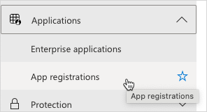
1. Click the **New Registration** button in the top left to open the **Register an application** page.

	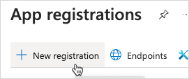
1. Type the application name in the **Name** field, select the appropriate **Supported account types** option, and set the **Redirect URI** value. When satisfied, click **Register**.

	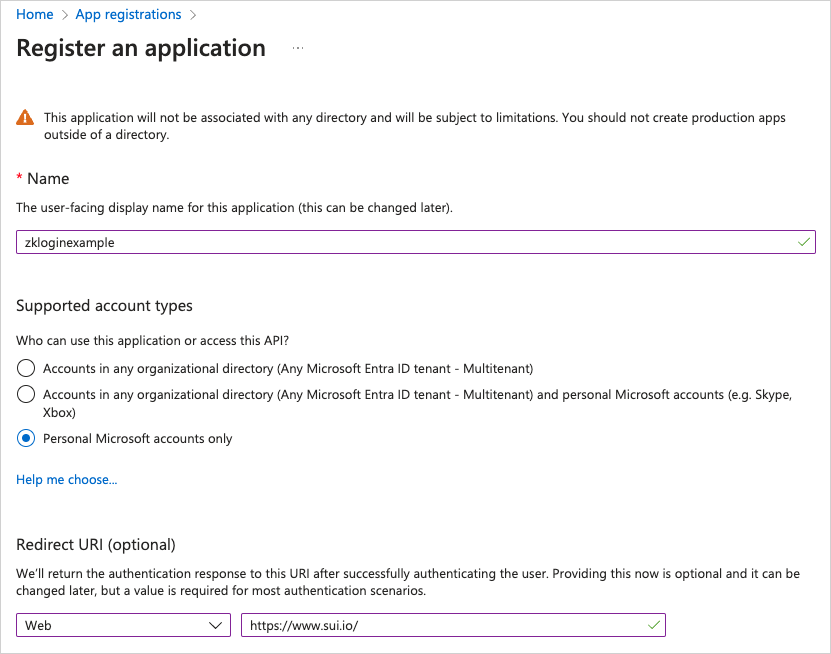
1. After clicking the **Register** button, the admin center opens the application view. Select **Authentication** from the left nav of the application view.

	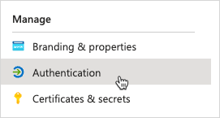
1. In the **Implicit grant and hybrid flows** section, check the **ID tokens (used for implicit and hybrid flows)** box.

	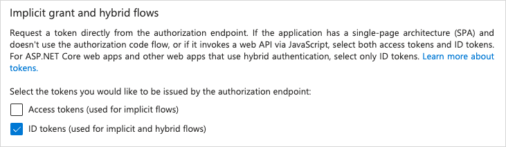
1. Click **Save**.
1. Client ID is available in the **Essentials** section of the application's **Overview** tab.

	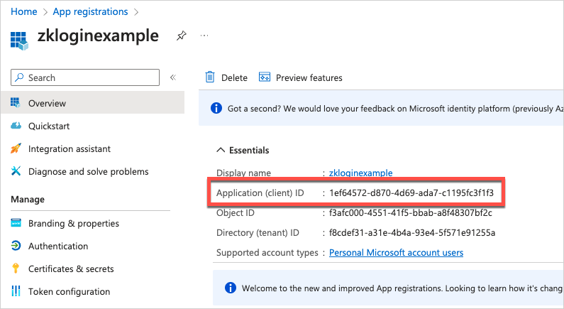
</TabItem>

</Tabs>

## Related links

- [zkLogin Integration Guide](../zklogin-integration.mdx)
- [zkLogin Example](./zklogin-example.mdx)