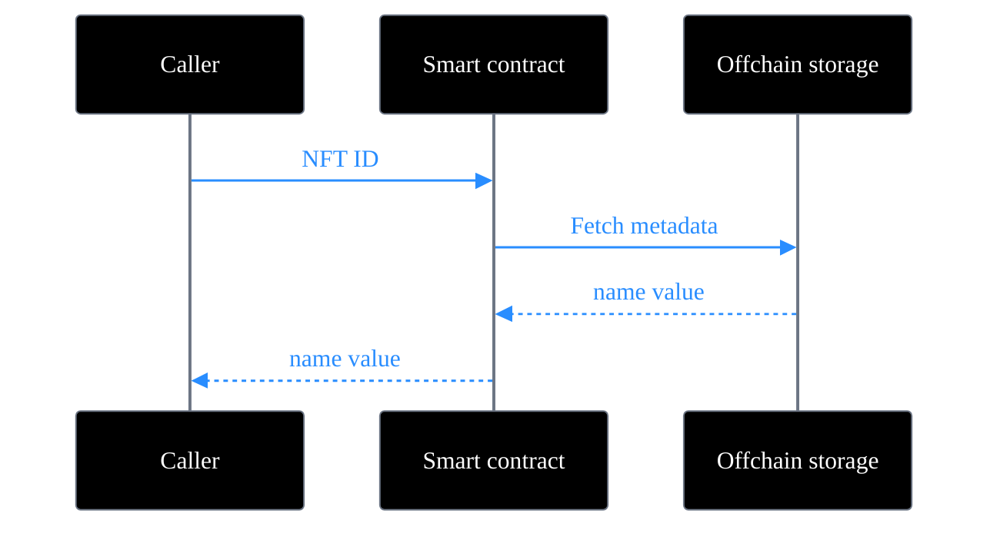

On Sui, every object is unique and has an owner, properties that other blockchains like Ethereum require a dedicated standard such as [ERC-721](https://erc721.org/) to achieve.

 
Imagine you create a Rare Reef Shark NFT collection on Sui and another blockchain that is not object based. To get an attribute like the shark's name on the other blockchain, you would need to interact with the smart contract that created the NFT to get that information (typically from offchain storage) using the NFT ID. On Sui, the name attribute is a field on the object that defines the NFT itself. This construct provides a more direct process for accessing NFT metadata because the smart contract that needs the information can return the name directly from the object.

## Use cases

NFTs on Sui are useful in a wide range of applications:

- **Digital collectibles**: Unique items like art, trading cards, or in-game characters with distinct attributes and provenance. [SuiFrens](https://suifrens.com/) is an example of a collectible NFT collection on Sui.
- **Gaming assets**: In-game items such as weapons, skins, or land parcels, where each asset has unique properties and can be owned, traded, or used across compatible games.
- **Event tickets and access passes**: Tickets or credentials that grant the holder access to an event, community, or gated experience. Uniqueness and ownership are verifiable on-chain.
- **Identity and credentials**: Soulbound NFTs that represent non-transferable credentials such as certifications, memberships, or reputation scores.
- **NFT rentals**: NFTs can be rented to other users for a defined period using Kiosk extensions. This enables use cases where a holder wants to monetize an asset without selling it.
- **Encrypted media**: NFTs can wrap encrypted content so that only the owner can access the underlying asset, which enables freemium and try-before-you-buy models.

## NFTs vs tokenized assets
 
On Sui, both NFTs and [tokenized assets](/guides/developer/digital-assets/non-fungible-tokens/asset-tokenization) are objects. The protocol does not distinguish between them. The difference is in how you design your smart contract.
 
An NFT is typically an object with a supply of 1 and metadata specific to that instance, such as a name, description, or image URL. A tokenized asset is designed for fractional ownership, with a supply greater than 1 and metadata shared across all fractions. Tokenized assets can also be split or merged, which NFTs are not designed for.
 
The following table summarizes the key design differences:
 
| Property | NFT | Tokenized asset |
|---|---|---|
| Supply | 1 | Greater than 1 |
| Metadata | Unique per token | Shared across all fractions |
| Divisibility | Not divisible | Divisible (split or merge) |
| Use case | Unique ownership of a single item | Fractional ownership of an asset |
| Example | A unique piece of digital art | Fractional shares in real estate |

## Example

The following example creates a basic NFT on Sui. The `TestnetNFT` struct defines the NFT with `id`, `name`, `description`, and `url` fields.

<ImportContent source="examples/move/nft/sources/testnet_nft.move" mode="code" struct="TestnetNFT" noComments />

In this example, anyone can mint the NFT by calling the `mint_to_sender` function. The function creates a new `TestnetNFT` and transfers it to the address that makes the call.

<ImportContent source="examples/move/nft/sources/testnet_nft.move" mode="code" fun="mint_to_sender" noComments />

The module includes functions to return NFT metadata. You can call the `name` function to get that value. The function returns the name field value directly from the NFT object.

<ImportContent source="examples/move/nft/sources/testnet_nft.move" mode="code" fun="name" noComments />

`testnet_nft.move` 

<ImportContent source="examples/move/nft/sources/testnet_nft.move" mode="code" />

