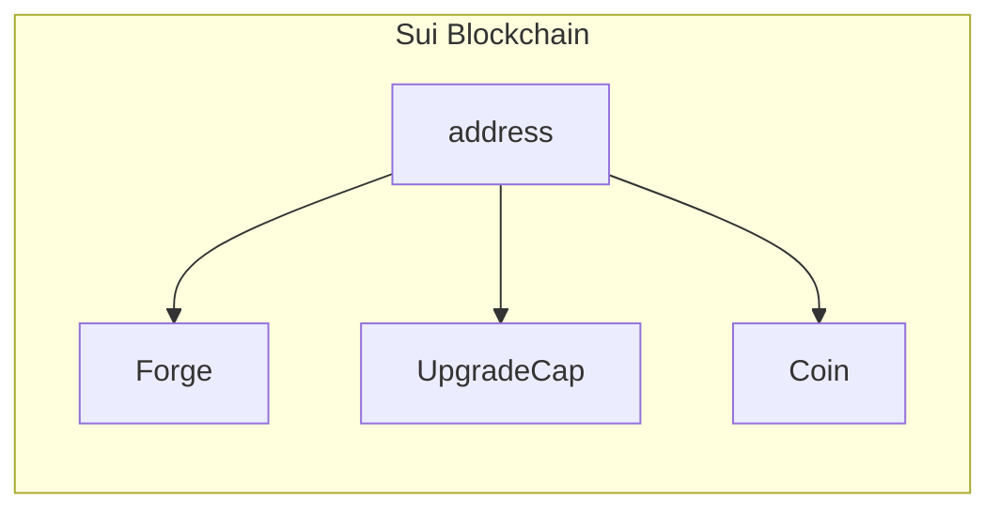
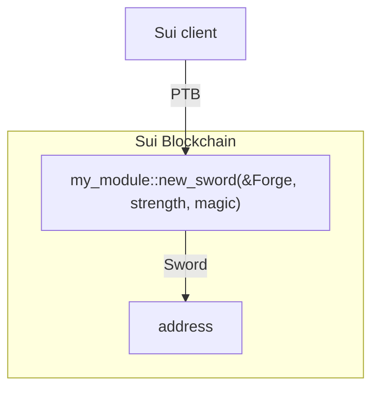

Before you can call functions in a Move package (beyond an emulated Sui execution scenario), that package must be available on the Sui network. When you publish a package, you are actually creating an immutable Sui object on the network that anyone can access.

To publish your package to the Sui network, you can use the `sui client publish` command of the Sui Client CLI. After the package becomes available on the network, you can then use the `sui client call` command to access the functions available in the package.

### Module initializers

Each module in a package can include a special initializer function that runs at publication time. The goal of an initializer function is to pre-initialize module-specific data (for example, to create singleton objects). The initializer function must have the following properties for it to execute at publication:

- Function name must be `init`
- The parameter list must end with either a `&mut TxContext` or a `&TxContext` type
- No return values
- Private visibility
- Optionally, the parameter list starts by accepting the module's one-time witness by value

For example, the following `init` functions are all valid:

- `fun init(ctx: &TxContext)`
- `fun init(ctx: &mut TxContext)`
- `fun init(otw: EXAMPLE, ctx: &TxContext)`
- `fun init(otw: EXAMPLE, ctx: &mut TxContext)`

While the `sui move` command does not support publishing explicitly, you can still test module initializers using the testing framework by dedicating the first transaction to executing the initializer function.

Continuing the fantasy game example, the `init` function should create a `Forge` object.

```move
    /// Module initializer to be executed when this module is published
    fun init(ctx: &mut TxContext) {
        let admin = Forge {
            id: object::new(ctx),
            swords_created: 0,
        };

        // transfer the forge object to the module/package publisher
        transfer::transfer(admin, tx_context::sender(ctx));
    }
```

The tests you have so far call the `init` function, but the initializer function itself isn't tested to ensure it properly creates a `Forge` object. To test this functionality, modify the `sword_create` function to take the forge as a parameter and to update the number of
created swords at the end of the function:

```move
    /// Constructor for creating swords
    public fun new_sword(
        forge: &mut Forge,
        magic: u64,
        strength: u64,
        ctx: &mut TxContext,
    ): Sword {
        forge.swords_created = forge.swords_created + 1;
        // ...
    }
```

Now, create a function to test the module initialization:

```move
    #[test_only] use sui::test_scenario as ts;

    #[test_only] const ADMIN: address = @0xAD;

    #[test]
    public fun test_module_init() {
        let ts = ts::begin(@0x0);

        // first transaction to emulate module initialization.
        {
            ts::next_tx(&mut ts, ADMIN);
            init(ts::ctx(&mut ts));
        };

        // second transaction to check if the forge has been created
        // and has initial value of zero swords created
        {
            ts::next_tx(&mut ts, ADMIN);

            // extract the Forge object
            let forge: Forge = ts::take_from_sender(&mut ts);

            // verify number of created swords
            assert!(swords_created(&forge) == 0, 1);

            // return the Forge object to the object pool
            ts::return_to_sender(&mut ts, forge);
        };

        ts::end(ts);
    }
```

As the new test function shows, the first transaction (explicitly) calls the initializer. The next transaction checks if the `Forge` object has been created and properly initialized.

If you try to run tests on the whole package at this point, you encounter compilation errors in the existing tests because of the
`new_sword` function signature change. The changes required for the tests to run again is an exercise left for you. If you need help, you can refer to the source code for the package (with all the tests properly adjusted) in [first_package](https://github.com/MystenLabs/sui/tree/main/examples/move/first_package/sources/example.move).

### Publish the package
Once you have the package ready, you can publish it to the Sui network. To do so, use 
```
sui client publish
```
You will need to set a gas budget by using the `--gas-budget` flag. The gas budget is the maximum amount of gas you are willing to spend on the transaction. In testnet and devnet, a high budget would allow the transaction to be executed by the network.

You can then check the status of the package using the `sui client objects` command. You can also view the status of the package using the [Sui Explorer](https://suiexplorer.com) or any other Sui blockchain explorer tools.



```
$ sui client objects

╭───────────────────────────────────────────────────────────────────────────────────────╮
│ ╭────────────┬──────────────────────────────────────────────────────────────────────╮ │
│ │ objectId   │  0x48dc0998f450a86a63f9a59a03b60a87baa61ae5b552ecb8cfb9524b4109aa15  │ │
│ │ version    │  10                                                                  │ │
│ │ digest     │  fuEysv0wzTTNP13kgMFhP6V7GG43mbKcvjnw4jlg14w=                        │ │
│ │ objectType │  0xe4dc..88cd::my_module::Forge                                      │ │
│ ╰────────────┴──────────────────────────────────────────────────────────────────────╯ │
│ ╭────────────┬──────────────────────────────────────────────────────────────────────╮ │
│ │ objectId   │  0x9e3cab3f784819e0125168b7f8e9a2977bd59c3b0bff42a22cb0993f3e4e7a35  │ │
│ │ version    │  10                                                                  │ │
│ │ digest     │  2byd+RLeh48n6rxo8bAeILNWS6VjaEzapcn5sdg1VmM=                        │ │
│ │ objectType │  0x0000..0002::coin::Coin                                            │ │
│ ╰────────────┴──────────────────────────────────────────────────────────────────────╯ │
│ ╭────────────┬──────────────────────────────────────────────────────────────────────╮ │
│ │ objectId   │  0xe3db38c2e8529bc5fdcb67c1a03d8717c58b7b68e2816111e4ad8d2556bc0c53  │ │
│ │ version    │  10                                                                  │ │
│ │ digest     │  NVY9pLVpoFFmvAP4sxkIATVRwfcBff+ysXHdaiZx+Ec=                        │ │
│ │ objectType │  0x0000..0002::package::UpgradeCap                                   │ │
│ ╰────────────┴──────────────────────────────────────────────────────────────────────╯ │
╰───────────────────────────────────────────────────────────────────────────────────────╯
```
Note that the `objectId` field is the unique identifier of each object. You can use this identifier to call functions in the package. We now have 3 objects under our address:
- The `Coin` object as a result of calling faucet in testnet or devnet
- The `Forge` object as a result of the `init` function in the package
- The `UpgradeCap` object as a result of publishing the package. You can learn more about it [here](../../../concepts/sui-move-concepts/packages/upgrade.mdx).

### Interact with the package

Now that the package is published, you can interact with it by calling functions in the package. You can use the `sui client ptb` command of the Sui Client PTB CLI to call functions in the package. PTB stands for Programmable Transaction Blocks. You can learn more about it [here](../../../concepts/transactions/prog-txn-blocks.mdx). Transactions are what clients use to make changes to the Sui blockchain. A programmable transaction block is a collection of transactions that are executed together.

For example, you can create a new `Sword` object defined in the package by calling the `new_sword` function in the `my_module` package, and then transfer the `Sword` object to any address:

```bash
$ sui client ptb \
	--assign forge @0xFORGE_ID \
	--assign to_address @0xADDRESS \
	--move-call 0xPACKAGEID::my_module::new_sword forge 3 3 \
	--assign sword \
	--transfer-objects to_address "[sword]" \
	--gas-budget 20000000
```
{@include: ../../../references/cli/address-prefix.mdx}
Make sure to replace `0xFORGE_ID`, `0xADDRESS`, and `0xPACKAGEID` with the actual `objectId` of the `Forge` object, the address of the recipient, and the `objectId` of the package, respectively. The above command makes use of the Sui Client PTB CLI. You can learn more about it [here](../../../references/cli/ptb.mdx).

Once the transaction is executed, you can check the status of the `Sword` object by using the `sui client objects` command or the blockchain explorer of your choice. You should see a total of 4 objects now:
```
╭───────────────────────────────────────────────────────────────────────────────────────╮
│ ╭────────────┬──────────────────────────────────────────────────────────────────────╮ │
│ │ objectId   │  0x48dc0998f450a86a63f9a59a03b60a87baa61ae5b552ecb8cfb9524b4109aa15  │ │
│ │ version    │  11                                                                  │ │
│ │ digest     │  /R0NMICp49ab3nQ8tgb5RlZ6O7SeyQVHKiBcr8Y6QeY=                        │ │
│ │ objectType │  0xe4dc..88cd::my_module::Forge                                      │ │
│ ╰────────────┴──────────────────────────────────────────────────────────────────────╯ │
│ ╭────────────┬──────────────────────────────────────────────────────────────────────╮ │
│ │ objectId   │  0x9e3cab3f784819e0125168b7f8e9a2977bd59c3b0bff42a22cb0993f3e4e7a35  │ │
│ │ version    │  11                                                                  │ │
│ │ digest     │  2OvUOhqwlHsOE9Vn40Hzf0HQQTPTp/edWp4V3Ch43Pg=                        │ │
│ │ objectType │  0x0000..0002::coin::Coin                                            │ │
│ ╰────────────┴──────────────────────────────────────────────────────────────────────╯ │
│ ╭────────────┬──────────────────────────────────────────────────────────────────────╮ │
│ │ objectId   │  0xe0f15011cb6796a7e016c63344067cb93dabe69ff84162b2967ed99b826c4c1d  │ │
│ │ version    │  11                                                                  │ │
│ │ digest     │  yCzz7CLjJJOlqGINDB4Cpe8y3u0NvsU1A+RGaEdZnO8=                        │ │
│ │ objectType │  0xe4dc..88cd::my_module::Sword                                      │ │
│ ╰────────────┴──────────────────────────────────────────────────────────────────────╯ │
│ ╭────────────┬──────────────────────────────────────────────────────────────────────╮ │
│ │ objectId   │  0xe3db38c2e8529bc5fdcb67c1a03d8717c58b7b68e2816111e4ad8d2556bc0c53  │ │
│ │ version    │  10                                                                  │ │
│ │ digest     │  NVY9pLVpoFFmvAP4sxkIATVRwfcBff+ysXHdaiZx+Ec=                        │ │
│ │ objectType │  0x0000..0002::package::UpgradeCap                                   │ │
│ ╰────────────┴──────────────────────────────────────────────────────────────────────╯ │
╰───────────────────────────────────────────────────────────────────────────────────────╯
```

Congratulations! You have successfully published a package to the Sui network and modified the blockchain state by using a Programmable Transaction Block! You can find more dApp examples in the [App Examples](../app-examples.mdx) page.
