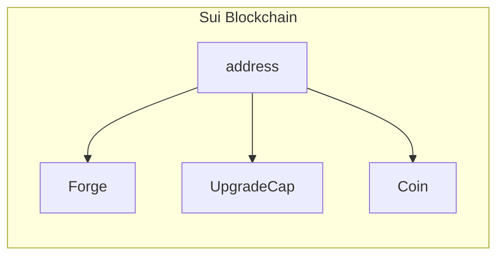
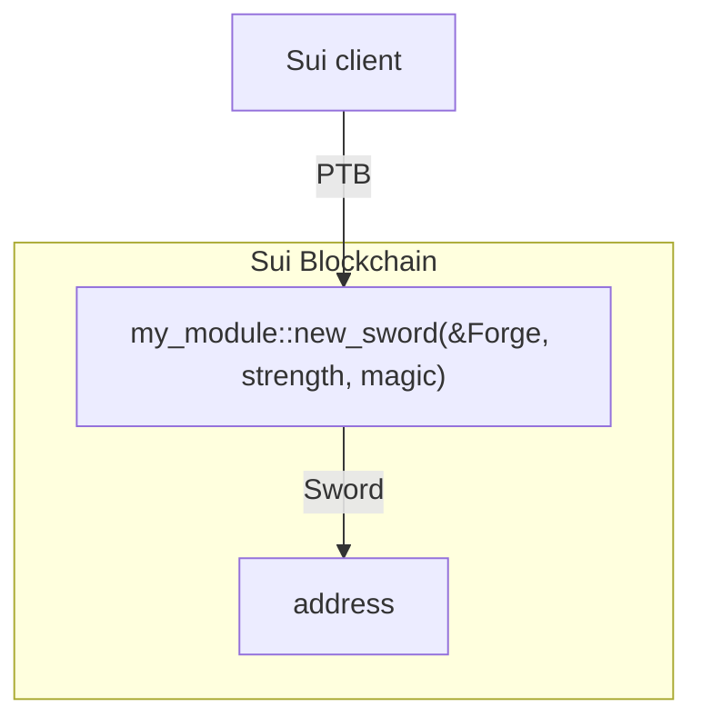

Before you can call functions in a Move package (beyond an emulated Sui execution scenario), that package must be available on the Sui network. When you publish a package, you are actually creating an immutable Sui object on the network that anyone can access.

To publish your package to the Sui network, use the `publish` CLI command in the root of your package. Use the `--gas-budget` flag to set a value for the maximum amount of gas the transaction can cost. If the cost of the transaction is more than the budget you set, the transaction fails and your package doesn't publish. 

{@include: ../../../snippets/info-gas-budget.mdx}

```sh
$ sui client publish --gas-budget 5000000
```

If the publish transaction is successful, your terminal or console responds with the details of the publish transaction separated into sections, including transaction data, transaction effects, transaction block events, object changes, and balance changes. 

In the **Object Changes** table, you can find the information about the package you just published in the **Published Objects** section. Your response has the actual `PackageID` that identifies the package (instead of `<PACKAGE-ID>`) in the form `0x123...ABC`.  

```sh
╭─────────────────────────────────────────────────────────────────────╮
│ Object Changes                                                      │
├─────────────────────────────────────────────────────────────────────┤
│ Created Objects:                                                    │
│  ...                                                                │
|                                                                     |
│ Mutated Objects:                                                    │
│  ...                                                                │
|                                                                     |
│ Published Objects:                                                  │
│  ┌──                                                                │
│  │ PackageID: <PACKAGE-ID>                                          │
│  │ Version: 1                                                       │
│  │ Digest: <DIGEST-HASH>                                            │
│  │ Modules: my_module                                               │
│  └──                                                                │
╰─────────────────────────────────────────────────────────────────────╯
```

Your currently active address now has three objects (or more, if you had objects prior to this example). Assuming you are using a new address, running the `sui client objects` command reveals what those objects are.

```
$ sui client objects

╭───────────────────────────────────────────────────────────────────────────────────────╮
│ ╭────────────┬──────────────────────────────────────────────────────────────────────╮ │
│ │ objectId   │  <OBJECT-ID>                                                         │ │
│ │ version    │  10                                                                  │ │
│ │ digest     │  <DIGEST-HASH>                                                       │ │
│ │ objectType │  <PACKAGE-ID>::my_module::Forge                                      │ │
│ ╰────────────┴──────────────────────────────────────────────────────────────────────╯ │
│ ╭────────────┬──────────────────────────────────────────────────────────────────────╮ │
│ │ objectId   │  <OBJECT-ID>                                                         │ │
│ │ version    │  10                                                                  │ │
│ │ digest     │  <DIGEST-HASH>                                                       │ │
│ │ objectType │  0x0000..0002::coin::Coin                                            │ │
│ ╰────────────┴──────────────────────────────────────────────────────────────────────╯ │
│ ╭────────────┬──────────────────────────────────────────────────────────────────────╮ │
│ │ objectId   │  <OBJECT-ID>                                                         │ │
│ │ version    │  10                                                                  │ │
│ │ digest     │  <DIGEST-HASH>                                                       │ │
│ │ objectType │  0x0000..0002::package::UpgradeCap                                   │ │
│ ╰────────────┴──────────────────────────────────────────────────────────────────────╯ │
╰───────────────────────────────────────────────────────────────────────────────────────╯
```

The `objectId` field is the unique identifier of each object. 

- `Coin` object: You received the Coin object from the Testnet faucet. It's value is slightly less than when you received it because of the cost of gas for the publish transaction. 
- `Forge` object: Recall that the `init` function runs when the package gets published. The `init` function for this example package creates a `Forge` object and transfers it to the publisher (you).
- `UpgradeCap` object: Each package you publish results in the receipt of an `UpgradeCap` object. You use this object to upgrade the package later or to burn it so the package cannot be upgraded.



### Interact with the package

Now that the package is on-chain, you can call its functions to interact with the package. Use the `sui client call` command to make individual calls to package functions, or construct more advanced blocks of transactions using the `sui client ptb` command. The `ptb` part of the command stands for [programmable transaction blocks (PTBs)](../../../concepts/transactions/prog-txn-blocks.mdx). PTBs allow you to group commands together in a single transaction for more efficient and cost-effective network activity.



For example, you can create a new `Sword` object defined in the package by calling the `new_sword` function in the `my_module` package, and then transfer the `Sword` object to any address:

```sh
$ sui client ptb \
	--assign forge @<FORGE-ID> \
	--assign to_address @<TO-ADDRESS> \
	--move-call <PACKAGE-ID>::my_module::new_sword forge 3 3 \
	--assign sword \
	--transfer-objects "[sword]" to_address \
	--gas-budget 20000000
```

:::info 

{@include: ../../../snippets/address-prefix.mdx}

Depending on your shell and operating system, you might need to pass some values with quotes (`"`), for example: `--assign "forge @<FORGE-ID>"`.

:::

Make sure to replace `<FORGE-ID>`, `<TO-ADDRESS>`, and `<PACKAGE-ID>` with the actual `objectId` of the `Forge` object, the address of the recipient (your address in this case), and the `packageID` of the package, respectively. 

After the transaction executes, you can check the status of the `Sword` object by using the `sui client objects` command again. Provided you used your address as the `<TO-ADDRESS>`, you should now see a total of four objects:

```
╭───────────────────────────────────────────────────────────────────────────────────────╮
│ ╭────────────┬──────────────────────────────────────────────────────────────────────╮ │
│ │ objectId   │  <OBJECT-ID>                                                         │ │
│ │ version    │  11                                                                  │ │
│ │ digest     │  <DIGEST-HASH>                                                       │ │
│ │ objectType │  <PACKAGE-ID>::my_module::Forge                                      │ │
│ ╰────────────┴──────────────────────────────────────────────────────────────────────╯ │
│ ╭────────────┬──────────────────────────────────────────────────────────────────────╮ │
│ │ objectId   │  <OBJECT-ID>                                                         │ │
│ │ version    │  11                                                                  │ │
│ │ digest     │  <DIGEST-HASH>                                                       │ │
│ │ objectType │  0x0000..0002::coin::Coin                                            │ │
│ ╰────────────┴──────────────────────────────────────────────────────────────────────╯ │
│ ╭────────────┬──────────────────────────────────────────────────────────────────────╮ │
│ │ objectId   │  <OBJECT-ID>                                                         │ │
│ │ version    │  11                                                                  │ │
│ │ digest     │  <DIGEST-HASH>                                                       │ │
│ │ objectType │  <PACKAGE-ID>::my_module::Sword                                      │ │
│ ╰────────────┴──────────────────────────────────────────────────────────────────────╯ │
│ ╭────────────┬──────────────────────────────────────────────────────────────────────╮ │
│ │ objectId   │  <OBJECT-ID>                                                         │ │
│ │ version    │  10                                                                  │ │
│ │ digest     │  <DIGEST-HASH>                                                       │ │
│ │ objectType │  0x0000..0002::package::UpgradeCap                                   │ │
│ ╰────────────┴──────────────────────────────────────────────────────────────────────╯ │
╰───────────────────────────────────────────────────────────────────────────────────────╯
```

Congratulations. 🎉 You have successfully published a package to the Sui network and modified the blockchain state by using a programmable transaction block. 

## Related links

- [Debugging](./debug.mdx): Print values to aid in logic debugging.
- [Package Upgrades](../../../concepts/sui-move-concepts/packages.mdx): Upgrading packages published on the Sui network.
- [Publish a Move Package](../../../references/cli/client.mdx#publish-a-move-package): More details about using the CLI to publish a package.
- [Programmable Transaction Blocks](../../../concepts/transactions/prog-txn-blocks.mdx): PTBs are collections of transactions that are executed together.
- [Sui Client PTB CLI](../../../references/cli/ptb.mdx): The `client ptb` command allows you to specify the transactions for execution in a programmable transaction block directly from your CLI or through bash scripts.
- [App Examples](../app-examples.mdx): End-to-end examples that include smart contract logic and frontend code.
