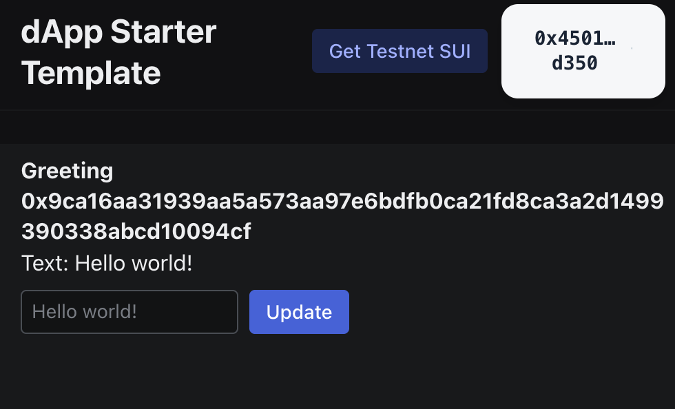
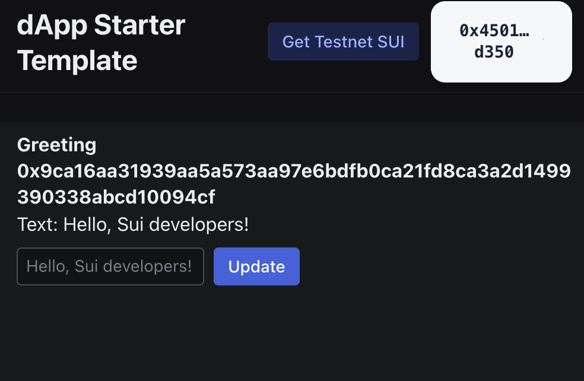

In the previous guide, ["Hello, World!"](/guides/developer/getting-started/hello-world.mdx), you deployed a Move package and interacted with it to create an object that stored the text "Hello world!".

This guide demonstrates how to connect a React interface to that "Hello, World!" package, giving any user a way to interact with the Move package from their browser and set a custom greeting.

<Tabs className="tabsHeadingCentered--small">
<TabItem value="prereq" label="Prerequisites">

- [x] [Install the latest version of Sui](/guides/developer/getting-started/sui-install.mdx).

- [x] [Configure the Sui client](/guides/developer/getting-started/configure-sui-client.mdx).

- [x] [Create a Sui address](/guides/developer/getting-started/get-address.mdx).

- [x] [Get SUI Testnet tokens](/guides/developer/getting-started/get-coins.mdx).

- [x] Complete the ["Hello, World!"](/guides/developer/getting-started/hello-world.mdx) guide and have your published Move package's ID. 

- [x] Install [`pnpm`](https://pnpm.io/installation) to use as the package manager.

- [x] Create a [Slush](https://slush.app/) wallet.

</TabItem>
</Tabs>

## Call the Move package 

First, confirm that you have [followed the "Hello, World!"](https://github.com/MystenLabs/sui-stack-hello-world.git) example guide and are within the `sui-stack-hello-world/move/hello-world` directory in your CLI.

Then, verify your Move package is still available on Testnet by obtaining its object information:

```
$ sui client object <PACKAGE_ID>
```

Replace `<PACKAGE_ID>` with your Move package's ID. 

:::danger

If your package no longer exists, or if you need to obtain the package ID again, follow the steps in the ["Hello, World!"](https://github.com/MystenLabs/sui-stack-hello-world.git) guide.

:::

## View the frontend source code

In the "Hello, World!" example project, the subdirectory `sui-stack-hello-world/ui` contains the frontend interface source code files:

```
.
├── index.html
├── package.json
├── pnpm-lock.yaml
├── prettier.config.cjs
├── src
│   ├── App.tsx
│   ├── constants.ts
│   ├── CreateGreeting.tsx
│   ├── Greeting.tsx
│   ├── main.tsx
│   ├── networkConfig.ts
│   └── vite-env.d.ts
├── tsconfig.json
├── tsconfig.node.json
└── vite.config.mts
```

### `App.tsx`

The `App.tsx` file contains code that creates a basic starter template for your React dApp. It includes a button to connect a Slush wallet to the dApp and a button to open the Sui Faucet to obtain Testnet SUI. 

<ImportContent source="/ui/src/App.tsx" mode="code" org="MystenLabs" repo="sui-stack-hello-world" />

### `CreateGreeting.tsx`

The `CreateGreeting.tsx` file contains logic that creates and sends a transaction to your Move package. The transaction calls the `new` function of the package, which creates a Move object with the value `Hello world!`. In the ["Hello, World!"](/guides/developer/getting-started/hello-world.mdx) guide, you called this function manually through the CLI with the command `sui client call --package <PACKAGE_ID> --module greeting --function new`.

<ImportContent source="/ui/src/CreateGreeting.tsx" mode="code" org="MystenLabs" repo="sui-stack-hello-world" />

### `Greeting.tsx`

The `Greeting.tsx` file also contains logic that creates and sends a transaction to your Move package. However, this transaction calls the `update_text` function of the package, which modifies the text to replace "Hello world!" with the text of your choosing.

<ImportContent source="/ui/src/Greeting.tsx" mode="code" org="MystenLabs" repo="sui-stack-hello-world" />

## Connect the React interface to your Move package

The `constants.ts` file is where you connect the React dApp to your Move package. This file contains a single line that sets your Move package ID as a constant `TESTNET_HELLO_WORLD_PACKAGE_ID`. By default, this file contains a sample package ID. 

Modify this file to include your Move package ID instead.

<ImportContent source="/ui/src/constants.ts" mode="code" org="MystenLabs" repo="sui-stack-hello-world" />

This constant is used in the `networkConfig.ts` file:

<ImportContent source="/ui/src/networkConfig.ts" mode="code" org="MystenLabs" repo="sui-stack-hello-world" />

## Install frontend dependencies 

Now, navigate into the `sui-stack-hello-world/ui` directory if you are not already there and install the necessary frontend dependencies:

```sh
$ pnpm install
```

## Run the React application

Start the React application in your local development environment:

```sh
$ pnpm dev
```

Then, open `http://localhost:5173/` in your browser. The dApp prompts you to connect your Slush wallet. Click **Connect Wallet**, authenticate when prompted, then approve the connection.

## Send SUI tokens to your Slush wallet

If you sent SUI tokens to an address used in the CLI in previous guides, then created a new Slush wallet in your browser, you likely need to send SUI tokens to the Slush wallet. The Slush wallet address is different and separate from the address created and used in the CLI.

Follow the [Testnet SUI](/guides/developer/getting-started/get-coins.mdx) instructions to send Testnet tokens to your Slush address. 

## Use the frontend interface

Next, click the **Create Greeting** button. In the code, this button activates the logic stored in `CreateGreeting.ts` to send a transaction to the Move package that calls the `new` function and creates the `Greeting` object. 

The Slush wallet prompts you to approve this transaction. 

:::danger 

If there is a problem, the prompt to approve the transaction displays the error message. Common errors include "Unable to Process Transaction" due to either insufficient gas coins or an incorrect Move package ID. 

[Obtain Testnet SUI](/guides/developer/getting-started/get-coins.mdx) or [confirm you have the correct Move package ID](/guides/developer/getting-started/hello-world.mdx) to resolve these errors.

:::

After you approve the transaction, the browser window displays the `Greeting` object's ID and its content, which by default is "Hello world!"

To change this text, enter a different greeting in the text box below the default value and click **Update**. The Slush wallet prompts you to approve the transaction.



After you approve the transaction, the new greeting is displayed:



<div className="next-steps-module">
  <div className="next-steps-header">
    <h3>Next steps</h3>
  </div>
  <div className="next-steps-grid">
    <Card className="plausible-event-name=hello+data+button"
      title="Access Sui Data" 
      href="/concepts/data-access/data-serving"
    >
      Learn more about accessing data on Sui.
    </Card>
    <Card className="plausible-event-name=hello+community+button"
      title="Join the Community" 
      href="/guides/developer/getting-started/next-steps"
    >
      Join the Sui developer community, try out other example projects, or read more documentation.
    </Card>
  </div>
</div>