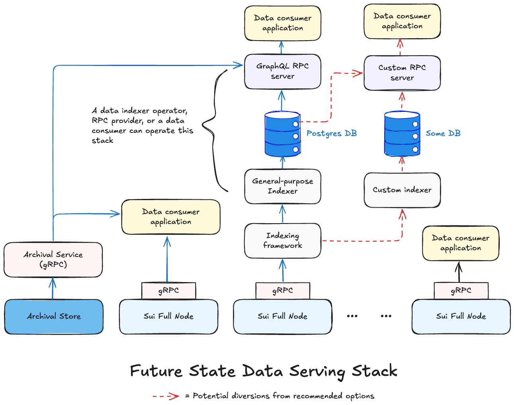

You can access Sui network data like [Transactions](/concepts/transactions.mdx), [Checkpoints](/concepts/cryptography/system/checkpoint-verification.mdx), [Objects](/concepts/object-model.mdx), [Events](/guides/developer/sui-101/using-events.mdx), and more through the available interfaces. You can use this data in your application workflows, to analyze network behavior across applications or protocols of interest, or to perform audits on parts or the whole of the network.

This document outlines the interfaces that are currently available to access the Sui network data, along with an overview of how that's gradually evolving. Refer to the following definitions for release stages mentioned in this document:

- **Alpha** - Experimental release that is subject to change and is not recommended for production use. You can use it for validation in non-production environments.
- **Beta** - Somewhat stable release that is subject to change based on user feedback. Use it in production only after verifying the desired functional, performance, and other relevant characteristics in a non-production environment.
- **Generally available (GA)** - Fully stable release that you can use in production. Notifications for any breaking changes are made in advance. 

## Current data access interfaces

Currently, you can use any of the following mechanisms to access Sui network data:

- Directly connect to [JSON-RPC](/references/sui-api.mdx) hosted on Sui [Full nodes](guides/operator/sui-full-node.mdx) that are operated by [RPC providers](https://sui.io/developers#dev-tools) (filter by `RPC`) or [Data indexer operators](https://github.com/sui-foundation/awesome-sui?tab=readme-ov-file#indexers--data-services).
  - The [Mainnet](https://fullnode.mainnet.sui.io:443), [Testnet](https://fullnode.testnet.sui.io:443), or [Devnet](https://fullnode.devnet.sui.io:443) load balancer URLs abstract the Sui Foundation-managed Full nodes. Those are not recommended for production use.
- Set up your own [custom indexer](/guides/developer/advanced/custom-indexer.mdx) to continuously load the data of interest into a Postgres database.

:::info

You can also use one of the [future-oriented interfaces](#future-state-data-interfaces) that are available in alpha, but those are not recommended for production use.

:::

### JSON-RPC

You can currently get real-time or historical data from a Sui Full node. Retention period for historical data depends on the [pruning strategy](/guides/operator/data-management.mdx#sui-full-node-pruning-policies) that node operators implement, though currently the default configuration for all Full nodes is to implicitly fall back on a [Sui Foundation-managed key-value store for historical transaction data](/guides/operator/data-management.mdx#sui-full-node-key-value-store-backup).

:::caution

WebSocket-based JSON RPCs `suix_subscribeEvent` and `suix_subscribeTransaction` were deprecated in July 2024. Do not rely on those RPCs in your applications. Refer to [Future data access interfaces](#future-state-data-interfaces) to learn about a future alternative.

:::

### Custom indexer

If you need more control over the types, granularity, and retention period of the data that you need in your application, or if you have specific query patterns that could be best served from a relational database, then you can set up your own [custom indexer](/guides/developer/advanced/custom-indexer.mdx) or reach out to a [Data indexer operator](https://github.com/sui-foundation/awesome-sui?tab=readme-ov-file#indexers--data-services) that might already have set one up. 

If you set up your own indexer, you are responsible for its ongoing maintenance and the related infrastructure and operational costs. You can reduce your costs by implementing a pruning strategy for the relational database by taking into account the retention needs of your application.

## Future data access interfaces

Primary interfaces to access Sui access data in the future include:

- Full node gRPC API will replace JSON-RPC on Full nodes, and is currently available in alpha. If you already use the JSON-RPC or are starting to utilize it as a dependency for your use case, you would need to migrate to gRPC or GraphQL (see below) within a reasonable duration. Refer to the [high-level timeline for gRPC availability](#grpc-api).
- Indexer 2.0 will include a performant and scalable implementation of the Sui indexer framework and is currently available in alpha. You can use it to load data at scale from Full nodes into a Postgres relational database.
- [GraphQL RPC](/references/sui-graphql.mdx) will include a lightweight GraphQL RPC Server that you can use to read data from the Indexer 2.0's relational database. It is currently available in alpha. You can use it as an alternative to gRPC, including for migration from JSON-RPC for an existing application. Refer to the [high-level timeline for GraphQL availability](#graphql-rpc-with-indexer-20).

You could still utilize an [RPC provider](https://sui.io/developers#dev-tools) (filter by `RPC`) or a [Data indexer operator](https://github.com/sui-foundation/awesome-sui?tab=readme-ov-file#indexers--data-services) with these options, assuming some or all of those providers choose to operate the Indexer 2.0 and the GraphQL RPC Server.

### gRPC API

As mentioned previously, gRPC API will replace the JSON-RPC on Full nodes, such that JSON-RPC will be deprecated when gRPC API is generally available. Apart from the message and request format changes between the two, the gRPC API comes with a couple of key functional differences:

- It has streaming or subscription API endpoints to consume real-time streaming data in your application without having to poll for those records. This support is a proper replacement of the deprecated WebSocket support in JSON-RPC.
- It doesn't have implicit fallback on the previously mentioned [Sui Foundation-managed key-value store for historical transaction data](/guides/operator/data-management.mdx#sui-full-node-key-value-store-backup). Full node operators, RPC providers, and data indexer operators are encouraged to run their own instance of a similar archival store, which you can explicitly define a dependency on to get the relevant historical data.

See [When to use gRPC vs GraphQL with Indexer 2.0](#when-to-use-grpc-vs-graphql-with-indexer-20) for a comparison with GraphQL RPC.

:::info

The gRPC API is in alpha and not recommended for production use. Its public documentation is coming soon. Until then, you can refer to [this technical proto spec](https://github.com/MystenLabs/sui/blob/main/crates/sui-rpc-api/proto/sui.node.v2.proto).

:::

**High-level timeline**

The target times indicated below are tentative and subject to updates based on project progress and your feedback.

| Tentative time | Milestone | Description |
| -------- | ------- | ------- |
| March 2025 | Beta release of initial set of polling-based APIs. | You can start validating the initial gRPC integration from your application and share feedback on the improvements you want to see. |
| May 2025 | Beta release of streaming APIs and the remaining set of polling-based APIs. | If your use case requires streaming low-latency data, this is an apt time to start validating that integration. Also, the functionality of the API coverage will be complete at this point, so you can start migrating your application in non-production environments. |
| July 2025 | GA release of polling-based APIs with appropriate SDK support. | You can start migration and cutover of your application in the production environment, with the support for streaming APIs still in beta. |
| September 2025 | GA release of scalable streaming APIs. | If your use case requires streaming low-latency data, you can now use those APIs at scale. **JSON-RPC will be deprecated at this point and migration notice period will start.** |
| June 2026 | End of migration timeline. | **JSON-RPC will be fully deactivated at this point.** This timeline assumes about 9 months of migration notice period. |

### Indexer 2.0

As mentioned, Indexer 2.0 will include a performant and scalable implementation of the indexer framework. The underlying framework uses the Full node RPCs to ingest the data, initially using the current generally available JSON-RPC, and later using the gRPC API.

Indexer 2.0 will be declarative such that you can seamlessly configure it to load different kinds of Sui network data into Postgres relational tables in parallel. This change is being implemented to improve the performance of the data ingestion into the Postgres database. In addition, you can configure pruning for different tables in the Postgres database, allowing you to tune it for the desired combination of performance and cost characteristics.

:::info

Indexer 2.0 is currently in alpha and not recommended for production use. A sneak preview of how you could set up Indexer 2.0 today is available [on GitHub](https://github.com/amnn/sui-sender-indexer).

:::

### GraphQL RPC

The [GraphQL RPC Server](/references/sui-graphql.mdx) will provide a performant GraphQL RPC layer while reading data from the Indexer 2.0's Postgres database. GraphQL RPC will be an alternative to gRPC API. If you are already using JSON-RPC in your application today, you would have an option to migrate to GraphQL RPC by either operating the combined stack of Indexer 2.0, Postgres database, and GraphQL RPC server on your own, or by utilizing it as a service from an RPC provider or data indexer operator.

GraphQL RPC Server will be a lightweight server component that will allow you to combine data from multiple Postgres database tables using GraphQL's expressive querying system, which is appealing to frontend developers.

See [When to use gRPC vs GraphQL with Indexer 2.0](#when-to-use-grpc-vs-graphql-with-indexer-20) for a comparison with the gRPC API.

:::info

GraphQL RPC Server is currently in alpha and not recommended for production use. Check out [this getting started document for GraphQL RPCs](guides/developer/getting-started/graphql-rpc.mdx) that refers to the Mysten Labs-managed stack of GraphQL RPC Server along with the underlying Postgres database and Indexer 2.0.

Based on valuable feedback from the community, the GraphQL RPC release stage has been updated to alpha. Refer to the high-level timeline for beta and GA releases in this document.

:::

**High-level timeline**

The target times indicated in this table are tentative and subject to updates based on project progress and your feedback.

| Tentative time | Milestone | Description |
| -------- | ------- | ------- |
| July 2025 | Beta release of GraphQL RPC Server and Indexer 2.0. | You can start validating the setup of Indexer 2.0, along with testing the GraphQL RPC Server to access the indexed Sui data. You can also start migrating your application in the non-production environments, and share feedback on the improvements you want to see. |
| September 2025 | Deprecation of JSON-RPC. | **JSON-RPC will be deprecated at this point and migration notice period will start.** |
| December 2025 | GA release of GraphQL RPC Server and Indexer 2.0. | You can start migration and cutover of your application in the production environment. |
| June 2026 | End of migration timeline. | **JSON-RPC will be fully deactivated at this point.** This timeline assumes about 9 months of migration notice period. |

### When to use gRPC vs GraphQL with Indexer 2.0

You can use the high-level criteria mentioned in the following table to determine whether gRPC API or GraphQL RPC with Indexer 2.0 would better serve your use case. It's not an exhaustive list and it's expected that either of the options could work suitably for some of the use cases.

| Dimension | gRPC API | GraphQL RPC with Indexer 2.0 |
| -------- | ------- | ------- |
| Type of application or data consumer. | Ideal for Web3 exchanges, defi market maker apps, other defi protocols or apps with ultra low-latency needs. | Ideal for webapp builders or builders with slightly relaxed latency needs. |
| Query patterns. | Okay to read data from different endpoints separately and combine on the client-side; faster serialization, parsing, and validation due to binary format. | Allows easier decoupling of the client with the ability to combine data from different tables in a single request; returns consistent data from different tables across similar checkpoints, including for paginated results. |
| Retention period requirements. | Default retention period will be two weeks with actual configuration dependent on the Full node operator and their needs and goals; see history-related note after the table. | Default retention period in Postgres database will be four weeks with actual configuration depending on your or a RPC provider or Data indexer operator's needs; see history-related note after the table. |
| Streaming needs. | Will include a streaming or subscription API before beta release. | Subscription API is planned but will be available after GA. |
| Incremental costs. | Little to no incremental costs if already using Full node JSON-RPC. | Somewhat significant incremental costs if already using Full node JSON-RPC and if retention period and query patterns differences are insignificant. |

:::info

This table only mentions the default retention period for both options. The expectation is that it's reasonable for you, a Full node operator, RPC provider, or data indexer operator to configure that to a few times higher without significantly impacting the performance. Also by default, GraphQL RPC Server can directly connect to a archival key-value store for historical data beyond the retention period configured for the underlying Postgres database. Whereas in comparison, gRPC API will not have such direct connectivity to an archival key-value store.

Relevant guidelines will be provided before each option's respective GA release. Those will include recommendations for how to access historical data beyond the configured retention period for your interface of choice.

:::

Refer to the following articles outlining general differences between gRPC and GraphQL. Please validate the accuracy and authenticity of the differences using your own experiments.

- https://stackoverflow.blog/2022/11/28/when-to-use-grpc-vs-graphql/
- https://blog.postman.com/grpc-vs-graphql/
