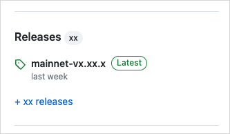

The quickest way to install Sui is using the binaries delivered with every release. If you require more control over the install process, you can install from source. To take advantage of containerization, you can utilize the Docker images in the `docker` folder of the sui repository.

## Supported operating systems {#supported-operating-systems}

Sui supports the following operating systems:

- Linux - Ubuntu version 20.04 (Bionic Beaver) or later
- macOS - macOS Monterey or later
- Microsoft Windows - Windows 10 and 11

::::info[Fastest method]

## Quick install using Homebrew or Chocolatey {#install-homebrew}

{@include: ../../../snippets/quick-install.mdx}

:::note

If you use this method to install Sui, you are all set. The quick install is suitable for most use cases. The remaining installation methods are for those wanting more control over the installation process.

:::
::::

## Download binaries from GitHub {#install-binaries}

Each Sui release provides a set of binaries for several operating systems. You can download these binaries from GitHub and use them to install Sui.

<Tabs groupId="operating-systems">

<TabItem value="linux" label="Linux">
1. Go to https://github.com/MystenLabs/sui.
1. In the right pane, find the **Releases** section.

    
1. Click the release tagged **Latest** to open the release's page.
1. In the **Assets** section of the release, select the .tgz compressed file that corresponds to your operating system.
1. Extract all files from the .tgz file into the preferred location on your system. These instructions assume you extract the files into a `sui` folder at the user root of your system for demonstration purposes. Replace references to this location in subsequent steps if you choose a different directory.
1. Navigate to the expanded folder. You should have the following extracted files:

    {@include: ../../../snippets/lists/binaries-file-list.mdx}

1. Add the folder containing the extracted files to your `PATH` variable. To do so, you can update your `~/.bashrc` to include the location of the Sui binaries. If using the suggested location, you type `export PATH=$PATH:~/sui` and press Enter.
1. Start a new terminal session or type `source ~/.bashrc` to load the new `PATH` value.

</TabItem>

<TabItem value="mac" label="macOS">

1. Go to https://github.com/MystenLabs/sui.
1. In the right pane, find the **Releases** section.

    
1. Click the release tagged **Latest** to open the release's page.
1. In the **Assets** section of the release, select the .tgz compressed file that corresponds to your operating system.
1. Extract all files from the .tgz file into the preferred location on your system. These instructions assume you extract the files into a `sui` folder at the user root of your system. Replace references to this location in subsequent steps if you choose a different directory.
1. Navigate to the expanded folder. You should have the following extracted files: 
    
    {@include: ../../../snippets/lists/binaries-file-list.mdx}

1. Add the folder containing the extracted files to your `PATH` variable. To do so, you can update your `~/.zshrc` or `~/.bashrc` to include the location of the Sui binaries. If using the suggested location, you type `export PATH=$PATH:~/sui` and press Enter.
1. Start a new terminal session or type `source ~/.zshrc` (or `.bashrc`) to load the new `PATH` value.
1. If running the binaries for the first time, you might receive an error from MacOS that prevents the binaries from running. If you receive this error, close the dialog and type `xattr -d com.apple.quarantine ~/sui/*` in your terminal and press Enter (be sure to adjust the path if different). 

</TabItem>

<TabItem value="win" label="Windows">

1. Go to https://github.com/MystenLabs/sui.
1. In the right pane, find the **Releases** section.

    
1. Click the release tagged **Latest** to open the release's page.
1. In the **Assets** section of the release, select the .tgz compressed file that corresponds to your operating system.
1. Extract all files from the .tgz file into the preferred location on your system. These instructions assume you extract the files into a `sui` folder at the root of your C drive. Replace references to this location in subsequent steps if you choose a different directory.

    :::info 

    Windows does not natively support .tgz files, but you can use a free compressed file app like [7Zip](https://7-zip.org/) to extract.

    :::

1. Navigate to the expanded folder. You should have the following extracted files:

    {@include: ../../../snippets/lists/binaries-file-list.mdx}

1. Add the folder containing the extracted files to your `PATH` variable. There are several ways to get to the setting depending on your version of Windows. One way that works on all versions of Windows is to type `sysdm.cpl` in a console to open the System Properties window. Under the **Advanced** tab, click the **Environment Variables...** button.
1. In the Environment Variables window, select the `Path` variable and click the **Edit...** button. 
1. In the Edit environment variable window, click **New** and add the path to your expanded folder. Using the example path, this would be `C:\sui`.
1. Click **OK**.

</TabItem>

</Tabs>

:::info 

Running binaries other than `sui` might require installing prerequisites itemized in the following section. 

:::

#### Confirm the installation {#confirm-the-installation}

To confirm that Sui installed correctly, type `sui --version` in your console or terminal and press Enter. The response should provide the Sui version installed. If the console or terminal responds with a command not found error, make sure the full path to your Sui binaries is included in your `PATH` variable.

## Install from Cargo {#install-sui-binaries-from-source}

Run the following command to install Sui binaries from the `testnet` branch:

```sh
$ cargo install --locked --git https://github.com/MystenLabs/sui.git --branch testnet sui --features tracing
```

Enabling the `tracing` feature is important as it adds Move test coverage and debugger support in the Sui CLI. Without it these two features will not be able to be used.

The install process can take a while to complete. You can monitor installation progress in the terminal. If you encounter an error, make sure to install the latest version of all prerequisites and then try the command again.

To update to the latest stable version of Rust:

```sh
$ rustup update stable
```

The command installs Sui components in the `~/.cargo/bin` folder.

## Upgrade from Cargo

If you previously installed the Sui binaries, you can update them to the most recent release with the same command you used to install them (changing `testnet` to the desired branch):

```sh
$ cargo install --locked --git https://github.com/MystenLabs/sui.git --branch testnet sui --features tracing
```

The `tracing` feature is important as it adds Move test coverage and debugger support in the Sui CLI. Unless it is enabled you will not be able to use these two features.

## Build from source

Follow the instructions in this topic to install the Rust crates (packages) required to interact with Sui networks, including the Sui CLI.

To install Sui from source, you first need to install its [prerequisites](#prerequisites) for your operating system. After installing the supporting technologies, you can install [Sui binaries from source](#install-sui-binaries-from-source).

You can also download the [source code](/references/contribute/sui-environment.mdx) to have local access to files.

#### Prerequisites {#prerequisites}

Your system needs the following prerequisites available to successfully install Sui.

#### Rust and Cargo {#rust-and-cargo}

Sui requires Rust and Cargo (Rust's package manager) on all supported operating systems. The suggested method to install Rust is with `rustup` using cURL.

Some other commands in the installation instructions also require cURL to run. If you can't run the cURL command to install Rust, see the instructions to install cURL for your operating system in the following section before you install Rust.

Use the following command to install Rust and Cargo on macOS or Linux:

```sh
$ curl --proto '=https' --tlsv1.2 -sSf https://sh.rustup.rs | sh
```

If you use Windows 11, see information about using the [Rust installer](https://www.rust-lang.org/tools/install) on the Rust website. The installer checks for C++ build tools and prompts you to install them if necessary. Select the option that best defines your environment and follow the instructions in the install wizard.

For additional installation options, see [Install Rust](https://www.rust-lang.org/tools/install).

Sui uses the latest version of Cargo to build and manage dependencies. See the [Cargo installation](https://doc.rust-lang.org/cargo/getting-started/installation.html) page on the Rust website for more information.

Use the following command to update Rust with `rustup`:

```sh
$ rustup update stable
```
#### Additional prerequisites by operating system

Select the appropriate tab to view the requirements for your system.

<Tabs groupId="operating-systems">

<TabItem value="linux" label="Linux">

The prerequisites needed for the Linux operating system include:

- cURL
- Rust and Cargo
- Git CLI
- CMake
- GCC
- libssl-dev
- libclang-dev
- libpq-dev (optional)
- build-essential

:::info

The Linux instructions assume a distribution that uses the APT package manager. You might need to adjust the instructions to use other package managers.

:::

Install the prerequisites listed in this section. Use the following command to update `apt-get`:

```sh
$ sudo apt-get update
```

#### All Linux prerequisites
 
Reference the relevant sections that follow to install each prerequisite individually, or run the following to install them all at once:

{@include: ../../../snippets/linux-deps.mdx}

#### cURL {#curl}

Install cURL with the following command:

```sh
$ sudo apt-get install curl
```

Verify that cURL installed correctly with the following command:

```sh
$ curl --version
```

#### Git CLI {#git-cli}

Run the following command to install Git, including the [Git CLI](https://cli.github.com/):

```sh
$ sudo apt-get install git-all
```

For more information, see [Install Git on Linux](https://github.com/git-guides/install-git#install-git-on-linux) on the GitHub website.

#### CMake {#cmake}

Use the following command to install CMake.

```sh
$ sudo apt-get install cmake
```

To customize the installation, see [Installing CMake](https://cmake.org/install/) on the CMake website.

#### GCC {#gcc}

Use the following command to install the GNU Compiler Collection, `gcc`:

```sh
$ sudo apt-get install gcc
```

#### libssl-dev {#libssl-dev}

Use the following command to install `libssl-dev`:

```sh
$ sudo apt-get install libssl-dev
```

If the version of Linux you use doesn't support `libssl-dev`, find an equivalent package for it on the [ROS Index](https://index.ros.org/d/libssl-dev/).

(Optional) If you have OpenSSL you might also need to also install `pkg-config`:

```sh
$ sudo apt-get install pkg-config
```

#### libclang-dev {#libclang-dev}

Use the following command to install `libclang-dev`:

```sh
$ sudo apt-get install libclang-dev
```

If the version of Linux you use doesn't support `libclang-dev`, find an equivalent package for it on the [ROS Index](https://index.ros.org/d/libclang-dev/).

#### libpq-dev (optional) {#libpq-dev}

{@include: ../../../snippets/libpq-req.mdx}

Use the following command to install `libpq-dev`:

```sh
$ sudo apt-get install libpq-dev
```

If the version of Linux you use doesn't support `libpq-dev`, find an equivalent package for it on the [ROS Index](https://index.ros.org/d/libpq-dev/).

#### build-essential {#build-essential}

Use the following command to install `build-essential`:

```sh
$ sudo apt-get install build-essential
```

</TabItem>

<TabItem value="mac" label="macOS">

The prerequisites needed for the macOS operating system include:

- Rust and Cargo
- Homebrew
- cURL
- CMake
- libpq (optional)
- Git CLI

macOS includes a version of cURL you can use to install Homebrew. Use Homebrew to install other tools, including a newer version of cURL.

#### Homebrew {#brew}

Use the following command to install [Homebrew](https://brew.sh/):

```sh
$ /bin/bash -c "$(curl -fsSL https://raw.githubusercontent.com/Homebrew/install/HEAD/install.sh)"
```

:::info

If you used the commands in the [Install using Homebrew](#install-homebrew) section, you do not need to install anything else.

:::

#### All macOS prerequisites

With Homebrew installed, you can install individual prerequisites from the following sections or install them all at once with this command:

{@include: ../../../snippets/macos-deps.mdx}


#### cURL {#curl-1}

Use the following command to update the default [cURL](https://curl.se) on macOS:

```sh
$ brew install curl
```

#### CMake {#cmake-1}

Use the following command to install CMake:

```sh
$ brew install cmake
```

To customize the installation, see [Installing CMake](https://cmake.org/install/) on the CMake website.

#### libpq (optional) {#libpq-1}

{@include: ../../../snippets/libpq-req.mdx}

Use the following command to install libpq:
```sh
$ brew install libpq
```

#### Git CLI {#git-cli-1}

Use the following command to install Git:

```sh
$ brew install git
```

After installing Git, download and install the [Git command line interface](https://git-scm.com/download/).

</TabItem>

<TabItem value="win" label="Windows">

The prerequisites needed for the Windows 11 operating system include:

- cURL
- Rust and Cargo
- Git CLI
- CMake
- C++ build tools
- LLVM compiler

#### cURL {#curl-2}

Windows 11 ships with a Microsoft version of [cURL](https://curl.se/windows/microsoft.html) already installed. If you want to use the curl project version instead, download and install it from [https://curl.se/windows/](https://curl.se/windows/).

#### Git CLI {#git-cli-2}

Download and install the [Git command line interface](https://git-scm.com/download/).

#### CMake {#cmake-2}

Download and install [CMake](https://cmake.org/download/) from the CMake website.

#### Protocol Buffers {#protocol-buffers}

Download [Protocol Buffers](https://github.com/protocolbuffers/protobuf/releases) (protoc-xx.x-win32.zip or protoc-xx.x-win64.zip) and add the \bin directory to your Windows PATH environment variable.

#### Additional tools for Windows {#additional-tools-windows}

Sui requires the following additional tools on computers running Windows.

- For Windows on ARM64 only - [Visual Studio 2022 Preview](https://visualstudio.microsoft.com/vs/preview/).
- [C++ build tools](https://visualstudio.microsoft.com/downloads/) is required to [install Rust](#rust-and-cargo).
- The [LLVM Compiler Infrastructure](https://releases.llvm.org/). Look for a file with a name similar to LLVM-15.0.7-win64.exe for 64-bit Windows, or LLVM-15.0.7-win32.exe for 32-bit Windows.

**Known issue** - The `sui console` command does not work in PowerShell.

</TabItem>

</Tabs>

## Using Sui from command line

With Sui installed, you can interact with Sui networks using the Sui CLI. For more details, see the [Sui CLI](/references/cli.mdx) reference.

## Installing Sui developer tools

If you use VSCode, you can install the [Move extension](https://marketplace.visualstudio.com/items?itemName=mysten.move) to get language server support for Move, as well as support for building, testing, and debugging Move code within the IDE. 
You can install the extension either by searching the fully-qualified extension name, `Mysten.move`, in the extension view, or by pressing `Ctrl-P` or `Cmd-P` and typing `ext install mysten.move`.
Installing the Move extension also installs the appropriate `move-analyzer` binary for your operating system, as well as the [Move Trace Debugger](https://marketplace.visualstudio.com/items?itemName=mysten.move-trace-debug) extension, and [Move Syntax](https://marketplace.visualstudio.com/items?itemName=damirka.move-syntax) extension.

There are also community Move packages for [Emacs](https://github.com/amnn/move-mode) and [Vim](https://github.com/yanganto/move.vim). 

## Next steps {#next-steps}

Now that you have Sui installed, it's time to start developing. Check out the following topics to start working with Sui:

- Read about the [Sui CLI](/references/cli.mdx), the most straightforward way to start exploring Sui networks.
- [Learn about the available networks](./connect.mdx) and connect to one.
- [Get some coins](./get-coins.mdx) on a development network.
- [Build your first dApp](../first-app.mdx) to start your on-chain journey.
