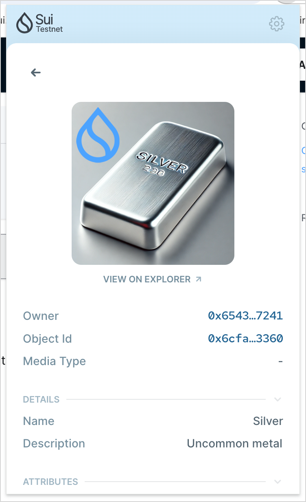

On Sui, everything is an object. Moreover, everything is a non-fungible token (NFT) as its objects are unique, non-fungible, and owned.

Creating NFTs on Sui differs from other blockchains that are not object based. Those blockchains require a dedicated standard to handle the properties that define NFTs because they are based on a mapping between smart contracts and the token's ID. For instance, the ERC-721 standard on Ethereum was necessary to pair a globally unique ID with the relevant smart contract address to create a unique token instance on the network. 

On Sui, every object already has a unique ID, so whether you're dealing with a million fungible tokens, like coins, or thousands of NFTs with individual characteristics, like SuiFrens, your smart contracts on Sui always interact with individual objects. 

Imagine you create an Excitable Chimp NFT collection on Sui and another blockchain that isn't object based. To get an attribute like the Chimp's name on the other blockchain, you would need to interact with the smart contract that created the NFT to get that information (typically from off-chain storage) using the NFT ID. On Sui, the name attribute can be a field on the object that defines the NFT itself. This construct provides a much more straightforward process for accessing metadata for the NFT as the smart contract that wants the information can just return the name from the object itself.

## Creating NFTs

The following example creates a basic NFT on Sui. The `TestnetNFT` struct defines the NFT with an `id`, `name`, `description`, and `url` fields. 

{@inject: examples/move/nft/sources/testnet_nft.move#struct=TestnetNFT noComments}

In this example, anyone can mint the NFT by calling the `mint_to_sender` function. As the name suggests, the function creates a new `TestnetNFT` and transfers it to the address that makes the call. 

{@inject: examples/move/nft/sources/testnet_nft.move#fun=mint_to_sender noComments}

The module includes functions to return NFT metadata, too. Referencing the hypothetical used previously, you can call the `name` function to get that value. As you can see, the function simply returns the name field value of the NFT itself.

{@inject: examples/move/nft/sources/testnet_nft.move#fun=name noComments}

<details>
<summary>
`testnet_nft.move` 
</summary>
{@inject: examples/move/nft/sources/testnet_nft.move}
</details>

## Creating NFTs with the Sui Object Display standard

If you use the [Sui Wallet](https://chromewebstore.google.com/detail/sui-wallet/opcgpfmipidbgpenhmajoajpbobppdil?pli=1) Chrome extension, checking your **Assets** tab won't show the visual representation of the NFT you created in the previous section. Instead, you can find its metadata in the **Everything Else** view.


To see the NFT in the **Visual Assets** view, you have to create a display for the object. The following code modifies the [Random NFT example](https://github.com/MystenLabs/sui/tree/main/examples/move/random/random_nft) to demonstrate the use of Object Display.

To create the `Display` object, you need to import the package.

```move
use sui::display;
```

This example creates several structs to support the smart contract. The `AirDropNFT` struct creates an NFT that the `reveal` function burns in exchange for a metal NFT of either bronze, silver, or gold. The example uses [on-chain randomness](./advanced/randomness-onchain.mdx) to determine which type of metal the user receives when turning in their `AirDropNFT`. For simplicity, this example creates a single airdrop NFT and transfers it to the publisher. The [Random NFT example](https://github.com/MystenLabs/sui/tree/main/examples/move/random/random_nft) this code is based on shows how to create multiple airdrop NFTs, as well as some additional randomization options. 

The `MetalNFT` struct sets up some basic `Display` properties. 

The `MintingCapability` struct is needed to authorize minting the metal NFT by the capability owner.

Finally, `RANDOM_NFT` is a one-time witness needed to create the `Publisher` object. 

{@inject: examples/move/nft-display/sources/metal.move#struct=AirDropNFT,MetalNFT,MintingCapability,RANDOM_NFT}

This example creates the `Display` object in the package initializer for ease of use, but you typically create the object using a programmable transaction block. The `init` function uses variables to define the `values` vector so you can define them when minting the `MetalNFT`.

{@inject: examples/move/nft-display/sources/metal.move#fun=init}

You can publish the project in the Sui repo to see the results of the code, but you must update the category file to use the GitHub `Sui` dependency. Your toml file should look like the following.

{@inject: examples/move/nft-display/Move.toml}

### Mint metal NFT

Typically, a production dApp includes a frontend to interact with users. To limit scope, this example uses the Sui CLI to interact with the smart contract. In the root of the project, build and publish the package.

```sh
$ sui client publish . --gas-budget 200000000
```

The terminal or console responds with the results of the publish. Locate the following entries and assign them to variables.

In the **Published Objects** results, copy the `PackageID` value and set it to `PID`.

```sh
$ PID=<Package-ID>
```

Next, in **Created Objects**, copy the `AirDropNFT` `ObjectID` value. Create a variable `AIR` and give it the copied value.

```sh
$ AIR=<Object-ID>
```

Finally, call the `reveal` function with the set values. The [`0x8` address](https://suiscan.xyz/testnet/object/0x0000000000000000000000000000000000000000000000000000000000000008) is the Randomness object.

```sh
$ sui client call --function reveal --module random_nft --package $PID --args $AIR 0x8 --gas-budget 20000000
```

<details>
<summary>
`reveal` function
</summary>
{@inject: examples/move/nft-display/sources/metal.move#fun=reveal}
</details>

After you call `reveal`, you can check your Sui Wallet to see which NFT you received. The NFT appears in the **Assets** tab within the **Visual Assets** view.



## Related links

- [NFT Rental](./nft/nft-rental.mdx): Example that rents NFTs using Kiosk Apps. 
- [Asset Tokenization](./nft/asset-tokenization.mdx): Example that uses NFTs to tokenize real-world assets.
- [Kiosk](../../standards/kiosk.mdx): Asset storage on the Sui network.
- [Kiosk Apps](../../standards/kiosk-apps.mdx): Extend the functionality of the Kiosk standard.
- [Sui Object Display](../../standards/display.mdx): A template engine that enables on-chain management of off-chain representation (display) for a type.
- [Random NFT example](https://github.com/MystenLabs/sui/tree/main/examples/move/random/random_nft): Example Move code to create AirDrop NFTs that are burned in exchange for a different, randomized NFT.