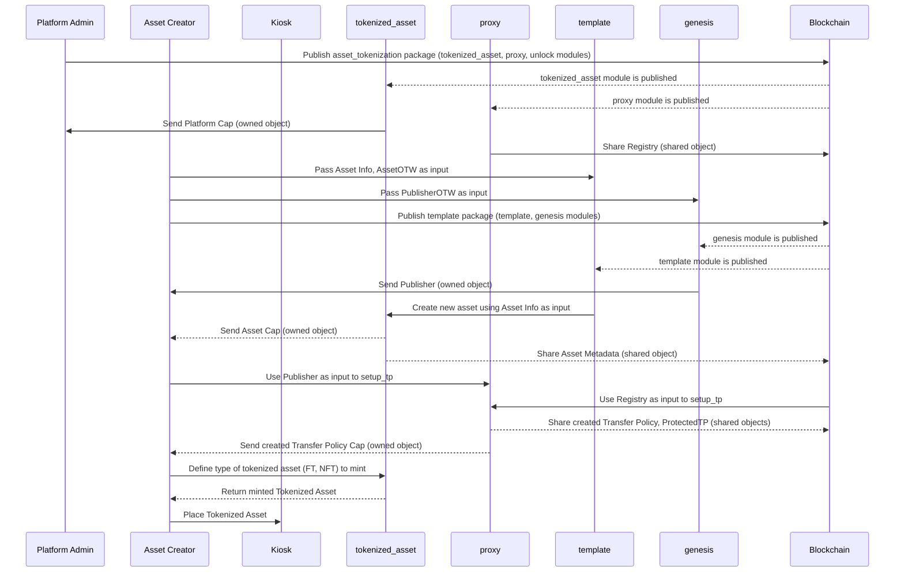
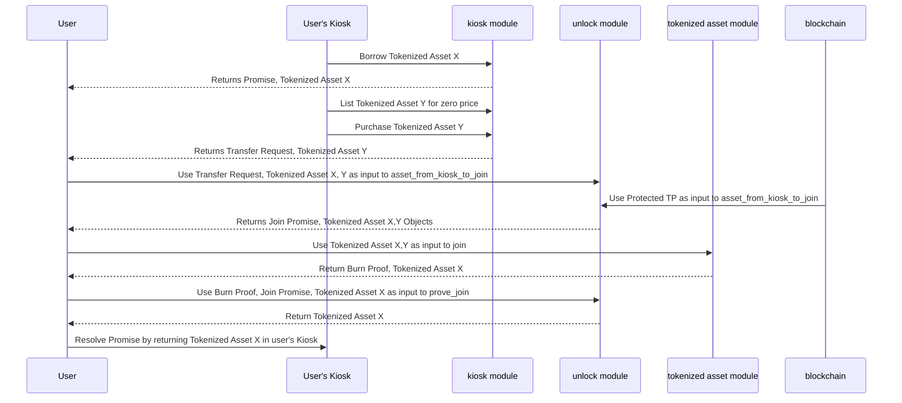
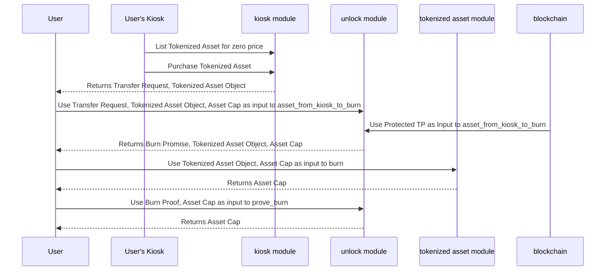

Asset tokenization refers to the process of representing real-world assets, such as real estate, art, commodities, stocks, or other valuable assets, as digital tokens on the blockchain network. This involves converting the ownership or rights of an asset into digital tokens, which are then recorded and managed on the blockchain.

## High-level overview

The concept is to divide high-value assets into smaller, more affordable units, representing ownership or a fraction of the asset.

This strategy enables wider participation from investors who might want to mitigate risk by investing in a portion of a digital asset rather than being the sole owner, thereby expanding accessibility to a broader range of investors.

This pattern is similar to the [ERC1155](https://eips.ethereum.org/EIPS/eip-1155) multi-token standard with additional functionality. This makes it a suitable choice for Solidity based use cases that one might want to implement on Sui.

- **Asset creation**

  Each asset is fractionalized into a total supply, with each fraction represented as either a non-fungible token (NFT) or fungible token (FT) type collectible. This ensures that each individual fraction maintains a balance equal to or greater than one, and when combined, all fractions collectively reach the total supply of the asset.

  Besides the total supply, each asset is defined by various other fields such as name, description, and more. These fields collectively form the metadata for the asset, and they remain consistent across all fractions of the asset.

- **NFTs vs FTs distinction**

  Each time a tokenized asset is minted, there's a possibility for it to be created with new metadata. If new metadata is incorporated, the tokenized asset is deemed unique, transforming it into an NFT. In this case, its balance is limited to one, signifying that only a single instance of this asset exists.

  If there's no additional metadata, the tokenized asset is categorized as an FT, allowing its balance to exceed one, enabling multiple identical instances of the asset to exist.

  FTs possess the capability to merge (join) among themselves or be split when the balance is greater than one. This functionality allows for the aggregation or division of units of the token, offering flexibility in handling varying quantities as needed.

  As previously mentioned, all the collectibles of tokenized assets, whether NFTs or FTs, when combined, can amount to the maximum total supply of the asset.

- **Burnability**

  When you create the asset, you can define whether the fractions of the asset are eligible for removal or destruction from circulation. The process of removing or destroying assets is called burning.

  If a tokenized asset is burnable, then burning a fraction causes the circulating supply to decrease by the balance of the burnt item. The total supply, however, remains constant, allowing you to mint the burned fractions again if needed, thus maintaining the predetermined total supply of the asset.

## Move packages

As with all smart contracts on Sui, Move provides the logic that powers asset tokenization.

### asset_tokenization package

:::info

This reference implementation uses the [Kiosk standard](../../../standards/kiosk.mdx) to ensure that tokenized assets operate within their defined policy. Use the implementation as presented to have marketable tokenized assets that support rules like royalties, commissions, and so on.

If using Kiosk is not a requirement, then you can exclude the unlock module and some of the proxy's methods related to transfer policies.

:::

Select a module to view its details:

<Tabs groupId="modules">

<TabItem label="tokenized_asset" value="tokenized_asset">

The `tokenized_asset` module operates in a manner similar to the `coin` library.

When it receives a new one-time witness type, it creates a unique representation of a fractional asset. This module employs similar implementations to some methods found in the `Coin` module. It encompasses functionalities pertinent to asset tokenization, including new asset creation, minting, splitting, joining, and burning. See [One Time Witness](https://move-book.com/programmability/one-time-witness.html) in The Move Book for more information.

**Structs**

- `AssetCap`

  Generate an `AssetCap` for each new asset represented as a fractional NFT. In most scenarios, you should create it as an owned object, which you can then transfer to the platform's administrator for access-restricted method invocation.

  ```rust
  struct AssetCap<phantom T> {
      id: UID,
      // the current supply in circulation
      supply: Supply<T>,
      // the total max supply allowed to exist at any time
      total_supply: u64,
      // Determines if the asset can be burned or not
      burnable: bool
  }
  ```

- `AssetMetadata`

  The `AssetMetadata` struct defines the metadata representing the entire asset to fractionalize. This should be a shared object.

  ```rust
  struct AssetMetadata<phantom T> has key, store {
          id: UID,
          /// Name of the asset
          name: String,
          // the total max supply allowed to exist at any time
          total_supply: u64,
          /// Symbol for the asset
          symbol: ascii::String,
          /// Description of the asset
          description: String,
          /// URL for the asset logo
          icon_url: Option<Url>
      }
  ```

- `TokenizedAsset`

  The `TokenizedAsset` is minted with a specified balance that is less than or equal to the remaining supply. If the `VecMap` of an asset is populated with values, indicating multiple unique entries, it is considered an NFT. Conversely, if the `VecMap` of an asset is not populated, indicating an absence of individual entries, it is considered an FT.

  ```rust
  struct TokenizedAsset<phantom T> has key, store {
          id: UID,
          /// The balance of the tokenized asset
          balance: Balance<T>,
          /// If the VecMap is populated, it is considered an NFT, else the asset is considered an FT.
          metadata: VecMap<String, String>,
          /// URL for the asset image (optional)
          image_url: Option<Url>,
      }
  ```

- `PlatformCap`

  The `PlatformCap` refers to the capability issued to the individual who deploys the contract. This capability grants specific permissions or authority related to the platform's functionalities, allowing the deployer certain controlled actions or access rights within the deployed contract.

  ```rust
  /// Capability that is issued to the one deploying the contract
  struct PlatformCap has key, store { id: UID }
  ```

**Functions**

- `init`

  This function creates a `PlatformCap` and sends it to the sender.

  ```rust
  fun init(ctx: &mut TxContext) {}
  ```

- `new_asset`

  This function holds the responsibility of creating a fresh representation of an asset, defining its crucial attributes. Upon execution, it returns two distinct objects: the `AssetCap` and `AssetMetadata`. These objects encapsulate the necessary information and characteristics defining the asset within the system.

  ```rust
  public fun new_asset<T: drop>(
          witness: T,
          total_supply: u64,
          symbol: ascii::String,
          name: String,
          description: String,
          icon_url: Option<Url>,
          burnable: bool,
          ctx: &mut TxContext
      ): (AssetCap<T>, AssetMetadata<T>) {}
  ```

- `mint`

  The function performs the minting of a tokenized asset. If new metadata is introduced during this process, the resulting tokenized asset is considered unique, resulting in the creation of an NFT with a balance set to 1. Alternatively, if no new metadata is added, the tokenized asset is classified as an FT, permitting its balance to surpass 1, as specified by a provided argument. Upon execution, the function returns the tokenized asset object.

  ```rust
  public fun mint<T>(
          cap: &mut AssetCap<T>,
          keys: vector<String>,
          values: vector<String>,
          value: u64,
          ctx: &mut TxContext
      ): TokenizedAsset<T> {}
  ```

- `split`

  This function is provided with a tokenized asset of the FT type and a balance greater than 1, along with a value less than the object's balance, and performs a split operation on the tokenized asset. The operation divides the existing tokenized asset into two separate tokenized assets. The newly created tokenized asset has a balance equal to the given value, while the balance of the provided object is reduced by the specified value. Upon completion, the function returns the newly created tokenized asset. This function does not accept or operate on tokenized assets of the NFT type.

  ```rust
  public fun split<T>(
          self: &mut TokenizedAsset<T>,
          split_amount: u64,
          ctx: &mut TxContext
      ): TokenizedAsset<T> {}
  ```

- `join`

  This function is given two tokenized assets of the FT type and executes a merge operation on the tokenized assets. The operation involves increasing the balance of the first tokenized asset by the balance of the second one. Subsequently, the second tokenized asset is burned or removed from circulation. After the process concludes, the function returns the ID of the burned tokenized asset.

  This function does not accept or operate on tokenized assets of the NFT type.

  ```rust
  public fun join<T>(
          self: &mut TokenizedAsset<T>,
          other: TokenizedAsset<T>
      ): ID {}
  ```

- `burn`

  This function requires the `assetCap` as a parameter, thereby restricting its invocation solely to the platform admin. Additionally, it accepts a tokenized asset that is burned as part of its operation. Upon burning the provided tokenized asset, the circulating supply decreases by the balance of the burnt item. It necessitates a tokenized asset that is burnable.

  ```rust
  public fun burn<T>(
          cap: &mut AssetCap<T>,
          tokenized_asset: TokenizedAsset<T>
      )
  ```

- `total_supply`

  This function retrieves and returns the value representing the total supply of the asset.

  ```rust
  public fun total_supply<T>(cap: &AssetCap<T>): u64 {}
  ```

- `supply`

  This function retrieves and returns the value representing the current circulating supply of the asset.

  ```rust
  public fun supply<T>(cap: &AssetCap<T>): u64 {}
  ```

- `value`

  This function takes a tokenized asset as input and retrieves its associated balance value.

  ```rust
  public fun value<T>(tokenized_asset: &TokenizedAsset<T>): u64 {}
  ```

- `create_vec_map_from_arrays`

  This internal helper function populates a `VecMap<String, String>`. It assists in the process of filling or setting key-value pairs within the `VecMap` data structure.

  ```rust
  fun create_vec_map_from_arrays(
          keys: vector<String>,
          values: vector<String>
      ): VecMap<String, String> {}
  ```

</TabItem>

<TabItem label="proxy" value="proxy">

The `proxy` module comprises methods that the type owner utilizes to execute publisher-related operations.

**Structs**

- `Proxy`

  The `PROXY` struct represents the one-time witness (OTW) to claim the publisher.

  ```rust
  struct PROXY has drop {}
  ```

- `Registry`

  This shared object serves as a repository for the `Publisher` object, specifically intended to control and restrict access to the creation and management of transfer policies for tokenized assets. Mutable access to this object is exclusively granted to the actual publisher.

  ```rust
  struct Registry has key {
          id: UID,
          publisher: Publisher
      }
  ```

- `ProtectedTP`

  This is a shared object that stores an empty transfer policy. It is required to create one per type `<T>` generated by a user. Its involvement is apparent in the unlock module.

  ```rust
  struct ProtectedTP<phantom T> has key, store {
          id: UID,
          policy_cap: TransferPolicyCap<T>,
          transfer_policy: TransferPolicy<T>
      }
  ```

**Functions**

- `init`

  This function is responsible for creating the `Publisher` object, encapsulating it within the registry, and subsequently sharing the `Registry` object.

  ```rust
  fun init(otw: PROXY, ctx: &mut TxContext) {}
  ```

- `setup_tp`

  This function leverages the publisher nested within the registry and the sender's publisher. It generates and returns a transfer policy and the associated transfer policy cap specific to the `TokenizedAsset<T>`. This type 'T' is derived from the `Publisher` object.

  It also generates an empty transfer policy wrapped in a `ProtectedTP<T>` object, which is shared. You can use this functionality under specific conditions to override the kiosk lock rule.

  ```rust
  public fun setup_tp<T: drop>(
          registry: &Registry,
          publisher: &Publisher,
          ctx: &mut TxContext
      ): (TransferPolicy<TokenizedAsset<T>>,
          TransferPolicyCap<TokenizedAsset<T>>) {}
  ```

- `new_display`

  This function utilizes the publisher nested within the registry and the sender's publisher to generate and return an empty `Display` for the type `TokenizedAsset<T>`, where `T` is encapsulated within the `Publisher` object.

  ```rust
  public fun new_display<T: drop>(
          registry: &Registry,
          publisher: &Publisher,
          ctx: &mut TxContext
      ): Display<TokenizedAsset<T>> {}
  ```

- `transfer_policy`

  This function, provided with the `protectedTP`, returns the transfer policy specifically designed for the type `TokenizedAsset<T>`

  ```rust
  public(friend) fun transfer_policy<T>(
          protected_tp: &ProtectedTP<T>
      ): &TransferPolicy<T> {}

  ```

- `publisher_mut`

  This function can only be accessed by the owner of the platform cap. It requires the registry as an argument to obtain a mutable reference to the publisher.

  ```rust
  public fun publisher_mut(
      _: &PlatformCap,
      registry: &mut Registry
  ): &mut Publisher {}
  ```

</TabItem>

<TabItem label="unlock" value="unlock">

The `unlock` module facilitates the unlocking of a tokenized asset specifically for authorized burning and joining.

It allows tokenized asset type creators to enable these operations for kiosk assets without necessitating adherence to the default set of requirements, such as rules or policies.

**Structs**

- `JoinPromise`

  A promise object is established to prevent attempts of permanently unlocking an object beyond the intended scope of joining.

  ```rust
  struct JoinPromise {
      /// the item where the balance of the burnt tokenized asset will be added.
      item: ID,
      /// burned is the id of the tokenized asset that will be burned
      burned: ID,
      /// the expected final balance of the item after merging
      expected_balance: u64
  }
  ```

- `BurnPromise`

  A promise object created to ensure the permanent burning of a specified object.

  ```rust
  struct BurnPromise {
    expected_supply: u64
  }
  ```

**Functions**

- `asset_from_kiosk_to_join`

  This helper function is intended to facilitate the joining of tokenized assets locked in kiosk. It aids in unlocking the tokenized asset that is set for burning and ensures that another tokenized asset of the same type will eventually contain its balance by returning a `JoinPromise.`

  ```rust
  public fun asset_from_kiosk_to_join<T>(
    self: &TokenizedAsset<T>, // A
    to_burn: &TokenizedAsset<T>, // B
    protected_tp: &ProtectedTP<TokenizedAsset<T>>, // unlocker
    transfer_request: TransferRequest<TokenizedAsset<T>> // transfer request for b
  ): JoinPromise {}
  ```

- `prove_join`

  A function utilized to demonstrate that the unlocked tokenized asset is successfully burned and its balance is incorporated into an existing tokenized asset.

  ```rust
  public fun prove_join<T>(
    self: &TokenizedAsset<T>,
    promise: JoinPromise,
    proof: ID) {
  }
  ```

- `asset_from_kiosk_to_burn`

  Helper function that facilitates the burning of tokenized assets locked in a kiosk. It assists in their unlocking while ensuring a promise that the circulating supply will be reduced, achieved by returning a `BurnPromise`.

  ```rust
  public fun asset_from_kiosk_to_burn<T>(
      to_burn: &TokenizedAsset<T>,
      asset_cap: &AssetCap<T>,
      protected_tp: &ProtectedTP<TokenizedAsset<T>>,
      transfer_request: TransferRequest<TokenizedAsset<T>>,
    ): BurnPromise {
  }
  ```

- `prove_burn`

  Ensures that the circulating supply of the asset cap is reduced by the balance of the burned tokenized asset.

  ```rust
  public fun prove_burn<T>(
    asset_cap: &AssetCap<T>,
    promise: BurnPromise) {
  }
  ```

</TabItem>

</Tabs>

### template package

An example use case package that enables utilization of Rust WASM functionality to support seamless asset creation on the browser.

This is similar to the launchpad approach and serves as the template package whenever a new asset requires representation as a tokenized asset.

Effectively allowing users to edit fields of this template contract on the fly and publish it with the edits included.
This package implements two essential modules, each catering to distinct functionalities required for asset tokenization.
More details regarding how Rust WASM was implemented can be found in the [Web Assembly](#webassembly-wasm-and-template-package) section.

- **Modules**

  - `template`

    This is the module that supports defining a new asset.

    When you need to represent a new asset as a fractional asset, modify this module to `<template>::<TEMPLATE>`, with the `<template>` (in capitals) being the OTW of this new asset.

    This module calls the `asset_tokenization::tokenized_asset::new_asset(...)` method, which facilitates the declaration of new fields for the asset:

    - `witness`: The OTW `NEW_ASSET`
    - `total_supply`: The total supply allowed to exist at any time
    - `symbol`: The symbol for the asset
    - `name`: The name of the asset
    - `description`: The description of the asset
    - `icon_url`: The URL for the asset logo (optional)
    - `burnable`: Boolean that defines if the asset can be burned by an admin

  - `genesis`

    A genesis type of module that includes a OTW so that the sender can claim the publisher.

### Publish and mint tokenized sequence diagram



### Join sequence diagram

The following sequence diagram presenting how the join flow would take place. The following flow assumes that:

- Tokenized assets X and Y have already been minted by the creator of their type.
- Tokenized assets X and Y are already placed and locked inside the user's kiosk.
- Everything is executed in the same programmable transaction block (PTB).



### Burn sequence diagram

The following sequence diagram shows the burn flow and assumes that:

- Tokenized asset has already been minted by the creator of its type.
- Tokenized asset is already placed and locked inside the user's Kiosk.
- Everything is executed in the same PTB.



## Variations

The packages and modules provided demonstrate how you could implement asset tokenization for your project. Your particular use case probably necessitates altering the contract for convenience or to introduce new features.

### Example convenience alteration

Instead of implementing the unlock functionality in multiple steps inside of a PTB, it would also be possible to create a method that performs the purchase, borrowing, unlocking and joining of an asset all on one function. This is how that would look like for the joining operation:

```rust
public fun kiosk_join<T>(
	kiosk: &mut Kiosk,
  kiosk_cap: &KioskOwnerCap,
	protected_tp: &ProtectedTP<TokenizedAsset<T>>,
  ta1_id: ID,
  ta2_id: ID,
  ctx: &mut TxContext
) {

	kiosk::list<TokenizedAsset<T>>(kiosk, kiosk_cap, ta2_id, 0);
	let (ta1, promise_ta1) = kiosk::borrow_val(kiosk, kiosk_cap, ta1_id);
	let coin = coin::zero<SUI>(ctx);
	let (ta2, request) = kiosk::purchase(kiosk, ta2_id, coin);

	let tp_ref = proxy::transfer_policy(protected_tp);
	let (_item, _paid, _from) = transfer_policy::confirm_request(
	    tp_ref,
	    request
	);

	tokenized_asset::join(&mut ta1, ta2);

	kiosk::return_val(kiosk, ta1, promise_ta1);
}
```

### Example alteration for use case

:::caution

The following example splits (effectively replacing) the `AssetCap<T>` into two new objects: the `Treasury<T>` and the `AdminCap<T>`. The access to methods defined in the original package, should now be carefully re-designed as this change can introduce unwanted effects. This required re-design is not entirely contained in this example and only some methods are changed for demonstration purposes (or as a thorough exercise).

:::

Assume you want to allow the users to also burn assets, not only admins. This still needs to be an authorized operation but it would allow the flexibility of consuming tokenized assets for a use case specific purpose (for example, burning all of the collectibles you've gathered to combine them). To achieve this, the admin can mint tickets that contain the ID of the asset they are allowed to burn. To support this functionality you must redesign the smart contract and separate the admin from the asset's treasury of each asset, which now holds only supply related information. Sample changes that need to happen follow:

**Structs**

Create a ticket that has only the `key` ability so that the receiver cannot trade it.

```rust
struct BurnTicket<phantom T> has key {
	id: UID,
	tokenized_asset_id: ID // the tokenized asset that this ticket gives access to burn
}
```

The struct that now only holds treasury related information (results from splitting the `AssetCap`, meaning it's no longer part of this design) is created as a shared object. Change functions like `mint` to also take as input both the `Treasury` object and the `AdminCap` object.

```rust
struct Treasury<phantom T> has key, store {
	id: UID,
	supply: Supply<T>,
  total_supply: u64,
}
```

The other half of the `AssetCap` functionality which retains the admin capability and the configuration of burnability is an owned object sent to the creator of type `<T>`.

```rust
struct AdminCap<phantom T> has key, store {
	id: UID,
	burnable: bool
}
```

**Method Signatures**

The `AdminCap` here acts both as an admin capability and a type insurance. Encoding the information of both the asset type that is allowed to be deleted with this ticket.
This function should assert that the asset T is burnable and return a `BurnTicket<T>`.

```rust
public fun mint_burn_ticket<T>(
	cap: &AdminCap<T>,
	tokenized_asset_id: ID,
	ctx: &mut TxContext
): BurnTicket
```

Burning on the user side requires for them to access the shared `Treasury` object. This function burns the tokenized asset and decreases the supply.

```rust
public fun burn_with_ticket<T>(
	treasury: &mut Treasury<T>,
	self: TokenizedAsset<T>,
	ticket: BurnTicket<T>)
```

# Deployment

{@include: ../../../snippets/initialize-sui-client-cli.mdx}

## Publishing

At this stage, you can choose to manually deploy the contracts or utilize the publish bash script that automatically deploys the contracts and sets up most of the `.env` Asset Tokenization related fields for you.
The `.env.template` file denotes variables that the script automatically fills in.
You can see a reference here:

```
SUI_NETWORK = rpc endpoint of the network of your choice | auto filled by publish script
ASSET_TOKENIZATION_PACKAGE_ID = Created by publishing `asset_tokenization` package | auto filled by publish script
REGISTRY = Created by publishing `asset_tokenization` package | auto filled by publish script

TEMPLATE_PACKAGE_ID = Created by publishing `template` package
ASSET_CAP_ID = Created by publishing `template` package
ASSET_METADATA_ID = Created by publishing `template` package
ASSET_PUBLISHER = Created by publishing `template` package

PROTECTED_TP = Created by calling `setup_tp` function
TRANSFER_POLICY = Created by calling `setup_tp` function

OWNER_MNEMONIC_PHRASE = your mnemonic | can be exported locally in the terminal before publishing
BUYER_MNEMONIC_PHRASE = buyer's mnemonic | can be exported locally in the terminal before publishing
TARGET_KIOSK = kiosk id
BUYER_KIOSK = kiosk id


TOKENIZED_ASSET = tokenized asset id (created by minting)
FT1 = tokenized asset id (to be joined)
FT2 = tokenized asset id (to be joined)
```

For more details on publishing, please check the setup folder's [README](https://github.com/MystenLabs/asset-tokenization/tree/main/setup).

### Publishing packages

Select a package for specific instructions.

{@include: ../../../snippets/info-gas-budget.mdx}

<Tabs>

<TabItem label="asset_tokenization" value="asset_tokenization">

### Manually

In a terminal or console at the `move/asset_tokenization` directory of the project enter:

```sh
$ sui client publish --gas-budget <GAS-BUDGET>
```

For the gas budget, use a standard value such as `20000000`.

The package should successfully deploy, and you then see:

```sh
UPDATING GIT DEPENDENCY https://github.com/MystenLabs/sui.git
INCLUDING DEPENDENCY Sui
INCLUDING DEPENDENCY MoveStdlib
BUILDING asset_tokenization
Successfully verified dependencies on-chain against source.
```

You can also view a multitude of information and transactional effects.

You should choose and store the `package ID` and the `registry ID` from the created objects in the respective fields within your .env file.

Afterward, it's necessary to modify the `Move.toml` file. Under the `[addresses]` section, replace `0x0` with the same `package ID`. Optionally, under the `[package]` section, add `published-at = <package ID>` (this step is not needed if you see a `Move.lock` file after running `sui client publish`).

### Automatically

The fields that are automatically filled are: `SUI_NETWORK`, `ASSET_TOKENIZATION_PACKAGE_ID` and `REGISTRY`.

To publish with the bash script run:

```sh
$ npm run publish-asset-tokenization
```

After publishing, you can now edit the `Move.toml` file like described in the Manual flow.

For more details regarding this process, please consult the setup folder's [README](https://github.com/MystenLabs/asset-tokenization/tree/main/setup).

</TabItem>

<TabItem label="template" value="template">

### Manually

In a terminal or console at the `move/template` directory of the project enter:

```sh
$ sui client publish --gas-budget <GAS-BUDGET>
```

For the gas budget, use a standard value such as `20000000`.

The package should successfully deploy, and you then see:

```sh
UPDATING GIT DEPENDENCY https://github.com/MystenLabs/sui.git
INCLUDING DEPENDENCY asset_tokenization
INCLUDING DEPENDENCY Sui
INCLUDING DEPENDENCY MoveStdlib
BUILDING template
Successfully verified dependencies on-chain against source.
```

You can also view a multitude of information and transactional effects.

You should choose and store the `package ID`, asset `metadata ID`, `asset cap ID` and the `Publisher ID` from the created objects in the respective fields within your .env file.

### Automatically

The process of automatic deployment for the template package refers to publishing a new asset via the WASM library. Quick start steps:

- Ensure that the `asset_tokenization` package address is set in the `[addresses]` section of `asset_tokenization/Move.toml`. This address should be the same as the original package deployment.
- If a `Move.lock` file exists after running`sui client publish`, go on to the next step. If not, ensure that the `asset_tokenization/Move.toml` file has its `published-at` field uncommented and populated with the address of the latest package deployment.
- Make any changes to the template fields by changing the input parameters of the `publishNewAsset` function.
- Run `npm run publish-template`.
- You should choose and store the _Template Package ID_, _asset metadata ID_, _asset cap ID_ and the _publisher ID_ from the created objects in the respective fields within your **.env** file.

For more details regarding this process, please consult the setup folder's [README](https://github.com/MystenLabs/asset-tokenization/tree/main/setup).

</TabItem>

</Tabs>

## WebAssembly (WASM) and template package {#webassembly-wasm-and-template-package}

:::tip

You can find a public facing reference to the WASM library in the [move-binary-format-wasm](https://github.com/MystenLabs/sui/tree/main/sdk/move-binary-format-wasm) Sui repo subfolder.

:::

This feature was developed with the intent to enable Move bytecode serialization and deserialization on the web. In essence, this feature allows you to edit existing contracts in a web environment.

In the case of asset tokenization, these edits allow you to create and publish new types that represent physical or digital assets that we want to tokenize.

### Bytecode manipulation {#bytecode-manipulation}

:::caution

On modifications that are made to the template package this process needs to be repeated. Note that some alterations, like changing a constant name, do not affect the produced bytecode.

:::

Before proceeding to how to make these edits, it's important to understand how the library exposes the template module bytecode. The process is currently manual. This requires that you build and retrieve the compiled bytecode. To do this, navigate inside the template folder and run the following command:

```sh
$ xxd -c 0 -p build/template/bytecode_modules/template.mv | head -n 1
```

<details>
  <summary>
  Console response
  </summary>

The response you should receive looks similar to the following:

```sh
a11ceb0b060000000a010010021026033637046d0a05776807df01ec0108cb03800106cb043
e0a8905050c8e0549001303140107010d01120215021602170004020001000c01000101010c
010001020307000302070100000403070006050200070607000009000100010a0a0b0102021
2050700030c010401000311060401000418050800050e0601010c050f1001010c06100d0e00
070b050300030304030109060c070f02080007080600040b040108070b010108000b0201080
00b04010807010807010b04010900010a020109000108030108050108000809000308030805
08050b0401080701070806020b010109000b02010900010b02010800010608060105010b010
10800020900050841737365744361700d41737365744d65746164617461064f7074696f6e06
537472696e670854454d504c415445095478436f6e746578740355726c0561736369690b647
56d6d795f6669656c6404696e6974096e65775f6173736574156e65775f756e736166655f66
726f6d5f6279746573046e6f6e65066f7074696f6e137075626c69635f73686172655f6f626
a6563740f7075626c69635f7472616e736665720673656e64657204736f6d6506737472696e
670874656d706c6174650f746f6b656e697a65645f6173736574087472616e736665720a747
85f636f6e746578740375726c04757466380000000000000000000000000000000000000000
000000000000000000000000000000000000000000000000000000000000000000000000000
000000000000100000000000000000000000000000000000000000000000000000000000000
02d9ebdef1e3cb5eb135362572b18faeb61259afe651a463f1384745ebd7fd51da030864000
000000000000a02070653796d626f6c0a0205044e616d650a020c0b4465736372697074696f
6e0a02090869636f6e5f75726c0101010a02010000020108010000000002230704070621040
738000c02050b0704110938010c020b020c050b0007000701110207021105070311050b0507
050a0138020c040c030b0438030b030b012e110838040200
```

</details>

Copy the output you receive and paste it in the return instruction of the `getBytecode` method, which is located inside the [bytecode-template.ts](https://github.com/MystenLabs/asset-tokenization/blob/main/setup/src/utils/bytecode-template.ts) file.

Additionally, because the template package contains two modules, and therefore has another dependency, you also need to retrieve the bytecode of the genesis module in a similar fashion. This module bytecode, however, is not edited and isn't used as is. This operation is not directly relevant to the WASM library, but is necessary to successfully deploy the edited template module. To acquire the bytecode for genesis, navigate to the `template` folder and run:

```sh
$ xxd -c 0 -p build/template/bytecode_modules/genesis.mv | head -n 1
```

The output format is similar to the template module but smaller in length. Similarly to what you did with the template module, you need to copy this output but this time paste it in the bytecode constant variable located in the [genesis_bytecode.ts](https://github.com/MystenLabs/asset-tokenization/blob/main/setup/src/utils/genesis_bytecode.ts) file.

With the above setup, the library can now manipulate the bytecode by deserializing it, editing it, and serializing it again so that you can publish it.

### Closer view of the template module

Taking a look at the template module, you should see that a few constants have been defined:

```rust
...
const TOTAL_SUPPLY: u64 = 100;
const SYMBOL: vector<u8> = b"Symbol";
const NAME: vector<u8> = b"Name";
const DESCRIPTION: vector<u8> = b"Description";
const ICON_URL: vector<u8> = b"icon_url";
const BURNABLE: bool = true;
...
```

These constants act as a reference point that the WASM library is able to modify. If you take a look at the TypeScript code that performs the edit and deploys, you can see in action how these fields are identified and updated:

```tsx
...
const template = getBytecode();

const compiledModule = new CompiledModule(
  JSON.parse(wasm.deserialize(template))
)
  .updateConstant(0, totalSupply, "100", "u64")
  .updateConstant(1, symbol, "Symbol", "string")
  .updateConstant(2, asset_name, "Name", "string")
  .updateConstant(3, description, "Description", "string")
  .updateConstant(4, iconUrl, "icon_url", "string")
  .updateConstant(5, burnable, "true", "bool")
  .changeIdentifiers({
    template: moduleName,
    TEMPLATE: moduleName.toUpperCase(),
  });

const bytesToPublish = wasm.serialize(JSON.stringify(compiledModule));
...
```

Examine the `updateConstant` method, which is used to update constants. This method takes four arguments:

- An `idx` (index) that the declared constant would have in the constant pool. The order is sequential, starting from 0 for the first constant defined in the Move file and stepping plus one for each consecutive constant.
- A `value` that contains an updated value of the constant you want to change.
- An `expectedValue` that contains the current value of the constant.
- An `expectedType` that contains the current type of the constant.

The last two arguments are required to minimize the risk of accidentally updating the wrong constant since this library is directly manipulating complied bytecode, which is quite dangerous.

Additionally, the `changeIdentifiers` method updates identifiers, which in our case are the module name and the struct name. This method takes a JSON object as an argument with keys of the current identifier names in the module and values being the desired names you want to change them into.

Lastly, to deploy the changed template module, build and publish:

```tsx
...
const tx = new Transaction();
  tx.setGasBudget(100000000);
  const [upgradeCap] = tx.publish({
    modules: [[...fromHex(bytesToPublish)], [...fromHex(genesis_bytecode)]],
    dependencies: [
      normalizeSuiObjectId("0x1"),
      normalizeSuiObjectId("0x2"),
      normalizeSuiObjectId(packageId),
    ],
  });

  tx.transferObjects(
    [upgradeCap],
    tx.pure(signer.getPublicKey().toSuiAddress(), "address")
  );
...
```

As mentioned in the [Bytecode manipulation](#bytecode-manipulation) section, the modules that you need to publish are the template and the genesis, hence the reason you have two elements in the `modules` array. It's also important to include any dependencies defined in the `Move.toml` file of the involved packages. The `packageId` used previously is the address the `asset_tokenization` package has been deployed to.

## TypeScript

Now, you can begin interacting with the deployed smart contract and your tokenized asset.

In a terminal or console within the project's setup directory, utilize the following commands:

- **Create Transfer Policy**

  First, create a `TransferPolicy` and a `ProtectedTP` with the following command:

  ```sh
  $ npm run call create-tp
  ```

  After executing the command, the console displays the effects of the transaction.

  By searching the transaction digest on a Sui network explorer, you can locate the created objects. Subsequently, select and save the `TransferPolicy ID` and the `ProtectedTP ID` from these objects into the respective fields within your .env file.

- **Add Rules**

  In the project's file `transferPolicyRules.ts` located in the directory `setup/src/functions`, you can modify the code to include the desired rules for your transfer policy.

  Code snippet to be modified:

  ```rust
  // A demonstration of using all the available rule add/remove functions.
      // You can chain these commands.
      tpTx
          .addFloorPriceRule('1000')
          .addLockRule()
          .addRoyaltyRule(percentageToBasisPoints(10), 0)
          // .addPersonalKioskRule()
          // .removeFloorPriceRule()
          // .removeLockRule()
          // .removeRoyaltyRule()
          // .removePersonalKioskRule()
  ```

  By running the command `npm run call tp-rules`, the rules will be added to your transfer policy.

  Now, investors can trade the fractions of your asset according to the rules you've set.

- **Select Kiosk**

  You must place the tokenized assets within a kiosk if marketable assets are desired. Subsequently, you can list and sell them to other users. It's imperative to lock the objects in the kiosk to prevent any future unauthorized usage outside the defined policy that you set.

  Best practices recommend a single, comprehensive kiosk for all operations. However, this might not always be the case. Therefore, this project requires the use of only one personal kiosk to ensure consistency and better management, even if you own multiple kiosks.

  To enforce this rule, execute the command `npm run call select-kiosk`. This provides you with the specific kiosk ID to use for this project.

  Then, store the provided Kiosk ID in the appropriate field within your .env file.

- **Mint**

  In the project's file `mint.ts`, found in the directory `setup/src/functions`, you can edit the code to mint the desired type (NFT/FT) and balance for your asset.

  As previously mentioned, if additional metadata is provided, the tokenized asset is treated as an NFT with a value of one. However, if there is no extra metadata, the tokenized asset is regarded as an FT, and you have the flexibility to select its balance, which can exceed one.

  Here is an example from the code that needs modification:

  ```rust
  // example without metadata -> FT
  function getVecMapValues() {

    const keys : string[] = [];
    const values : string[] = [];

    return { keys, values };
  }
  ```

  or

  ```rust
  // example with metadata -> NFT
  function getVecMapValues() {
  	const keys = [
  	  "Piece",
  	  "Is it Amazing?",
  	  "In a scale from 1 to 10, how good?",
    ];
    const values = ["8/100", "Yes", "11"];

    return { keys, values };
  }
  ```

  Upon executing the command `npm run call mint`, a new tokenized asset is minted. You can save the object's `ID` in the .env file for future reference.

- **Lock**

  Locking the objects within the kiosk is crucial to prevent any unauthorized usage beyond the established policy.

  Upon executing the command `npm run call lock`, your newly minted tokenized asset is secured within your kiosk.

  Before running the command, make sure that the field `TOKENIZED_ASSET` within your `.env` file is populated with the object you intend to lock.

- **Mint and Lock**

  Executing the command `npm run call mint-lock` performs both the mint and lock functions sequentially, ensuring the minted asset is created and immediately locked within the kiosk.

- **List**

  Now that your tokenized asset is placed and locked within your kiosk, you can proceed to list it for sale.

  In the project's file `listItem.ts`, found in the directory `setup/src/functions`, you can adjust the code to specify the desired asset for listing.

  Code snippet to be modified:

  ```rust
  const SALE_PRICE = '100000';
    kioskTx
      .list({
          itemId,
          itemType,
          price: SALE_PRICE,
      })
      .finalize();
  ```

  By running the command `npm run call list`, your tokenized asset is listed and made available for sale.

- **Purchase**

  When a user intends to purchase an item, it needs to be listed for sale. After the user selects the item to buy, they are required to modify the following snippet of code found in the file `purchaseItem.ts`, located in the `setup/src/functions` directory.

  ```rust
  const item = {
      itemType: tokenizedAssetType,
      itemId: tokenized_asset ?? tokenizedAssetID,
      price: "100000",
      sellerKiosk: targetKioskId,
  };
  ```

  Apart from specifying the item and its type, the buyer must set the specific price and the seller's kiosk ID to execute the purchase transaction successfully, accomplished by running `npm run call purchase`.

- **Join**

  When you execute the command `npm run call join`, two specified tokenized assets of the FT type are merged together. Before running the command, make sure that the fields `FT1` and `FT2` within your `.env` file are populated with the objects you intend to merge.

- **Burn**

  When you intend to burn a tokenized asset, execute the command `npm run call burn`. Following this action, the specified asset is destroyed. Before running the command, make sure that the field `TOKENIZED_ASSET` within your `.env` file is populated with the object you intend to burn.

- **Get Balance**

  By executing the command `npm run call get-balance`, you can retrieve the balance value associated with the specified tokenized asset.

- **Get Supply**

  By executing the command `npm run call get-supply`, you can retrieve the value representing the current circulating supply of the asset.

- **Get Total Supply**

  By executing the command `npm run call get-total-supply`, you can retrieve the value representing the current circulating supply of the asset.
