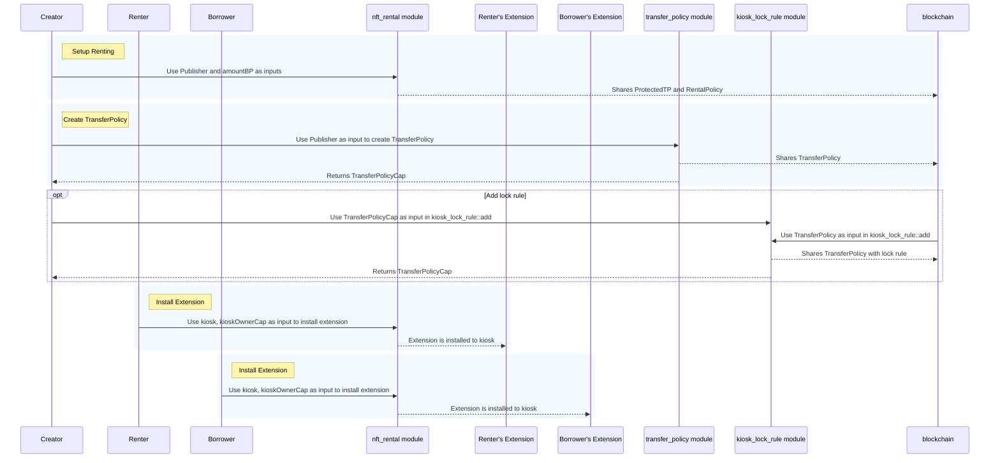
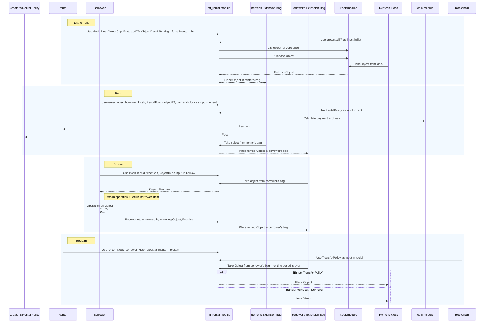
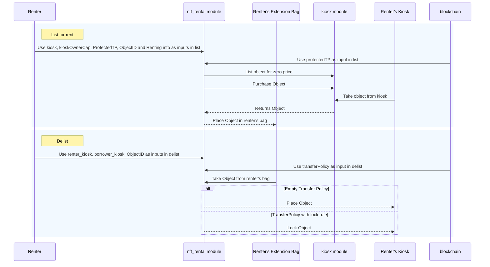

NFT renting is a mechanism that allows individuals without ownership or possession of a specific NFT to temporarily utilize or experience it. The implementation of this process leverages the [Kiosk Apps standard](../../../standards/kiosk-apps.mdx) to establish an infrastructure for rental transactions. This approach closely aligns with the [Ethereum ERC-4907](https://eips.ethereum.org/EIPS/eip-4907) renting standard, making it a suitable choice for Solidity-based use cases intended for implementation on Sui.

The NFT Rental example satisfies the following project requirements:

- Enable a lender to offer their assets for renting for a specified period of time (list for renting).
- Enable a lender to define the rental duration.
    - Borrower has to comply with the renting period.
- Borrower can gain mutable or immutable access to the NFT.
    - Immutable access is read-only.
    - Mutable, the lender should consider downgrade and upgrade operations and include them in the renting fee.
- After the renting period has finished, the item can be sold normally.
- Creator-defined royalties are respected by encompassing [transfer policy rules](../../../concepts/transfers/custom-rules.mdx).

## Use cases

Some use cases for real-world NFT rental example include:

- [Gaming](#gaming)
- [Ticketing](#ticketing) 
- [Virtual land](#virtual-land)
- [Temporary assets and subscriptions](#temp-assets-subs)

### Gaming

There are multiple cases in gaming where renting NFTs can be beneficial to user experience:

- **In-game assets:** NFTs can represent unique in-game items, characters, skins, or accessories. Players can rent these assets securely.
- **Ownership and authenticity:** NFTs provide a transparent and immutable record of ownership, ensuring that players who truly own their in-game items can rent them and receive back the item under rent after the renting period expires. This can combat issues like fraud and counterfeiting.
- **Cross-game integration:** Renting NFTs can work across multiple games, allowing players to carry and rent their unique items or characters from one game to another, fostering interoperability.
- **Gaming collectibles:** NFTs can represent digital collectibles within games, creating a digital asset ecosystem where players can rent unique items.

### Ticketing

In the realm of ticketing, NFTs play a pivotal role in enhancing transferability. These digital assets facilitate a secure and traceable transfer, resale, or rental of tickets, mitigating the risk of counterfeit tickets within the secondary market. The blockchain-based nature of NFTs ensures transparency and authenticity in each transaction, providing users with a reliable and fraud-resistant means to engage in ticket-related activities. This innovation not only simplifies the process for ticket holders but also contributes to a more trustworthy and efficient secondary ticket market.

### Virtual land {#virtual-land}

Renting virtual lands and offices in the metaverse provides businesses with flexible solutions, enabling event companies to host gatherings without the commitment of permanent acquisitions and facilitating remote work through virtual offices. This approach not only offers cost-effective alternatives but also aligns with the evolving dynamics of digital business operations.

### Temporary assets and subscriptions {#temp-assets-subs}

Temporary assets and subscriptions are notable applications of rental NFTs, offering accessibility to virtual experiences like high-end virtual casinos or curated digital fashion. These NFTs cater to diverse budgets, broadening audience reach. Subscription rentals extend to pools of digital assets, allowing users to pay monthly for a set number of items, fostering accessibility, user retention, and acquisition. Holders can rent out unused subscriptions, ensuring no loss for them, potential customer gains for the protocol, and a commitment-free trial for temporary holders. This showcases the adaptability and user-centric appeal of rental NFTs in diverse scenarios.

## Smart contract design

:::warning

Transferring kiosks might result in unexpected behaviors while an asset is being rented. If you want to disallow kiosk transferring all together, consider using personal kiosks.

:::

The rental smart contract uses the [Kiosk Apps](../../../standards/kiosk-apps.mdx) standard. Both the lender and borrower must install a Kiosk extension to take part, and the creator of the borrowed asset type must create a rental policy and `ProtectedTP` object to allow the extension to manage rentals while enforcing royalties.

:::info

This implementation is charging a rental fee based on days. You can re-purpose and update the logic to support charging per hour, or even seconds.

:::

## Move modules

The NFT Rental example uses a single module, `nft_rental.move`. You can find the source for this file hosted in the [sui repository](https://github.com/MystenLabs/sui/tree/main/examples/move/nft-rental/sources/nft_rental.move) in the `examples` directory. The source code includes extensive comments to help you follow the example's logic and structure. 

### nft_rental

The `nft_rental` module provides an API that facilitates lending or borrowing through the following operations:

- List for renting
- Delist from renting
- Rent
- Borrow by reference and borrow by value
- Reclaim for the lender

### Structs

The object model of the `nft_rental` module provides the structure of the app, beginning with the `Rentables` object. The struct has only the `drop` ability and acts as the extension key for the kiosk `Rentables` extension.

```move
public struct Rentables has drop {}
```

The `Rented` struct represents a rented item. The only field the struct includes is the ID of the object. It is used as the dynamic field key in the borrower's `Bag` entry when someone is actively borrowing an item. The struct has `store`, `copy`, and `drop` abilities because they are necessary for all dynamic field keys.

```move
public struct Rented has store, copy, drop { id: ID }
```

The `Listed` struct represents a listed item. The only field the struct includes is the ID of the object. It is used as the dynamic field key in the renter's `Bag` entry after an item is listed for renting. Like `Rented`, this struct has `store`, `copy`, and `drop` abilities because they are necessary for all dynamic field keys.

```move
public struct Listed has store, copy, drop { id: ID }
```

The `Promise` struct is created for borrowing by value. The `Promise` operates as the hot potato (a struct that has no capabilities that you can only pack and unpack in its module) that can only be resolved by returning the item back to the extension's `Bag`.

The `Promise` field lacks the `store` ability as it shouldn't be wrapped inside other objects.
It also lacks the `drop` ability because only the `return_val` function can consume it.

```move
public struct Promise {
  item: Rented,
  duration: u64,
  start_date: u64,
  price_per_day: u64,
  renter_kiosk: address,
  borrower_kiosk: ID
}
```

The `Rentable` struct is as a wrapper object that holds an asset that is being rented. Contains information relevant to the rental period, cost, and renter.
This struct requires the `store` ability because it stores a value `T` that definitely also has `store`.

```move
public struct Rentable<T: key + store> has store {
  object: T,
  /// Total amount of time offered for renting in days.
  duration: u64,
  /// Initially undefined, is updated once someone rents it.
  start_date: Option<u64>,
  price_per_day: u64,
  /// The kiosk id that the object was taken from.
  kiosk_id: ID,
}
```

The `RentalPolicy` struct is a shared object that every creator mints. The struct defines the royalties the creator receives from each rent invocation.

```move
public struct RentalPolicy<phantom T> has key, store {
  id: UID,
  balance: Balance<SUI>,
  /// Note: Move does not support float numbers.
  ///
  /// If you need to represent a float, you need to determine the desired
  /// precision and use a larger integer representation.
  ///
  /// For example, percentages can be represented using basis points:
  /// 10000 basis points represent 100% and 100 basis points represent 1%.
  amount_bp: u64
}
```

The `ProtectedTP` object is a shared object that creators mint to enable renting. The object provides authorized access to an empty `TransferPolicy`.
This is in part required because of the restrictions that Kiosk imposes around royalty enforced items and their tradability. 
Additionally it allows the rental module to operate within the Extension framework while maintaining the guarantee that the assets 
handled will always be tradable.

A protected empty transfer policy is required to facilitate the rental process so that the extension can transfer the asset without any additional rules to resolve (like lock rule, loyalty rule, and so on). If creators want to enforce royalties on rentals, they can use the `RentalPolicy` detailed previously.

```move
public struct ProtectedTP<phantom T> has key, store {
  id: UID,
  transfer_policy: TransferPolicy<T>,
  policy_cap: TransferPolicyCap<T>
}
```

### Function signatures

The NFT Rental example includes the following functions that define the project's logic. 

The `install` function enables installation of the `Rentables` extension in a kiosk. The party facilitating the rental process is responsible for making sure that the user installs the extension in their kiosk.

```move
public fun install(
  kiosk: &mut Kiosk,
  cap: &KioskOwnerCap,
  ctx: &mut TxContext
){
  kiosk_extension::add(Rentables {}, kiosk, cap, PERMISSIONS, ctx);
}
```

The `remove` function enables the owner (and only the owner) of the kiosk to remove the extension. The extension storage must be empty for the transaction to succeed. The extension storage empties after the user is no longer borrowing or renting any items. The `kiosk_extension::remove` function performs the ownership check before executing. 

```move
public fun remove(kiosk: &mut Kiosk, cap: &KioskOwnerCap, _ctx: &mut TxContext){
  kiosk_extension::remove<Rentables>(kiosk, cap);
}
```

The `setup_renting` function mints and shares a `ProtectedTP` and a `RentalPolicy` object for type `T`. The publisher of type `T` is the only entity that can perform the action.

```move
public fun setup_renting<T>(publisher: &Publisher, amount_bp: u64, ctx: &mut TxContext) {
  // Creates an empty TP and shares a ProtectedTP<T> object.
  // This can be used to bypass the lock rule under specific conditions.
  // Storing inside the cap the ProtectedTP with no way to access it
  // as we do not want to modify this policy
  let (transfer_policy, policy_cap) = transfer_policy::new<T>(publisher, ctx);

  let protected_tp = ProtectedTP {
    id: object::new(ctx),
    transfer_policy,
    policy_cap,
  };

  let rental_policy = RentalPolicy<T> {
    id: object::new(ctx),
    balance: balance::zero<SUI>(),
    amount_bp,
  };

  transfer::share_object(protected_tp);
  transfer::share_object(rental_policy);
}
```

The `list` function enables listing of an asset within the `Rentables` extension's bag, creating a bag entry with the asset's ID as the key and a `Rentable` wrapper object as the value. Requires the existence of a `ProtectedTP` transfer policy that only the creator of type `T` can create. The function assumes an item is already placed (and optionally locked) in a kiosk.

```move
public fun list<T: key + store>(
  kiosk: &mut Kiosk,
  cap: &KioskOwnerCap,
  protected_tp: &ProtectedTP<T>,
  item_id: ID,
  duration: u64,
  price_per_day: u64,
  ctx: &mut TxContext,
) {
    
  // Aborts if Rentables extension is not installed.
  assert!(kiosk_extension::is_installed<Rentables>(kiosk), EExtensionNotInstalled);

  // Sets the kiosk owner to the transaction sender to keep metadata fields up to date.
  // This is also crucial to ensure the correct person receives the payment.
  // Prevents unexpected results in cases where the kiosk could have been transferred 
  // between users without the owner being updated.
  kiosk.set_owner(cap, ctx);

  // Lists the item for zero SUI.
  kiosk.list<T>(cap, item_id, 0);

  // Constructs a zero coin.
  let coin = coin::zero<SUI>(ctx);
  // Purchases the item with 0 SUI.
  let (object, request) = kiosk.purchase<T>(item_id, coin);

  // Resolves the TransferRequest with the empty TransferPolicy which is protected and accessible only via this module.
  let (_item, _paid, _from) = protected_tp.transfer_policy.confirm_request(request);

  // Wraps the item in the Rentable struct along with relevant metadata.
  let rentable = Rentable {
    object,
    duration,
    start_date: option::none<u64>(),
    price_per_day,
    kiosk_id: object::id(kiosk),
  };

  // Places the rentable as listed in the extension's bag (place_in_bag is a helper method defined in nft_rental.move file).
  place_in_bag<T, Listed>(kiosk, Listed { id: item_id }, rentable);
}
```

The `delist` function allows the renter to delist an item, as long as it's not currently being rented. The function also places (or locks, if a lock rule is present) the object back to owner's kiosk. You should mint an empty `TransferPolicy` even if you don't want to apply any royalties. If at some point you do want to enforce royalties, you can always update the existing `TransferPolicy`.

```move
public fun delist<T: key + store>(
  kiosk: &mut Kiosk,
  cap: &KioskOwnerCap,
  transfer_policy: &TransferPolicy<T>,
  item_id: ID,
  _ctx: &mut TxContext,
) {

  // Aborts if the cap doesn't match the Kiosk.
  assert!(kiosk.has_access(cap), ENotOwner);

  // Removes the rentable item from the extension's Bag (take_from_bag is a helper method defined in nft_rental.move file). 
  let rentable = take_from_bag<T, Listed>(kiosk, Listed { id: item_id });

  // Deconstructs the Rentable object.
  let Rentable {
    object,
    duration: _,
    start_date: _,
    price_per_day: _,
    kiosk_id: _,
  } = rentable;

  // Respects the lock rule, if present, by re-locking the asset in the owner's Kiosk.
  if (has_rule<T, LockRule>(transfer_policy)) {
    kiosk.lock(cap, transfer_policy, object);
  } else {
    kiosk.place(cap, object);
  };
}
```

The `rent` function enables renting a listed `Rentable`. It permits anyone to borrow an item on behalf of another user, provided they have the `Rentables` extension installed. The `rental_policy` defines the portion of the coin that is retained as fees and added to the rental policy's balance.

```move
public fun rent<T: key + store>(
  renter_kiosk: &mut Kiosk,
  borrower_kiosk: &mut Kiosk,
  rental_policy: &mut RentalPolicy<T>,
  item_id: ID,
  mut coin: Coin<SUI>,
  clock: &Clock,
  ctx: &mut TxContext,
) {

  // Aborts if Rentables extension is not installed.
  assert!(kiosk_extension::is_installed<Rentables>(borrower_kiosk), EExtensionNotInstalled);

  let mut rentable = take_from_bag<T, Listed>(renter_kiosk, Listed { id: item_id });

  // Calculates the price of the rental based on the days it was rented for by ensuring the outcome can be stored as a u64.
  let max_price_per_day = MAX_VALUE_U64 / rentable.duration;
  assert!(rentable.price_per_day <= max_price_per_day, ETotalPriceOverflow);
  let total_price = rentable.price_per_day * rentable.duration;

  // Accepts only exact balance for the payment and does not give change.
  let coin_value = coin.value();
  assert!(coin_value == total_price, ENotEnoughCoins);

  // Calculate fees_amount using the given basis points amount (percentage), ensuring the
  // result fits into a 64-bit unsigned integer.
  let mut fees_amount = coin_value as u128;
  fees_amount = fees_amount * (rental_policy.amount_bp as u128);
  fees_amount = fees_amount / (MAX_BASIS_POINTS as u128);

  // Calculate fees_amount using the given basis points amount (percentage), ensuring the result fits into a 64-bit unsigned integer.
  let fees = coin.split(fees_amount as u64, ctx);

  // Merges the fee balance of the given coin with the RentalPolicy balance.
  coin::put(&mut rental_policy.balance, fees);
  // Transfers the payment to the renter.
  transfer::public_transfer(coin, renter_kiosk.owner());
  rentable.start_date.fill(clock.timestamp_ms());

  place_in_bag<T, Rented>(borrower_kiosk, Rented { id: item_id }, rentable);
}
```

The `borrow` function enables the borrower to acquire the `Rentable` by reference from their bag.

```move
public fun borrow<T: key + store>(
  kiosk: &mut Kiosk,
  cap: &KioskOwnerCap,
  item_id: ID,
  _ctx: &mut TxContext,
): &T {
  // Aborts if the cap doesn't match the Kiosk.
  assert!(kiosk.has_access(cap), ENotOwner);
  let ext_storage_mut = kiosk_extension::storage_mut(Rentables {}, kiosk);
  let rentable: &Rentable<T> = &ext_storage_mut[Rented { id: item_id }];
  &rentable.object
}
```

The `borrow_val` function enables the borrower to temporarily acquire the `Rentable` with an agreement or promise to return it. The `Promise` stores all the information about the `Rentable`, facilitating the reconstruction of the `Rentable` upon object return.

```move
public fun borrow_val<T: key + store>(
  kiosk: &mut Kiosk,
  cap: &KioskOwnerCap,
  item_id: ID,
  _ctx: &mut TxContext,
): (T, Promise) {
  // Aborts if the cap doesn't match the Kiosk.
  assert!(kiosk.has_access(cap), ENotOwner);
  let borrower_kiosk = object::id(kiosk);

  let rentable = take_from_bag<T, Rented>(kiosk, Rented { id: item_id });

  // Construct a Promise struct containing the Rentable's metadata.
  let promise = Promise {
    item: Rented { id: item_id },
    duration: rentable.duration,
    start_date: *option::borrow(&rentable.start_date),
    price_per_day: rentable.price_per_day,
    renter_kiosk: rentable.kiosk_id,
    borrower_kiosk
  };

  // Deconstructs the rentable and returns the promise along with the wrapped item T.
  let Rentable {
    object,
    duration: _,
    start_date: _,
    price_per_day: _,
    kiosk_id: _,
  } = rentable;

  (object, promise)
}
```

The `return_val` function enables the borrower to return the borrowed item.

```move
public fun return_val<T: key + store>(
  kiosk: &mut Kiosk,
  object: T,
  promise: Promise,
  _ctx: &mut TxContext,
) {
  assert!(kiosk_extension::is_installed<Rentables>(kiosk), EExtensionNotInstalled);

  let Promise {
    item,
    duration,
    start_date,
    price_per_day,
    renter_kiosk,
    borrower_kiosk,
  } = promise;

  let kiosk_id = object::id(kiosk);
  assert!(kiosk_id == borrower_kiosk, EInvalidKiosk);

  let rentable = Rentable {
    object,
    duration,
    start_date: option::some(start_date),
    price_per_day,
    kiosk_id: renter_kiosk,
  };

  place_in_bag(kiosk, item, rentable);
}
```
:::note

The `reclaim` functionality is manually invoked and the rental service provider is responsible for ensuring that the renter is reminded to `reclaim`. As such, this can cause the borrower to hold the asset for longer than the rental period. This can be mitigated through modification of the current contract by adding an assertion in the `borrow` and `borrow_val` functions to check if the rental period has expired.

:::

The `reclaim` function enables an owner to claim back their asset after the rental period is over and place it inside their kiosk. If a lock rule is present, the example also locks the item inside the owner kiosk. 

```move
public fun reclaim<T: key + store>(
  renter_kiosk: &mut Kiosk,
  borrower_kiosk: &mut Kiosk,
  transfer_policy: &TransferPolicy<T>,
  clock: &Clock,
  item_id: ID,
  _ctx: &mut TxContext,
) {

  // Aborts if Rentables extension is not installed.
  assert!(kiosk_extension::is_installed<Rentables>(renter_kiosk), EExtensionNotInstalled);

  let rentable = take_from_bag<T, Rented>(borrower_kiosk, Rented { id: item_id });

  // Destructures the Rentable struct to place it back to the renter's Kiosk.
  let Rentable {
    object,
    duration,
    start_date,
    price_per_day: _,
    kiosk_id,
  } = rentable;

  // Aborts if provided kiosk is different that the initial kiosk the item was borrowed from.
  assert!(object::id(renter_kiosk) == kiosk_id, EInvalidKiosk);

  let start_date_ms = *option::borrow(&start_date);
  let current_timestamp = clock.timestamp_ms();
  let final_timestamp = start_date_ms + duration * SECONDS_IN_A_DAY;

  // Aborts if rental duration has not elapsed.
  assert!(current_timestamp > final_timestamp, ERentingPeriodNotOver);

  // Respects the lock rule, if present, by re-locking the asset in the owner's kiosk.
  if (transfer_policy.has_rule<T, LockRule>()) {
    kiosk_extension::lock<Rentables, T>(
      Rentables {},
      renter_kiosk,
      object,
      transfer_policy,
    );
  } else {
    kiosk_extension::place<Rentables, T>(
      Rentables {},
      renter_kiosk,
      object,
      transfer_policy,
    );
  };
}
```

## Sequence diagrams

:::note

This implementation assumes that each creator, as an enabling action, creates a `TransferPolicy` even if empty, so that the `Rentables` extension can operate. This is a requirement in addition to invoking the `setup_renting` method.

:::

### Initialize

The initialization process is part of the flow but only happens once for each entity:

- For a new type that a creator would like to allow to be rented
    - Involves invoking `setup_renting` and `TransferPolicy` creation with optional lock rule
- For a Borrower that has never borrowed before using this framework
    - If no kiosk exists for the user, one should be created
    - Involves installing the extension in their kiosk
- For a Renter that has never rented before using this framework
    - If no kiosk exists for the user, one should be created
    - Involves installing the extension in their kiosk



### List-Rent-Borrow-Reclaim



### List-Delist



## Deployment

{@include: ../../../snippets/initialize-sui-client-cli.mdx}

{@include: ../../../snippets/publish-to-devnet-with-coins.mdx}

## Related links

- [NFT Rental example](https://github.com/MystenLabs/sui/tree/main/examples/move/nft-rental): The source code that this document references.
- [Sui Kiosk](../../../standards/kiosk.mdx): Kiosk is a decentralized system for commerce applications on Sui.
- [Kiosk Apps](../../../standards/kiosk-apps.mdx): The Kiosk Apps standard extends the functionality of Sui Kiosk.  
- [Custom Transfer Rules](../../../concepts/transfers/custom-rules.mdx): Custom transfer rules are used in this example to define rental policies.