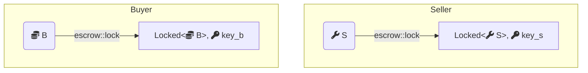
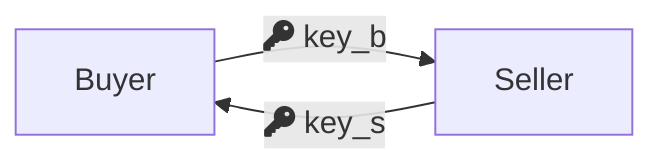
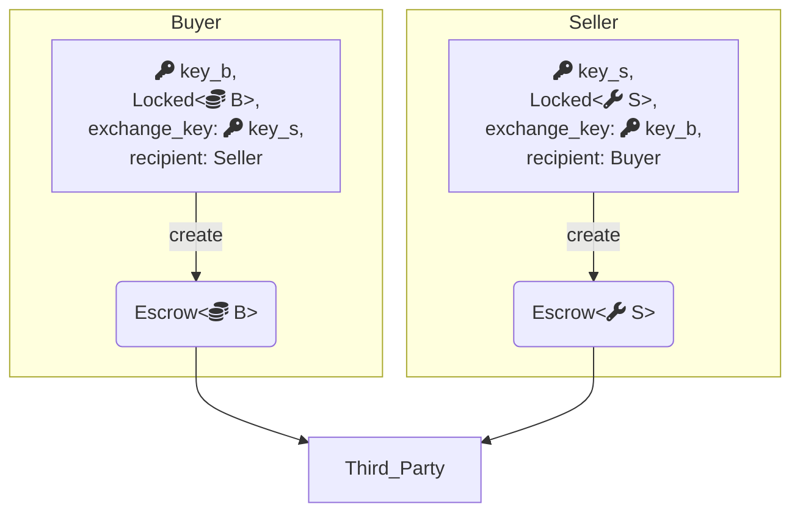
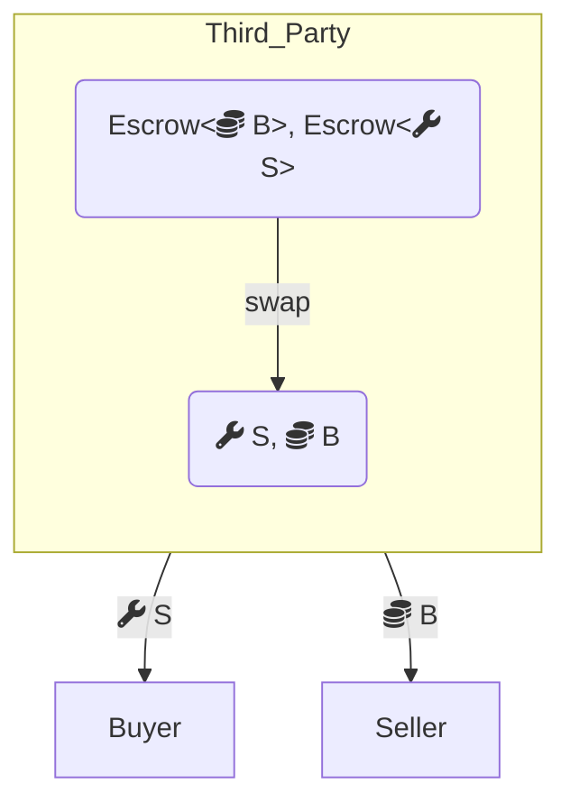
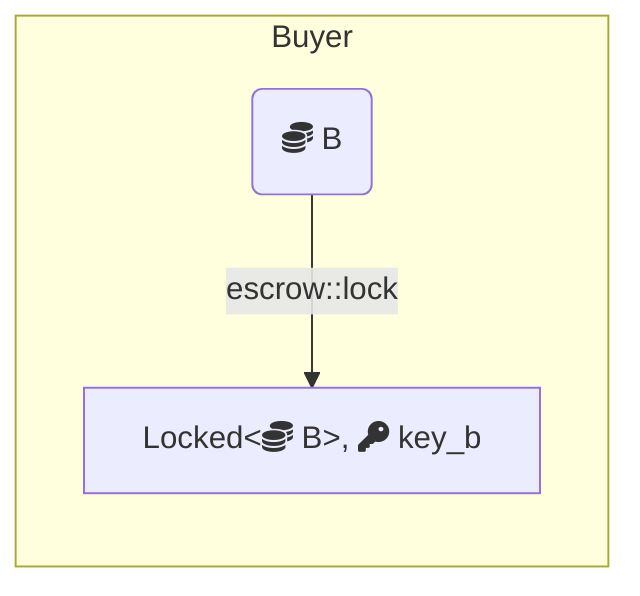
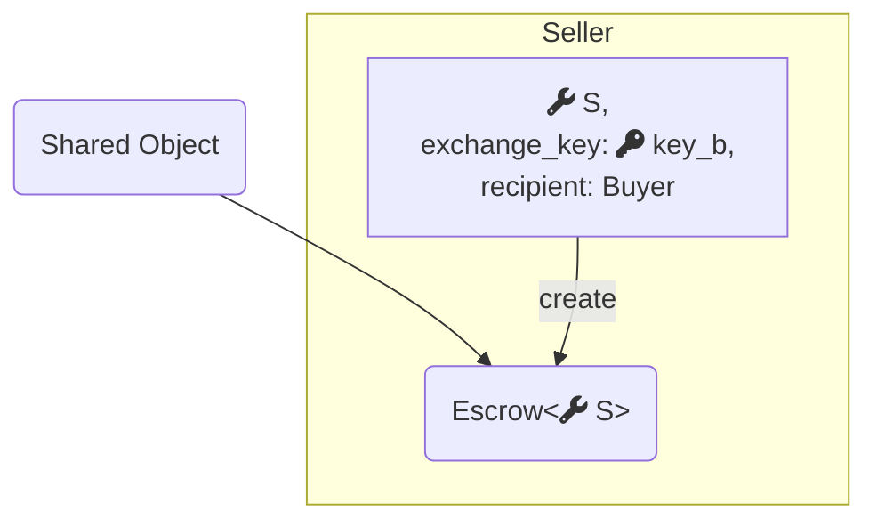
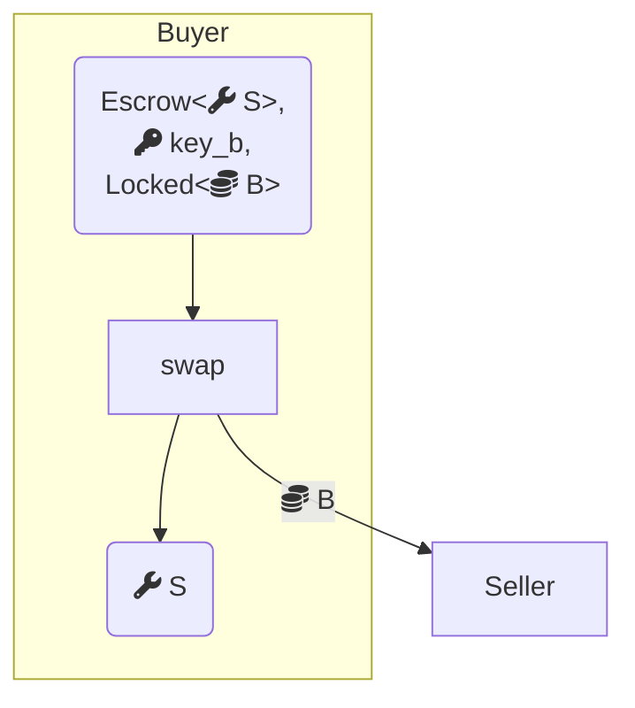

Every object has an owner that determines who can use it in transactions. If an object is [address owned](/guides/developer/objects/object-ownership/address-owned.mdx), then it is owned by either an account address derived from a particular signature scheme or an object ID. [Immutable](/guides/developer/objects/object-ownership/immutable.mdx) objects are not owned by anyone and are publicly available to be used, however they cannot be mutated, transferred, or deleted.

[Party](/guides/developer/objects/object-ownership/party.mdx) objects are accessible by the `Party` to which it is transferred. They objects can be singly owned, but unlike address-owned objects, they are [versioned](/guides/developer/objects/versioning.mdx) by [consensus](/concepts/sui-architecture/consensus.mdx). 

[Shared](/guides/developer/objects/object-ownership/shared.mdx) objects can be mutated and are accessible to everyone on the network. They can be used by different transactions concurrently.

Lastly, [wrapped](/guides/developer/objects/object-ownership/wrapped.mdx) are not necessarily an ownership type, but rather a data structure containing a `struct` type nested within another.

## Object versioning paths

Objects on Sui can be [versioned](/guides/developer/objects/versioning.mdx) either through the [fastpath](#fastpath-objects) or through [consensus](/concepts/sui-architecture/consensus.mdx). The choice between these paths affects your options for object ownership. Applications can be built using a solution that either uses consensus objects or only uses fastpath objects, with trade-offs for each.

### Fastpath objects

:::tip 

It is recommended to use [party objects](/guides/developer/objects/object-ownership/party.mdx) rather than fastpath objects.

:::

Fastpath objects can only be [address-owned](/guides/developer/objects/object-ownership/address-owned.mdx) or [immutable](/guides/developer/objects/object-ownership/immutable.mdx). This makes it complicated to write applications that require multiple parties to access the same object. Transactions that use fastpath benefit from low latency and fast finality.
 
Every transaction using a fastpath object must lock the object's current version in the transaction input, then use the output version as the reference for the next transaction's input. If a fastpath object is frequently used by multiple senders, there is a risk of equivocating or causing the object to be locked until the end of the epoch. Therefore, you must coordinate off-chain access to fastpath objects. 

Applications that are extremely sensitive to latency or gas costs, that do not need to handle complex multi-party transactions, or that already require an off-chain service might benefit from a design that only uses fastpath objects.

### Consensus objects

Consensus objects can be [address-owned](/guides/developer/objects/object-ownership/address-owned.mdx), owned by a [party](/guides/developer/objects/object-ownership/party.mdx), or [shared](/guides/developer/objects/object-ownership/shared.mdx). Transactions that access 1 or more consensus objects require consensus to sequence the reads and writes to those objects. This makes version management simpler, especially for frequently accessed objects, but results in higher gas cost and latency.

Transactions that access multiple consensus objects, or particularly popular objects, might have increased latency because of contention. However, the advantage of using consensus objects is the flexibility of allowing multiple addresses to access the same object in a coordinated manner.

Applications that require coordination between multiple parties typically benefit from using [shared](/guides/developer/objects/object-ownership/shared.mdx) objects through consensus.

## Example

This example demonstrates the trade-offs between consensus objects and fastpath objects by implementing the same application both ways. Both variations of the example implement a service that enables a trustless swap of objects between 2 addresses, with the service holding those objects in escrow.

View the example's [complete code](https://github.com/MystenLabs/sui/blob/93e6b4845a481300ed4a56ab4ac61c5ccb6aa008/examples/move/escrow/sources/lock.move).

### `Locked<T>` and `Key`


Both implementations use a primitive for locking values, which offers the following interface:

```move
module escrow::lock {
    public fun lock<T: store>(obj: T, ctx: &mut TxContext): (Locked<T>, Key);
    public fun unlock<T: store>(locked: Locked<T>, key: Key): T
}
```

Any `T: store` can be locked to get a `Locked<T>` and a corresponding `Key`, and conversely, the locked value and its corresponding key can be consumed to get back the wrapped object.

This interface provides locked values that cannot be modified unless they are unlocked first and later relocked. Because unlocking consumes the key, tampering with a locked value can be detected by monitoring the ID of the key that it was locked with. This prevents situations where a party in a swap changes the object they are offering.

### Address-owned objects (fastpath)

<details>
<summary>
`owned.move`
</summary>

<ImportContent source="examples/trading/contracts/escrow/sources/owned.move" mode="code" />

</details>

Swapping through escrow using fastpath objects starts with both parties locking their respective objects. Fastpath objects must be [address-owned](/guides/developer/objects/object-ownership/address-owned.mdx) or [immutable](/guides/developer/objects/object-ownership/immutable.mdx). This proves that the object has not been tampered with after the swap has been agreed to. If either party doesn't want to proceed at this stage, they just unlock their object.



Assuming both parties are happy to continue, the next step requires both parties to swap the keys.



A third party acts as the custodian and holds the objects that are waiting for their counterparts to arrive. When they arrive, it matches them up to complete the swap.

<ImportContent source="examples/trading/contracts/escrow/sources/owned.move" mode="code" fun="create" noComments />



The `create` function prepares the `Escrow` request and sends it to the custodian. The object being offered is passed in, locked with its key, and the object being requested is identified by the ID of the key it was locked with. While preparing the request, the offered object is unlocked while referencing the ID of its key.

Although the custodian is trusted to preserve liveness, all other properties are maintained in Move. Even though the custodian owns both objects being swapped, the only valid action they are permitted to take is to match them up with their correct counterpart to finish the swap or to cancel the swap and return them:



<ImportContent source="examples/trading/contracts/escrow/sources/owned.move" mode="code" fun="swap" />

The `swap` function checks that senders and recipients match and that each party wants the object that the other party is offering by comparing their respective key IDs. If the custodian tries to match together 2 unrelated escrow requests to swap, the transaction does not succeed.

### Shared objects (consensus)

<details>
<summary>
`shared.move`
</summary>

<ImportContent source="examples/trading/contracts/escrow/sources/shared.move" mode="code" />

</details>

The protocol in the consensus object case is less symmetric but still starts with the first party locking the object they want to swap. Consensus objects can be [address-owned](/guides/developer/objects/object-ownership/address-owned.mdx), owned by a [party](/guides/developer/objects/object-ownership/party.mdx), or [shared](/guides/developer/objects/object-ownership/shared.mdx). This example uses a shared object. 



The second party can then view the object that was locked. If they decide they want to swap with it, they indicate their interest by creating a swap request:



<ImportContent source="examples/trading/contracts/escrow/sources/shared.move" mode="code" fun="create" noComments />

The `create` request accepts the object being escrowed directly, meaning it is not locked, and creates a shared `Escrow` object. The request remembers the address that sent it, who is allowed to reclaim the object if the swap hasn't already happened. The intended recipient is then expected to continue the swap by providing the object they initially locked:



<ImportContent source="examples/trading/contracts/escrow/sources/shared.move" mode="code" fun="swap" />

Even though the `Escrow` object is a [shared](/guides/developer/objects/object-ownership/shared.mdx) object that is accessible by anyone, the Move interface ensures that only the original sender and the intended recipient can successfully interact with it. `swap` checks that the locked object matches the object that was requested when the `Escrow` was created and assumes that the intended recipient wants the escrowed object.

Assuming all checks pass, the object held in `Escrow` is extracted, its wrapper is deleted, and it is returned to the first party. The locked object offered by the first party is also unlocked and sent to the second party, completing the swap.

### Comparison

In both examples there is a point at which the first party has made a request and the other has not responded. At this point, both parties might want to access the `Escrow` object either to cancel the swap or to complete it.

In some cases, the protocol uses only [address-owned](/guides/developer/objects/object-ownership/address-owned.mdx) objects but requires a custodian to act as an intermediary. This has the advantage of avoiding the costs and latencies of consensus, but involves more steps and requires trusting a third party for liveness.

In the other case, the object is in custody on-chain in a [shared](/guides/developer/objects/object-ownership/shared.mdx) object. This requires consensus but involves fewer steps and no third party.