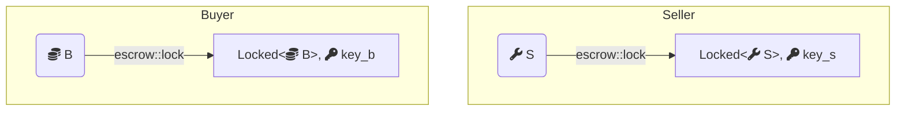
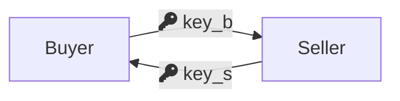
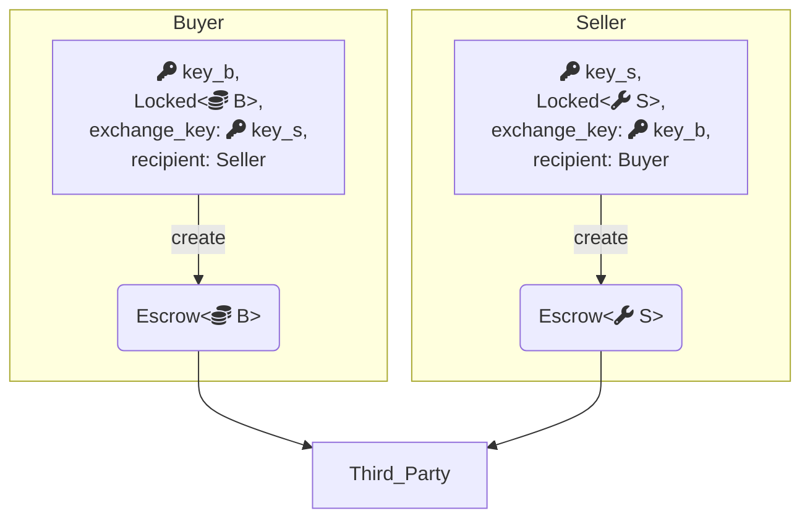
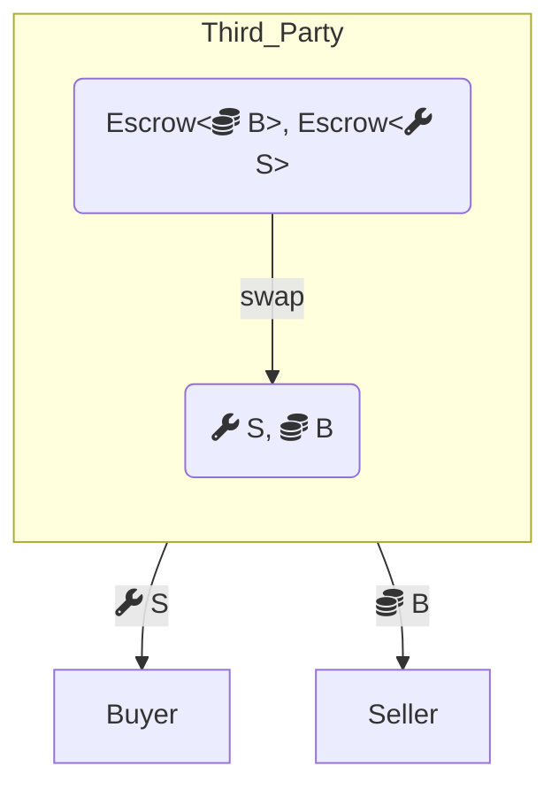
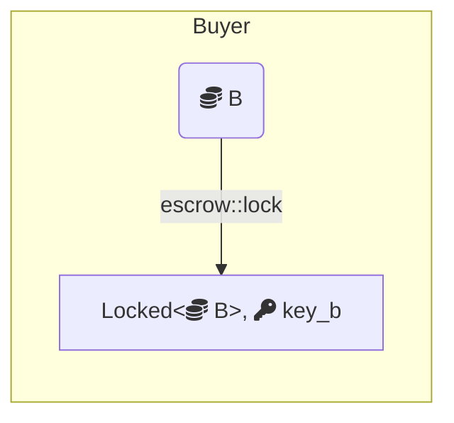
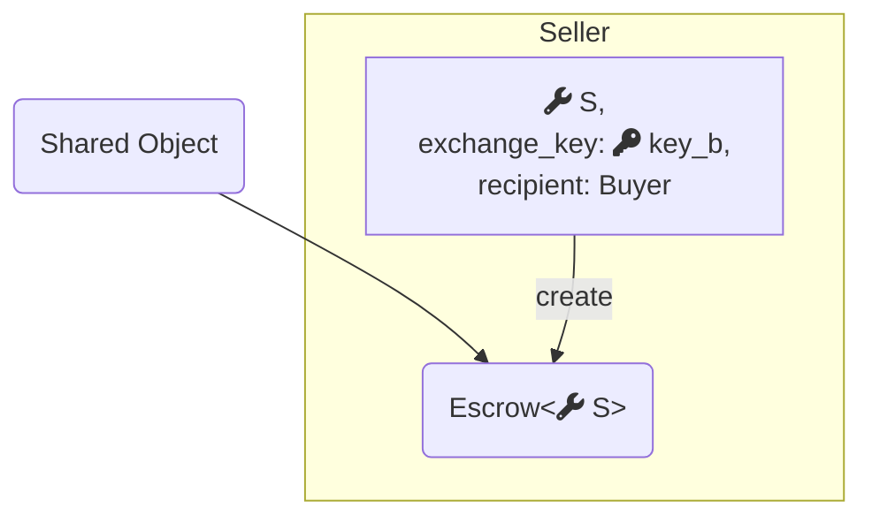
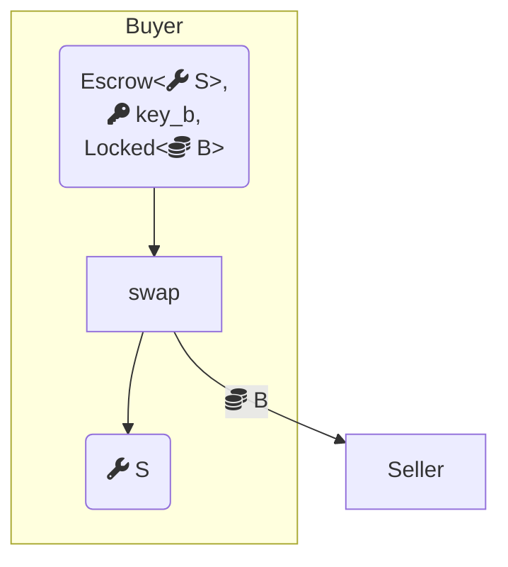

Every object stored on-chain is referenced by an ID and version. When a transaction modifies an object, it writes the new contents to an on-chain reference with the same ID but a new version. Despite appearing multiple times in the store, only the latest version of an object is available to transactions. Only one transaction can modify an object at a given version, guaranteeing a linear history.

```
(I, v0) => ...
(I, v1) => ...  # v0 < v1
(I, v2) => ...  # v1 < v2
```

Versions are strictly increasing and (`ID`, `version`) pairs are never re-used. This allows [node operators](/guides/operator/index.mdx) to prune old object versions from their stores, though they may also retain them to serve historical requests or help other nodes catch up.

## Object versioning paths

Objects on Sui are versioned either through the [fastpath](#fastpath-objects) or through [consensus](/concepts/sui-architecture/consensus.mdx). The choice affects object ownership options and has performance trade-offs.

Sui uses [Lamport timestamps](https://en.wikipedia.org/wiki/Lamport_timestamp) in its versioning algorithm. This guarantees versions are never re-used: a transaction sets the new version for all objects it touches to `1 + max(version of all input objects)`. For example, a transaction transferring object `O` at version 5 using gas object `G` at version 3 updates both to version `1 + max(5, 3) = 6`.

## Fastpath objects

:::tip

It is recommended to use [party objects](/guides/developer/objects/object-ownership/party.mdx) rather than fastpath objects.

:::

Fastpath objects can only be [address-owned](/guides/developer/objects/object-ownership/address-owned.mdx) or [immutable](/guides/developer/objects/object-ownership/immutable.mdx). Transactions using fastpath benefit from low latency and fast finality because they bypass consensus.

Every fastpath transaction must lock the object's current version as input and use the output version as the reference for the next transaction. If a fastpath object is frequently used by multiple senders, there is a risk of equivocating or locking the object until the end of the epoch, so you must coordinate off-chain access carefully.

:::info

Only an object's owner can equivocate it. You can avoid equivocation by never attempting to execute two different transactions that use the same object. If you don't receive a definite success or failure from the network for a transaction, assume it may have gone through and do not re-use any of its objects for different transactions. All locks reset at the end of the epoch, freeing equivocated objects again.

:::

You must reference fastpath transaction inputs at a specific ID and version. When a validator signs a transaction with an address-owned input at a specific version, that version is locked to that transaction. Validators reject other transactions requiring the same input. [Immutable](/guides/developer/objects/object-ownership/immutable.mdx) objects are also referenced at a specific version, but do not need to be locked since their contents never change. Their version identifies the point at which they became immutable.

Fastpath is a good fit for applications that are extremely sensitive to latency or gas costs, do not need complex multi-party transactions, or already rely on an off-chain coordination service.

## Consensus objects

Consensus objects can be [address-owned](/guides/developer/objects/object-ownership/address-owned.mdx), owned by a [party](/guides/developer/objects/object-ownership/party.mdx), or [shared](/guides/developer/objects/object-ownership/shared.mdx). Transactions that access one or more consensus objects require consensus to sequence reads and writes, which means higher gas cost and latency compared to fastpath, but version management is simpler, especially for frequently accessed or multi-party objects.

Transactions accessing multiple consensus objects or particularly popular objects may see increased latency due to contention. The trade-off is flexibility: multiple addresses can access the same object in a coordinated way without off-chain coordination.

You reference [shared](/guides/developer/objects/object-ownership/shared.mdx) transaction inputs by ID, the version the object was shared at, and a flag indicating whether it is accessed mutably. You don't specify the precise access version because consensus determines that during scheduling, one transaction's output version becomes the next transaction's input version. Immutably referenced shared objects participate in scheduling but don't increment the object's version.

Consensus is a good fit for applications that require coordination between multiple parties.

## Wrapped and dynamic field objects

[Wrapped](/guides/developer/objects/object-ownership/wrapped.mdx) objects are not accessible by their ID in the object store, you must access them through the object that wraps them. You do not need to supply a wrapped object's ID or version as transaction input. Validators refuse to sign transactions that specify wrapped objects directly as inputs.

Wrapped objects can be unwrapped, after which they are accessible by their ID again. An object retains its ID across all wrap and unwrap events. Lamport timestamp versioning ensures the version at unwrap is always greater than the version at wrap.

[Dynamic fields](/guides/developer/objects/dynamic-fields.mdx) behave similarly: they are only accessible through their parent object and do not need to be supplied as transaction inputs. However, unlike wrapped objects, if a transaction modifies a dynamic object field, its version is incremented in that transaction. Lamport versioning also ensures that when a field is removed and re-added with the same name, the new `Field` object's version is strictly greater than the deleted one's, so (`ID`, `version`) pairs are never reused.

## Packages

[Move packages](/guides/developer/packages/index.mdx) are also versioned and stored on-chain, but follow a different scheme because they are immutable from inception. Package transaction inputs are referenced by ID alone. They are always loaded at their latest version.

### User packages

Every publish or upgrade generates a new ID. A newly published package starts at version 1; each upgrade increments the version by 1 from the immediately preceding version. Unlike objects, older package versions remain accessible after an upgrade. A package upgraded twice might appear in the store as:

```
(0x17fb7f87e48622257725f584949beac81539a3f4ff864317ad90357c37d82605, 1) => P v1
(0x260f6eeb866c61ab5659f4a89bc0704dd4c51a573c4f4627e40c5bb93d4d500e, 2) => P v2
(0xd24cc3ec3e2877f085bc756337bf73ae6976c38c3d93a0dbaf8004505de980ef, 3) => P v3
```

All three versions are at different IDs and remain callable, including `v1` even after `v3` exists.

### Framework packages

Framework packages, such as the [Move standard library](https://move-book.com/reference/) at `0x1`, the [Sui framework](https://docs.sui.io/references/framework/sui_sui) at `0x2`, the [Sui system library](https://docs.sui.io/references/framework/sui_system) at `0x3`, and [DeepBook](/standards/deepbook.mdx) at `0xdee9`, are a special case. Their IDs must remain stable across upgrades. The network upgrades them through a system transaction at epoch boundaries, preserving IDs while incrementing versions:

```
(0x1, 1) => MoveStdlib v1
(0x1, 2) => MoveStdlib v2
(0x1, 3) => MoveStdlib v3
```

### Package manifest versions

Package manifest files include version fields in both the `[package]` section and `[dependencies]`. These are for user-level documentation only, as the `publish` and `upgrade` commands do not use them. Two publishes of the same package with different manifest versions are treated as entirely separate packages and cannot be used as dependency overrides for each other.

## Fastpath vs. consensus: comparison

| | Fastpath | Consensus |
| :-- | :-- | :-- |
| **Supported ownership** | Address-owned, immutable | Address-owned, party, shared |
| **Version input** | Must specify exact ID and version | Specify ID and shared-at version; consensus assigns access version |
| **Latency** | Low | Higher |
| **Gas cost** | Lower | Higher |
| **Multi-party access** | Requires off-chain coordination | Handled on-chain |
| **Equivocation risk** | Yes, if same object used in two transactions | No |
| **Best for** | Latency-sensitive, single-party, or off-chain-coordinated apps | Multi-party coordination, frequently shared objects |

## Example: escrow swap

This example demonstrates the trade-offs by implementing the same trustless object swap service two ways, one using fastpath address-owned objects with a custodian, and one using a consensus shared object.

Both implementations use a locking primitive:

```move
module escrow::lock {
    public fun lock<T: store>(obj: T, ctx: &mut TxContext): (Locked<T>, Key);
    public fun unlock<T: store>(locked: Locked<T>, key: Key): T
}
```

Any `T: store` can be locked to get a `Locked<T>` and a corresponding `Key`. Unlocking consumes the key, so any tampering with the locked value is detectable by monitoring the key's ID.

View the [complete code](https://github.com/MystenLabs/sui/blob/93e6b4845a481300ed4a56ab4ac61c5ccb6aa008/examples/move/escrow/sources/lock.move) on GitHub.

### Fastpath: address-owned objects

<details>
<summary>`owned.move`</summary>

<ImportContent source="examples/trading/contracts/escrow/sources/owned.move" mode="code" />

</details>

Both parties begin by locking their objects. If either decides not to proceed, they unlock and exit.



Both parties then swap keys:



A third-party custodian holds the objects and matches them when both arrive. The `create` function sends the `Escrow` request to the custodian, unlocking the offered object while recording the ID of the key it was locked with:

<ImportContent source="examples/trading/contracts/escrow/sources/owned.move" mode="code" fun="create" noComments />



Even though the custodian owns both objects, the only valid actions in Move are to match them correctly or return them. The `swap` function verifies that senders and recipients match and that each party wants what the other is offering by comparing key IDs:

<ImportContent source="examples/trading/contracts/escrow/sources/owned.move" mode="code" fun="swap" />



### Consensus: shared object

<details>
<summary>`shared.move`</summary>

<ImportContent source="examples/trading/contracts/escrow/sources/shared.move" mode="code" />

</details>

The first party locks the object they want to swap:



The second party views the locked object and, if interested, creates a swap request that passes their object directly into a shared `Escrow` object. The request records the sender (who can reclaim if the swap doesn't complete) and the intended recipient:

<ImportContent source="examples/trading/contracts/escrow/sources/shared.move" mode="code" fun="create" noComments />



The intended recipient completes the swap by providing their locked object:

<ImportContent source="examples/trading/contracts/escrow/sources/shared.move" mode="code" fun="swap" />



Although the `Escrow` object is shared and accessible by anyone, Move ensures only the original sender and intended recipient can interact with it. `swap` verifies the locked object matches what was requested, extracts the escrowed object, deletes the wrapper, and delivers both objects to their new owners.