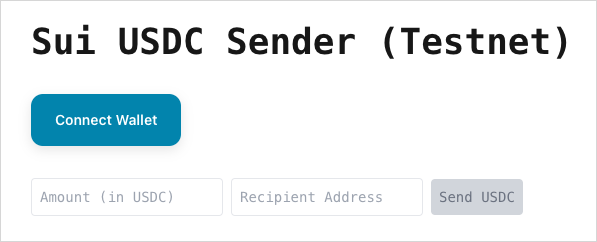
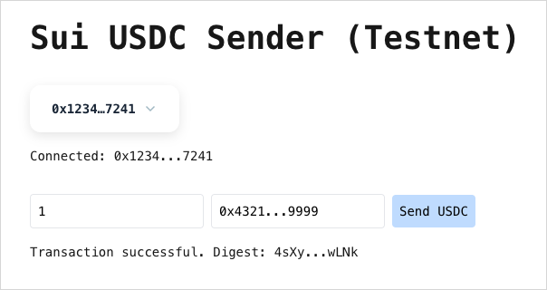

Stablecoins are a type of cryptocurrency that are designed to maintain a stable value relative to a fiat currency or a basket of assets. They are widely used for trading, lending, and as a store of value. 

## Available stablecoins

On Sui, you can interact with various stablecoins such as USDC, USDT, Agora, and Ondo USDY.

### USDC (USD Coin)

USDC is a fully collateralized US dollar stablecoin issued by regulated financial institutions. Each USDC token is backed by one US dollar held in reserve. USDC is widely used for trading, payments, and as a stable store of value.

For more detailed information on how to interact with USDC on Sui, refer to the [USDC guide](#usdc-guide).

**Site:** [Circle](https://www.circle.com/en/usdc)

### USDT (Tether)

USDT, also known as Tether, is one of the oldest and most widely used stablecoins. It is pegged to the US dollar and is backed by a mix of reserves, including cash, cash equivalents, and other assets.

USDT is currently not issued natively on Sui. For more information on bridging USDT to Sui, refer to [SUI Bridging](../../concepts/tokenomics/sui-bridging.mdx).

**Site:** [Tether](https://tether.to/)

### Agora

AUSD is a fully collateralized US dollar stablecoin issued by Agora Finance.

**Site:** [Agora Finance](https://www.agora.finance/)

### Ondo USDY
USDY is a fully collateralized US dollar stablecoin issued by Ondo Finance, allowing users to earn yield from US Treasury Bills.

**Site:** [Ondo Finance](https://ondo.finance/)

## How to transfer USDC on Sui {#usdc-guide}

USDC provides the ability to transfer dollars over public blockchains using smart contracts. The smart contract allows users to send, receive, and store dollars on chain with a wallet.

Here's a quickstart guide for developers to build an app to perform their first USDC transfer on Sui.

### Contract addresses

- [Testnet](https://suiscan.xyz/testnet/coin/0xa1ec7fc00a6f40db9693ad1415d0c193ad3906494428cf252621037bd7117e29::usdc::USDC)
  ```
  0xa1ec7fc00a6f40db9693ad1415d0c193ad3906494428cf252621037bd7117e29::usdc::USDC
  ```
- [Mainnet](https://suiscan.xyz/coin/0xdba34672e30cb065b1f93e3ab55318768fd6fef66c15942c9f7cb846e2f900e7::usdc::USDC)
  ```
  0xdba34672e30cb065b1f93e3ab55318768fd6fef66c15942c9f7cb846e2f900e7::usdc::USDC
  ```

### Prerequisites

Before you start building the sample app to perform a USDC transfer, ensure you meet the following prerequisites:

- [Node.js](https://nodejs.org/en) and [npm](https://www.npmjs.com/): Ensure that you have Node.js and npm installed on your machine. You can download and install Node.js from [nodejs.org](http://nodejs.org). npm comes with Node.js.
- [Sui Wallet](https://chromewebstore.google.com/detail/sui-wallet/opcgpfmipidbgpenhmajoajpbobppdil): Install the Sui Wallet browser extension, set up your wallet, and connect it to the appropriate network. Ensure that your wallet is funded with:
  - Some SUI tokens to cover transaction fees. (**Request Testnet SUI Tokens** from the **Wallet Settings** page)
  - USDC tokens for the transfer. ([USDC Testnet Faucet](https://faucet.circle.com/))

### Installation

To begin, create a new project directory (`usdc-transfer-app`, for example) and initialize it with pnpm:

```sh
$ pnpm init
```

To keep a small footprint, the instruction uses [Parcel](https://parceljs.org/) to render the example React-based app. You can use a more robust framework, like Next.js, or a different package manager, but you must modify the steps appropriately. 

```sh
$ pnpm add react react-dom parcel
```

Install Sui dependencies next:

```sh
$ pnpm add @mysten/dapp-kit @mysten/sui @tanstack/react-query
```

Finally, update your `package.json` to include the following script:

```json
"scripts": {
    "start": "parcel index.html"
  },
```

### Create site structure

At the root of your project directory, create an `index.html` file and save the following content to it:

<details>
<summary>
`index.html` file
</summary>
{@inject: examples/usdc-transfer-app/index.html}
</details>

Next, create and save an `index.js` file in the same location with the following code: 

<details>
<summary>
`index.js` file
</summary>
{@inject: examples/usdc-transfer-app/index.js}
</details>

To style the output for the site, create a `global.css` file in the root of your project. Copy and paste the following minimal styling into the file and save:

<details>
<summary>
`global.css` file
</summary>
{@inject: examples/usdc-transfer-app/global.css}
</details>

Finally, create an `App.js` file at the project root. When complete, this file will hold the logic for the USDC transfer. For now, just create the file to display some basic text. This example does not use TypeScript to keep the instruction focused, but you can certainly use it in your own projects.

<details>
<summary>
`App.js` file
</summary>
{@inject: examples/usdc-transfer-app/lib/App-stub.js noComments noTitle}
</details>

Start the development server to make sure the default app runs using the following command in the root of your project:

```sh
$ pnpm start
```

Open a browser to `localhost:1234` to make sure the Hello World text appears.

### Import code and setup

Open the `App.js` file and make the changes that follow. 

First, import necessary libraries and set up the network configuration.

{@inject: examples/usdc-transfer-app/App.js#setup}

This component handles the main functionality of the application, including wallet connection, defining token, and token transfer.

#### Define USDC Testnet token contract

{@inject: examples/usdc-transfer-app/App.js#variable=USDC_TYPE}

#### State management

Create a `HomeContent()` function that is going to be responsible for setting up and displaying the UI. At the top of this function, define state variables to manage the connection status, amount, recipient address, and transaction status.

{@inject: examples/usdc-transfer-app/App.js#state}

**Effect Hook for Connection Status** 

Use `useEffect` to update the connection status whenever the `currentAccount` value changes.

{@inject: examples/usdc-transfer-app/App.js#useeffect}

#### Token sending logic

Define the function to handle sending tokens, including validation and transaction execution.

{@inject: examples/usdc-transfer-app/App.js#variable=handleSendTokens}

#### Rendering the UI

Render the main UI components, including input fields for amount and recipient address, and a button to send tokens.

{@inject: examples/usdc-transfer-app/App.js#ui}

#### Complete HomeContent function

After adding the UI components, your `HomeContent()` function is complete. Continue to the next section to add the function to the main application component.

<details>
<summary>
Complete `HomeContent()` function
</summary>
{@inject: examples/usdc-transfer-app/App.js#component=HomeContent}
</details>

### Main application component

This component wraps the `HomeContent()` with necessary providers for state management and wallet connection.

{@inject: examples/usdc-transfer-app/App.js#component=App}

Save your `App.js` file and run `pnpm start` from your project root to start the development server (if not already running). 

Open [http://localhost:1234](http://localhost:1234) in your browser. Your UI should display and look similar to the following:



<details>
<summary>
Complete code for `App.js`
</summary>
{@inject: examples/usdc-transfer-app/App.js noComments}
</details> 

### Connecting your wallet

To connect your wallet:

1. On the USDC Token Sender app, click the **Connect Wallet** button.
1. Select your wallet from the list of available options. 
1. Approve the connection in your wallet extension.


### Performing a USDC transfer

Follow these steps to perform a USDC transfer:

1. Ensure you have USDC tokens in your wallet. You can get Testnet tokens from Circle's [faucet](https://faucet.circle.com/) if needed.
1. Click the **Request Testnet SUI Tokens** button from your Sui Wallet to source gas tokens. The button is visible only when your wallet is connected to Testnet.
1. In the app, enter the amount of USDC you want to send and the recipient address. 
1. Click the **Send Tokens** button.
1. Your wallet prompts you to approve the transaction. Review the details and confirm.
1. Wait for the transaction to be processed. The app displays the transaction status. A successful transaction looks like the following:
  <div class="pt-2"></div>
  

## Related links

- [Regulated Coin and Deny List](./coin/regulated.mdx): Create a regulated coin and add or remove names from the deny list.
- [Loyalty Token](./coin/loyalty.mdx): Create a token to reward user loyalty.
- [In-Game Token](./coin/in-game-token.mdx): Create tokens that can be used only within a mobile game.