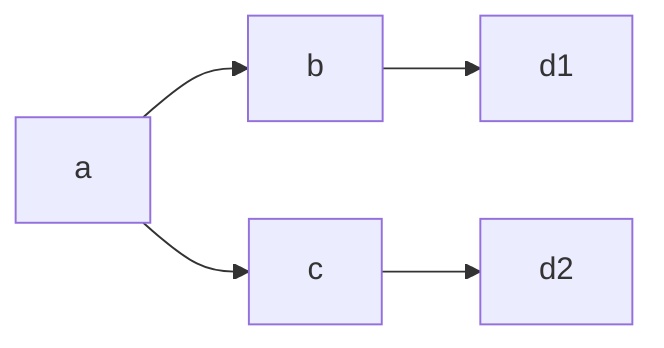
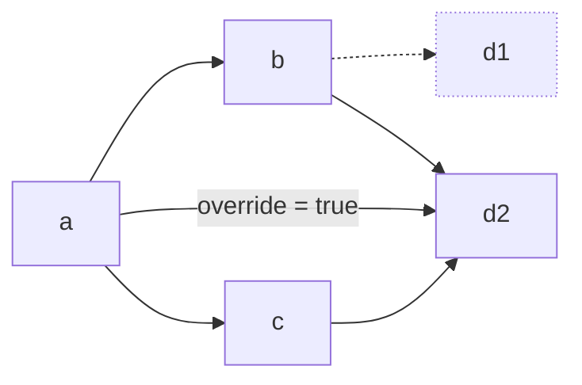

A Move package is a collection of Move modules that you publish together as a single object on the Sui blockchain. Packages can depend on other packages and can be upgraded over time while maintaining their on-chain identity. The Move package manager helps you manage dependencies and publish packages to the network.

:::info

Version 1.63 introduced major changes to the Move package system. This document describes the new system. See [automated address management](/concepts/sui-move-concepts/packages/automated-address-management.mdx) for the documentation on the old system, and [the migration guide](/references/package-managers/package-manager-migration.mdx) for a description of the differences and how to migrate to the new system.

:::

## Package-related files

Package authors configure their packages by providing a manifest file (`Move.toml`) in the root of the package directory. This file contains metadata about the package and its list of dependencies.

When you build a Move package for the first time, the package management system uses the information in the manifest file to find the source code for the package's dependencies. The system stores the exact versions of the dependencies in a lockfile (`Move.lock`). The system calls this process _pinning_.

For example, the manifest might specify a dependency on a branch of a git repository. The package system pins that dependency to a specific commit so that subsequent builds use exactly the same source.

You should commit the `Move.lock` file to source control so that your collaborators, CI jobs, and users who want to verify the source code are all using the same dependency versions. The package system only repins the dependencies if your manifest file changes or if you run the `sui move update-deps` command. You should never edit `Move.lock` manually.

The third file that the package management system uses is the publication file (`Published.toml`). Each time you publish your package, the package system updates this file with metadata about the publication, such as its on-chain address, upgrade capability address, and information about the compiler version used to build the package. The `Published.toml` file should be committed to source control.

Finally, the `test-publish` command makes use of ephemeral publication files, typically named `Pub.<env-name>.toml`. These files contain information about temporary publications that are not intended to be shared, such as publications to local networks.

## Dependencies

Dependencies allow your package to use code from other packages.

### Adding dependencies

To add a dependency, add a line to the `[dependencies]` section of your manifest. For example, to depend on the `mvr` package `@potatoes/ascii`, write:

```toml
[package]
name = "example"

[dependencies]
ascii = { r.mvr = "@potatoes/ascii" }
```

Then refer to modules in the `ascii` package in your Move source code:

```move
module example::example_module;

use ascii::ascii;
use ascii::char;
```

When you build this package, the package system downloads and uses the source code for the ascii package. When published, the package links to the on-chain package object referenced from the ascii `Published.toml` file.

### Dependency types

The Move package system supports 4 types of dependencies, each suited for different use cases:

 - Move registry (`mvr`) dependencies are the recommended way to depend on published packages from the ecosystem.
 - Local dependencies are used when a single repository contains multiple packages.
 - Git dependencies can be used to depend on packages that have not yet been published to Move registry.
 - System dependencies are used for built-in packages that are part of Sui.

The remainder of this section describes these dependency types in detail.

#### Move registry (`mvr`) dependencies (recommended)

The preferred way to depend on another package is using the Move registry, called `mvr`. The [Move registry](https://moveregistry.com/) is an on-chain database linking published packages with their source code.

To depend on a package with `mvr` name `@example/package`, add `example = { r.mvr = "@example/package" }` to your `[dependencies]` section.

**Advantages:**
- Automatically resolves correct version for your environment (Mainnet versus Testnet).
- Ensures package source code is verified and available.
- Simplest way to depend on published packages.

#### Local dependencies

Local dependencies are useful when you want to depend on another package in the same repository. For example, if your repository contains Move packages in directories `packages/a` and `packages/b` and you want package `a` to depend on package `b`, then you would add `b = { local = "../b" }` to `packages/a/Move.toml`.

**Advantages:**
- Fast iteration during development.
- No need to publish packages to test changes.
- Keep related packages in sync.

#### Git dependencies

Git dependencies can be used to depend on packages stored in git repositories. A git dependency must include the repository URL, the subdirectory inside the repository that contains the package, and a revision (branch, tag, or 40-character commit hash). For example, to add a dependency to the `usdc` package, you could add the following to your manifest:

```toml
[dependencies]
usdc = { git = "https://github.com/circlefin/stablecoin-sui.git", subdir = "packages/usdc", rev = "master" }
```

Manifest files are written in TOML, which also allows you to expand inline tables. The preceding example is equivalent to:

```toml
[dependencies.usdc]
git = "https://github.com/circlefin/stablecoin-sui.git"
subdir = "packages/usdc"
rev = "master"
```

:::caution

Although you can use a shortened commit hash, doing so requires downloading the entire git history, which is less efficient than including the full 40-character hash.

:::

#### System dependencies

:::info

System dependencies do not exist in the old system, and implicit dependencies work differently.

:::

Several packages are built into Sui. The `system` dependency type can be used to depend on these packages. The available system packages are `std`, `sui`, `sui_system`, `bridge`, and `deepbook`.

However:

 - The `std` and `sui` packages are implicitly included unless you write `implicit-dependencies = false` in your `[package]` section. You do not need to explicitly include them.

 - The `deepbook` system package is for the deprecated DeepBook version 2. New applications should use DeepBook version 3 by adding `deepbook = { mvr = "@deepbook/core" }`.

To include a system dependency, write `{ system = "<name>" }`. For example, to use `sui_system`, add `sui_system = { system = "sui_system" }` to your `[dependencies]` section.

### Advanced dependency configuration

There are additional fields that can be used with any of the 4 dependency types: `rename-from`, `override`, and `modes`.

#### Renaming dependencies

:::info

`rename-from` does not exist in the old system.

:::

The `rename-from` field is used for depending on multiple packages that have the same name. By default, the package system checks that the name you give to a dependency is the same as the name that the dependency gives itself. However, the `rename-from` field lets you change the name you use. For example, if `@a/math` and `@b/math` both refer to packages named `math`, you could depend on both of them by writing:

```toml
[dependencies]
math_a = { r.mvr = "@a/math", rename-from = "math" }
math_b = { r.mvr = "@b/math", rename-from = "math" }
```

Then your Move code could refer to both of them:

```move
use math_a::signed;
use math_b::muldiv;
```

#### Overriding dependency versions

The `override` flag is used for combining packages that depend on different versions of the same package. The Move package system requires that there is only one version of each package in use within a package. For example, suppose that your package `a` wants to depend on packages `b` and `c`, but that `b` depends on version 1 of `d`, and `c` depends on version `2` of `d`:



The package system does not allow this by default, because running code in package `a` would require both versions 1 and 2 of `d`.

By adding `override = true` to a dependency, you force all of your dependencies to use the specified version of the dependency. In the preceding example, you could add an override dependency on `d` version 2, which would cause `b` to use version 2 of `d` instead of version 1.



You are only allowed to override packages to newer versions. In the example you could not add an override dependency on version 1 of `d` because it would force `c` to downgrade.

#### Test-only and moded dependencies

The `modes` field lets you add dependencies that are only used in specific modes, such as test mode. If no `modes` field is provided, the dependency is included in all modes. For example, to include the `ascii` dependency for testing only, you would write:

```toml
ascii = { r.mvr = "@potatoes/ascii", modes = ["test"] }
```

This dependency is included whenever you run `sui move test` or pass `-m test` to any `sui move` command.

:::info

There is not currently a way to have different dependencies in different modes, only to include or omit a dependency based on the mode.

:::


## Environments

:::info

The old package system only maintains different publication addresses for different chain IDs. Most of the features in this section are new.

:::

Move packages are commonly published on both Mainnet and Testnet, and often there are different versions published to each of the networks. The Move package system allows you to manage multiple deployments using environments.

Building packages is always done relative to a build environment. The environment determines which dependency packages to use, which addresses to use, and other information that changes from network to network. By default, the command line uses your active CLI environment to choose the build environment, but you can override this with the `-e <env>` option.

By default, the available environments are `mainnet` and `testnet`, but you can add additional environments by including an `[environments]` section in your manifest. For example, if you wanted to maintain a public deployment of your package on Devnet, you could add a `devnet` entry to your manifest:

```toml
[environments]
devnet = "aba3e445"
```

The right-hand side of the entry is the chain identifier for the network. You can find the chain ID using `sui client chain-identifier`. The chain identifier is used to ensure dependencies agree on the meaning of the environment name, and to reset package addresses if the network is wiped and restarted.

:::caution

You should only include an environment in your manifest if you expect other packages to link against your package on that network. You usually do not want to include local networks in your manifest, since they are typically short-lived and private. Instead, you should consider using the [`test-publish`](#test-publish) command to publish your package and its dependencies on a local network. The `test-publish` command gives you much more flexibility to manage your deployment.

:::

Environments can have the same chain ID, and this can be useful if you wish to maintain multiple deployments of your package on the same network. For example, if you want to maintain an alpha and a beta deployment of your package on Testnet, you could add separate environments:

```toml
[environments]
testnet_alpha = "4c78adac"
testnet_beta = "4c78adac"
```

This causes the package system to maintain separate published addresses for each environment in `Published.toml`, and allows you to specify different dependencies for the different package versions.

### Environment-specific dependencies

You can replace dependencies in different environments using the `[dep-replacements.<env>]` section of the manifest. For example, if you want to use different branches of the `codec` library for Mainnet and Testnet, you could write:

```toml
[dependencies]
codec = { git = "https://github.com/sui-potatoes/app.git", subdir = "packages/codec", rev = "codec@testnet-v2" }

[dep-replacements.mainnet]
codec = { git = "https://github.com/sui-potatoes/app.git", subdir = "packages/codec", rev = "codec@mainnet-v2" }
```

This is easier to achieve if you are using `mvr`, which automatically resolves the Mainnet or Testnet version depending on the build environment:

```toml
[dependencies]
codec = { r.mvr = "@potatoes/codec" }
```

#### Environment-specific dependency configuration

There are additional fields that you can provide for dependencies in the `dep-replacements` section that only make sense for a specific environment: `use-environment`, `published-at`, and `original-id`.

The `use-environment` field indicates which of the dependency's environments should be used. For example, if you want to depend on a package in the `testnet_beta` environment, you could add `use-environment = "testnet_beta"` to the dependency in the `[dep-replacements.testnet]` section.

The `published-at` and `original-id` can be used to override the published address for a dependency. If you include either of these fields, you must include both of them.

The `published-at` and `original-id` fields are only useful in the case where a dependency has not properly published their `Published.toml` file (for example, many legacy packages only include the address for a single environment). In this case, you can override the addresses that your package uses for the dependency.

The `published-at` field should contain the address of the package version that you want to use.

The `original-id` field should contain the address of the first version of the package, which is used by the package system to determine whether 2 packages are different versions of the same package or are different packages altogether.

## Working with Move packages

### Building and testing packages

Whenever you run `sui move build` or `sui move test`, the system ensures that you have all dependencies cached in your `~/.move` directory. It first checks whether the lockfile is current, and if it is not, it repins all of the dependencies for your build environment. It then checks whether the packages are cached, and if not it downloads them.

Since the system always fetches after pinning, you do not need to connect to a network unless a dependency needs to be repinned because the manifest changed or you ran `update-deps`.

### Updating dependencies

Run `sui move update-deps` to repin all of your dependencies. This does not change your manifest file, it only redownloads the latest versions that are compatible with what you have written.

### Publishing and upgrading

During normal package publication and upgrades (`sui client publish` or `sui client upgrade`), the system rechecks that the dependencies are published on the given network and that the relevant chain IDs are consistent. The system also ensures that the additional on-chain linkage requirements are satisfied. For example, on-chain packages can have extra dependencies in their linkage that they do not actually use, so the system needs to include the on-chain linkages.

The system updates the publication file (`Published.toml`) to include the updated publication information. The publication file contains an entry for each environment that has a published version of the package. The entry contains the published address, original ID (the address of the first version of the package), the version number, the upgrade capability, and information about the build configuration that can be used for source validation. Here is an example publication file:

```toml
[published.mainnet]
chain-id = "35834a8a"
original-id = "0x9c11913b6be956a7020cb9e120f03f396e52c3b766164c6163569ac9d7fabe06"
published-at = "0x9c11913b6be956a7020cb9e120f03f396e52c3b766164c6163569ac9d7fabe06"
version = 2
toolchain-version = "sui-1.63.0"
upgrade-capability = "0x7804be7ba062dcd09e7adfeda7be090b9fe35cda9c02ad2c417b88d6c419ca52"

[published.testnet]
chain-id = "4c78adac"
original-id = "0x65d106ccd0feddc4183dcaa92decafd3376ee9b34315aae938dc838f6d654f18"
published-at = "0x65d106ccd0feddc4183dcaa92decafd3376ee9b34315aae938dc838f6d654f18"
version = 1
toolchain-version = "sui-1.62.4"
upgrade-capability = "0xe03549eaeab8d9461977ff1e993adf37a7d320f688a787b30fbdd30ce53c939c"
```

You should commit the publication file to source control so that other packages can depend on your package.

You can also publish or upgrade using the `sui client ptb` command. See [Building Programmable Transaction Blocks](/guides/developer/sui-101/building-ptb.mdx) for details.

:::info

In the old system, the `Published.toml` information was stored in `Move.lock`.

:::

### Ephemeral publication {#test-publish}

By design, the `Published.toml` file should only record publications to persistent environments like Mainnet and Testnet. Addresses for ephemeral publications on local networks or Devnet should not usually be committed to source control.

Instead, the package manager supports ephemeral publication of a package and its dependencies for testing. The `sui client test-publish` command works like a normal publish, except that the system reads the publication addresses for packages and writes them to a separate file.

The format of an ephemeral publication file is as follows:

```toml
# generated by move
# this file contains metadata from ephemeral publications
# this file should not be committed to source control

build-env = "mainnet"
chain-id = "localnet chain ID"

[[published]]
source = { root = true }
published-at = "..."
original-id = "..."
upgrade-cap = "..."

[[published]]
source = { git = "...", rev = "...", path = "..." }
published-at = "0x000000000000000000000000000000000000000000000000000000000000cccc"
original-id = "0x000000000000000000000000000000000000000000000000000000000000cc00"
upgrade-cap = "0x000000000000000000000000000000000000000000000000000000000011cc00"

[[published]]
source = { local = "../foo" }
published-at = "0x0000000000000000000000000000000000000000000000000000000000001234"
original-id = "0x0000000000000000000000000000000000000000000000000000000000005678"
upgrade-cap = "0x000000000000000000000000000000000000000000000000000000000022cc00"
```

:::caution

You should not commit ephemeral publication files to source control because they contain information that is only relevant in a local development environment.

:::

The system identifies entries by the `source` field. These fields are pinned dependencies, so they might be different from the dependencies written in your manifest file, however they should match the `source` fields in the lockfile.

If an entry for a dependency is missing, the `test-publish` command attempts to obtain the published address for the dependency from the build environment. This produces an error if the dependency is not published on the ephemeral environment.

The command `sui client test-publish <pubfile> --build-env <env>` builds the root package for the `<env>` environment and then publishes it to a chain using the addresses from the ephemeral publication file `<pubfile>`.

If `<pubfile>` is omitted, it defaults to `Pub.<env-name>.toml` where `<env-name>` is the name of the active CLI environment, irrespective of the environments defined in the manifest. This file contains the addresses to use for publication.

If `--build-env <env>` is omitted, it defaults to the `build-env` name of the file at `<file>`. If that is missing, the system errors. The build environment determines how the system resolves dependencies for the package.

:::info
The old system did not support ephemeral publication.
:::

Although publication files and ephemeral publication files are similar, they hold different information:

| Feature | Persistent networks (`Published.toml`) | Ephemeral networks (`Pub.<env>.toml`) |
|---------|----------------------------|----------------------------|
| **Networks** | Mainnet, Testnet | Localnet, Devnet |
| **Contents** | Your package addresses only | Package and dependency addresses |
| **Scope** | Multiple networks in one file | Single network per file |
| **Commit to source control** | Yes since others can depend on your package | No since it contains local development data |
| **Created by** | `sui client publish` | `sui client test-publish` |

## Register your package on `mvr`

Once you have published your package, you should consider adding it to the Move registry so that others can easily depend on it. See [the Move registry documentation](https://docs.suins.io/move-registry/managing-package-info) for more information.
