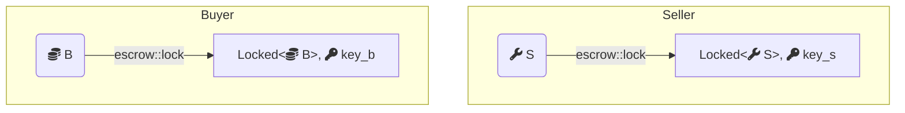
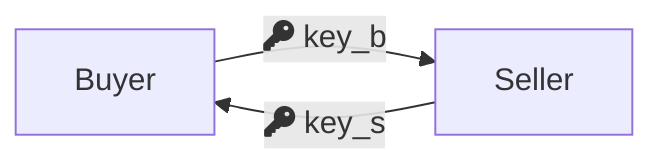
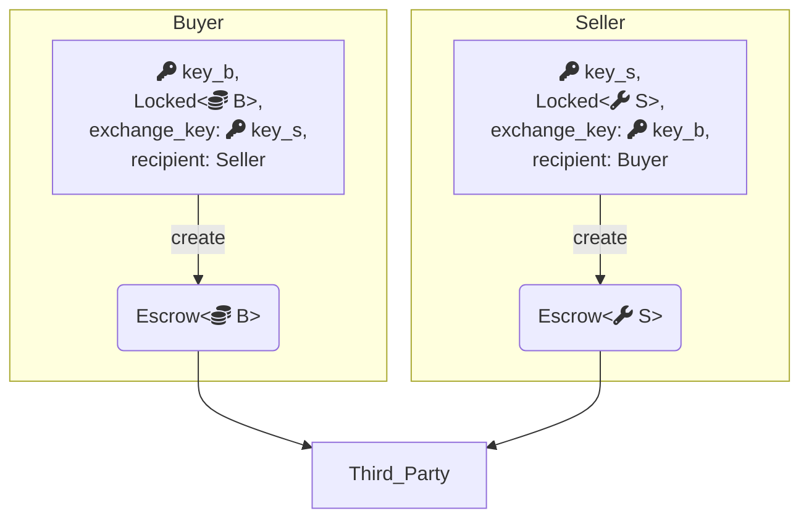
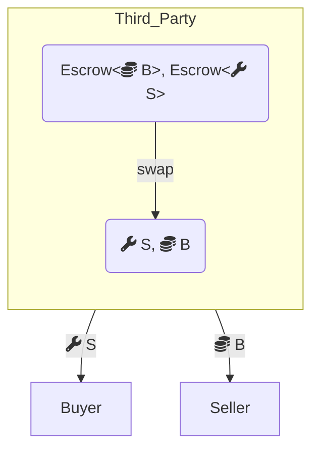
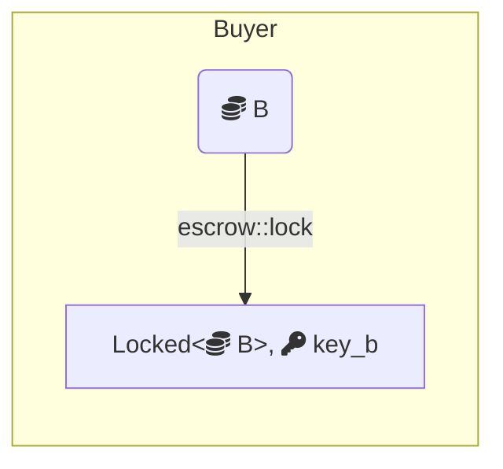
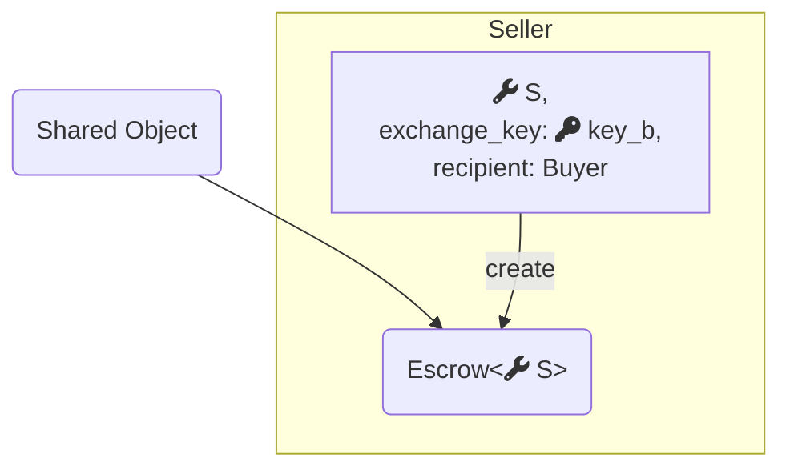
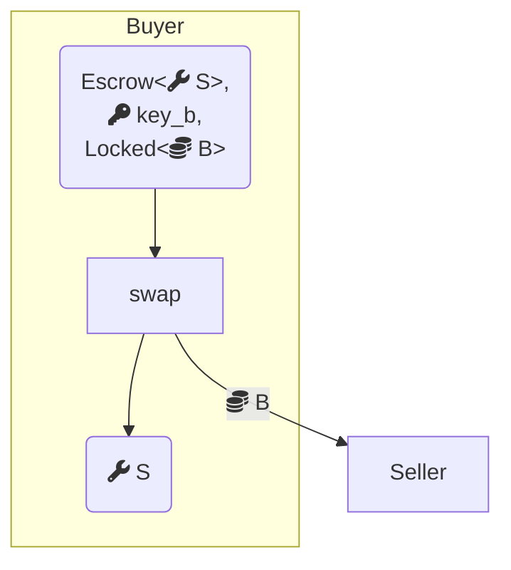

Objects on Sui can be shared (accessible for reads and writes by any transaction) or owned (accessible for reads and writes by transactions signed by their owner).  Many applications can be built using a solution that either uses shared objects or only owned objects, with trade-offs for each that need to be weighed.

Transactions that use only owned objects benefit from very low latency to finality, because they do not need to go through consensus.  On the other hand, the fact that only the owner of the object can access it complicates processes that need to work with objects owned by multiple parties, and access to very hot objects needs to be coordinated off-chain.

Transactions that access one or more shared objects require consensus to sequence reads and writes to those objects, resulting in a slightly higher gas cost and increased latency.

Transactions that access multiple shared objects, or particularly popular objects, might have increases in latency due to contention. However, the advantage of using shared objects lies in the flexibility of allowing multiple addresses to access the same object in a coordinated manner.

To summarize, applications that are extremely sensitive to latency or gas costs, that do not need to handle complex multi-party transactions, or that already require an off-chain service could benefit from a design that only uses owned objects. Applications that require coordination between multiple parties typically benefit from using shared objects.

For more information on the types of objects that Sui supports, see [Object Ownership](/concepts/object-ownership.mdx).

## Example: Escrow

The Escrow example demonstrates the trade-offs between shared objects and owned objects by implementing the same application in both styles. It implements a service that allows two addresses to perform a trustless swap of objects with each other (a "trade") with the service holding their objects in escrow.

### `Locked<T>` and `Key`

[Code Sample](https://github.com/MystenLabs/sui/blob/93e6b4845a481300ed4a56ab4ac61c5ccb6aa008/examples/move/escrow/sources/lock.move)

Both implementations use a primitive for locking values, which offers the following interface:

```move
module escrow::lock {
    public fun lock<T: store>(obj: T, ctx: &mut TxContext): (Locked<T>, Key);
    public fun unlock<T: store>(locked: Locked<T>, key: Key): T
}
```

Any `T: store` can be locked, to get a `Locked<T>` and a corresponding `Key`, and conversely, the locked value and its corresponding key can be consumed to get back the wrapped object.

The important property that this interface provides is that locked values cannot be modified except by unlocking them first (and later relocking them).  Because unlocking consumes the key, tampering with a locked value can be detected by remembering the ID of the key that it was locked with.  This prevents situations where one party in a swap changes the object they are offering to reduce its value.

### Owned objects

<details>
<summary>
`owned.move`
</summary>
{@inject: examples/trading/contracts/escrow/sources/owned.move}
</details>

The protocol for swapping via escrow implemented using owned objects starts with both parties locking their respective objects. 



This is used to prove that the object has not been tampered with after the swap has been agreed to. If either party doesn't want to proceed at this stage, they just unlock their object.

Assuming both parties are happy to continue, the next step requires both parties to swap the keys.



A third party acts as custodian. The custodian holds objects that are waiting for their counterparts to arrive and when they arrive, it matches them up to complete the swap.

{@inject: examples/trading/contracts/escrow/sources/owned.move#fun=create noComments}



The `create` function prepares the `Escrow` request and sends it to the `custodian`.  The object being offered by this party is passed in, locked, with its key, and the object being requested is identified by the ID of the key it was locked with.  While preparing the request, the offered object is unlocked, while remembering the ID of its key.

Although the custodian is trusted to preserve liveness (to complete swaps if it owns both sides of a swap and to return objects if requested), all other correctness properties are maintained in Move: Even though the custodian owns both objects being swapped, the only valid action they are permitted to take is to match them up with their correct counterpart to finish the swap, or to return them:



{@inject: examples/trading/contracts/escrow/sources/owned.move#fun=swap}

The `swap` function checks that senders and recipients match and that each party wants the object that the other party is offering, by comparing their respective key IDs.  If the custodian tried to match together two unrelated escrow requests to swap, the transaction would not succeed.

### Shared objects

<details>
<summary>
`shared.move`
</summary>
{@inject: examples/trading/contracts/escrow/sources/shared.move}
</details>

The protocol in the shared object case is less symmetric, but still starts with the first party locking the object they want to swap. 


The second party can then view the object that was locked, and if they decide they want to swap with it, they indicate their interest by creating a swap request:



{@inject: examples/trading/contracts/escrow/sources/shared.move#fun=create noComments}

This time the `create` request accepts the object being escrowed directly (not locked), and creates a shared `Escrow` object.  The request remembers the address that sent it (who is allowed to reclaim the object if the swap hasn't already happened), and the intended recipient, who is then expected to continue the swap by providing the object they initially locked:



{@inject: examples/trading/contracts/escrow/sources/shared.move#fun=swap}


Even though the `Escrow` object is a shared object that is accessible by anyone, the Move interface ensures that only the original sender and the intended recipient can successfully interact with it. `swap` checks that the locked object matches the object that was requested when the `Escrow` was created (again, by comparing key IDs) and assumes that the intended recipient wants the escrowed object (if they did not, they would not have called `swap`).

Assuming all checks pass, the object held in `Escrow` is extracted, its wrapper is deleted and it is returned to the first party.  The locked object offered by the first party is also unlocked and sent to the second party, completing the swap.

### Comparison

This topic explores two ways to implement a swap between two objects.  In both cases there is a point at which one party has made a request and the other has not responded.  At this point, both parties may want to access the `Escrow` object: One to cancel the swap, and the other to complete it.

In one case, the protocol uses only owned objects but requires a custodian to act as an intermediary. This has the advantage of avoiding the costs and latencies of consensus altogether, but involves more steps and requires trusting a third party for liveness.

In the other case, the object is custodied on chain in a shared object.  This requires consensus but involves fewer steps, and no third party.
