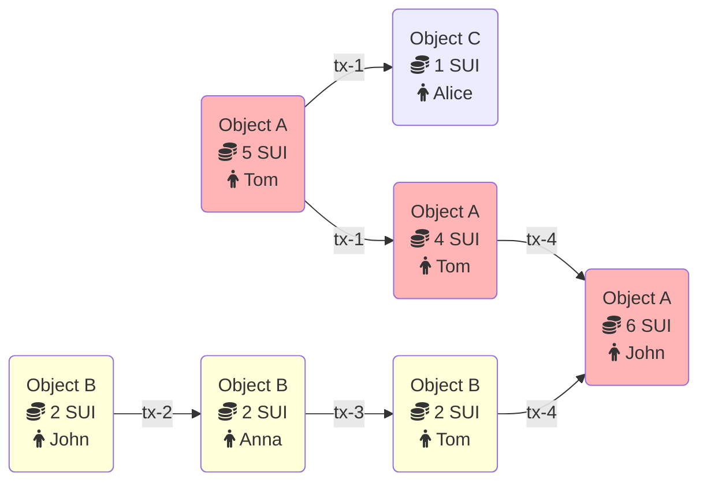

Every update on Sui, whether to the network itself or to objects on the network, happens through a transaction. Transactions handle everything from creating objects and minting assets to managing network operations.

Sui has two types of transactions:

- **Programmable transaction blocks (PTBs):** Enable everyday network activities like deploying smart contracts and sending tokens. Anyone can create and submit PTBs.

- **System transactions:** Manage network events such as epoch changes and checkpoint creation. Only validators can submit system transactions.

## Transaction metadata

Programmable transaction blocks have the following metadata fields:

- **Sender address:** The [address](/guides/developer/getting-started/get-address.mdx) of the user sending the transaction.

- **Gas input:** A reference pointing to the object used to pay for the transaction's execution and storage. The sender address must own the object and it must be of type `sui::coin::Coin<SUI>`.

- **Gas price:** An unsigned integer specifying the number of native tokens per gas unit the transaction pays. The gas price must be greater than zero.

- **Maximum gas budget:** The maximum number of gas units that can be used to execute the transaction. If execution exceeds this budget, the transaction aborts without any effects except charging the gas input object. The gas input object must have a balance greater than or equal to the gas price multiplied by the maximum gas budget. This product represents the maximum amount that can be charged for the transaction.

- **Epoch:** The epoch this transaction is intended for.

- **Type:** Identifies whether the transaction is a call, publish, or native transaction and its type-specific data.

- **Authenticator:** A cryptographic signature and a public key that verifies against the signature and is cryptographically committed to by the sender address.

- **Expiration:** An epoch reference that sets a deadline after which validators no longer consider the transaction valid. The optional expiration epoch reference enables users to define transactions that either execute and commit by a set time (current epoch less than or equal to expiration epoch), or never execute after the deadline passes. By default, there is no deadline for when a transaction must execute. 

System transactions do not have gas input, price, or budget, and do not have an expiration. The sender address of a system transaction is always `0x0`.

## Example of a transaction flow

The relationship between objects and transactions is written in a [directed acyclic graph](https://en.wikipedia.org/wiki/Directed_acyclic_graph) (DAG).

The following example shows how objects and transactions are connected to each other in Sui.

Consider two objects:

- Object A contains 5 SUI coins and belongs to Tom.
- Object B contains 2 SUI coins and belongs to John.

Tom decides to send 1 SUI coin to Alice. In this case, Object A is the input to this transaction and 1 SUI coin is debited from this object. The output of the transaction is: 

- Object A with 4 SUI coins that still belongs to Tom.
- New Object C that contains 1 SUI coin and belongs to Alice.

At the same time, John decides to send 2 SUI coins to Anna. The output of this transaction is:

- Object B that contains 2 SUI coins and now belongs to Alice. 

Because both transactions interact with different objects, the second transaction executes in parallel with the first transaction that sends coins from Tom to Alice. 

After receiving 2 SUI coins, Anna sends them to Tom. Now Tom has 6 SUI coins, 4 from Object A and 2 from Object B.

Finally, Tom sends all of his SUI coins to John. For this transaction, the input is both Object A and Object B. Object B is destroyed, and its value is added to Object A. As a result, the transaction's output is only Object A with a value of 6 SUI.

## Limits on transactions, objects, and data

Sui has some limits on transactions and the data used in them, such as a maximum size and number of objects used. You can find these limits in the [`sui-protocol-config` crate](https://github.com/MystenLabs/sui/blob/main/crates/sui-protocol-config/src/lib.rs) of the Sui repo. The limits are defined in the `ProtocolConfig` struct and values set in the `get_for_version_impl` function.