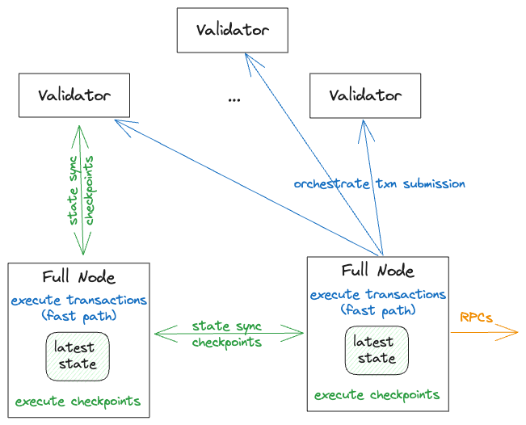

Managing the data on your Sui Full node is critical to ensuring a healthy Sui network. This topic provides a high-level description of data management on Sui Full nodes that you can use to optimize your Full node configuration. For more information about Sui Full nodes, such as pruning policies and archival settings, see [Run a Sui Full Node](./sui-full-node.mdx).

## Basic Sui Full node functionality

The minimal version of a Sui Full node executes all of the transactions Sui validators commit. Sui Full nodes also orchestrate the submitting of new transactions to the system:



The preceding image shows how data flows through a Full node:

1. **`State sync` protocol:** A Sui Full node performs the following to achieve state synchronization:
   - Retrieves the information about the committed checkpoints via the p2p gossip-like protocol
   - Executes the transactions locally to verify that effects match the effects certified by the quorum of the validators
   - Updates the local state with the latest object values accordingly.
2. **RPCs:** A Sui Full node exposes Sui RPC endpoints for querying the latest state of the system, including both the latest state metadata (such as, `sui_getProtocolConfig`), and the latest state object data (`sui_getObject)`.
3. **Transaction submission:** Each Sui Full node orchestrates transaction submission to the quorum of the Sui Validators, and, optionally if configured, locally executes the finalized transactions (called fast path execution), which circumvents the wait for checkpoint synchronization.

## Sui Full node Data and RPC types

A Sui Full Node stores multiple categories of data in its permanent store.

:::info

The per-epoch Sui store is beyond the scope of this topic. Sui uses the per-epoch store (resets at the start of each epoch) internally for authority and consensus operations.

:::

Sui Full nodes store the following types of data:

1. **Transactions with associated effects and events:** Sui uses a unique transaction digest to retrieve information about a transaction, including its effects and emitted events. Sui Full nodes don't require the historic transaction information for basic Full node operations. To conserve drive space, you can enable pruning to remove this historical data.
2. **Checkpoints:** Sui groups committed transactions in checkpoints, and then uses those checkpoints to achieve state synchronization. Checkpoints keep transaction digests that contain additional integrity metadata.
Sui Full nodes don't require data from checkpoints to  execute and submit transactions, so you can configure pruning for this data as well.
3. **Objects:** Transactions that mutate objects create new object versions. Each object has a unique pair of `(objectId, version)` used to identify the object. Sui Full nodes don't require historic object versions to  execute and submit transactions, so you can configure your Full node to also prune this data. 
4. **Indexing information:** A Full node default configuration is to post-process the committed transactions: it indexes the committed information to enable efficient aggregation and filtering queries. For example, the indexing can be useful for retrieving all the historic transactions of a given sender, or finding all the objects owned by an address. 

Sui Full nodes support more than 40 RPC types that includes the following categories:

* **General metadata**, such as `sui_getProtocolConfig` and `sui_getChainIdentier`. These requests don't depend on additional indexing and don't require historic data to process.
* **Direct lookups**, such as `sui_getObject`, `sui_getEvents`. These requests don't depend on additional indexing, but require historic data in some cases, such as `sui_tryGetPastObject` and `sui_getTransactionBlock`.
* **Accumulation and filtering queries**,such as `suix_getOwnedObjects` and `suix_getCoins`. These requests depend on additional indexing, and require historic data in some cases, such as `suix_queryTransactionBlocks`.

:::info

Sui plans to migrate the RPC endpoints that require additional indexing away from Sui Full nodes in the near future. This plan decouples the storage that is backing transaction execution from the storage that is better suited for data indexing.

:::

## Sui Archival data

A Sui archive instance stores the full Sui transaction history since genesis in a database agnostic format. This includes information about transactions (with client authentication), effects, events, and checkpoints. As such, archival storage can be used for data auditing and for replaying historic transactions.

:::info

The current archival storage format doesn't include historic object versions. 

:::

As a Full node operator, you can [enable archival fallback for your Full node](./sui-full-node.mdx#set-up-archival-fallback) by specifying the URL to upload archival data. Currently, Mysten Labs manages a Sui archive and stores it in AWS S3. To ensure a healthy network, we encourage the Sui community to set  up additional archives to ensure archival data availability across the network. In a typical configuration, an archive trails behind the latest checkpoint by approximately 10 minutes.

A Full Node that starts from scratch can replay (and thus re-verify) transactions that occurred since Sui genesis from the given archive via [configuring Archival Fallback](./sui-full-node.mdx#archival-fallback) in the `fullnode.yaml` configuration file to point to the S3 bucket that stores the archive.

A Sui Full node that fails to retrieve checkpoints from its peers via state sync protocol falls back to downloading the missing checkpoints from its pre-configured archive. This fallback enables a Full node to catch up with the rest of the system regardless of the pruning policies of its peers.

## Sui Full node pruning policies

As described previously, sustainable disk usage requires Sui Full nodes to prune the information about historic object versions as well as historic transactions with the corresponding effects and events, including old checkpoint data.

Both transaction and object pruners run in the background. The logical deletion of entries from RocksDB ultimately triggers the physical compaction of data on disk, which is governed by RocksDB background jobs: the pruning effect on disk usage is not immediate and might take multiple days.

To learn more about object pruning policies, see  [Object pruning](./sui-full-node.mdx#object-pruning). You can configure the pruner in two modes:
* **aggressive pruning** (`num-epochs-to-retain: 0`): Preferred option. Sui prunes old object versions as soon as possible.
* **epoch-based pruning** (`num-epochs-to-retain: X`): Sui prunes old object versions after X epochs.

:::tip 

Testing indicates that aggressive pruning results in more efficient Full Node operation.

:::

To learn more about transaction pruning policies, see  [Transaction pruning](./sui-full-node.mdx#transaction-pruning). To configure transaction pruning, specify the `num-epochs-to-retain-for-checkpoints: X` config option. The checkpoints, including their transactions, effects and events are pruned up to X epochs ago. We suggest setting transaction pruning to 2 epochs.

### Set an archiving watermark

In case your Full node is configured to upload committed information to an archive, you should ensure that pruning doesn't occur until after the corresponding data is uploaded. To do so, set the `use-for-pruning-watermark: true` in the Fullnode.yaml file as described in [Archival fallback](./sui-full-node.mdx#archival-fallback).

## Sui Full node key-value store backup

To enable historic data queries for the Sui Full nodes that prune old transactional data, Full node RPC implementation is configured to fallback for querying missing transactional data from a remote store.

If the information about the transaction digest, effects, events, or checkpoints is not available locally, a Full node automatically retrieves the historical data from a cloud-based key-value store (currently managed by MystenLabs). Note that the current key-value store implementation keeps historic transactional data only: we plan to provide support for a similar setup for retrieving the historic object versions in a future release.

## Object pruning {#object-pruning}

Sui adds new object versions to the database as part of transaction execution. This makes previous versions ready for 
garbage collection. However, without pruning, this can result in database performance degradation and requires large 
amounts of storage space. Sui identifies the objects that are eligible for pruning in each checkpoint, and then performs
the pruning in the background.

You can enable pruning for a Sui node by adding the `authority-store-pruning-config` config to `fullnode.yaml` file:
```yaml
authority-store-pruning-config:
  # Number of epoch dbs to keep 
  # Not relevant for object pruning
  num-latest-epoch-dbs-to-retain: 3
  # The amount of time, in seconds, between running the object pruning task.
  # Not relevant for object pruning
  epoch-db-pruning-period-secs: 3600
  # Number of epochs to wait before performing object pruning.
  # When set to 0, Sui prunes old object versions as soon
  # as possible. This is also called *aggressive pruning*, and results in the most effective
  # garbage collection method with the lowest disk usage possible. 
  # This is the recommended setting for Sui Validator nodes since older object versions aren't
  # necessary to execute transactions.
  # When set to 1, Sui prunes only object versions from transaction checkpoints
  # previous to the current epoch. In general, when set to N (where N >= 1), Sui prunes  
  # only object versions from checkpoints up to `current - N` epoch. 
  # It is therefore possible to have multiple versions of an object present 
  # in the database. This setting is recommended for Sui Full nodes as they might need to serve 
  # RPC requests that require looking up objects by ID and Version (rather than just latest
  # version). However, if your Full node does not serve RPC requests you should then also enable  
  # aggressive pruning.
  num-epochs-to-retain: 1
  # Advanced setting: Maximum number of checkpoints to prune in a batch. The default
  # settings are appropriate for most use cases.
  max-checkpoints-in-batch: 10
  # Advanced setting: Maximum number of transactions in one batch of pruning run. The default
  # settings are appropriate for most use cases.
  max-transactions-in-batch: 1000
```
## Transaction pruning {#transaction-pruning}

Transaction pruning removes previous transactions and effects from the database.
Sui periodically creates checkpoints. Each checkpoint contains the transactions that occurred during the checkpoint and their associated effects.

Sui performs transaction pruning in the background after checkpoints complete.

You can enable transaction pruning for your Full node or Validator node by adding  `num-epochs-to-retain-for-checkpoints`
to the `authority-store-pruning-config` config for the node:

```yaml
authority-store-pruning-config:
  num-latest-epoch-dbs-to-retain: 3
  epoch-db-pruning-period-secs: 3600
  num-epochs-to-retain: 0
  max-checkpoints-in-batch: 10
  max-transactions-in-batch: 1000
  # Number of epochs to wait before performing transaction pruning.
  # When this is N (where N >= 2), Sui prunes transactions and effects from 
  # checkpoints up to the `current - N` epoch. Sui never prunes transactions and effects from the current and
  # immediately prior epoch. N = 2 is a recommended setting for Sui Validator nodes and Sui Full nodes that don't 
  # serve RPC requests.
  num-epochs-to-retain-for-checkpoints: 2
  # Ensures that individual database files periodically go through the compaction process.
  # This helps reclaim disk space and avoid fragmentation issues
  periodic-compaction-threshold-days: 1
```

:::info

If you prune transactions, Archival nodes can help ensure lagging peer nodes don't lose any information. For more information, see [Sui Archives](./archives.mdx).

:::


## Pruning policy examples

Use the examples in this section to configure your Sui Full node. You can copy the examples, and then, optionally, modify the values as appropriate for your environment. 

### Validator and minimal Full node

This configuration keeps disk usage to a minimum. It is suitable for most validators. A Full node with this configuration cannot answer queries that require indexing or historic data.

```yaml
# Do not generate or maintain indexing of Sui data on the node
enable-index-processing: false

authority-store-pruning-config:
  # Prune historic object versions as soon as possible.
  num-epochs-to-retain: 0
  # Prune historic transactions of the past epochs
  num-epochs-to-retain-for-checkpoints: 2
```

### Full node with indexing but no history

This setup manages secondary indexing in addition to the latest state, but aggressively prunes historic data. A Full node with this configuration:

- Answers RPC queries that require indexing, like `suix_getBalance()`.
- Answers RPC queries that require historic transactions via a fallback to retrieve the data from a remote key-value store: `sui_getTransactionBlock()`.
- Cannot answer RPC queries that require historic object versions: `sui_tryGetPastObject()`.
  - The `showBalanceChanges` filter of `sui_getTransactionBlock()` query relies on historic object versions, so it can't work with this configuration.

```yaml
authority-store-pruning-config:
  # Prune historic object versions
  num-epochs-to-retain: 0
  # Prune historic transactions of the past epochs
  num-epochs-to-retain-for-checkpoints: 2
```

### Full node with full object history but pruned transaction history

This configuration manages the full object history while still pruning historic transactions. A Full node with this configuration can answer all historic and indexing queries (using the transaction query fallback for transactional data), including the ones that require historic objects such as the `showBalanceChanges` filter of `sui_getTransactionBlock()`.

The main caveat is that the current setup enables **transaction pruner** to go ahead of **object pruner**. The object pruner might not be able to properly clean up the objects modified by the transactions that have been already pruned. You should closely monitor the disk space growth on a Full node with this configuration.

In addition to the regular (pruned) snapshots, Mysten Labs also maintains special RocksDB snapshots with full history of object versions available for the operators using this configuration.

```yaml
authority-store-pruning-config:
  # No pruning of object versions with u64::max for num of epochs.
  # Set a lower value for a smaller objects history.
  num-epochs-to-retain: 18446744073709551615
  # Prune historic transactions of the past epochs
  num-epochs-to-retain-for-checkpoints: 2
```
