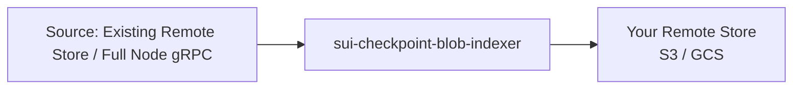

The remote store is an object store (S3 or GCS) containing protobuf-encoded checkpoint blobs. Full nodes read from it for state sync and indexers read from it for backfills. The `sui-checkpoint-blob-indexer` populates this store by reading checkpoints from a source and writing compressed protobuf blobs to a destination.

## Architecture overview



<Tabs className="tabsHeadingCentered--small">
<TabItem value="prereq" label="Prerequisites">

- Access to a checkpoint source:
   - **Mysten's public buckets**: GCS bucket `mysten-mainnet-checkpoints` (Mainnet) or `mysten-testnet-checkpoints` (Testnet). Also available over HTTPS at `https://checkpoints.mainnet.sui.io` and `https://checkpoints.testnet.sui.io`.
   - **Your own full node:** Must have gRPC enabled for steady-state streaming.
- A destination object store with write credentials (S3 or GCS).
- The `sui-checkpoint-blob-indexer` binary.

</TabItem>
</Tabs>

## Pipelines

The indexer runs three pipelines. Only the first two should be enabled:

| Pipeline | Output | Description |
|----------|--------|-------------|
| `checkpoint_blob` | `{seq}.binpb.zst` | Protobuf-encoded checkpoint blobs. **This is the format to use.** |
| `epochs` | `epochs.json` | Sorted list of epoch-boundary checkpoint sequence numbers. Required metadata. |
| `checkpoint_bcs` | `{seq}.chk` | BCS-encoded checkpoints. **Deprecated and being decommissioned. Do not enable this pipeline.** |

## Backfill from an existing bucket

The easiest way to populate your own remote store is to backfill from Mysten's public GCS buckets. Use `--remote-store-gcs` as the source and a destination flag (`--s3` or `--gcs`) to write to your store.

#### Example: Backfill an S3 bucket from Mysten's GCS bucket (Mainnet)

```sh
sui-checkpoint-blob-indexer \
    --pipeline checkpoint_blob --pipeline epochs \
    --remote-store-gcs mysten-mainnet-checkpoints \
    --s3 my-checkpoint-bucket \
    --compression-level 3
```

For Testnet, use `--remote-store-gcs mysten-testnet-checkpoints`.

You can also use `--remote-store-url https://checkpoints.mainnet.sui.io` instead of `--remote-store-gcs`, but the GCS option is faster for backfill since it uses the GCS API directly rather than HTTPS.

:::info

Mysten Labs plans to enable requester-pays on the public checkpoint buckets in the future. Streaming from your own full node avoids these costs.

:::

## Alternative: Backfill from a full node

If you have an unpruned full node, you can use it as the checkpoint source instead of a bucket:

```sh
sui-checkpoint-blob-indexer \
    --pipeline checkpoint_blob --pipeline epochs \
    --rpc-api-url http://my-fullnode:9000 \
    --s3 my-checkpoint-bucket \
    --compression-level 3
```

## Steady-state operation

Once the backfill has caught up to the network tip, switch to full node gRPC streaming for the lowest latency. Use `--rpc-api-url` for checkpoint fetching and `--streaming-url` for live streaming:

```sh
sui-checkpoint-blob-indexer \
    --pipeline checkpoint_blob --pipeline epochs \
    --rpc-api-url http://my-fullnode:9000 \
    --streaming-url http://my-fullnode:9000 \
    --s3 my-checkpoint-bucket \
    --compression-level 3
```

The full node only needs gRPC enabled. JSON-RPC is not required.

### Running multiple instances

Writes are idempotent, so multiple indexer instances can safely write to the same bucket. Run **2–3 instances** at steady state to enable rolling deployments without ever delaying updates from the chain. During backfill, a single instance is sufficient.

## CLI reference

### Destination flags (mutually exclusive, one required)

| Flag | Description |
|------|-------------|
| `--s3 <BUCKET>` | Write to AWS S3. Env: `AWS_ENDPOINT`, `AWS_ACCESS_KEY_ID`, `AWS_SECRET_ACCESS_KEY`, `AWS_DEFAULT_REGION`. |
| `--gcs <BUCKET>` | Write to Google Cloud Storage. Env: `GOOGLE_SERVICE_ACCOUNT_PATH`. |
| `--http <URL>` | Write to an HTTP endpoint. |

### Source flags (mutually exclusive, one required)

| Flag | Description |
|------|-------------|
| `--remote-store-gcs <BUCKET>` | Fetch checkpoints from a GCS bucket. Recommended for backfill. |
| `--remote-store-url <URL>` | Fetch checkpoints from an HTTPS remote store URL. |
| `--remote-store-s3 <BUCKET>` | Fetch checkpoints from an S3 bucket. |
| `--rpc-api-url <URL>` | Fetch checkpoints from a full node gRPC endpoint. |

### Other flags

| Flag | Default | Description |
|------|---------|-------------|
| `--config <PATH>` | — | Path to optional TOML configuration file. Framework defaults are sufficient for most deployments. See [Configuration](#configuration-toml). |
| `--compression-level <LEVEL>` | None (uncompressed) | Zstd compression level. **Strongly recommended.** Without this flag, files are written as `.binpb` instead of `.binpb.zst`. The indexer framework expects `.binpb.zst` when reading from a remote store, so uncompressed files will not be found by downstream consumers. A value of `3` is a good default. |
| `--streaming-url <URL>` | — | Full node gRPC URL for streaming live checkpoints. Used alongside `--rpc-api-url` for lowest latency at the network tip. |
| `--first-checkpoint <N>` | 0 | Checkpoint to start indexing from. |
| `--last-checkpoint <N>` | — | Checkpoint to stop indexing at (inclusive). Useful for bounded backfill jobs. |
| `--pipeline <NAME>` | All pipelines | Only run the specified pipeline(s). Can be repeated. |
| `--request-timeout <DURATION>` | `30s` | HTTP request timeout for object store operations. |
| `--metrics-address <ADDR>` | `0.0.0.0:9184` | Prometheus metrics bind address. |

## Configuration (TOML)

Use `--pipeline` to run only the two recommended pipelines and exclude the deprecated BCS pipeline:

```sh
--pipeline checkpoint_blob --pipeline epochs
```

Pass the following TOML configuration file via `--config` to tune the committer for object store workloads:

```toml
[committer]
write-concurrency = 500
watermark-interval-ms = 120000
watermark-interval-jitter-ms = 120000
```

- **`write-concurrency`** — Allows up to 500 concurrent writes to the object store. Decrease this if you observe heavy throttling from your storage provider.
- **`watermark-interval-ms`** — Reduces the frequency of watermark updates from the framework default to avoid hot-key issues on the watermark file in the object store.
- **`watermark-interval-jitter-ms`** — Adds random jitter to the watermark interval, staggering writes when running multiple indexer instances so they don't write to the same key simultaneously.

The configuration options (`[ingestion]`, `[committer]`, `[pipeline.<name>]`) are the same as the indexer framework's standard settings. See [Pipeline architecture: Performance tuning](/concepts/data-access/pipeline-architecture#performance-tuning) for the full reference.

## Output format

The indexer writes the following files to the destination object store:

| Path | Description |
|------|-------------|
| `{seq}.binpb.zst` | Zstd-compressed protobuf checkpoint blob (when `--compression-level` is set). **This is the expected format.** |
| `{seq}.binpb` | Uncompressed protobuf checkpoint blob (without `--compression-level`). **Not recommended** — the indexer framework looks for `.binpb.zst` when ingesting from a remote store. |
| `epochs.json` | JSON array of epoch-boundary checkpoint sequence numbers, sorted. |
| `_metadata/watermarks/` | Internal watermark files used by the indexer to track progress. |

## Monitoring

The indexer exports Prometheus metrics on port 9184 at `/metrics` (configurable via `--metrics-address`). Metrics use the `checkpoint_blob_` prefix. The indexer uses the same [indexer framework metrics](/concepts/data-access/indexer-runtime-perf) as the other indexers (ingestion, pipeline, watermark, and commit metrics), with pipeline-specific labels.

```yaml
scrape_configs:
  - job_name: sui-checkpoint-blob-indexer
    static_configs:
      - targets: ['<HOST>:9184']
```
