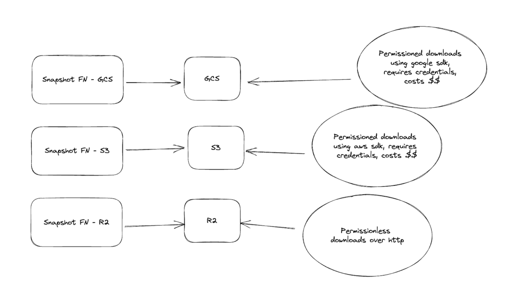

Database snapshots provide a point-in-time view of a database's store. In Sui, the database snapshot captures a running database's view of the Sui network from a particular node at the end of an epoch. While validators can enable snapshots, they are typically most valuable for Full node operators.

Snapshots of the Sui network enable Full node operators a way to bootstrap a Full node without having to execute all the transactions that occurred after genesis. You can upload snapshots to remote object stores like S3, Google Cloud Storage, Azure Blob Storage, and similar services. These services typically run the export process in the background so there is no degradation in performance for your Full node. With snapshots stored in the cloud, you're more easily able to recover quickly from catastrophic failures in your system or hardware.

To maintain a healthy Sui network, Sui encourages the Sui community to bring up additional snapshots to ensure stronger data availability across the network.

## Supported snapshot types

Sui supports two types of snapshots:

- **RocksDB snapshots** are a point-in-time view of a database store. This means that the snapshot keeps the state of the system at the moment it generates the snapshot, including non-pruned data, additional indices, and other data.
- **Formal snapshots** are database agnostic with a minimalistic format, in other words they contain only the data necessary to restore a node to a valid state at the specified epoch, thus they have a much smaller storage footprint and are generally faster to restore from when compared to database snapshots. Formal snapshots are also supported natively by the Sui protocol. In this context, this means that we can cryptographically verify the contents of the formal snapshot against a commitment from the committee at the epoch we are restoring to. This verification happens automatically and by default during a Formal snapshot restore (unless explicitly bypassed). 

:::info

Formal snapshots are not suitable for use if you are running an RPC node that does any historical data lookups. For more information on node data management, see [Data Management](./data-management.mdx).

:::

You can configure a Full node snapshot to generate a state snapshot at the end of each epoch.
A single Full node can generate RocksDB snapshots, Formal snapshots, or both.

## Formal snapshots

Formal snapshots provide a mechanism for a node to restore to a canonical state (the state of a full pruned and compacted node at the end of an epoch) at some prior point in time without having to execute all the transactions that have occurred since genesis. Unlike existing database snapshots, these formal snapshots have the following properties:

1. **Minimalism:** Formal snapshots currently contain only the end of epoch live object set (the set of all object versions eligible for use as input objects for future transactions). Sui syncs all other critical chain information from the chain or derives it. Thus, formal snapshots contain only the necessary data required for a node to startup at epoch boundary and participate in the network.
1. **Agnosticism:** Formal snapshots are by nature agnostic to the underlying database choice or implementation of the protocol. As the live object set is protocol defined, so is the formal snapshot.
1. **Verifiability:** Formal snapshots have first-class support in the core Sui protocol. As such, they must be trustless/verifiable by the node operator upon download. To support this, the protocol signs a commitment to the live object state at end of epoch, which formal snapshots are checked against at restore time. If this verification fails, the node state is moved back to the state before the snapshot restore attempt.

Because these snapshots do not contain indexes, they are most immediately useful for validators and state sync Full nodes (SSFNs). You can upload snapshots to remote object stores like S3, Google Cloud Storage, Azure Blob Storage, and similar services. These services typically run the export process in the background so there is no degradation in performance for your Full node. With snapshots stored in the cloud, you can recover from catastrophic failures in your system or hardware more efficiently.

## Restoring a Full node using snapshots

### Restoring using RocksDB snapshots

To restore from a RocksDB snapshot, follow these steps:

1. Download the snapshot for the epoch you want to restore to your local disk. There is one snapshot per epoch in s3 bucket.
1. Place the snapshot into the directory that the `db-config` value points to in your fullnode.yaml file. For example, if the `db-config` value points to `/opt/sui/db/authorities_db/full_node_db` and you want to restore from epoch 10, then copy the snapshot to the directory with this command:

   You can use the aws cli (provided you have credentials to associate with the download):
   `aws s3 cp s3://<BUCKET_NAME>/epoch_10 /opt/sui/db/authorities_db/full_node_db/live --recursive --request-payer`.
   
   An alternative is to use `sui-tool` to copy the files:
   ```
   sui-tool download-db-snapshot --latest \
       --network <NETWORK> --snapshot-bucket <BUCKET-NAME> \
       --snapshot-bucket-type <TYPE> --path <PATH-TO-NODE-DB> \
       --num-parallel-downloads 25 \
       --skip-indexes \
       --no-sign-request
   ```
   - `--epoch`: The epoch that you want to download. Mysten Labs hosted buckets will only keep the last 90 epochs, you can check the most recent epoch on sui explorers like [suivision](https://suivision.xyz/) or [suiscan](https://suiscan.xyz/).
   - `--latest`: Rather than explicitly passing a epoch via `--epoch`, you can pass the `--latest` flag, which will automatically select the latest snapshot`
   - `--network`: Network to download snapshot for. Defaults to "mainnet".
   - `--path`: Path to snapshot directory on local filesystem.
   - `--no-sign-request`: If set, `--snapshot-bucket` and `--snapshot-bucket-type` are ignored, and a static Cloudflare R2 bucket is used.
   - `--snapshot-bucket`: Source snapshot bucket name, eg `mysten-mainnet-snapshots`. This cannot be used with `--no-sign-request`.
   - `--snapshot-bucket-type`: Snapshot bucket type. GCS and S3 currently supported. This cannot be used with `--no-sign-request`.
   - `--skip-indexes`: Skips downloading the very large `indexes/` dir, used by jsonrpc on the fullnode

   The following environment variables are used if `--no-sign-request` is not set:
   * *AWS*: `AWS_SNAPSHOT_ACCESS_KEY_ID`, `AWS_SNAPSHOT_SECRET_ACCESS_KEY`, `AWS_SNAPSHOT_REGION`
   * *GCS*: `GCS_SNAPSHOT_SERVICE_ACCOUNT_FILE_PATH`
   * *AZURE*: `AZURE_SNAPSHOT_STORAGE_ACCOUNT`, `AZURE_SNAPSHOT_STORAGE_ACCESS_KEY`

1. When using `sui-tool download-db-snapshot` the database is copied to the location you pass to `--path`, in a directory named `epoch_[NUM]`. Rename the `epoch_[NUM]` directory to `live/` under your node's `db_path`, for example `cp -r /tmp/epoch_[NUM] /opt/sui/db/authorities_db/full_node_db/live`.
1. Make sure you update the ownership of the downloaded directory to the sui user (whichever linux user you run `sui-node` as)
   `sudo chown -R sui:sui  /opt/sui/db/authorities_db/full_node_db/live`.
1. Start the Sui node.

:::info

When you restore a Full node from a snapshot, write it to the path `/opt/sui/db/authorities_db/full_node_db/live`. When restoring a Validator node, you can shorten the database destination to `/opt/sui/db/authorities_db/live`. Check the `db_path` field of your Full node or Validator configs to confirm the path location.

:::

### Restoring using Formal snapshots

To restore using a Formal snapshot, use the `sui-tool` binary. `sui-tool` can be downloaded along with other sui binaries.
See [Install Sui](../developer/getting-started/sui-install.mdx) for more details.

The following steps can be used to restore a node from a Formal snapshot:

1. If it's running, stop the node.
2. Run the command:
   ```
   sui-tool download-formal-snapshot --latest --genesis "<PATH-TO-GENESIS-BLOB>" \
        --network <NETWORK> --snapshot-bucket <BUCKET-NAME> --snapshot-bucket-type <TYPE> \
        --path <PATH-TO-NODE-DB> --num-parallel-downloads 50 --no-sign-request
   ```
   - `--epoch`: The epoch that you want to download. Mysten Labs hosted buckets will only keep the last 90 epochs, you can check the most recent epoch on sui explorers like [suivision](https://suivision.xyz/) or [suiscan](https://suiscan.xyz/).
   - `--latest`: Rather than explicitly passing a epoch via `--epoch`, you can pass the `--latest` flag, which will automatically select the latest snapshot`
   - `--genesis`: The path to the location of the network's `genesis.blob`.
   - `--network`: Network to download snapshot for. Defaults to "mainnet".
   - `--path`: Path to snapshot directory on local filesystem.
   - `--no-sign-request`: If set, `--snapshot-bucket` and `--snapshot-bucket-type` are ignored, and Cloudflare R2 is used.
   - `--snapshot-bucket`: Source snapshot bucket name, eg `mysten-mainnet-snapshots`. This cannot be used with `--no-sign-request`.
   - `--snapshot-bucket-type`: Snapshot bucket type. GCS and S3 currently supported. This cannot be used with `--no-sign-request`.

   The following environment variables are used if `--no-sign-request` is not set:
   * *AWS*: `AWS_SNAPSHOT_ACCESS_KEY_ID`, `AWS_SNAPSHOT_SECRET_ACCESS_KEY`, `AWS_SNAPSHOT_REGION`
   * *GCS*: `GCS_SNAPSHOT_SERVICE_ACCOUNT_FILE_PATH`
   * *AZURE*: `AZURE_SNAPSHOT_STORAGE_ACCOUNT`, `AZURE_SNAPSHOT_STORAGE_ACCESS_KEY`


## Mysten Labs managed snapshots

Mysten Labs hosts two tiers of snapshot storage access. **High throughput, Requester Pays enabled buckets**, and **free, permissionless buckets**.

**High throughput, Requester Pays enabled buckets:**
* GCS and S3 are both setup with requester pays. This means that you'll need to provide a set of valid AWS/GCP credentials when downloading from these buckets.
[Requester Pays](https://cloud.google.com/storage/docs/requester-pays) means you are charged for the egress costs of pulling the snapshot data.
* If you are looking for the best download speeds, we recommend using the S3 buckets with [transfer acceleration](https://aws.amazon.com/s3/transfer-acceleration/) enabled.

**Free, permissionless buckets:**
* These are currently hosted on Cloudflare R2, currently only in North America, but we plan on adding more regions soon.
* Since the bucket is open to the internet, there's no need to provide any cloud credentials.

### Bucket Names
**S3**
Testnet: `s3://mysten-testnet-snapshots/`, `s3://mysten-testnet-formal/`
Mainnet: `s3://mysten-mainnet-snapshots/`,  `s3://mysten-mainnet-formal/`

**GCS**
Testnet: `gs://mysten-testnet-snapshots/`, `gs://mysten-testnet-formal/`
Mainnet: `gs://mysten-mainnet-snapshots/`,  `gs://mysten-mainnet-formal/`



## Enabling snapshots

Full nodes do not take snapshots by default. To enable this feature you must apply specific configs to your Full node.

Follow these steps to change the configs for a Full node:

1. Stop your node, if it's running.
2. Open your fullnode.yaml config file and apply config updates as the following sections show.
3. Save the fullnode.yaml file and restart the node.

### Enabling DB snapshots

Add an entry to the config file for `db-checkpoint-config`. Using Amazon's S3 service as an example:
   ```yaml
   db-checkpoint-config:
     perform-db-checkpoints-at-epoch-end: true
     perform-index-db-checkpoints-at-epoch-end: true
     object-store-config:
       object-store: "S3"
       bucket: "<BUCKET-NAME>"
       aws-access-key-id: “<ACCESS-KEY>”
       aws-secret-access-key: “<SHARED-KEY>”
       aws-region: "<BUCKET-REGION>"
       object-store-connection-limit: 20
   ```
   - `object-store`: The remote object store to upload snapshots. Set as Amazon's `S3` service in the example.
   - `bucket`: The S3 bucket name to store the snapshots.
   - `aws-access-key-id` and `aws-secret-access-key`: AWS authentication information with write access to the bucket.
   - `aws-region`: Region where bucket exists.
   - `object-store-connection-limit`: Number of simultaneous connections to the object store.

### Enabling Formal snapshots

 Add an entry to the config file for `state-snapshot-write-config`. Using Amazon's S3 service as an example:
   ```yaml
   state-snapshot-write-config:
     object-store-config:
       object-store: "S3"
       bucket: "<BUCKET-NAME>"
       aws-access-key-id: “<ACCESS-KEY>”
       aws-secret-access-key: “<SHARED-KEY>”
       aws-region: "<BUCKET-REGION>"
       object-store-connection-limit: 200
   ```
   The configuration settings shown in the example are specific to AWS S3, but GCS, Azure Storage, and Cloudflare R2 are all supported.

