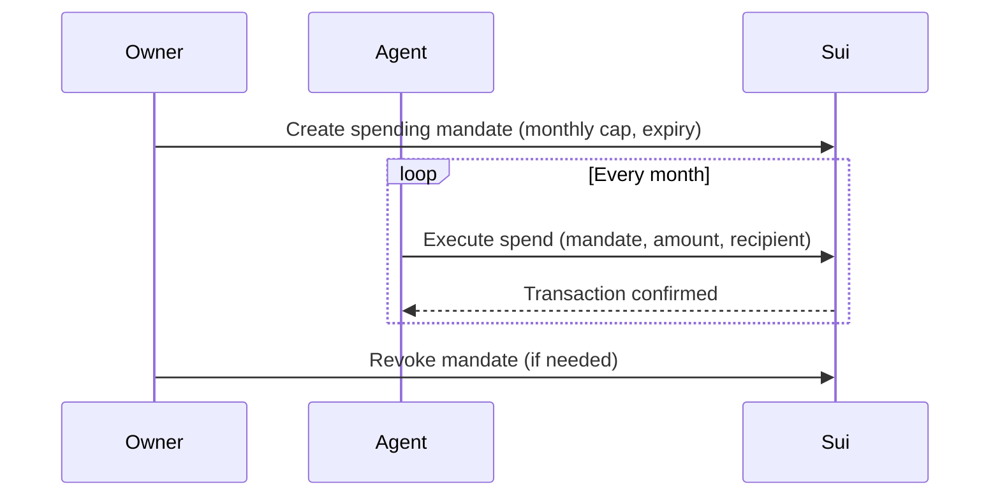

Sui does not have native recurring payments — there is no cron system or auto-debit mechanism that pulls funds from an account on a schedule. Instead, you implement recurring payments using an off-chain scheduler that triggers onchain transactions, or a prepaid streaming object that the recipient claims from over time.

## Pattern 1: Scheduled agent payments

An off-chain agent or cron job executes a payment transaction at each interval. The agent operates under a [spending mandate](/onchain-finance/agentic-payments/spending-policies) that authorizes periodic withdrawals up to a cap.



### Implementation

The agent runs a simple loop or is triggered by a scheduler (cron, Cloud Scheduler, AWS EventBridge):

```typescript
import { SuiGrpcClient } from '@mysten/sui/grpc';
import { Ed25519Keypair } from '@mysten/sui/keypairs/ed25519';
import { Transaction } from '@mysten/sui/transactions';

const client = new SuiGrpcClient({
  baseUrl: 'https://fullnode.mainnet.sui.io:443',
  network: 'mainnet',
});
const agentKeypair = Ed25519Keypair.fromSecretKey(process.env.AGENT_SECRET_KEY!);

async function executeRecurringPayment(
  mandateId: string,
  recipientAddress: string,
  amountMist: bigint,
) {
  const tx = new Transaction();
  tx.setSender(agentKeypair.toSuiAddress());

  tx.moveCall({
    target: '0xPACKAGE::spending_mandate::execute_spend',
    arguments: [
      tx.object(mandateId),
      tx.pure.u64(amountMist),
      tx.pure.address(recipientAddress),
      tx.object('0x6'), // Clock
    ],
  });

  const result = await client.signAndExecuteTransaction({
    transaction: tx,
    signer: agentKeypair,
  });

  if (result.$kind === 'FailedTransaction') {
    throw new Error(`Recurring payment failed: ${result.FailedTransaction.error}`);
  }

  return result.Transaction!.digest;
}
```

:::tip Use idempotency keys

If the scheduler might fire twice (at-least-once delivery), track each payment period in a database and skip execution if the period was already paid. See [Production Hardening](/onchain-finance/agentic-payments/production-hardening#idempotency-keys) for the pattern.

:::

### Advantages and tradeoffs

- **Advantages:** Full control over scheduling logic, easy to pause/resume, works with any payment amount or recipient.
- **Tradeoffs:** Requires an always-on agent or scheduler. The agent holds (or is delegated) spending authority. If the agent goes down, payments stop until it recovers.

## Pattern 2: Prepaid streaming

Lock funds in a shared onchain object with a linear unlock schedule. The recipient claims the unlocked portion at any time. No off-chain agent is needed after the initial deposit.

### Move module

```move
module example::stream;

use sui::balance::{Self, Balance};
use sui::clock::Clock;
use sui::coin::{Self, Coin};
use sui::sui::SUI;

const EStreamNotStarted: u64 = 0;
const ENotRecipient: u64 = 1;
const ENothingToClaim: u64 = 2;

public struct StreamPayment has key {
    id: UID,
    sender: address,
    recipient: address,
    total_amount: u64,
    claimed_amount: u64,
    start_time_ms: u64,
    end_time_ms: u64,
    balance: Balance<SUI>,
}

/// Create a new stream. Funds are locked until the recipient claims them.
public fun create(
    coin: Coin<SUI>,
    recipient: address,
    start_time_ms: u64,
    end_time_ms: u64,
    ctx: &mut TxContext,
) {
    let total = coin.value();
    let stream = StreamPayment {
        id: object::new(ctx),
        sender: ctx.sender(),
        recipient,
        total_amount: total,
        claimed_amount: 0,
        start_time_ms,
        end_time_ms,
        balance: coin.into_balance(),
    };
    transfer::share_object(stream);
}

/// Claim the unlocked portion of the stream.
public fun claim(
    stream: &mut StreamPayment,
    clock: &Clock,
    ctx: &mut TxContext,
): Coin<SUI> {
    assert!(ctx.sender() == stream.recipient, ENotRecipient);

    let now = clock.timestamp_ms();
    assert!(now >= stream.start_time_ms, EStreamNotStarted);

    let elapsed = if (now >= stream.end_time_ms) {
        stream.end_time_ms - stream.start_time_ms
    } else {
        now - stream.start_time_ms
    };

    let total_duration = stream.end_time_ms - stream.start_time_ms;
    let vested = (stream.total_amount as u128) * (elapsed as u128) / (total_duration as u128);
    let claimable = (vested as u64) - stream.claimed_amount;

    assert!(claimable > 0, ENothingToClaim);

    stream.claimed_amount = stream.claimed_amount + claimable;
    coin::from_balance(stream.balance.split(claimable), ctx)
}

/// Cancel the stream and return remaining funds to the sender.
/// Only the sender can cancel.
public fun cancel(
    stream: StreamPayment,
    clock: &Clock,
    ctx: &mut TxContext,
) {
    assert!(ctx.sender() == stream.sender, ENotRecipient);

    let StreamPayment {
        id,
        sender,
        recipient,
        total_amount: _,
        claimed_amount: _,
        start_time_ms: _,
        end_time_ms: _,
        balance,
    } = stream;

    // Return remaining balance to sender
    if (balance.value() > 0) {
        let remaining = coin::from_balance(balance, ctx);
        transfer::public_transfer(remaining, sender);
    } else {
        balance.destroy_zero();
    };

    id.delete();
}
```

### Advantages and tradeoffs

- **Advantages:** No off-chain infrastructure needed after creation. The recipient claims on their own schedule. Funds are locked onchain so neither party can renege.
- **Tradeoffs:** Requires upfront capital to fund the entire stream. The sender cannot change the rate after creation (cancel and recreate instead). Uses a shared object, which adds consensus overhead.

## Choosing between patterns

| Criteria | Scheduled agent | Prepaid stream |
|---|---|---|
| Upfront capital | Pay-as-you-go | Full amount locked |
| Infrastructure | Agent or cron required | None after creation |
| Flexibility | Change amount/recipient anytime | Fixed rate and recipient |
| Cancellation | Stop the agent | Onchain cancel returns remainder |
| Best for | Subscriptions, variable amounts | Salary, vesting, escrow |
