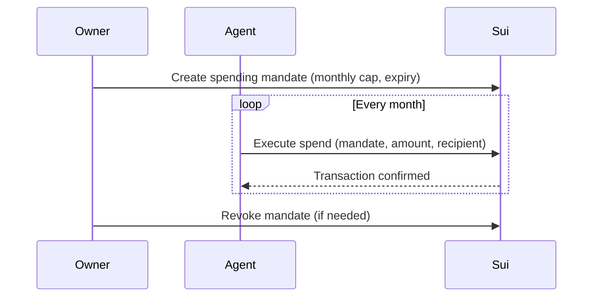

Sui does not have native recurring payments, cron, or automatic debits from a user account. Recurring payments are usually implemented either by an offchain scheduler that submits authorized transactions, or by locking funds into an onchain stream or escrow object that the recipient claims from over time.

## Pattern 1: Scheduled agent payments

An offchain agent or cron job executes a payment transaction at each interval. The agent operates under a [spending mandate](/onchain-finance/agentic-payments/spending-policies) that authorizes periodic withdrawals up to a cap.

```mermaid
sequenceDiagram
    participant Owner
    participant Agent
    participant Sui

    Owner->>Sui: Create spending mandate (monthly cap, expiry)
    loop Every month
        Agent->>Sui: Execute spend (mandate, amount, recipient)
        Sui-->>Agent: Transaction confirmed
    end
    Owner->>Sui: Revoke mandate (if needed)
```

### Implementation

The agent runs a basic loop or is triggered by a scheduler (cron, Cloud Scheduler, AWS EventBridge). Each execution reads the mandate, builds a PTB that calls `execute_spend`, and submits the transaction.

:::tip Use idempotency keys

If the scheduler might fire twice (at-least-once delivery), track each payment period in a database and skip execution if the period was already paid. See [Production Hardening](/onchain-finance/agentic-payments/production-hardening#idempotency-keys) for the pattern.

:::

### Advantages and tradeoffs

- **Advantages:** Full control over scheduling logic, easy to pause/resume, works with any payment amount or recipient.
- **Tradeoffs:** Requires an always-on agent or scheduler. The agent holds (or is delegated) spending authority. If the agent goes down, payments stop until it recovers.

## Pattern 2: Prepaid streaming

Lock funds in a shared onchain object with a linear unlock schedule. The recipient claims the unlocked portion at any time. No offchain agent is needed after the initial deposit.

### Move module

<ImportContent source="examples/onchain-finance/recurring-payments/sources/stream.move" mode="code" tag="stream" />

### Advantages and tradeoffs

- **Advantages:** No offchain infrastructure needed after creation. The recipient claims on their own schedule. On cancellation, vested-but-unclaimed funds go to the recipient and only unvested funds return to the sender.
- **Tradeoffs:** Requires upfront capital to fund the entire stream. The sender cannot change the rate after creation (cancel and recreate instead). Uses a shared object, which adds consensus overhead.

## Choosing between patterns

| Criteria | Scheduled agent | Prepaid stream |
|---|---|---|
| Upfront capital | Pay-as-you-go | Full amount locked |
| Infrastructure | Agent or cron required | None after creation |
| Flexibility | Change amount/recipient anytime | Fixed rate and recipient |
| Cancellation | Stop the agent | Onchain cancel returns remainder |
| Best for | Subscriptions, variable amounts | Salary, vesting, escrow |
