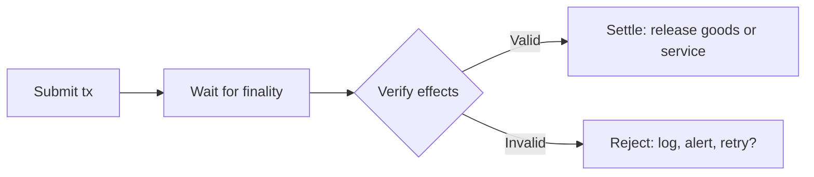

Settlement verification is the step between "I submitted a payment" and "I release the goods or service." An agent should never treat a successful submission as proof of settlement. The verify-then-settle pattern ensures the payment is final and correct before proceeding.

## The verify-then-settle pattern

1. **Submit:** the agent signs and submits the payment transaction.
2. **Wait:** the agent blocks until the transaction is finalized (included in a checkpoint).
3. **Verify:** the agent inspects the transaction effects to confirm the expected outcome.
4. **Settle:** only after verification passes does the agent release the goods, service, or next operation.



## Waiting for finality

After submitting a transaction, use `waitForTransaction` to block until the transaction is finalized. Do not treat a successful submission response as proof of settlement. Submission means the transaction was received, not that it succeeded.

<ImportContent source="examples/onchain-finance/settlement/src/verify.ts" mode="code" tag="wait-for-finality" />

## Verifying transaction effects

After the transaction is confirmed, inspect the effects to verify the payment.

### Check status

The most basic check: did the transaction succeed?

<ImportContent source="examples/onchain-finance/settlement/src/verify.ts" mode="code" tag="assert-success" />

### Verify balance changes

For basic coin transfers, check `balanceChanges` to confirm the correct amount reached the correct recipient.

<ImportContent source="examples/onchain-finance/settlement/src/verify.ts" mode="code" tag="verify-balance-changes" />

### Verify Payment Kit events

If you are using the [Payment Kit](/onchain-finance/payment-kit), verify the payment by checking emitted events instead of raw balance changes. Payment Kit events include the nonce, amount, coin type, and receiver, which makes matching more precise.

<ImportContent source="examples/onchain-finance/settlement/src/verify.ts" mode="code" tag="verify-payment-kit-events" />

## Handling edge cases

### Transaction succeeded but recipient is wrong

This is an agent bug, not a network issue. The transaction is final and cannot be reversed. Prevent this by validating the recipient address before building the transaction:

<ImportContent source="examples/onchain-finance/settlement/src/verify.ts" mode="code" tag="validate-address" />

### Transaction timed out

If `waitForTransaction` times out, the transaction might still succeed later. Query the digest directly before retrying:

<ImportContent source="examples/onchain-finance/settlement/src/verify.ts" mode="code" tag="handle-timeout" />

See [Production Hardening](/onchain-finance/agentic-payments/production-hardening) for the full retry-safety pattern.

### Transaction reverted

If the transaction reverted, user-visible effects (transfers, Move state changes) are rolled back, but the network still charges gas and the gas coin version changes onchain. Read the error message to diagnose the cause:

- **Insufficient balance:** The sender did not have enough coins.
- **Mandate exceeded:** The spending mandate's cap or per-tx limit was hit.
- **Mandate expired:** The mandate's `expires_at_ms` has passed.
- **Recipient not in allowlist:** The allowlist does not include the recipient address.

Log the error, alert the operator, and decide whether to retry (with a corrected transaction) or halt.

## Onchain settlement verification

For high-value flows, move the verification logic onchain using a Move module. The hot potato pattern ensures the settlement check happens within the same transaction as the payment. The caller cannot skip verification.

```move
module example::settlement;

use std::string::{Self, String};
use sui::coin::Coin;
use sui::event;

/// Hot potato (no `drop`): must be consumed in the same transaction.
public struct SettlementProof {
    recipient: address,
    amount: u64,
    coin_type: String,
}

public struct SettlementVerified has copy, drop {
    recipient: address,
    amount: u64,
}

/// Execute a payment and return a proof that must be consumed.
public fun pay_and_prove<T>(
    payment: Coin<T>,
    recipient: address,
): SettlementProof {
    let amount = payment.value();
    let coin_type = std::string::from_ascii(std::type_name::with_defining_ids<T>().into_string());
    transfer::public_transfer(payment, recipient);

    SettlementProof { recipient, amount, coin_type }
}

/// Consume the proof. Call this after verifying the payment details.
/// Because SettlementProof has no `drop`, this function MUST be called
/// in the same transaction. The proof cannot be ignored.
public fun verify_settlement(
    proof: SettlementProof,
    expected_recipient: address,
    expected_amount: u64,
) {
    assert!(proof.recipient == expected_recipient, 0);
    assert!(proof.amount >= expected_amount, 1);

    event::emit(SettlementVerified {
        recipient: proof.recipient,
        amount: proof.amount,
    });

    let SettlementProof { recipient: _, amount: _, coin_type: _ } = proof;
}
```

In the PTB, the caller must chain `pay_and_prove` into `verify_settlement`. If they skip verification, the transaction aborts because nothing consumed the hot potato `SettlementProof`.

<ImportContent source="examples/onchain-finance/settlement/src/verify.ts" mode="code" tag="onchain-settlement-ptb" />

## Polling vs event subscription

Choose based on your agent architecture:

| | Polling | Event subscription |
|---|---|---|
| **How** | Call `waitForTransaction` or `getTransactionBlock` per digest | Subscribe to events through gRPC streaming |
| **Best for** | Request-response agents that process one transaction at a time | High-throughput agents that process many transactions concurrently |
| **Complexity** | Low | Medium (manage stream lifecycle, reconnection) |
| **Latency** | Low for individual transactions | Lowest for bulk monitoring |

For most agents, polling with `waitForTransaction` is sufficient. Use event subscription when your agent monitors a stream of incoming payments (for example, a merchant backend that watches for Payment Kit events across many customers).

See [Using Events](/develop/accessing-data/using-events) for the event subscription API.
