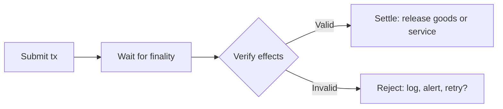

An agent should never release a service before verifying that payment is final. On Sui, finality is fast (sub-second), but the agent must still confirm transaction effects to prevent acting on a failed, reverted, or misrouted transaction.

## The verify-then-settle pattern

The pattern has four steps:

1. **Submit:** the agent (or a user) submits the payment transaction.
2. **Wait:** the agent waits for the transaction to reach finality, not just submission acknowledgment.
3. **Verify:** the agent checks the effects: correct recipient, correct amount, correct coin type, success status.
4. **Settle:** only after verification passes does the agent release the goods, service, or next operation.



## Waiting for finality

After submitting a transaction, use `waitForTransaction` to block until the transaction is finalized. Do not treat a successful submission response as proof of settlement. Submission means the transaction was received, not that it succeeded.

```typescript
import { SuiGrpcClient } from '@mysten/sui/grpc';

const client = new SuiGrpcClient({
  baseUrl: 'https://fullnode.testnet.sui.io:443',
  network: 'testnet',
});

// Submit the transaction
const submitResult = await agentKeypair.signAndExecuteTransaction({
  transaction: tx,
  client,
});

if (submitResult.$kind === 'FailedTransaction') {
  throw new Error(`Transaction failed: ${submitResult.FailedTransaction.status.error?.message}`);
}

// Wait for the transaction to be indexed
await client.waitForTransaction({ digest: submitResult.Transaction.digest });

// Fetch full effects for verification
const confirmed = await client.getTransaction({
  digest: submitResult.Transaction.digest,
  include: { effects: true, balanceChanges: true, events: true },
});
```

## Verifying transaction effects

After the transaction is confirmed, inspect the effects to verify the payment. The result from `getTransaction` uses a `$kind` discriminator (`'Transaction'` on success, `'FailedTransaction'` on failure).

### Check status

The most basic check: did the transaction succeed?

```typescript
function assertSuccess(result: Awaited<ReturnType<typeof client.getTransaction>>) {
  if (result.$kind !== 'Transaction') {
    throw new Error(
      `Transaction failed: ${result.FailedTransaction.status.error?.message}`,
    );
  }
}
```

### Verify balance changes

For basic coin transfers, check `balanceChanges` to confirm the correct amount reached the correct recipient.

```typescript
function verifyPayment(
  result: { $kind: 'Transaction'; Transaction: { balanceChanges?: any[] } },
  expectedRecipient: string,
  expectedAmount: bigint,
  expectedCoinType: string,
): boolean {
  const changes = result.Transaction.balanceChanges ?? [];

  // Find the recipient's positive balance change
  const recipientChange = changes.find(
    (c) =>
      c.address === expectedRecipient &&
      c.coinType === expectedCoinType &&
      BigInt(c.amount) > 0n,
  );

  if (!recipientChange) {
    return false; // No matching change found
  }

  return BigInt(recipientChange.amount) >= expectedAmount;
}

// Usage
const isValid = verifyPayment(
  confirmed,
  recipientAddress,
  5_000_000n,  // 5 USDC
  '0xdba...::usdc::USDC',
);

if (!isValid) {
  throw new Error('Payment verification failed');
}
```

### Verify Payment Kit events

If you are using the [Payment Kit](/onchain-finance/payment-kit), verify the payment by checking emitted events instead of raw balance changes. Payment Kit events include the nonce, amount, coin type, and receiver, which makes matching more precise.

```typescript
function verifyPaymentKitEvent(
  result: { $kind: 'Transaction'; Transaction: { events?: any[] } },
  expectedNonce: string,
  expectedAmount: bigint,
  expectedRecipient: string,
): boolean {
  const events = result.Transaction.events ?? [];

  const paymentEvent = events.find(
    (e) =>
      e.eventType.includes('payment_kit::PaymentProcessed') &&
      e.json?.nonce === expectedNonce,
  );

  if (!paymentEvent) {
    return false;
  }

  const data = paymentEvent.json;
  return (
    BigInt(data.payment_amount) >= expectedAmount &&
    data.receiver === expectedRecipient
  );
}
```

## Handling edge cases

### Transaction succeeded but recipient is wrong

This is an agent bug, not a network issue. The transaction is final and cannot be reversed. Prevent this by validating the recipient address before building the transaction:

```typescript
// Validate before building
if (recipientAddress.length !== 66 || !recipientAddress.startsWith('0x')) {
  throw new Error('Invalid recipient address');
}
```

### Transaction timed out

If `waitForTransaction` times out, the transaction might still succeed later. Query the digest directly before retrying:

```typescript
try {
  await client.waitForTransaction({ digest, timeout: 30_000 });
} catch (timeoutError) {
  // Check if the transaction eventually settled
  try {
    const result = await client.getTransaction({
      digest,
      include: { effects: true },
    });
    // Transaction settled — verify effects
    return result;
  } catch {
    // Transaction never settled — safe to retry with same idempotency key
    throw new Error('Transaction not found — retry is safe');
  }
}
```

See [Production Hardening](/onchain-finance/agentic-payments/production-hardening) for the full retry-safety pattern.

### Transaction reverted

If `result.$kind` is `'FailedTransaction'`, the transaction reverted. User-visible effects (transfers, Move state changes) are rolled back, but the network still charges gas and the gas coin version changes onchain. Read the error message from `result.FailedTransaction.status.error?.message` to diagnose the cause:

- **Insufficient balance:** The sender did not have enough coins.
- **Mandate exceeded:** The spending mandate's cap or per-tx limit was hit.
- **Mandate expired:** The mandate's `expires_at_ms` has passed.
- **Recipient not in allowlist:** The allowlist does not include the recipient address.

Log the error, alert the operator, and decide whether to retry (with a corrected transaction) or halt.

## Onchain settlement verification

For high-value flows, move the verification logic onchain using a Move module. The hot potato pattern ensures the settlement check happens within the same transaction as the payment. The caller cannot skip verification.

```move
module example::settlement;

use std::string::String;
use sui::coin::Coin;
use sui::event;

/// Hot potato (no `drop`) — must be consumed in the same transaction.
public struct SettlementProof {
    recipient: address,
    amount: u64,
    coin_type: String,
}

public struct SettlementVerified has copy, drop {
    recipient: address,
    amount: u64,
}

/// Execute a payment and return a proof that must be consumed.
public fun pay_and_prove<T>(
    payment: Coin<T>,
    recipient: address,
): SettlementProof {
    let amount = payment.value();
    let coin_type = std::type_name::get<T>().into_string().to_ascii_string().to_string();
    transfer::public_transfer(payment, recipient);

    SettlementProof { recipient, amount, coin_type }
}

/// Consume the proof. Call this after verifying the payment details.
/// Because SettlementProof has no `drop`, this function MUST be called
/// in the same transaction. The proof cannot be ignored.
public fun verify_settlement(
    proof: SettlementProof,
    expected_recipient: address,
    expected_amount: u64,
) {
    assert!(proof.recipient == expected_recipient, 0);
    assert!(proof.amount >= expected_amount, 1);

    event::emit(SettlementVerified {
        recipient: proof.recipient,
        amount: proof.amount,
    });

    let SettlementProof { recipient: _, amount: _, coin_type: _ } = proof;
}
```

In the PTB, the caller must chain `pay_and_prove` into `verify_settlement`. If they skip verification, the transaction aborts because nothing consumed the hot potato `SettlementProof`.

```typescript
const tx = new Transaction();

const [coin] = tx.splitCoins(tx.gas, [amount]);

// Pay and get proof
const [proof] = tx.moveCall({
  target: `${PACKAGE_ID}::settlement::pay_and_prove`,
  typeArguments: ['0x2::sui::SUI'],
  arguments: [coin, tx.pure.address(recipient)],
});

// Verify the proof (mandatory — hot potato)
tx.moveCall({
  target: `${PACKAGE_ID}::settlement::verify_settlement`,
  arguments: [
    proof,
    tx.pure.address(recipient),
    tx.pure.u64(amount),
  ],
});
```

## Polling vs event subscription

Choose based on your agent architecture:

| | Polling | Event subscription |
|---|---|---|
| **How** | Call `waitForTransaction` or `getTransaction` per digest | Subscribe to events through gRPC streaming |
| **Best for** | Request-response agents that process one transaction at a time | High-throughput agents that process many transactions concurrently |
| **Complexity** | Low | Medium (manage stream lifecycle, reconnection) |
| **Latency** | Low for individual transactions | Lowest for bulk monitoring |

For most agents, polling with `waitForTransaction` is sufficient. Use event subscription when your agent monitors a stream of incoming payments (for example, a merchant backend that watches for Payment Kit events across many customers).

See [Using Events](/develop/accessing-data/using-events) for the event subscription API.
