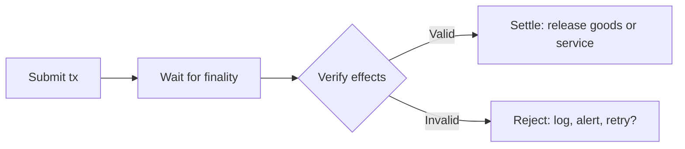

Settlement verification is the step between "I submitted a payment" and "I release the goods or service." An agent should never treat a successful submission as proof of settlement. The verify-then-settle pattern ensures the payment is final and correct before proceeding.

## The verify-then-settle pattern

1. **Submit:** The agent signs and submits the payment transaction.
2. **Wait:** The agent blocks until the transaction is finalized and transaction effects are available.
3. **Verify:** The agent inspects the transaction effects to confirm the expected outcome.
4. **Settle:** Only after verification passes does the agent release the goods, service, or next operation.

```mermaid
flowchart LR
    A[Submit tx] --> B[Wait for finality]
    B --> C{Verify effects}
    C -->|Valid| D[Settle: release goods or service]
    C -->|Invalid| E[Reject: log, alert, retry?]
```

## Waiting for finality

After submitting a transaction, use `waitForTransaction` to block until the transaction is finalized and the transaction block can be queried. Do not treat a successful submission response as proof of settlement. Submission means the transaction was received, not that it succeeded or produced the expected effects.

## Verifying transaction effects

After the transaction is confirmed, inspect the effects to verify the payment:

1. **Check status:** Verify the transaction succeeded (not reverted).
2. **Verify balance changes:** For basic coin transfers, check `balanceChanges` to confirm the exact coin type and amount reached the intended recipient. When checking sender-side changes, account for gas separately so the gas payment does not make the payment verification brittle. 
3. **Verify Payment Kit events:** If you use the [Payment Kit](/onchain-finance/payment-kit), verify the emitted `PaymentReceipt` event. Match the full event type against your network's audited Payment Kit package ID, and match the expected nonce or payment ID, exact amount, coin type, and receiver.

## Handling edge cases

### Transaction succeeded but recipient is wrong

This is an agent bug, not a network issue. The transaction is final and cannot be reversed. Prevent this by validating the recipient address before building the transaction.

### Transaction timed out

If `waitForTransaction` times out, the transaction might still succeed later. Store the submitted digest and query it directly before retrying. Never blindly submit a replacement payment until you know whether the original transaction finalized.

See [Production Hardening](/onchain-finance/agentic-payments/production-hardening) for the full retry-safety pattern.

### Transaction reverted

If the transaction reverted, user-visible effects (transfers, Move state changes) are rolled back, but the network still charges gas and the gas coin version changes onchain. Read the error message to diagnose the cause:

- **Insufficient balance:** The sender did not have enough coins.
- **Mandate exceeded:** The spending mandate's cap or per-tx limit was hit.
- **Mandate expired:** The mandate's `expires_at_ms` has passed.
- **Recipient not in allowlist:** The allowlist does not include the recipient address.

Log the error, alert the operator, and decide whether to retry (with a corrected transaction) or halt.

## Onchain settlement verification

For flows where settlement correctness is protocol-critical, move the verification logic onchain using a Move module. The hot potato pattern ensures the settlement check happens within the same transaction as the payment. The caller cannot skip verification.

<ImportContent
	source="examples/onchain-finance/settlement/sources/settlement.move"
	mode="code"
	tag="settlement"
/>

In the PTB, chain `pay_and_prove` into `consume_proof` so that the settlement check happens atomically within the same transaction.

## Polling vs event subscription

Choose based on your agent architecture:

|                | **Polling**                                                      | **Event subscription**                                               |
| -------------- | -------------------------------------------------------------- | ------------------------------------------------------------------ |
| How        | Call `waitForTransaction` or `getTransactionBlock` per digest  | Subscribe to events through gRPC streaming                         |
| Best for   | Request-response agents that process one transaction at a time | High-throughput agents that process many transactions concurrently |
| Complexity | Low                                                            | Medium (manage stream lifecycle, reconnection)                     |
| Latency    | Low for individual transactions                                | Lowest for bulk monitoring                                         |

For most agents, polling with `waitForTransaction` is sufficient. Use event subscription when your agent monitors a stream of incoming payments (for example, a merchant backend that watches for Payment Kit events across many customers).

Event subscriptions are a discovery mechanism, not settlement proof by themselves. After receiving an event, still verify the transaction digest, effects, event type, package ID, and payment fields before settling.

See [Using Events](/develop/accessing-data/using-events) for the event subscription API.
