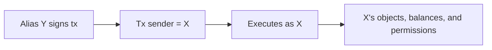

Address aliases let you authorize additional Sui addresses to act on behalf of your account. A transaction signed by an alias address can set its sender to the original address, giving the alias full authority to transact as the original account. This enables key rotation without migrating assets and basic account abstraction patterns.

## How aliases work

The `sui::address_alias` module manages a per-account `AddressAliases` object. Each account can have up to 8 aliases.

When address X sets address Y as an alias, transactions signed by Y can specify X as the sender. From the network's perspective, the transaction executes as if X sent it — Y's key is just the signing mechanism.



## Enable aliases

Before adding aliases, you must enable the alias system for your address. This creates the `AddressAliases` object:

```bash
sui client call \
  --package 0x2 \
  --module address_alias \
  --function enable \
  --args 0xADDRESS_ALIAS_STATE_ID \
  --gas-budget 10000000
```

The `ADDRESS_ALIAS_STATE_ID` is a singleton shared object. Query it from the network or use the SDK.

## Add an alias

After enabling, add an alias address:

```bash
sui client call \
  --package 0x2 \
  --module address_alias \
  --function add \
  --args <ALIASES_OBJECT_ID> <ALIAS_ADDRESS> \
  --gas-budget 10000000
```

The alias address can now sign transactions on behalf of your account.

## Remove an alias

```bash
sui client call \
  --package 0x2 \
  --module address_alias \
  --function remove \
  --args <ALIASES_OBJECT_ID> <ALIAS_ADDRESS> \
  --gas-budget 10000000
```

:::caution You cannot remove the last alias

The `remove` function aborts if you attempt to remove the last alias. This prevents accidentally locking yourself out of the alias system.

:::

## Replace all aliases

To replace the entire alias set at once (useful for bulk rotation):

```bash
sui client call \
  --package 0x2 \
  --module address_alias \
  --function replace_all \
  --args <ALIASES_OBJECT_ID> '["<ADDR1>", "<ADDR2>"]' \
  --gas-budget 10000000
```

## Use cases

### Key rotation without asset migration

Traditional key rotation on Sui requires transferring all objects and balances from the old address to the new one. With aliases:

1. Generate a new keypair (new address).
2. Add the new address as an alias of the old address.
3. Start signing transactions with the new key, setting the sender to the old address.
4. Remove the old address's alias (optional — it remains valid until removed).

No asset migration needed. All objects and balances stay at the original address.

### Multisig-to-alias delegation

A multisig account can add a single-key alias for routine operations. High-value operations still require the full multisig, but day-to-day transactions can be signed by the alias without gathering multiple signatures.

### Agent authorization

Instead of transferring objects to an agent's address, add the agent as an alias. The agent signs transactions as your address, accessing your objects and balances. Revoke by removing the alias.

:::danger Aliases have full authority

An alias address has the same authority as the original address. It can transfer objects, spend balances, and call any function as the aliased address. Only add aliases for keys you fully trust.

:::

## API reference

The `sui::address_alias` module exposes the following entry functions:

| Function | Description |
|---|---|
| `enable(state, ctx)` | Create the `AddressAliases` object for the sender |
| `add(aliases, address)` | Add an alias address (max 8) |
| `remove(aliases, address)` | Remove an alias (cannot remove the last one) |
| `replace_all(aliases, new_aliases)` | Replace the entire alias set |
