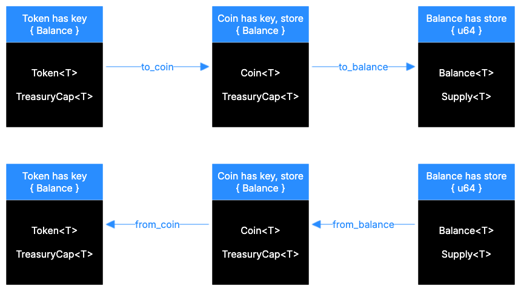

Using the Closed-Loop Token standard, you can limit the applications that can use the token and set up custom policies for transfers, spends, and conversions. The [`sui::token` module](https://github.com/MystenLabs/sui/blob/main/crates/sui-framework/docs/sui/token.md) in the Sui framework defines the standard.

## Background and use cases

The [Currency Standard](/onchain-finance/fungible-tokens/currency) on Sui is an example of an open-loop system. Coins are free-flowing, [wrappable](/develop/objects/object-ownership/wrapped), [freely transferable](/develop/objects/transfers/custom-rules), and you can store them in any application.

Some applications, however, require constraining the scope of the token to a specific purpose. For example, some applications might need a token that you can only use for a specific service, or that only an authorized account can use, or a token that you can block certain accounts from using. A real-world analogy would be a bank account that is regulated, bank-controlled, and compliant with certain rules and policies.

## Difference with Coin



Unlike Coin, which has `key + store` abilities and thus supports wrapping and public transfers, Token has only the `key` ability and cannot be wrapped, stored as a dynamic field, or freely transferred (unless there's a custom policy for that). Due to this restriction, Token **can only be owned by an account** and can't be stored in an application (however, [it can be spent](/onchain-finance/closed-loop-token/spending).

```move
// defined in `sui::coin`
struct Coin<phantom T> has key, store { id: UID, balance: Balance<T> }

// defined in `sui::token`
struct Token<phantom T> has key { id: UID, balance: Balance<T> }
```

## Compliance and rules

You can set up any rules for transfers, spends, and conversions for the tokens you create. You specify these rules per action in the [TokenPolicy](/onchain-finance/closed-loop-token/token-policy). [Rules](/onchain-finance/closed-loop-token/rules) are custom programmable restrictions that you can use to implement any request authorization or validation logic.

For example, a policy can set a limit on a transfer - `X` tokens per operation; or require user verification before spending tokens; or allow spending tokens only on a specific service.

You can reuse rules across different policies and applications; and you can freely combine rules to create complex policies.

## Public actions

Tokens have a set of public and protected actions that you can use to manage the token. Public actions are available to everyone and don't require any authorization. They have similar APIs to coins, but operate on the `Token` type:

- `token::keep`: Send a token to the transaction sender
- `token::join`: Join two tokens
- `token::split`: Split a token into two, specify the amount to split
- `token::zero`: Create an empty (zero balance) token
- `token::destroy_zero`: Destroy a token with zero balance


## Protected actions

Protected actions are ones that issue an [`ActionRequest`](/onchain-finance/closed-loop-token/action-request) - a hot-potato struct that must be resolved for the transaction to succeed. There are three main ways to resolve an `ActionRequest`, most common of which is through the [`TokenPolicy`](/onchain-finance/closed-loop-token/token-policy).

- `token::transfer`: Transfer a token to a specified address
- `token::to_coin`: Convert a token to a coin
- `token::from_coin`: Convert a coin to a token
- `token::spend`: Spend a token on a specified address

The previous methods are included in the base implementation, however it is possible to create `ActionRequest`s for custom actions.

## Token policy and rules

Protected actions are disabled by default but you can enable them in a [`TokenPolicy`](/onchain-finance/closed-loop-token/token-policy). Additionally, you can set custom restrictions called [rules](/onchain-finance/closed-loop-token/rules) that a specific action must satisfy for it to succeed.
