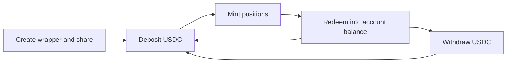

DeepBook Predict has no `PredictManager` and no `predict_manager` module. Custody and identity moved into a standalone `account` package, where each trader owns one shared `AccountWrapper` holding an embedded `Account`. Predict attaches its own per-account data to that `Account` rather than storing positions itself.

If you arrived from the old Predict Manager title, you are in the right place. That title and the SDK's `createManager()` method both survive from older DeepBook balance-manager vocabulary, and both name the account wrapper described here. The SDK's own name for the object is account wrapper.

This surface belongs to 2 modules, both under `packages/account/sources/` rather than under the Predict package:

- **`account::account`:** The `AccountWrapper` object, the embedded `Account`, the `Auth` type, and the custody functions, at [`account.move`](https://github.com/MystenLabs/deepbookv3/blob/14a7e8f822e0397df2d61fbfbce3ef21086891c2/packages/account/sources/account.move).
- **`account::account_registry`:** Account creation, address derivation, and the app authorization allowlist, at [`account_registry.move`](https://github.com/MystenLabs/deepbookv3/blob/14a7e8f822e0397df2d61fbfbce3ef21086891c2/packages/account/sources/account_registry.move).

Predict's own per-account slot lives in [`deepbook_predict::predict_account`](https://github.com/MystenLabs/deepbookv3/blob/14a7e8f822e0397df2d61fbfbce3ef21086891c2/packages/predict/sources/predict_account.move).

Sui Mainnet and Sui Testnet each run a separate deployment of the `account` package from identical sources, and the Move snippets on this page pin the Mainnet source commit, which is also the `deepbook-predict-mainnet` branch. An account on one network does not exist on the other, and neither deployment shares accounts with the previous-generation `predict-8-21` deployment. Take the IDs from `getAccountConfig(network)` rather than transcribing them:

| **Object** | **Mainnet** | **Testnet** |
|---|---|---|
| `account` package | `0xa6f1b22aaeb429f6fd8f01c13f605256e00876457fd122da8a0e2c1045c75929` | `0x543139156cb90d1a73df33b5dca37d7c8bdce62506c7874ebc854afd319b98f1` |
| `AccountRegistry` | `0x210ba485d973b5356e9078318837137efabdd5ffb9eeb3705ba7eef3340324fc` | `0xb889caefe327cbdea58e529e3b9e10dc93f1e661ddef32824d28527edf8d6385` |

The registry authorizes `PredictApp`, `SessionsApp`, and `DeepbookCoreAccountApp` on both networks, verified 2026-09-10.

## Lifecycle {#lifecycle}

An account moves through 5 stages. Only creation happens once.



| **Stage** | **Call** | **What changes** |
|---|---|---|
| Create | `account_registry::new` then `account::share` | Claims both derived IDs for the sender and shares a new `AccountWrapper`. |
| Deposit | `account::deposit_funds<T>` | Settles pending accumulator funds, then adds a whole `Coin<T>` to stored balance. |
| Mint | `expiry_market::mint_exact_quantity`, `expiry_market::mint_exact_amount` | Debits the all-in cost and records a position in Predict's account slot. |
| Redeem | `expiry_market::redeem_live`, `expiry_market::redeem_settled`, `expiry_market::redeem_settled_permissionless` | Removes or replaces the position and credits the payout. |
| Withdraw | `account::withdraw_funds<T>` | Settles pending funds, debits stored balance, and returns a `Coin<T>`. |

Every stage shares 3 properties:

- **Owner:** Creation fixes the owner. `new` records `ctx.sender()` as `owner`, and no function changes it. To move an account to a different address, create a new one under that address.
- **Ownership:** The wrapper is shared, not owned. `AccountWrapper` has the `key` ability only, and creation hands it back for `account::share`. Any transaction can name it as an input, so authorization comes from the `Auth` value a function demands.
- **Derived IDs:** Both IDs derive from the registry. The wrapper address and the account identity are derived objects claimed from it, so they are deterministic and computable before the account exists.

## Create an account {#create-a-manager}

The registry has 3 constructors, and all 3 are permissionless:

```move title='packages/account/sources/account_registry.move'
public fun new(registry: &mut AccountRegistry, ctx: &mut TxContext): AccountWrapper

public fun new_with_referrer(
    registry: &mut AccountRegistry,
    referrer: &AccountWrapper,
    ctx: &mut TxContext,
): AccountWrapper

public fun new_self_owned(
    registry: &mut AccountRegistry,
    owner_uid: &mut UID,
    ctx: &mut TxContext,
): AccountWrapper
```

`new` and `new_with_referrer` set the owner to the transaction sender. `new_self_owned` sets it to an object's address, so a package can own an account. `new_with_referrer` permanently records the referring account's canonical ID and receive address, which is what makes later mints pay a referral share to that account.

Each constructor returns the `AccountWrapper` by value. You cannot drop a `key`-only value, so the same transaction must consume it, and the only sensible consumer is:

```move title='packages/account/sources/account.move'
public fun share(self: AccountWrapper)
```

Call `account::share` on the returned wrapper in the same programmable transaction block. Forgetting it makes the transaction fail with an unused value error.

Creating an account twice for the same owner aborts with `EAccountAlreadyExists`. Check first with `derived_exists` or `derived_wrapper_exists`, or catch the abort.

<details>
<summary>Creation source</summary>

<ImportContent
	source="packages/account/sources/account_registry.move"
	mode="code"
	org="MystenLabs"
	repo="deepbookv3"
	branch="14a7e8f822e0397df2d61fbfbce3ef21086891c2"
	fun="new,new_with_referrer"
	noComments
/>

</details>

### Derive the IDs before you create {#derive-the-ids}

Both object IDs derive from the shared `AccountRegistry` and the owner address, so you can compute them offchain and hardcode them into the transaction that creates the account:

```move title='packages/account/sources/account_registry.move'
public fun derived_address(registry: &AccountRegistry, owner: address): address
public fun derived_wrapper_address(registry: &AccountRegistry, owner: address): address
public fun derived_exists(registry: &AccountRegistry, owner: address): bool
public fun derived_wrapper_exists(registry: &AccountRegistry, owner: address): bool
```

`derived_wrapper_address` returns the shared object's address, which is what every Predict call takes as the `wrapper` argument and what the accumulator delivers funds to. `derived_address` returns the canonical account identity, which is the parent of every app-data slot and the value that appears as `account_id` in events.

That determinism removes the 2-transaction sequence the old manager required. You no longer need to execute a creation transaction, read the new object ID out of effects, and wait for finality before depositing. Compose creation, sharing, and the first deposit in one block. The TypeScript SDK does exactly this with `client.predict.tx.deposit(owner, amount, { create: true })`, and it exposes the derivation directly as `client.predict.wrapperIdFor(owner)` and the free function `deriveAccountWrapperId(config, owner)`.

<details>
<summary>Derivation source</summary>

<ImportContent
	source="packages/account/sources/account_registry.move"
	mode="code"
	org="MystenLabs"
	repo="deepbookv3"
	branch="14a7e8f822e0397df2d61fbfbce3ef21086891c2"
	fun="derived_address,derived_wrapper_address,derived_exists,derived_wrapper_exists"
	noComments
/>

</details>

The SDK's `client.predict.tx.createManager()` builds `account_registry::new` plus `account::share` as one transaction and takes no arguments. Decode the result with `client.predict.decode.createManager(result)`, which returns `accountId`, `wrapperId`, `owner`, and `selfOwned`.

<details>
<summary>Create the account with the SDK</summary>

<ImportContent source="examples/deepbook-predict/src/create-manager.ts" mode="code" tag="create-manager" />

</details>

## Structs {#structs}

The layer has 2 structs that describe the object and 1 that describes the authority that opens it.

### `AccountWrapper` and `Account` {#account-wrapper-struct}

`AccountWrapper` is the shared object. `Account` is a `store` field inside it, not a separate object, so it has no independent object ID that a transaction can name:

| **Struct** | **Field** | **Type** | **Description** |
|---|---|---|---|
| `AccountWrapper` | `id` | `UID` | Object ID of the shared wrapper. This is the argument Predict calls take. |
| `AccountWrapper` | `account` | `Account` | The embedded account state. |
| `Account` | `account_id` | `UID` | Canonical identity and the dynamic-field parent for app data. |
| `Account` | `owner` | `address` | Owning address, either an external address or an object ID as an address. |
| `Account` | `receive_address` | `address` | The wrapper's address, used as the accumulator delivery and withdrawal anchor. |
| `Account` | `balances` | `Bag` | Stored `Balance<T>` values, indexed by coin type. |
| `Account` | `settlements` | `Bag` | Per-coin timestamp of the latest settlement attempt. |
| `Account` | `referrer_account_id` | `Option<ID>` | Referring account's canonical ID, set only at referral creation. |
| `Account` | `referrer_receive_address` | `Option<address>` | Referring account's wrapper address, the destination for referral payments. |

Field order in the table is declaration order. Creation writes the 2 referrer fields once, and they never change, which is why you cannot add or move a referral relationship afterward.

<details>
<summary>`AccountWrapper` and `Account` source</summary>

<ImportContent
	source="packages/account/sources/account.move"
	mode="code"
	org="MystenLabs"
	repo="deepbookv3"
	branch="14a7e8f822e0397df2d61fbfbce3ef21086891c2"
	struct="AccountWrapper,Account"
/>

</details>

### The `Auth` hot potato {#auth}

`Auth` carries the authority to open an account mutably:

```move title='packages/account/sources/account.move'
public struct Auth {
    kind: u8,
    owner: address,
}
```

`Auth` declares no abilities at all. You cannot copy, drop, or store it, so the transaction that creates one must consume it, and one `Auth` authorizes exactly one call. Build one per gated call in the block.

Owner authority comes from 2 constructors, and app authority from 1 package-issued path:

| **Constructor** | **Binds to** | **Use** |
|---|---|---|
| `account::generate_auth(ctx: &mut TxContext): Auth` | `ctx.sender()` | An address-owned account. This is the ordinary path. |
| `account::generate_auth_as_object(uid: &mut UID): Auth` | The object's address | An account created with `new_self_owned`, opened by the owning object. |
| `account_registry::generate_auth_as_app<App>` | The app witness | Requires a `Permit<App>` plus registry authorization, so only the app's own package can call it. Predict uses it for `redeem_settled_permissionless`. |

`load_account_mut(wrapper, auth)` consumes the value and returns `&mut Account`. Owner authority must match the stored `owner`, otherwise the call aborts with `EInvalidOwner`. App authority carries no owner restriction, which is why the allowlist behind it is admin-controlled and revocable with `deauthorize_app`.

<details>
<summary>`Auth` and authority source</summary>

<ImportContent
	source="packages/account/sources/account.move"
	mode="code"
	org="MystenLabs"
	repo="deepbookv3"
	branch="14a7e8f822e0397df2d61fbfbce3ef21086891c2"
	struct="Auth"
/>

<ImportContent
	source="packages/account/sources/account.move"
	mode="code"
	org="MystenLabs"
	repo="deepbookv3"
	branch="14a7e8f822e0397df2d61fbfbce3ef21086891c2"
	fun="generate_auth,generate_auth_as_object,share,load_account_mut"
	noComments
/>

</details>

## Balances and custody {#quote-balances}

Funds reach an account in 2 ways. Some arrive as stored balance directly: a deposit, and a redemption payout, which Predict credits to the account inside the redeeming transaction. The rest arrive at the wrapper address through Sui's fund accumulator, which is how builder fees, referral shares, and filled liquidity requests arrive, and a settling call has to fold them into stored balance before the account can spend them.

`settle` does that folding and is permissionless:

```move title='packages/account/sources/account.move'
public fun settle<T>(wrapper: &mut AccountWrapper, root: &AccumulatorRoot, clock: &Clock)
```

Anyone can call it for any account and coin type, because only the wrapper's own UID can authenticate the address-balance withdrawal and no value leaves the account. It latches a per-coin timestamp before reading the accumulator, so it is safe to call repeatedly and is a no-op once it has run for that coin type in the same millisecond. It emits `FundsSettled` when it moves a nonzero amount.

In practice you rarely call it alone. The 2 custody functions settle first, then act:

```move title='packages/account/sources/account.move'
public fun deposit_funds<T>(
    wrapper: &mut AccountWrapper,
    auth: Auth,
    coin: Coin<T>,
    root: &AccumulatorRoot,
    clock: &Clock,
)

public fun withdraw_funds<T>(
    wrapper: &mut AccountWrapper,
    auth: Auth,
    amount: u64,
    root: &AccumulatorRoot,
    clock: &Clock,
    ctx: &mut TxContext,
): Coin<T>
```

Predict's own trading functions settle USDC through the wrapper before they price anything, so an integrator seldom calls `settle` directly. Because the per-coin latch is timestamp-based, a second settle for the same coin type inside one transaction moves nothing.

<details>
<summary>Custody source</summary>

<ImportContent
	source="packages/account/sources/account.move"
	mode="code"
	org="MystenLabs"
	repo="deepbookv3"
	branch="14a7e8f822e0397df2d61fbfbce3ef21086891c2"
	fun="deposit_funds,withdraw_funds,settle"
	noComments
/>

</details>

### Predict does not gate withdrawal {#withdrawal-is-ungated}

`withdraw_funds` lives in the `account` package, which knows nothing about Predict's `ProtocolConfig`. It therefore runs regardless of Predict's package version watermark, its `trading_paused` flag, and its emergency freeze. Pausing or freezing Predict stops trading, not the exit of idle balance.

This has 2 consequences. You can always retrieve funds that are not committed to a live position. Risk tooling must not treat a Predict pause as a custody halt.

### Deposit and withdraw {#deposit-and-withdraw}

`deposit_funds` consumes a whole `Coin<T>`, so split the exact amount off a larger coin first. `withdraw_funds` takes an amount and returns a `Coin<T>` that the transaction must consume, by transferring it or by sending it to an address balance.

Both take an `Auth`, and both abort with `EInvalidOwner` when owner authority does not match the stored owner. `withdraw_funds` aborts with `EBalanceTooLow` when the amount exceeds stored balance or when the account has never held that coin type.

The SDK's `client.predict.tx.deposit(owner, amountUsdc)` sources the quote coin from coin objects or the address balance and can create the account in the same block with `{ create: true }`. Its `client.predict.tx.withdraw(owner, amountUsdc)` sends the result to the owner's address balance by default, or returns a coin object with `{ toCoinObject: true }`.

### Coin types {#supported-coin-types}

`deposit_funds<T>` and `withdraw_funds<T>` are generic over the coin type and place no restriction on `T`. The restriction lives one level up, in Predict: `USDC` is the settlement asset for every trade, and `PLP` is the pool share coin. On Mainnet the quote coin is native USDC, `0xdba34672e30cb065b1f93e3ab55318768fd6fef66c15942c9f7cb846e2f900e7::usdc::USDC`. On Testnet it is a mintable test coin at the same `usdc::USDC` module path, `0xc028557a1ed49e42ed091e115aedefd70a442b184c18fbec5c48d5b6c0b8c184::usdc::USDC`, which displays as DUSDC. Read the exact type from `getConfig(network).quoteCoinType`. Depositing an unrelated coin type succeeds and you can always withdraw it again, but you cannot trade with it.

Read a balance with the account accessor, which counts stored balance plus funds delivered to the wrapper and not yet settled:

```move title='packages/account/sources/account.move'
public fun balance<T>(self: &Account, root: &AccumulatorRoot, clock: &Clock): u64
```

Because it includes unsettled funds, it does not go stale between a payout and the next `settle`. The SDK's `client.predict.read.balance(owner)` returns the same figure as a decimal, and `client.predict.read.plpBalance(owner)` returns raw PLP shares.

<details>
<summary>Read accessor source</summary>

<ImportContent
	source="packages/account/sources/account.move"
	mode="code"
	org="MystenLabs"
	repo="deepbookv3"
	branch="14a7e8f822e0397df2d61fbfbce3ef21086891c2"
	fun="owner,receive_address,account_id,balance,referrer_account_id,referrer_receive_address"
	noComments
/>

</details>

## Predict's account slot {#predict-data}

Predict does not store positions in its own objects. It attaches a `PredictData` value to the account under `DataKey<PredictApp>`, where `PredictApp` is a witness type only the `predict_account` module can construct. That namespacing means no other package can write Predict's slot, and Predict cannot write anyone else's. Predict creates the slot lazily on first use.

| **Struct** | **Field** | **Type** | **Description** |
|---|---|---|---|
| `PredictData` | `positions` | `Table<PositionKey, Position>` | Open positions, scoped by expiry market. |
| `PredictData` | `builder_code_id` | `Option<ID>` | Sticky builder-code attribution applied to future trades. |
| `PositionKey` | `expiry_market_id` | `ID` | The market that minted the order. |
| `PositionKey` | `order_id` | `u256` | The packed order ID. |
| `Position` | `root_id` | `u256` | Original mint's order ID, carried forward across partial-close replacements. |
| `Position` | `opened_at_ms` | `u64` | Onchain time at which the position opened, also carried forward. |

An order ID alone does not identify a position. It carries the quantity and the tick range but not the market, so only the `(expiry_market_id, order_id)` pair binds a position to its market. Never infer market facts from an order ID.

`root_id` is what makes one economic position traceable. A partial close retires the current order ID and issues a replacement, but `root_id` stays fixed, so joining events on `position_root_id` follows the position through its whole life. Predict likewise carries `opened_at_ms` forward, which keeps a seasoned position closable while still rejecting a live redeem in the same millisecond as the mint.

<details>
<summary>`PredictData` source</summary>

<ImportContent
	source="packages/predict/sources/predict_account.move"
	mode="code"
	org="MystenLabs"
	repo="deepbookv3"
	branch="14a7e8f822e0397df2d61fbfbce3ef21086891c2"
	struct="PositionKey,Position,PredictData"
/>

</details>

### Read a position {#read-a-position-quantity}

The `predict_account` module has 2 reads that work against a borrowed `&Account`, so a simulated transaction resolves them without gas:

```move title='packages/predict/sources/predict_account.move'
public fun has_position(account: &Account, expiry_market_id: ID, order_id: u256): bool
public fun builder_code_id(account: &Account): Option<ID>
```

Both return the empty answer rather than aborting when the account has no Predict slot yet, so `false` and `none` do not distinguish an unused account from a closed position.

`has_position` answers one exact question and needs the market ID and order ID up front, so it cannot enumerate a portfolio. To list what an account holds, read the dynamic fields of the `positions` table, where each field key is a `PositionKey` in Binary Canonical Serialization (BCS). The SDK's `client.predict.read.positions(owner)` does this on either network and returns `{ marketId, orderId }` pairs, and `client.predict.read.hasPosition(owner, marketId, orderId)` wraps the single read. The public offchain read services answer the same question over HTTP for the previous-generation `predict-8-21` deployment only, and their account and position paths key on the canonical account ID rather than the wrapper ID; see [Wrapper ID and account ID](/onchain-finance/deepbook/deepbook-predict-sdk/accounts#wrapper-and-account-ids).

To value a position, pass its order ID to the market: `expiry_market::live_order_value` with a market-bound pricer while the market is live, or `expiry_market::settled_order_payout` once it has settled. See [Predict](/onchain-finance/deepbook/deepbook-predict/contract-information/predict#read-accessors) for both.

### Builder codes {#builder-codes}

An account can carry one builder code, which routes an add-on fee to the code's owner on every trade the account makes:

```move title='packages/predict/sources/predict_account.move'
public fun set_builder_code(
    wrapper: &mut AccountWrapper,
    auth: Auth,
    code: &BuilderCode,
    ctx: &mut TxContext,
)

public fun unset_builder_code(wrapper: &mut AccountWrapper, auth: Auth, ctx: &mut TxContext)
```

Both consume an `Auth` and both emit `BuilderCodeSet` from `deepbook_predict::builder_code_events`, with `builder_code_id` set on one and absent on the other. Attribution is sticky: it applies to trades made after the call, not retroactively. The SDK exposes `client.predict.tx.setBuilderCode(owner, builderCodeId)` and `client.predict.tx.unsetBuilderCode(owner)`.

<details>
<summary>Predict account function source</summary>

<ImportContent
	source="packages/predict/sources/predict_account.move"
	mode="code"
	org="MystenLabs"
	repo="deepbookv3"
	branch="14a7e8f822e0397df2d61fbfbce3ef21086891c2"
	fun="has_position,builder_code_id,set_builder_code,unset_builder_code"
	noComments
/>

</details>

## Function reference {#function-reference}

Complete public signatures for the account layer. Copy them as written when you generate calls or bindings. Every one is a `public fun` you invoke with a `moveCall`.

```move title='packages/account/sources/account_registry.move'
public fun derived_address(registry: &AccountRegistry, owner: address): address
public fun derived_wrapper_address(registry: &AccountRegistry, owner: address): address
public fun derived_exists(registry: &AccountRegistry, owner: address): bool
public fun derived_wrapper_exists(registry: &AccountRegistry, owner: address): bool
public fun new(registry: &mut AccountRegistry, ctx: &mut TxContext): AccountWrapper
public fun new_with_referrer(registry: &mut AccountRegistry, referrer: &AccountWrapper, ctx: &mut TxContext): AccountWrapper
public fun new_self_owned(registry: &mut AccountRegistry, owner_uid: &mut UID, ctx: &mut TxContext): AccountWrapper
public fun is_app_authorized<App>(registry: &AccountRegistry): bool
public fun assert_app_is_authorized<App>(registry: &AccountRegistry)
```

```move title='packages/account/sources/account.move'
public fun id(self: &AccountWrapper): ID
public fun load_account(self: &AccountWrapper): &Account
public fun owner(self: &Account): address
public fun account_id(self: &Account): ID
public fun receive_address(self: &Account): address
public fun referrer_account_id(self: &Account): Option<ID>
public fun referrer_receive_address(self: &Account): Option<address>
public fun balance<T>(self: &Account, root: &AccumulatorRoot, clock: &Clock): u64
public fun has_data<App>(self: &Account): bool
public fun generate_auth(ctx: &mut TxContext): Auth
public fun generate_auth_as_object(uid: &mut UID): Auth
public fun share(self: AccountWrapper)
public fun load_account_mut(self: &mut AccountWrapper, auth: Auth): &mut Account
public fun settle<T>(wrapper: &mut AccountWrapper, root: &AccumulatorRoot, clock: &Clock)
public fun deposit<T>(self: &mut Account, coin: Coin<T>)
public fun withdraw<T>(self: &mut Account, amount: u64, ctx: &mut TxContext): Coin<T>
public fun deposit_funds<T>(wrapper: &mut AccountWrapper, auth: Auth, coin: Coin<T>, root: &AccumulatorRoot, clock: &Clock)
public fun withdraw_funds<T>(wrapper: &mut AccountWrapper, auth: Auth, amount: u64, root: &AccumulatorRoot, clock: &Clock, ctx: &mut TxContext): Coin<T>
```

```move title='packages/predict/sources/predict_account.move'
public fun has_position(account: &Account, expiry_market_id: ID, order_id: u256): bool
public fun builder_code_id(account: &Account): Option<ID>
public fun set_builder_code(wrapper: &mut AccountWrapper, auth: Auth, code: &BuilderCode, ctx: &mut TxContext)
public fun unset_builder_code(wrapper: &mut AccountWrapper, auth: Auth, ctx: &mut TxContext)
```

`deposit` and `withdraw` take a `&mut Account`, which only `load_account_mut` produces, so reaching them still costs an `Auth`. `authorize_app` and `deauthorize_app` need the `AccountAdminCap`, and `generate_auth_as_app` needs a `Permit<App>`, so none of the 3 is an integrator call.

## The account SDK subpath {#account-sdk}

`@mysten/deepbook-v3` publishes the account primitive on its own subpath, `@mysten/deepbook-v3/account`, with `getAccountConfig(network)` for the deployed IDs and an `AccountContract` class whose builders compose into a programmable transaction block of your own. [Predict Accounts SDK](/onchain-finance/deepbook/deepbook-predict-sdk/accounts#account-subpath) documents every `AccountContract` method, the split between wrapper and account IDs, and the generated bindings.

## End-to-end workflow {#end-to-end-workflow}

You can compose creating an account, funding it, and trading into one programmable transaction block, because the wrapper's object ID is derivable before the account exists. You have 2 layers that reach that, and they are not interchangeable.

The facade builders under `client.predict.tx.*` do not compose. Each one returns its own fresh `Transaction` carrying just that builder's commands, so you cannot chain 2 of them into one block. What the facade does offer is 2 prebuilt compositions:

- **`client.predict.tx.deposit(owner, amount, { create: true })`:** Creates the wrapper, deposits through the fresh handle, and shares last, in one block. The `owner` must be the signer, because `account_registry::new` derives from the transaction sender, and the call aborts if the account already exists.
- **`client.predict.tx.mint(owner, descriptor, opts)`:** A standalone transaction containing `load_live_pricer`, `generate_auth`, and `mint_exact_quantity`, and nothing else. There is no create, share, split, or deposit in it.

The example below is the second of those. It reads a quote, derives a `maxCost` cap from it, and returns an unsigned mint transaction:

<details>
<summary>Quote and mint with the SDK</summary>

<ImportContent source="examples/deepbook-predict/src/mint.ts" mode="code" tag="mint-binary" />

</details>

Composing create, fund, and trade into a single block of your own is generated-bindings work rather than facade work. Build it from the [`AccountContract` methods](/onchain-finance/deepbook/deepbook-predict-sdk/accounts#account-contract) and the `loadLivePricer` function that the `/predict` subpath exports, adding commands to a single `Transaction` in this order:

1. `account_registry::new`
1. `account::generate_auth`
1. `account::deposit_funds`
1. `account::share`
1. `expiry_market::load_live_pricer`
1. A second `account::generate_auth`, because `deposit_funds` consumed the first
1. `expiry_market::mint_exact_quantity`

Share the wrapper after the deposit, not before: an object input can only name an object that already existed when the block started, so a wrapper that the block creates is reachable only through the result handle from `new`.

The [tutorial](/onchain-finance/deepbook/deepbook-predict/tutorial) walks the whole flow with quotes, ranges, redemption, and settlement.

## Events {#events}

Account events live in `account::account_events`. All of them carry `copy` and `drop` but not `store`, so they are readable from transaction results and no object can hold them. Field order below is declaration order, which is the order BCS decoding depends on.

### `AccountCreated` {#account-created}

All 3 constructors emit it, once per account:

| **#** | **Field** | **Type** | **Description** |
|---|---|---|---|
| 1 | `account_id` | `ID` | Canonical account identity, matching `derived_address`. |
| 2 | `wrapper_id` | `ID` | Shared wrapper object, matching `derived_wrapper_address`. |
| 3 | `owner` | `address` | Owning address, or the owning object's address. |
| 4 | `self_owned` | `bool` | True when created with `new_self_owned`. |
| 5 | `referrer_account_id` | `Option<ID>` | Referring account, set only by `new_with_referrer`. |

To recover a lost wrapper ID, prefer `derived_wrapper_address` over an event query. The derivation needs no indexer and works before the account exists.

### Balance events {#balance-events}

Value moves in and out under 3 events, and each carries the same 4 fields:

| **#** | **Field** | **Type** | **Description** |
|---|---|---|---|
| 1 | `account_id` | `ID` | Canonical account identity. |
| 2 | `coin_type` | `String` | Fully qualified coin type. |
| 3 | `amount` | `u64` | Amount moved, in the coin's base units. |
| 4 | `new_balance` | `u64` | Stored balance after the move, excluding unsettled funds. |

The 3 differ only in what caused the move:

- **`Deposited`:** A coin entered stored balance through `deposit`, reached from `deposit_funds`.
- **`Withdrawn`:** Stored balance left as a coin through `withdraw`, reached from `withdraw_funds`.
- **`FundsSettled`:** Accumulator funds at the wrapper address folded into stored balance. `settle` emits it only when the settled amount is greater than zero, so a no-op `settle` is silent.

A redemption payout credits stored balance inside the redeeming transaction, so it surfaces as `Deposited`. Builder fees, referral shares, and filled liquidity requests travel through the accumulator instead and surface as `FundsSettled` on the next settling call. Index all 3 events to reconstruct a full account ledger, and read the order events described in [Predict](/onchain-finance/deepbook/deepbook-predict/contract-information/predict#events) for the trades themselves.

The module declares 2 further events, `AppAuthorized` and `AppDeauthorized`, which each carry a single `app` string and record changes to the registry allowlist that governs app authority.

<details>
<summary>Account event source</summary>

<ImportContent
	source="packages/account/sources/account_events.move"
	mode="code"
	org="MystenLabs"
	repo="deepbookv3"
	branch="14a7e8f822e0397df2d61fbfbce3ef21086891c2"
	struct="AccountCreated,Deposited,Withdrawn,FundsSettled"
/>

</details>

## Error codes {#error-codes}

| **Code** | **Constant** | **Module** | **Cause** |
|---|---|---|---|
| `0` | `EInvalidOwner` | `account::account` | Owner authority does not match the account's stored `owner`. |
| `1` | `EBalanceTooLow` | `account::account` | A withdrawal exceeds stored balance, or the account has never held that coin type. |
| `2` | `EInvalidAuth` | `account::account` | The `Auth` value carries neither owner nor app authority. |
| `0` | `EAppAlreadyAuthorized` | `account::account_registry` | An admin authorized an app that is already on the allowlist. |
| `1` | `EAppNotAuthorized` | `account::account_registry` | A caller requested app authority, or an admin attempted a deauthorization, for an app not on the allowlist. |
| `2` | `EAccountAlreadyExists` | `account::account_registry` | Either derived ID already exists for that owner. |
| `0` | `EPositionAlreadyExists` | `deepbook_predict::predict_account` | A mint tried to record a duplicate market and order ID pair. |
| `1` | `EPositionNotFound` | `deepbook_predict::predict_account` | A redeem referenced a position the account does not hold. |

Codes repeat across modules, so always resolve an abort against the module named in the abort location rather than against the number alone. Over gRPC or GraphQL the abort also carries the constant name; over JSON-RPC it does not.
