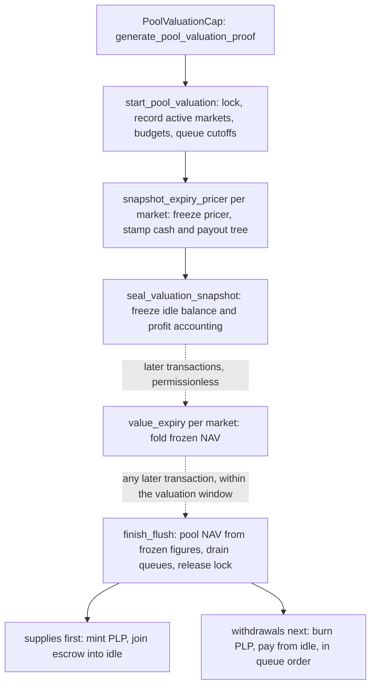

DeepBook Predict keeps its protocol state in four kinds of shared object, custodies user funds in the DeepBook `account` package, and reads every price from feeds that belong to a separate `propbook` package. Knowing which object owns which piece of state is enough to follow any Predict transaction. The same contracts run on Sui Mainnet and Sui Testnet; the only difference a reader of this page meets is the quote coin, which is native USDC on Mainnet and a mintable test coin with the same `usdc::USDC` module path on Testnet, where it displays as DUSDC.

The protocol's own shared objects are:

- `Registry`: The index and governance anchor. It records approved underlyings, the cadence policy that creates markets, the unique market for each underlying and expiry, and the allowlists of pause, market lifecycle, and pool valuation capabilities.
- `ProtocolConfig`: Every admin-tunable value, together with the global gates that each flow checks before it runs.
- `PoolVault`: The liquidity pool that writes every contract. It holds idle USDC, the protocol reserve, the PLP treasury cap, the per-expiry accounting ledger, the two liquidity request queues, and the pool valuation in flight, if any.
- `ExpiryMarket`: One object per underlying and expiry, holding that expiry's strike exposure, payout backing, and working USDC.

Trader balances and positions live in the account layer, and oracle data lives outside Predict entirely.

## Protocol shared objects {#shared-objects}

`Registry` indexes the protocol. It records each admin-approved propbook underlying, the cadence deployment policy for that underlying, and one `ExpiryMarket` for each underlying and expiry pair. It also holds the allowlists that make a `PauseCap`, a `MarketLifecycleCap`, or a `PoolValuationCap` valid, and it derives the `BuilderCode` objects that attribute builder fees to order-flow routers. It holds no trading state.

Package publication creates `Registry` and `ProtocolConfig` together and sends one `AdminCap` to the deployer. `ProtocolConfig` carries the tunable configuration plus three global gates: `trading_paused` blocks new risk, `frozen` halts the whole version-gated surface, and `version_watermark` sets the lowest package version a gated call can run. Two further flags track the pool flush: `valuation_in_progress` is set from the start of a flush until it finishes, which spans transactions, and `snapshot_in_progress` is set only inside the single transaction that snapshots the markets. A `flush_seq` counter stamps each valuation. Two timing values gate trading and flushes: `no_trade_window_ms`, deployed at 2000 ms, closes live trading just before expiry, and `max_valuation_window_ms`, deployed at 300000 ms, bounds how long a flush may take to finish. One configuration struct is a template: each new `ExpiryMarket` snapshots the current strike-exposure policy at creation, so a template change reaches later expiries and never a live one.

`ExpiryMarket` is the hot object for one expiry. It owns trade execution, the tick-keyed payout tree that tracks strike exposure, and an embedded `ExpiryCash` component that holds that expiry's working USDC. It stores the propbook underlying ID rather than any oracle object ID, alongside its tick size, admission tick size, and mint pause flag. A new market opens with zero cash and cannot mint until pool capital funds it. `plp::rebalance_expiry_cash` moves that cash from the pool's idle balance, and anyone can call it.

Capabilities are owned objects rather than roles stored on a shared object. `AdminCap` sets policy, `MarketLifecycleCap` creates markets, `PoolValuationCap` starts a pool flush, and `PauseCap` is a one-way emergency brake that cannot unpause anything. `AdminCap` mints and revokes the lifecycle and pool valuation capabilities, and each is valid only while its ID sits on the registry's allowlist. Predict holds no price-writing capability at all.

Every function an integrator calls is a `public fun` invoked from a [programmable transaction block](/develop/transactions/ptbs/prog-txn-blocks). Several return a value that the same transaction must consume, such as the pricer a quote reads or the authorization an account call spends.

## Accounts and custody {#predict-manager}

Predict defines no account object of its own. It uses the shared `AccountWrapper` from the `account` package, which embeds an `Account` holding coin balances, the root for app data, and optional referral attribution. That `Account` is a field inside the wrapper, not a separate object.

Both the wrapper and the account address derive from the owner address through the `AccountRegistry`, so an application can compute either offchain before the account exists. `account_registry::new` creates the wrapper permissionlessly with the transaction sender as owner, and `account::share` publishes it in the same transaction. A second creation for the same owner aborts.

The two derived addresses are not interchangeable, and each surface takes exactly one of them. Every Move call takes the shared `AccountWrapper` object, so the wrapper ID is the onchain handle. The canonical account ID is the identity everything else keys on: app data hangs off it, event payloads carry it as `account_id`, and indexed read services accept it and nothing else. `client.predict.wrapperIdFor(owner)` derives the first, and `SessionsContract.deriveAccountId(owner)` on the `@mysten/deepbook-v3/sessions` subpath derives the second.

Predict attaches its own state to that account under the `PredictApp` namespace: a table of open positions keyed by the pair of expiry market ID and order ID, plus the sticky builder code the account trades under. Positions are not standalone objects, so read them from the account with `read.positions`.

Account mutation runs on an `Auth` value that `load_account_mut` consumes, and that value comes from one of two sources:

- **Owner authorization:** The account owner, or an owning object, generates it. Minting, live redemption, settled exits, liquidity requests and cancellations, and builder code configuration all use it.
- **Predict app authorization:** Predict generates it internally through the account registry so a keeper can sweep settled positions into an account without the owner signing. Deauthorizing the `PredictApp` type disables that automation while owner-authorized exits keep working.

Two delivery paths credit an account, and they surface as different events:

- **Straight into stored balance:** Settled payouts and live-close proceeds call `account::deposit<USDC>` on the account itself and emit `Deposited`. The funds are spendable as soon as the transaction lands, and no follow-up call is needed.
- **Through the balance accumulator:** Builder fees, referral shares, and liquidity queue fills and refunds go to the account's receive address instead. They stay outside stored balance until the permissionless `account::settle<T>` folds them in and emits `FundsSettled`.

Reading a balance settles nothing. `account::balance<T>` takes an immutable `&Account`, so it cannot mutate anything: it reports stored balance plus the unsettled accumulator balance, which covers both paths without moving either. `account::settle<T>` is the mutating call, it takes the wrapper rather than the account, and anyone can make it.

## Oracle feeds {#oracle-feeds}

Oracle data is not Predict state. Three shared objects in the separate `propbook` package carry it, and Predict reads them without ever writing to them:

- `PythFeed`: One source-native Pyth Lazer spot payload per feed ID, plus exact timestamp history. Predict reads the normalized spot and the timestamp of the observation behind it.
- `BlockScholesValueStore`: The latest Block Scholes spot and the per-expiry forward, plus exact minute-boundary spot history.
- `BlockScholesSVIStore`: The latest per-expiry SVI parameter set, which describes the shape of the implied distribution.

Updates to all three are permissionless, because a verified Pyth Lazer payload, or a signed Block Scholes batch, is its own proof of origin. The relayer that lands one needs no capability.

Propbook's `OracleRegistry` records which feed objects are canonical for an underlying. Market creation asserts those bindings exist, and every priced call revalidates the objects it receives against the current binding, so passing a feed that is not canonical aborts. Predict also rejects an observation whose writer digest matches the current transaction, which stops a caller from pushing an oracle update and trading against it, or snapshotting a flush against it, in the same transaction.

Freshness is a read-time check rather than a writer promise. Three admin-tunable windows gate live pricing: one for the Pyth spot, one for the Block Scholes spot and forward, and a looser one for the SVI parameters, which change more slowly. Both deployments ship the first two at 2 seconds and the SVI window at 60 seconds. An observation is fresh only when its source timestamp is positive, not in the future, and inside its window. For Block Scholes data the source timestamp is the provider's per-update timestamp, and the SVI roll-down keys on it.

## Strikes, ticks, and positions {#positions-and-ranges}

Predict has one strike representation across the whole protocol: an absolute integer tick, where the raw strike is the tick multiplied by the market's `tick_size`. There is no centered grid and no per-market origin, so the same tick means the same price at the public function, in the event, in the payout tree, and at settlement. Because the tick domain is fixed in advance, market creation reads no live spot.

A position is a range, carried as the tick pair `lower_tick` and `higher_tick`, and its payout region is half-open: it pays when settlement lands above the lower strike and at or below the higher strike. Two sentinel ticks give a range an open end:

- Tick `0` is the negative infinity sentinel, so a downside position runs from `0` to the strike tick.
- Tick `1073741823`, the largest 30-bit value, is the positive infinity sentinel, so an upside position runs from the strike tick to `1073741823`.
- Finite strikes occupy every tick in between, from `1` to `1073741822`.

The protocol rejects the fully open range from `0` to `1073741823`, because it would pay in every outcome. A finite boundary must also land on the market's coarser admission grid, with one exception: each market records a reference tick taken from the exact Pyth spot at its reference timestamp, and the protocol admits that tick even when it falls off the admission grid. Anyone can record it with `expiry_market::set_reference_tick`, which takes no capability, and until a market has one, a quote against the reference strike fails. A repeat call with the same tick succeeds and emits nothing, so the call is safe to retry.

Minting returns one packed `u256` order ID that encodes the quantity in lots, both ticks, and a market-local sequence number. Treat it as an opaque handle. Quantity moves in whole lots of `10000` base units, which is 0.01 USDC, and that lot size is the granularity of a quantity rather than a tradable minimum. The premium floor under [Pricing and settlement](#pricing-and-risk) sets the real minimum, and it is always more than a hundred lots. An order ID is unique only inside one market, so identify a position by the pair of market ID and order ID. Closing part of a position retires its order ID and issues a replacement for the remaining quantity, while the original mint's root ID stays stable across those replacements.

## Pricing and settlement {#pricing-and-risk}

Pricing is transaction-local. `expiry_market::load_live_pricer` takes the protocol configuration, the propbook registry, and the three oracle objects, then returns a pricer bound to that one market. The pricer has no `store` ability, so every transaction that quotes, mints, or redeems live builds a fresh one. The pool flush is the one place a pricer outlives its transaction, and it does so as a `FrozenPricer` that only the `plp` module can create or read.

The pricer resolves a forward, then reads each range's probability off the SVI curve as the difference between its two strike boundaries. While `use_pyth_spot_for_forward` is set, which is the shipped default, a fresh usable Pyth spot anchors the forward and the Block Scholes basis scales it. A missing, stale, or unusable Pyth spot falls back to the Block Scholes forward for that expiry. A position's live value is its quantity multiplied by its range probability, and a winning position settles at its full quantity. Mint admission holds the quoted entry probability inside a per-market band and requires a minimum premium, so a quote at the extreme edge of the distribution fails rather than rounding. A mint whose all-in cost would exceed its own maximum payout aborts with `EMintCostAboveMaxPayout`.

Live trading has a hard stop before expiry. `no_trade_window_ms` sets a window, 2 seconds on both deployments, inside which every quote, mint, and live redeem aborts with `ETradeWindowClosed`, and live pricing aborts once the expiry itself has passed. Settled redemption, settlement, and reference tick recording ignore the window. In a market's final seconds the entry probability converges hard, so the window removes trades that would fill at a converged price.

That premium floor is what actually bounds trade size. `strike_exposure_config::assert_mint_admission` rejects any mint whose premium falls below 1 USDC, and the premium is the quantity multiplied by the quoted entry probability. The admissible quantity is therefore the reciprocal of the quoted probability, and `max_entry_probability` caps that probability at 0.99, so about 1.02 contracts is the smallest quantity any strike can ever take and every other strike needs more. A quote near a coin flip needs roughly 2 contracts, and a far strike quoting near the bottom of the band needs tens. Size a position by the product rather than by the lot grid.

Settlement is one permissionless transition, `expiry_market::try_settle`, and repeat calls are harmless. It first looks for the exact Pyth spot at the market's expiry timestamp. If Pyth remains unavailable 30 seconds after expiry, the same call can use the exact Block Scholes minute-boundary spot instead. Both lookups are exact matches, with no nearest, rounded, or interpolated fallback. The transition records the terminal price and the exact remaining payout liability together, and `MarketSettled` reports which source won. When neither source is usable, the call returns `false` and the market stays unsettled. A flush in flight never blocks settlement. Settled redemption and `plp::rebalance_expiry_cash` read only the recorded state, so they take no oracle argument at all. In the flush, only the snapshot stage reads oracles: `plp::snapshot_expiry_pricer` takes the `OracleRegistry`, the `PythFeed`, the `BlockScholesValueStore`, and the `BlockScholesSVIStore`, and the later `plp::value_expiry` takes none of them.

Predict enforces solvency per expiry rather than through a protocol-wide exposure ratio. Every cash movement re-asserts that a market's `ExpiryCash` balance covers its payout liability plus its isolated inventory-impact escrow, and only the surplus above that line is cash the pool can sweep. Monetary math rounds in the protocol's favor, so an expiry can always pay its winners. At the pool level, `max_lp_pool_value` caps how much liquidity the pool accepts, at 500,000 USDC on both deployments.

### Fee components {#fee-components}

A quote reports every charge separately, and a mint debits the premium plus the trading fee net of any subsidy, plus the builder fee, the congestion surcharge, and the inventory-impact charge. A live close withholds the same charges from the payout, and a settled winner collects its full quantity. The components are:

- **Trading fee:** A rate proportional to the standard deviation of the contract's Bernoulli outcome, so it peaks where the quoted probability is nearest to a coin flip and falls toward the tails, with a per-unit floor underneath it. A linear ramp lifts that rate inside a configured window before expiry.
- **Fee incentive subsidy:** A reduction in the trading fee, funded from the market's sponsored incentive balance. Anyone can top that balance up. It is `fee_incentive_subsidy` onchain and `subsidy` in the SDK quote and receipt.
- **Builder fee:** An optional add-on for accounts that carry a builder code, computed from the trading fee and capped by a per-quantity rate. It routes to the builder code's address rather than into the pool.
- **Congestion surcharge:** A flat per-unit charge that fires only when the transaction's gas price is a high outlier against the market's own smoothed estimate. It is `penalty_fee` onchain and `penalty` in the SDK quote and receipt, so a `penalty` line in a quote is this charge. Admin can disable it, and it ships disabled on both deployments.
- **Inventory-impact charge:** A charge sized by the change a trade makes to the book's payout profile, held in the market's isolated escrow and rebated when a trade closes that exposure. Its rate ships at zero, which makes the mechanism inert.

A referral share is not another charge. Its basis is the trading fee net of the incentive subsidy, plus the congestion surcharge, and the protocol computes it only after `all_in_cost` is fixed, then splits it out of the payment the trader has already made. It is carved out of fees the trader paid anyway, it never adds a debit, and it never changes `cost`. The SDK reports it as `fees.referral`. The Move `MintQuote` carries no referral field, because the split happens after the quote.

## Pool liquidity and PLP {#vault-and-plp}

`PoolVault` is the counterparty to every trade. Liquidity providers deposit USDC and receive PLP shares, a 6-decimal coin that matches USDC's decimals. The vault holds idle USDC available for withdrawals and expiry funding, a protocol reserve excluded from PLP redemption, the PLP treasury cap, the per-expiry accounting ledger, the supply and withdraw queues, and the valuation in flight.

Supply and withdrawal are asynchronous, so nobody mints or burns PLP against a live price:

- `plp::request_supply` escrows USDC with a `min_plp_out` floor and returns a queue index.
- `plp::request_withdraw` escrows PLP with a `min_usdc_out` floor and returns a queue index.
- `plp::cancel_supply_request` and `plp::cancel_withdraw_request` reclaim the escrow at that index any time before a flush reaches it, except while a flush is in flight.

A flush values the whole pool once and fills eligible queue heads at that single frozen mark. It runs in three stages, and only the first is confined to one transaction:

1. **Snapshot, in one transaction.** `registry::generate_pool_valuation_proof` turns an allowlisted `PoolValuationCap` into a proof that `start_pool_valuation` consumes. Starting sets the valuation lock, bumps `flush_seq`, records the active market set, the two drain budgets, and each queue's request cutoff, and returns a `SnapshotStage` value with no abilities. `snapshot_expiry_pricer` then runs once per active market, taking the propbook `OracleRegistry` and the three feed objects: a live market's pricer is frozen into a `FrozenPricer` and the market's cash, escrow, and payout tree are stamped, while an already settled market is swept and recorded as contributing zero. `seal_valuation_snapshot` consumes the stage, aborts unless every expected market was snapshotted, and freezes the vault's idle balance and profit accounting. The two hot potatoes force all of this into a single transaction, and an oracle observation written in that same transaction is refused.
1. **Valuation, across any number of transactions.** `value_expiry(vault, market, config)` folds one market's frozen mark into the running total: the stamped cash rows plus the payout liability the frozen pricer implies. It is permissionless, takes no oracle or clock, moves no cash, and returns without effect on a market that is not in the snapshot or was already valued, so a keeper list that is stale or a retry that repeats is harmless.
1. **Finish, in any later transaction.** `finish_flush` is permissionless, because the budgets were committed at the start. It aborts unless every snapshotted market was valued, computes the pool's net asset value from the frozen figures, drains the queues at that one mark for every request queued before the cutoff, releases the lock, and emits `FlushExecuted`.

The snapshot has a shelf life. `finish_flush` aborts with `EValuationWindowExpired` once `max_valuation_window_ms` has elapsed since the snapshot, 5 minutes on both deployments. There is no abort call: the recovery is a fresh `start_pool_valuation`, which discards the stale valuation, emits `FlushRestarted`, and snapshots again. Any stamp left on a market by an abandoned flush is cleared lazily by the next mint, redeem, or settlement on that market.

Pool value is not simply idle plus markets. `lp_pool_value` starts from the frozen idle USDC plus accumulated market net asset value, then subtracts two held-out terms: an exclusion term covering the protocol's share of profit that PLP holders cannot redeem, and the pending protocol profit that has been materialized but not yet drained into the reserve. The result floors at zero rather than underflowing. `FlushExecuted.pool_value` reports that frozen figure, and its `idle_balance_before` field is live telemetry rather than the mark input.

Starting a flush is privileged; finishing it is not. Only a `PoolValuationCap` on the registry's allowlist can produce the proof that `start_pool_valuation` consumes, and the snapshot that fixes the mark exists only through that call, so gating the start gates the mark. That boundary is what makes one mark safe in both directions, because an adversary cannot time the valuation against an oracle update they control. Once the snapshot is sealed, anyone can value the markets and finish the flush, and nothing they do changes the mark.

Trading continues through a flush. Live mints, quotes, and redeems abort with `ESnapshotInProgress` only inside the snapshot transaction itself, which no other transaction can interleave with, so in practice the gate never fires on a trader. After the seal, trades on a stamped market run normally and do not move the frozen mark, because the payout tree keeps the pre-trade values the snapshot captured. Supply and withdraw requests submitted during a flush queue normally and wait for the next one. What a flush in flight does block is cancelling a queued request, sponsoring fee incentives, rebalancing expiry cash during the snapshot stage, and the admin setters the flush reads.

The drain runs supplies first, then withdrawals in queue order until idle USDC runs out, and the budgets committed at the start bound each pass. A head request whose quote misses its own floor is refunded rather than left to block the queue: `lp_request_limit_flush_attempts` is 1 on both deployments, so the first miss cancels it. A withdrawal larger than the remaining idle balance takes what idle covers and keeps its unfilled balance queued. The flush delivers every fill and refund to the recipient account's receive address through the balance accumulator.

Because supplies fill before withdrawals, USDC supplied in a flush can pay that same flush's withdrawals. Cash already funded into an expiry stays there until rebalancing or settlement returns it, so idle liquidity bounds a large exit and spreads it across flushes instead of draining a live market.

## Data flow {#data-flow}

Split reads by freshness and purpose:

1. Build quotes, balances, positions, pool state, and market state with the Predict client in [`@mysten/deepbook-v3`](https://www.npmjs.com/package/@mysten/deepbook-v3). Every read runs against the Sui node core API through simulation and object reads, and the event decoders parse a transaction result with no network call at all, so these reads need no indexer on either network.
1. Subscribe to Sui checkpoints or protocol events over gRPC when an interface needs a live tape of oracle updates and trades, and back it with a `ListEvents` backfill for history.
1. Render history, portfolios, and oracle observation series from an indexed read service where one exists for the deployment you target. As of 2026-09-10 the public read services index only the previous-generation `predict-8-21` Testnet deployment, and none exists for the current Mainnet or Testnet deployments; [Contract Information](/onchain-finance/deepbook/deepbook-predict/contract-information#public-read-apis-for-the-previous-testnet-deployment) scopes them. Any such service keys account-scoped paths on the canonical account ID, and a wrapper ID there returns `200` with an empty array rather than an error.

Preflight is a property of the SDK layer, not of the Move layer, and the two quote surfaces differ:

- **In the SDK:** `read.quoteMint` and `read.quoteRedeem` each dry-run the identical transaction their matching builder produces, against the real account and the real fee path, so they raise the same typed errors the write would, insufficient balance included. A successful SDK quote is a preflight.
- **Onchain:** `expiry_market::quote_mint` prices only. It applies the live-mint and admission gates, including the no-trade window, and it checks no account, no slippage cap, and no exposure capacity, so a successful Move quote says nothing about whether the mint would land.

For package IDs, object IDs, and deployed configuration, see [Contract Information](/onchain-finance/deepbook/deepbook-predict/contract-information).
