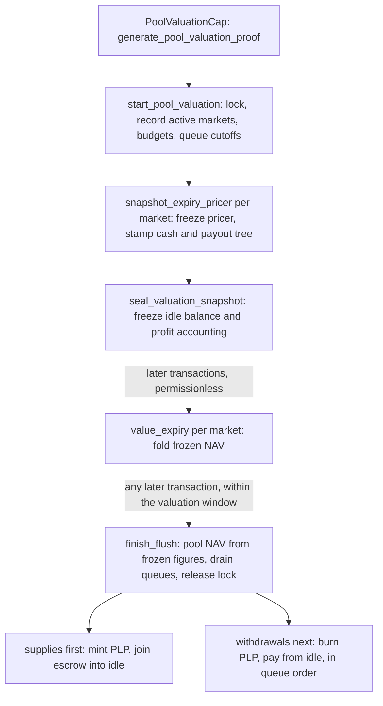

DeepBook Predict keeps its protocol state in 4 kinds of shared object, custodies user funds in the DeepBook `account` package, and reads every price from feeds that belong to a separate `propbook` package. Knowing which object owns which piece of state is enough to follow any Predict transaction. The same contracts run on Sui Mainnet and Sui Testnet; the only difference a reader of this page meets is the quote coin, which is native USDC on Mainnet and a mintable test coin with the same `usdc::USDC` module path on Testnet, where it displays as DUSDC.

The protocol's own shared objects are:

- `Registry`: The index and governance anchor. It records approved underlyings, the cadence policy that creates markets, the unique market for each underlying and expiry, and the allowlists of pause, market lifecycle, and pool valuation capabilities.
- `ProtocolConfig`: Every admin-tunable value, together with the global gates that each flow checks before it runs.
- `PoolVault`: The liquidity pool that writes every contract. It holds idle USDC, the protocol reserve, the PLP treasury cap, the per-expiry accounting ledger, the 2 liquidity request queues, and the pool valuation in flight, if any.
- `ExpiryMarket`: One object per underlying and expiry, holding that expiry's strike exposure, payout backing, and working USDC.

Trader balances and positions live in the account layer, and oracle data lives outside Predict entirely.

## Protocol shared objects {#shared-objects}

`Registry` indexes the protocol. It records each admin-approved propbook underlying, the cadence deployment policy for that underlying, and one `ExpiryMarket` for each underlying and expiry pair. It also holds the allowlists that make a `PauseCap`, a `MarketLifecycleCap`, or a `PoolValuationCap` valid, and it derives the `BuilderCode` objects that attribute builder fees to order-flow routers. It holds no trading state.

Package publication creates `Registry` and `ProtocolConfig` together and sends one `AdminCap` to the deployer. `ProtocolConfig` carries the tunable configuration plus 3 global gates: `trading_paused` blocks new risk, `frozen` halts the whole version-gated surface, and `version_watermark` sets the lowest package version a gated call can run. The pool flush has 2 further flags: the flush sets `valuation_in_progress` from its start until it finishes, which spans transactions, and sets `snapshot_in_progress` only inside the single transaction that snapshots the markets. A `flush_seq` counter stamps each valuation. Trading and flushes run under 2 timing values: `no_trade_window_ms`, deployed at 2000 ms, closes live trading just before expiry, and `max_valuation_window_ms`, deployed at 300000 ms, bounds how long a flush can take to finish. One configuration struct is a template: each new `ExpiryMarket` snapshots the current strike-exposure policy at creation, so a template change reaches later expiries and never a live one.

`ExpiryMarket` is the hot object for one expiry. It owns trade execution, the tick-keyed payout tree that tracks strike exposure, and an embedded `ExpiryCash` component that holds that expiry's working USDC. It stores the propbook underlying ID rather than any oracle object ID, alongside its tick size, admission tick size, and mint pause flag. A new market opens with zero cash and cannot mint until pool capital funds it. `plp::rebalance_expiry_cash` moves that cash from the pool's idle balance, and anyone can call it.

Capabilities are owned objects rather than roles stored on a shared object. `AdminCap` sets policy, `MarketLifecycleCap` creates markets, `PoolValuationCap` starts a pool flush, and `PauseCap` is a one-way emergency brake that cannot unpause anything. `AdminCap` mints and revokes the lifecycle and pool valuation capabilities, and each is valid only while its ID sits on the registry's allowlist. Predict holds no price-writing capability at all.

Every function an integrator calls is a `public fun` invoked from a [programmable transaction block](/develop/transactions/ptbs/prog-txn-blocks). Several return a value that the same transaction must consume, such as the pricer a quote reads or the authorization an account call spends.

## Where funds and positions live {#predict-manager}

Predict defines no account object of its own. It uses the shared `AccountWrapper` from the `account` package, which embeds an `Account` holding coin balances, the root for app data, and optional referral attribution. That `Account` is a field inside the wrapper, not a separate object.

Both the wrapper and the account address derive from the owner address through the `AccountRegistry`, so an application can compute either offchain before the account exists. `account_registry::new` creates the wrapper permissionlessly with the transaction sender as owner, and `account::share` publishes it in the same transaction. A second creation for the same owner aborts.

The 2 derived addresses are not interchangeable, and each surface takes exactly one of them. Every Move call takes the shared `AccountWrapper` object, so the wrapper ID is the onchain handle. The canonical account ID is the identity everything else keys on: app data hangs off it, event payloads carry it as `account_id`, and indexed read services accept it and nothing else. `client.predict.wrapperIdFor(owner)` derives the first, and `SessionsContract.deriveAccountId(owner)` on the `@mysten/deepbook-v3/sessions` subpath derives the second.

Predict attaches its own state to that account under the `PredictApp` namespace: a table of open positions keyed by the pair of expiry market ID and order ID, plus the sticky builder code the account trades under. Positions are not standalone objects, so read them from the account with `read.positions`.

Account mutation runs on an `Auth` value that `load_account_mut` consumes, and that value comes from one of 2 sources:

- **Owner authorization:** The account owner, or an owning object, generates it. Minting, live redemption, settled exits, liquidity requests and cancellations, and builder code configuration all use it.
- **Predict app authorization:** Predict generates it internally through the account registry so a keeper can sweep settled positions into an account without the owner signing. Deauthorizing the `PredictApp` type disables that automation while owner-authorized exits keep working.

An account receives credit through 2 delivery paths, and they surface as different events:

- **Straight into stored balance:** Settled payouts and live-close proceeds call `account::deposit<USDC>` on the account itself and emit `Deposited`. The funds are spendable as soon as the transaction lands, with no follow-up call.
- **Through the balance accumulator:** Builder fees, referral shares, and liquidity queue fills and refunds go to the account's receive address instead. They stay outside stored balance until the permissionless `account::settle<T>` folds them in and emits `FundsSettled`.

Reading a balance settles nothing. `account::balance<T>` takes an immutable `&Account`, so it cannot mutate anything: it reports stored balance plus the unsettled accumulator balance, which covers both paths without moving either. `account::settle<T>` is the mutating call, it takes the wrapper rather than the account, and anyone can make it.

## Oracle feeds {#oracle-feeds}

Oracle data is not Predict state. It lives in 3 shared objects in the separate `propbook` package, and Predict reads them without ever writing to them:

- `PythFeed`: One source-native Pyth Lazer spot payload per feed ID, plus exact timestamp history. Predict reads the normalized spot and the timestamp of the observation behind it.
- `BlockScholesValueStore`: The 10 most recent Block Scholes spots and the latest per-expiry forward, plus exact minute-boundary spot history.
- `BlockScholesSVIStore`: The latest per-expiry stochastic volatility inspired (SVI) parameter set, which describes the shape of the implied distribution.

Updates to all 3 are permissionless, because a verified Pyth Lazer payload, or a signed Block Scholes batch, is its own proof of origin. The relayer that lands one needs no capability.

Propbook's `OracleRegistry` records which feed objects are canonical for an underlying. Market creation asserts those bindings exist, and every priced call revalidates the objects it receives against the current binding, so passing a feed that is not canonical aborts. Predict also rejects an observation whose writer digest matches the current transaction, which stops a caller from pushing an oracle update and trading against it, or snapshotting a flush against it, in the same transaction.

Freshness is a read-time check rather than a writer promise. Live pricing runs under 3 admin-tunable windows: one for the Pyth spot, one for the Block Scholes spot and forward, and a looser one for the SVI parameters, which change more slowly. Both deployments ship the first 2 at 2 seconds and the SVI window at 60 seconds. An observation is fresh only when its source timestamp is positive, not in the future, and inside its window. For Block Scholes data the source timestamp is the provider's per-update timestamp, and the SVI roll-down keys on it.

## Strikes, ticks, and positions {#positions-and-ranges}

Predict has one strike representation across the whole protocol: an absolute integer tick, where the raw strike is the tick multiplied by the market's `tick_size`. There is no centered grid and no per-market origin, so the same tick means the same price at the public function, in the event, in the payout tree, and at settlement. Because the protocol fixes the tick domain in advance, market creation reads no live spot.

A position is a range, carried as the tick pair `lower_tick` and `higher_tick`, and its payout region is half-open: it pays when settlement lands above the lower strike and at or below the higher strike. Either of 2 sentinel ticks gives a range an open end:

- Tick `0` is the negative infinity sentinel, so a downside position runs from `0` to the strike tick.
- Tick `1073741823`, the largest 30-bit value, is the positive infinity sentinel, so an upside position runs from the strike tick to `1073741823`.
- Finite strikes occupy every tick in between, from `1` to `1073741822`.

The protocol rejects the fully open range from `0` to `1073741823`, because it would pay in every outcome. A finite boundary must also land on the market's coarser admission grid, with one exception: each market records a reference tick taken from the exact Pyth spot at its reference timestamp, and the protocol admits that tick even when it falls off the admission grid. Anyone can record it with `expiry_market::set_reference_tick`, which takes no capability, and until a market has one, a quote against the reference strike fails. A repeat call with the same tick succeeds and emits nothing, so the call is safe to retry.

Minting returns one packed `u256` order ID that encodes the quantity in lots, both ticks, and a market-local sequence number. Treat it as an opaque handle. Quantity moves in whole lots of `10000` base units, which is 0.01 USDC, and that lot size is the granularity of a quantity rather than a tradable minimum. The premium floor under [Pricing and settlement](#pricing-and-risk) sets the real minimum, and it is always more than 100 lots. An order ID is unique only inside one market, so identify a position by the pair of market ID and order ID. Closing part of a position retires its order ID and issues a replacement for the remaining quantity, while the original mint's root ID stays stable across those replacements.

## Pricing and settlement {#pricing-and-risk}

Pricing is transaction-local. `expiry_market::load_live_pricer` takes the protocol configuration, the propbook registry, and the 3 oracle objects, then returns a pricer bound to that one market. The pricer has no `store` ability, so every transaction that quotes, mints, or redeems live builds a fresh one. The pool flush is the one place a pricer outlives its transaction, and it does so as a `FrozenPricer` that only the `plp` module can create or read.

The pricer resolves a forward, then reads each range's probability off the SVI curve as the difference between its 2 strike boundaries. While `use_pyth_spot_for_forward` is on, which is the shipped default, a fresh usable Pyth spot anchors the forward and the Block Scholes basis scales it. The basis is the latest Block Scholes forward for that expiry divided by the Block Scholes spot that carries the same source timestamp, which the pricer looks up among the 10 most recent spots the value store retains. When no retained spot matches, live pricing aborts with `EBlockScholesPriceUnavailable`, whichever forward source is active. A missing, stale, or unusable Pyth spot falls back to the Block Scholes forward for that expiry. A position's live value is its quantity multiplied by its range probability, and a winning position settles at its full quantity. Mint admission holds the quoted range probability inside a per-market band, and for a two-sided range it also holds the probability that settlement ends above the lower strike and the probability that it ends at or below the higher strike inside that band. It also requires a minimum premium, so a quote at the extreme edge of the distribution fails rather than rounding. A mint whose all-in cost would exceed its own maximum payout aborts with `EMintCostAboveMaxPayout`.

Live trading has a hard stop before expiry. `no_trade_window_ms` sets a window, 2 seconds on both deployments, inside which every quote, mint, and live redeem aborts with `ETradeWindowClosed`, and live pricing aborts once the expiry itself has passed. Settled redemption, settlement, and reference tick recording ignore the window. In a market's final seconds the entry probability converges hard, so the window removes trades that would fill at a converged price.

That premium floor is what actually bounds trade size. `strike_exposure_config::assert_mint_admission` rejects any mint whose premium falls below 1 USDC, and the premium is the quantity multiplied by the quoted entry probability. The admissible quantity is therefore the reciprocal of the quoted probability, and `max_entry_probability` caps that probability at 0.99, so about 1.02 contracts is the smallest quantity any strike can ever take and every other strike needs more. A quote near a 50 percent chance needs roughly 2 contracts, and a far strike quoting near the bottom of the band needs tens. Size a position by the product rather than by the lot grid.

Settlement is one permissionless transition, `expiry_market::try_settle`, and repeat calls are harmless. It first looks for the exact Pyth spot at the market's expiry timestamp. If Pyth remains unavailable 30 seconds after expiry, the same call can use the exact Block Scholes minute-boundary spot instead. Both lookups are exact matches, with no nearest, rounded, or interpolated fallback. The transition records the terminal price and the exact remaining payout liability together, and `MarketSettled` reports which source won. When neither source is usable, the call returns `false` and the market stays unsettled. A flush in flight never blocks settlement. Settled redemption and `plp::rebalance_expiry_cash` read only the recorded state, so they take no oracle argument at all. In the flush, only the snapshot stage reads oracles: `plp::snapshot_expiry_pricer` takes the `OracleRegistry`, the `PythFeed`, the `BlockScholesValueStore`, and the `BlockScholesSVIStore`, and the later `plp::value_expiry` takes none of them.

Predict enforces solvency per expiry rather than through a protocol-wide exposure ratio. Every cash movement re-asserts that a market's `ExpiryCash` balance covers its payout liability plus its isolated inventory-impact escrow, and only the surplus above that line is cash the pool can sweep. Monetary math rounds in the protocol's favor, so an expiry can always pay its winners. At the pool level, `max_lp_pool_value` caps how much liquidity the pool accepts, at 500,000 USDC on both deployments.

### Fee components {#fee-components}

A quote reports every charge separately, and a mint debits the premium plus the trading fee net of any subsidy, plus the builder fee, the congestion surcharge, and the inventory-impact charge. A live close withholds the same charges from the payout, and a settled winner collects its full quantity. The components are:

- **Trading fee:** The protocol charges it once at each finite boundary of the range, so a directional position pays 1 boundary fee and a two-sided range pays 2. Each boundary's per-unit rate is proportional to the standard deviation of the Bernoulli outcome at that strike, so it peaks where the probability of settling above the strike is nearest to 50 percent and falls toward the tails, with a per-unit floor underneath it. A linear ramp lifts that rate inside a configured window before expiry, and the protocol rounds each boundary's fee down separately.
- **Fee incentive subsidy:** A reduction in the trading fee, funded from the market's sponsored incentive balance. Anyone can top that balance up. It is `fee_incentive_subsidy` onchain and `subsidy` in the SDK quote and receipt.
- **Builder fee:** An optional add-on for accounts that carry a builder code: 10 percent of the trading fee, capped at 0.5 percent of quantity. It routes to the builder code's address rather than into the pool. [Builder codes](#builder-codes) covers the mechanism.
- **Congestion surcharge:** A flat per-unit charge that fires only when the transaction's gas price is a high outlier against the market's own smoothed estimate. It is `penalty_fee` onchain and `penalty` in the SDK quote and receipt, so a `penalty` line in a quote is this charge. Admin can disable it, and it ships disabled on both deployments.
- **Inventory-impact charge:** A charge sized by the change a trade makes to the book's payout profile, held in the market's isolated escrow and rebated when a trade closes that exposure. Its rate ships at zero, which makes the mechanism inert.

For example, take a two-sided range with a 0.8 probability of settling above its lower strike and a 0.2 probability of settling above its higher strike. Its range probability is 0.6, so the premium is 0.6 USDC per contract. At a 10 percent base fee and outside the expiry ramp, each boundary's rate is `0.1 * sqrt(0.8 * 0.2) = 0.04`, so the range pays 0.08 USDC per contract in trading fee. Each boundary pays at least the per-unit floor, so a two-sided range always pays at least twice the floor.

A referral share is not another charge: it is split out of fees the trader has already paid, and it never changes `cost`. [Referrals](#referrals) covers the whole mechanism.

## Referrals {#referrals}

Predict pays referrers out of protocol fees. When an account created with a referrer mints a position, a fixed share of the fees that mint paid goes to the referrer's account instead of into the pool. The referred trader pays exactly what an unreferred trader pays for the same trade, so the referral is a redistribution of protocol revenue, not a surcharge.

The system has no registration, no codes to issue, and no claim step. Any existing account can be a referrer, and earnings arrive in the referrer's account balance on the transaction that earns them.

### Set the referrer at account creation {#referral-attribution}

A referral is a property of the referred account, fixed when the account is created. `account::account_registry::new_with_referrer` takes the referrer's shared `AccountWrapper` and creates the sender's account with 2 fields copied from it: the referrer's canonical account ID, which identifies the referrer in events, and the referrer's wrapper address, which receives the payments. [Create an account](/onchain-finance/deepbook/deepbook-predict/contract-information/predict-manager#create-a-manager) gives the signature alongside the other 2 constructors.

Nothing can change that attribution afterwards. The account package has no setter for either field, so a referrer can never be swapped, removed, or added later, and an account created with the plain `account_registry::new` has no referrer for its whole life. Each owner address has exactly one account, which makes the choice permanent for that address. An onboarding flow that wants to credit a referrer must use `new_with_referrer` on the user's first account creation, because an owner address can create an account only once. `new_self_owned`, which creates an account owned by an object, has no referral form.

Three more rules follow from the call's signature:

- **Any account can refer.** The referrer needs only to exist as a shared `AccountWrapper`. It does not register, does not need to have traded, and does not need to hold a balance.
- **A new account cannot refer itself.** The referrer wrapper must exist before the call runs, and the account being created does not. Beyond that, the registry does not check who controls the referrer, so nothing stops one person from creating an account at a second address with their first account as its referrer.
- **Referral is one level deep.** A mint pays only the minting account's own referrer. The protocol never follows that referrer's referrer, so there are no multi-level payouts.

### What a referrer earns {#referral-fee}

On every mint by a referred account, the protocol computes:

```text
referral_fee_basis = (trading_fee - fee_incentive_subsidy) + penalty_fee
referral_fee       = floor(referral_fee_basis * referral_fee_rate / 1e9)
```

The basis is what the trader actually paid the protocol in fees on that mint: the trading fee net of the sponsor-funded subsidy, which the trader did not pay, plus the congestion surcharge. The basis excludes two other amounts:

- **The builder fee:** It already belongs to the builder the account routes through.
- **The inventory-impact charge:** It is isolated risk escrow held against the book, not fee revenue.

`referral_fee_rate` is a single protocol-wide value on `ProtocolConfig`, not a per-referrer or per-account rate. It ships at `100_000_000`, which is 10 percent, and a chain read on 2026-09-28 found it at that value on both networks. An admin can set it anywhere from 0 to 25 percent with `protocol_config::set_referral_fee_rate`. The protocol reads the current rate on each mint rather than snapshotting it into the account or the market, so a rate change reaches every referred account from its next mint onward. The setter emits no event, so read the live value with `protocol_config::referral_fee_rate` rather than tracking changes.

Every mint shape pays referrals: `mint_exact_quantity`, `mint_exact_amount`, and `mint_exact_cost` all go through the same charging path. Nothing else does. A live redeem and a settled redeem both charge or pay out with no referral share, so a referrer earns on the positions a referred trader opens, and not when that trader closes them.

For example, take a referred directional mint that pays 0.25 USDC of trading fee, of which the sponsor subsidy covers 0.05 USDC, and no congestion surcharge. The referral basis is 0.20 USDC, and at 10 percent the referrer receives 0.02 USDC. An unreferred trader making the same mint pays the same 0.20 USDC of fees, all of which stays with the pool. The protocol rounds the referral down to the USDC base unit, and when that rounds to zero it sends nothing.

### Where the referral comes from {#referral-funding}

The trader does not pay for the referral. The protocol computes the referral only after the mint's `all_in_cost` is final, then splits it out of the payment the trader has already made, so `all_in_cost`, the `max_cost` guard, and the account debit are identical with or without a referrer. The Move `MintQuote` has no referral field for that reason.

The referral reduces what the pool keeps. Without a referrer, the trader-paid fee and the congestion surcharge land in the expiry's cash and accrue to the pool, that is, to PLP holders and the protocol's profit share. With a referrer, the referral share is split off first and only the rest lands there. Sponsor incentives never fund it: the basis excludes the subsidy, and the protocol splits the referral from the trader's payment before the subsidy joins. [The referral split](/onchain-finance/deepbook/deepbook-predict/contract-information/predict#referral-split) gives the Move-level formula.

### How the referrer receives it {#referral-delivery}

The protocol sends each referral payment to the referrer's wrapper address with `balance::send_funds`, through the balance accumulator, in the same transaction as the mint. There is no claim to make:

- **It counts at once.** `account::balance<USDC>`, and therefore `read.balance` in the SDK, includes accumulator funds that have not been settled yet, so the payment shows in the referrer's balance as soon as the mint lands. The one exception is a referrer whose USDC already settled at the same millisecond timestamp: the settlement latch defers both the read and the fold to the next timestamp.
- **It becomes spendable on the next call.** Every mint entrypoint and `account::withdraw_funds` settle the account's USDC before they debit it, so the referrer can trade or withdraw the earnings directly. Anyone can also fold them into stored balance with the permissionless `account::settle<USDC>`.

The settled earnings are then ordinary account balance, spendable under the same authority as any other funds in the account.

### Tracking referrals {#referral-events}

Two events carry the referral across three fields, all keyed on the canonical account ID rather than the wrapper ID:

| **Event** | **Field** | **Meaning** |
| --- | --- | --- |
| `account_events::AccountCreated` | `referrer_account_id` | The referrer an account was created with, or none. Emitted once, at creation. |
| `order_events::OrderMinted` | `referrer_account_id` | The minting account's referrer, recorded on every mint. It is present even when the rate is 0 or the payment rounds to 0. |
| `order_events::OrderMinted` | `referral_fee` | The USDC, in base units, sent to that referrer on this mint. |

A referrer's total earnings are the sum of `referral_fee` over `OrderMinted` events whose `referrer_account_id` is the referrer's canonical account ID. Onchain, `account::referrer_account_id` and `account::referrer_receive_address` read the attribution from any account.

The SDK reports the amount but not the recipient. `MintQuote.fees.referral` and `MintReceipt.fees.referral` carry the referral payment, with the exact integer in the receipt's `raw.referralFee`, but neither receipt nor `CreateManagerReceipt` carries `referrer_account_id`. Read attribution from the raw events. [Predict Accounts SDK](/onchain-finance/deepbook/deepbook-predict-sdk/accounts#create-with-referrer) shows how to create a referred account from TypeScript.

### Referrals, builder codes, and DeepBook spot referrals {#referrals-vs-builder-codes}

Predict has a second way to reward the party that brings in a trader, and DeepBook's spot order book has a referral system of its own. They do not interact:

| **Property** | **Predict referral** | **Predict builder code** |
| --- | --- | --- |
| Who is paid | The referrer's account | The builder code's object address |
| Cost to the trader | None: carved out of protocol fees | An add-on on top of the trading fee |
| Charged on | Mints only | Mints and live redeems |
| How it is attached | Once, at account creation, permanently | Set or cleared at any time, under the account's owner or app authorization |
| Rate | Protocol-wide `referral_fee_rate` | Protocol-wide builder multiplier, capped per quantity |

An account can carry both, and a mint then pays both independently. [Builder codes](#builder-codes) covers the builder side in full. DeepBook spot referrals attach to a balance manager and pay out of spot trading fees; the `ReferralQueries` methods on the `@mysten/deepbook-v3` package root read those, and they do not apply to Predict accounts or mints.

## Builder codes {#builder-codes}

A builder code lets an app, wallet, or bot that routes order flow to Predict earn a fee from the accounts that trade through it. An account opts in by attaching a code. From then on, each of its mints and live closes pays a builder fee on top of the trading fee, and the fee collects at the code's own address until the code's owner claims it.

Builder codes and referrals answer different needs. A referral pays out of protocol fees at no cost to the trader, and it is fixed when the account is created. A builder fee is an extra charge the trader pays, and the account can change or remove its code at any time. [Referrals, builder codes, and DeepBook spot referrals](#referrals-vs-builder-codes) compares the two.

### Create a code {#builder-code-create}

`registry::create_and_share_builder_code` creates a shared `BuilderCode` object and returns its ID. Anyone can call it. The transaction sender becomes the code's owner and chooses an `index`, so one address can own any number of codes, for example one for each app it runs. [Builder codes](/onchain-finance/deepbook/deepbook-predict/contract-information/registry#builder-codes) gives the signature.

The code's ID derives from the Predict `Registry`, the owner address, and the index. You can therefore compute the ID before the code exists, and a second creation with the same owner and index aborts with `derived_object::EObjectAlreadyExists`. Creation is version-gated like other Predict calls and emits `BuilderCodeCreated`.

The owner never changes. `BuilderCode` has no function that transfers ownership or deletes the code, and only the owner can claim its fees, so the key that creates a code is the only key that can ever collect from it.

### Attach a code to an account {#builder-code-attach}

An account attaches a code with `predict_account::set_builder_code` and removes it with `predict_account::unset_builder_code`. [Builder codes](/onchain-finance/deepbook/deepbook-predict/contract-information/predict-manager#builder-codes) gives both signatures. Each call takes an `Auth`, which in practice means the account owner signs it. The code's owner takes no part, and no session wrapper exists for either call, so a session key cannot change the attachment.

An account carries at most one code. Attaching one affects only the trades that follow, and a later `set_builder_code` replaces it. Any app the account owner signs a `set_builder_code` transaction for can therefore switch the account to that app's own code, and the previous code earns nothing from the account's later trades.

### What the builder earns {#builder-fee}

On each mint and each live close by an account that carries a code, the protocol charges:

```text
builder_fee = min(floor(trading_fee * 100_000_000 / 1e9), floor(quantity * 5_000_000 / 1e9))
```

That is 10 percent of the trading fee, capped at 0.5 percent of the quantity, which is the position's maximum payout. Both rates are compiled constants, `constants::builder_fee_multiplier` and `constants::max_builder_fee_rate`, so they are the same on both networks and change only with a package upgrade. No admin setting adjusts them, unlike the referral rate.

Three details decide what a trade pays:

- **The trader pays it on top of the trading fee.** On a mint it adds to `all_in_cost`, so the `max_cost` cap covers it. On a live close it comes out of the proceeds, so the `min_proceeds` floor covers it.
- **The sponsor subsidy does not reduce it.** On a mint the protocol computes it from the full trading fee, before the subsidy, so a subsidized mint pays the same builder fee as an unsubsidized one.
- **A live close caps it again.** The builder fee on a close cannot exceed the payout left after the trading fee, so a close whose trading fee consumes the whole payout pays no builder fee.

A settled redeem pays no builder fee, because it charges no fees at all.

For example, take the two-sided range from [Fee components](#fee-components), which pays 0.08 USDC per contract in trading fee. Ten percent of that is 0.008 USDC per contract, but the cap is 0.005 USDC per contract, so the builder fee is 0.005 USDC per contract, or 0.50 USDC on a 100-contract mint.

### Claim the fees {#builder-fee-claim}

The protocol sends each builder fee to the code's object address with `balance::send_funds`, through the balance accumulator, in the same transaction as the trade. The fees never reach the owner's address or any account directly. Two functions on `deepbook_predict::builder_code` read and collect them:

- **`claimable_builder_fees`** returns the USDC that the accumulator has settled at the code's address. It counts only funds the accumulator has already settled, so it can briefly lag the most recent trades.
- **`claim_all_builder_fees`** withdraws all of it and returns a `Coin<USDC>`, which the same transaction must transfer or use. Only the code's owner can call it, and any other sender aborts with `builder_code::ENotOwner`. With nothing to claim, it returns a zero-value coin and emits no event. It has no partial form.

Claiming takes no `ProtocolConfig`, so a trading pause, a protocol freeze, or a raised version watermark never blocks it. [Predict Accounts SDK](/onchain-finance/deepbook/deepbook-predict-sdk/accounts#operate-builder-code) shows how to create a code and claim its fees from TypeScript.

### Track builder activity {#builder-code-events}

Five events cover a code's life:

| **Event** | **Fields** | **Emitted** |
| --- | --- | --- |
| `builder_code_events::BuilderCodeCreated` | `builder_code_id`, `owner`, `builder_code_index` | Once, when the code is created. |
| `builder_code_events::BuilderCodeSet` | `account_id`, `owner`, `builder_code_id` | On each attach and each removal. `owner` is the account's owner, and `builder_code_id` is `none` after a removal. |
| `order_events::OrderMinted` | `builder_fee`, `builder_code_id` | On each mint. |
| `order_events::LiveOrderRedeemed` | `builder_fee`, `builder_code_id` | On each live close. |
| `builder_code_events::BuilderFeesClaimed` | `builder_code_id`, `owner`, `amount` | On each claim that collects a non-zero amount. |

On the 2 order events, `builder_code_id` names the code that was paid, not the code the account carries. It is `none` whenever `builder_fee` is 0, even when the account has a code attached. To find the accounts that carry a code, read `BuilderCodeSet`. To total what a code has earned, sum `builder_fee` over the order events whose `builder_code_id` is that code. Referral attribution behaves differently: `OrderMinted.referrer_account_id` is present even when the referral payment is 0.

In the SDK, `MintReceipt` and `RedeemReceipt` carry `builderCodeId` and `fees.builder`, with the exact integer in `raw.builderFee`, and `decode.builderCode` reads `BuilderCodeSet`.

## Pool liquidity and PLP {#vault-and-plp}

`PoolVault` is the counterparty to every trade. Liquidity providers deposit USDC and receive PLP shares, a 6-decimal coin that matches USDC's decimals. The vault holds:

- Idle USDC available for withdrawals and expiry funding
- A protocol reserve excluded from PLP redemption
- The PLP treasury cap
- The per-expiry accounting ledger
- The supply and withdraw queues
- The valuation in flight

Supply and withdrawal are asynchronous, so nobody mints or burns PLP against a live price:

- `plp::request_supply` escrows USDC with a `min_plp_out` floor and returns a queue index.
- `plp::request_withdraw` escrows PLP with a `min_usdc_out` floor and returns a queue index.
- `plp::cancel_supply_request` and `plp::cancel_withdraw_request` reclaim the escrow at that index any time before a flush reaches it, except while a flush is in flight.

A flush values the whole pool once and fills eligible queue heads at that single frozen mark. It runs in 3 stages, and only the first must fit in one transaction:

1. **Snapshot, in one transaction:** `registry::generate_pool_valuation_proof` turns an allowlisted `PoolValuationCap` into a proof that `start_pool_valuation` consumes. Starting sets the valuation lock, bumps `flush_seq`, records the active market set, the 2 drain budgets, and each queue's request cutoff, and returns a `SnapshotStage` value with no abilities. `snapshot_expiry_pricer` then runs once per active market, taking the propbook `OracleRegistry` and the 3 feed objects: it freezes a live market's pricer into a `FrozenPricer` and stamps the market's cash, escrow, and payout tree, while it sweeps an already settled market and records it as contributing zero. `seal_valuation_snapshot` consumes the stage, aborts unless every expected market has a snapshot, and freezes the vault's idle balance and profit accounting. The 2 hot potatoes force all of this into a single transaction, and the snapshot refuses an oracle observation written in that same transaction.
1. **Valuation, across any number of transactions:** `value_expiry(vault, market, config)` folds one market's frozen mark into the running total: the stamped cash rows plus the payout liability the frozen pricer implies. It is permissionless, takes no oracle or clock, moves no cash, and returns without effect on a market that is not in the snapshot or that an earlier call already valued, so a keeper list that is stale or a retry that repeats is harmless.
1. **Finish, in any later transaction:** `finish_flush` is permissionless, because the start committed the budgets. It aborts unless `value_expiry` has run for every snapshotted market, computes the pool's net asset value from the frozen figures, drains the queues at that one mark for every request queued before the cutoff, releases the lock, and emits `FlushExecuted`.

The snapshot expires. `finish_flush` aborts with `EValuationWindowExpired` once `max_valuation_window_ms` has elapsed since the snapshot, 5 minutes on both deployments. There is no abort call: the recovery is a fresh `start_pool_valuation`, which discards the stale valuation, emits `FlushRestarted`, and snapshots again. The next mint, redeem, or settlement on a market lazily clears any stamp an abandoned flush left on it.

Pool value is not idle plus markets. `lp_pool_value` starts from the frozen idle USDC plus accumulated market net asset value, then subtracts 2 held-out terms: an exclusion term covering the protocol's share of profit that PLP holders cannot redeem, and the pending protocol profit already materialized but not yet drained into the reserve. The result floors at zero rather than underflowing. `FlushExecuted.pool_value` reports that frozen figure, and its `idle_balance_before` field is live telemetry rather than the mark input.


```mermaid
flowchart TD
  CAP["PoolValuationCap: generate_pool_valuation_proof"] --> START["start_pool_valuation: lock, record active markets, budgets, queue cutoffs"]
  START --> SNAP["snapshot_expiry_pricer per market: freeze pricer, stamp cash and payout tree"]
  SNAP --> SEAL["seal_valuation_snapshot: freeze idle balance and profit accounting"]
  SEAL -. later transactions, permissionless .-> VAL["value_expiry per market: fold frozen NAV"]
  VAL -. any later transaction, within the valuation window .-> FIN["finish_flush: pool NAV from frozen figures, drain queues, release lock"]
  FIN --> SUP["supplies first: mint PLP, join escrow into idle"]
  FIN --> WD["withdrawals next: burn PLP, pay from idle, in queue order"]
```

Starting a flush needs a capability; finishing it does not. Only a `PoolValuationCap` on the registry's allowlist can produce the proof that `start_pool_valuation` consumes, and the snapshot that fixes the mark exists only through that call, so gating the start gates the mark. That boundary is what makes one mark safe in both directions, because an adversary cannot time the valuation against an oracle update they control. After the seal, anyone can value the markets and finish the flush, and nothing they do changes the mark.

Trading continues through a flush. Live mints, quotes, and redeems abort with `ESnapshotInProgress` only inside the snapshot transaction itself, which no other transaction can interleave with, so in practice the gate never fires on a trader. After the seal, trades on a stamped market run normally and do not move the frozen mark, because the payout tree keeps the pre-trade values the snapshot captured. Supply and withdraw requests submitted during a flush queue normally and wait for the next one. What a flush in flight does block is canceling a queued request, sponsoring fee incentives, rebalancing expiry cash during the snapshot stage, and the admin setters the flush reads.

The drain runs supplies first, then withdrawals in queue order until idle USDC runs out, and the budgets committed at the start bound each pass. The flush refunds a head request whose quote misses its own floor rather than leaving it to block the queue: `lp_request_limit_flush_attempts` is 1 on both deployments, so the first miss cancels it. A withdrawal larger than the remaining idle balance takes what idle covers and keeps its unfilled balance queued. The flush delivers every fill and refund to the recipient account's receive address through the balance accumulator.

Because supplies fill before withdrawals, USDC supplied in a flush can pay that same flush's withdrawals. Cash already funded into an expiry stays there until rebalancing or settlement returns it, so idle liquidity bounds a large exit and spreads it across flushes instead of draining a live market.

## Data flow {#data-flow}

Split reads by freshness and purpose:

1. Build quotes, balances, positions, pool state, and market state with the Predict client in [`@mysten/deepbook-v3`](https://www.npmjs.com/package/@mysten/deepbook-v3). Every read runs against the Sui node core API through simulation and object reads, and the event decoders parse a transaction result with no network call at all, so these reads need no indexer on either network.
1. Subscribe to Sui checkpoints or protocol events over gRPC when an interface needs a live tape of oracle updates and trades, and back it with a `ListEvents` backfill for history.
1. Render history, portfolios, and oracle observation series from an indexed read service where one exists for the deployment you target. As of 2026-09-14 the public read services index only `predict-8-21`, an earlier Testnet deployment, and none exists for the current Mainnet or Testnet deployments; [Contract Information](/onchain-finance/deepbook/deepbook-predict/contract-information#public-read-apis-for-the-predict-8-21-testnet-deployment) scopes them. Any such service keys account-scoped paths on the canonical account ID, and a wrapper ID there returns `200` with an empty array rather than an error.

Preflight is a property of the SDK layer, not of the Move layer, and the 2 quote surfaces differ:

- **In the SDK:** `read.quoteMint` and `read.quoteRedeem` each dry-run the transaction their matching builder produces for the options you pass, against the real account and the real fee path, so they raise the same typed errors the write would, including insufficient balance. A mint quote called with only `quantity` carries no slippage cap. A successful SDK quote is a preflight.
- **Onchain:** `expiry_market::quote_mint` prices only. It applies the live-mint and admission gates, including the no-trade window, and it checks no account, no slippage cap, and no exposure capacity, so a successful Move quote says nothing about whether the mint would land.

For package IDs, object IDs, and deployed configuration, see [Contract Information](/onchain-finance/deepbook/deepbook-predict/contract-information).
