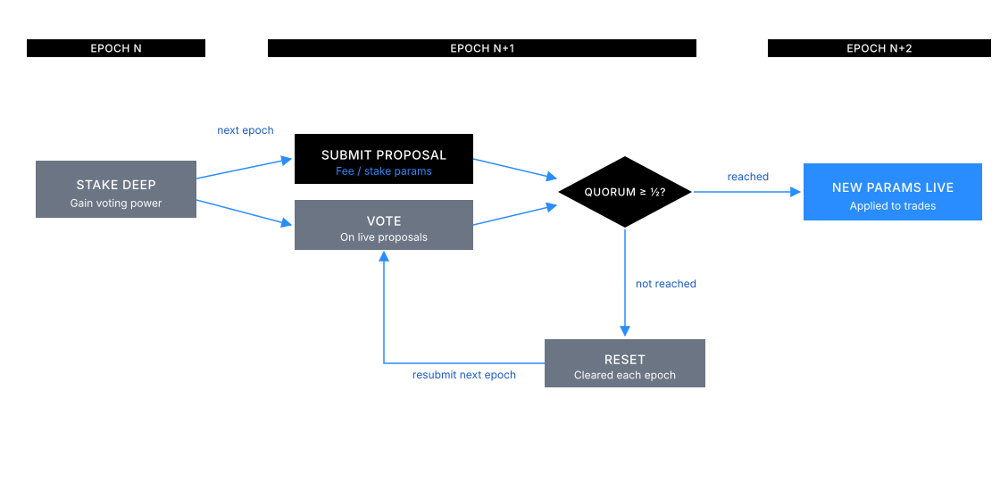

DeepBook's novel approach to governance allows users to update a single pool's three parameters:

- Taker fee rate
- Maker fee rate
- Stake required

Stake required is the amount of DEEP tokens a user must have staked in the pool to take advantage of taker and maker incentives. Each individual DeepBook pool has independent governance, and governance can be conducted every epoch. See [Design](/onchain-finance/deepbook/deepbookv3/design#governance) to learn more about governance.



## How staking works

To participate in a pool's governance, you stake DEEP tokens from your own `BalanceManager` into the pool. Your stake does not become active until the following epoch. Once active, if your staked amount meets or exceeds the pool's required stake threshold, you receive reduced taker fees and accumulate maker rebates for that epoch.

Staking gives you two types of benefits:

- **Reduced taker fees:** Paid when you place an order that matches against an existing order in the book.
- **Maker rebates:** Accumulated when you provide liquidity by placing orders that rest in the book. You claim these rebates explicitly using `claim_rebates`.

When you unstake, all active and inactive stake returns to your `BalanceManager` immediately. Any votes you cast are removed, maker rebates for the current epoch are forfeited, and reduced taker fees are disabled for the remainder of the epoch.

## How governance works

Each DeepBook pool governs its own parameters independently. Governance runs on an epoch-by-epoch cycle:

1. Users with nonzero active stake submit proposals to change the taker fee, maker fee, or required stake amount.
2. Each `BalanceManager` submits at most one proposal per epoch.
3. If the maximum number of proposals is reached, the proposal with the fewest votes is removed. A new proposal is only added if the submitter has more voting power than the lowest-voted existing proposal.
4. Users vote on proposals using their full voting power. Switching votes removes the previous vote and applies all voting power to the new proposal.
5. A proposal only takes effect if its votes are strictly above quorum. At the end of the epoch, the parameters of the leading proposal above quorum take effect in the following epoch. If no proposal clears quorum, the pool keeps its current parameters.

Quorum is 50% of the pool's total voting power, snapshotted at the start of the epoch. Because the snapshot is taken then, stake added during the epoch raises voting power for the next epoch's quorum, not the current one.

Voting power is not proportional to stake. It counts one for one up to 100,000 DEEP, and grows as the square root of stake beyond that, so a very large staker cannot dominate a pool outright. You cannot split voting power across multiple proposals.

Whitelisted pools are exempt from governance. Submitting a proposal against one aborts with `EWhitelistedPoolCannotChange`.

## What are the staking and governance endpoints?

`Pool` exposes the following endpoints for staking and governance.

<details>
<summary>Stake</summary>

DEEP tokens must be available in the `balance_manager` for staking. A user's stake becomes active in the following epoch. If the user's active stake is greater than the stake required, the user can get reduced taker fees and can accumulate trading fee rebates during that epoch.

<ImportContent source="packages/deepbook/sources/pool.move" mode="code" org="MystenLabs" repo="deepbookv3" fun="stake" noComments />

</details>

<details>
<summary>Unstake</summary>

All of the user's active and inactive stake are removed and added back into the `BalanceManager`. Any casted votes are removed. Maker rebates for the epoch are forfeited, and any reduced taker fees for the remaining epoch are disabled.

The `balance_manager` must have enough staked DEEP tokens. The `balance_manager` data is updated with the unstaked amount. Balance is transferred to the `balance_manager` immediately.

<ImportContent source="packages/deepbook/sources/pool.move" mode="code" org="MystenLabs" repo="deepbookv3" fun="unstake" noComments />

</details>

<details>
<summary>Submit proposal</summary>

Users with a nonzero active stake can submit proposals. One proposal per user. The user automatically votes for the proposal they submit.

Submit a proposal to change the taker fee, maker fee, and stake required. The `balance_manager` must have enough staked DEEP tokens to participate. Each `balance_manager` can only submit one proposal per epoch. If the maximum proposal is reached, the proposal with the lowest vote is removed. If the `balance_manager` has less voting power than the lowest voted proposal, the proposal is not added.

<ImportContent source="packages/deepbook/sources/pool.move" mode="code" org="MystenLabs" repo="deepbookv3" fun="submit_proposal" noComments />

</details>

<details>
<summary>Vote</summary>

Users with nonzero voting power can vote on a proposal. All voting power is used on a single proposal. If the user has voted on a different proposal during this epoch, then that vote is removed and recasted into the new proposal. The `balance_manager` must have enough staked DEEP tokens to participate.

<ImportContent source="packages/deepbook/sources/pool.move" mode="code" org="MystenLabs" repo="deepbookv3" fun="vote" noComments />

</details>

<details>
<summary>Claim rebates</summary>

Use `claim_rebates` to claim the rewards for the `balance_manager`. The `balance_manager` data is updated with the claimed rewards. Calling it with nothing accrued succeeds and claims zero.

<ImportContent source="packages/deepbook/sources/pool.move" mode="code" org="MystenLabs" repo="deepbookv3" fun="claim_rebates" noComments />

</details>

## Why should I stake DEEP tokens?

Staking DEEP tokens in a pool gives you direct influence over that pool's economics and lowers your trading costs. Without staking, you pay the pool's default taker fee on every matched order and receive no rebates for providing liquidity.

With sufficient active stake, you pay a reduced taker fee and earn maker rebates each epoch. Over time, active participants who stake and vote can shape the pool's fee structure to reflect current market conditions, benefiting all users who trade in that pool.

## Example: stake, vote, and claim rebates

The following example shows the sequence of calls a user makes to stake DEEP tokens, submit a governance proposal, vote on a proposal, and claim rebates at the end of an epoch.

```move
// Each call needs a TradeProof for the BalanceManager. The owner
// generates one directly; a delegated trader uses generate_proof_as_trader.
let proof = balance_manager.generate_proof_as_owner(ctx);

// 1. Stake DEEP tokens from your BalanceManager into the pool.
//    Your stake becomes active in the next epoch.
pool::stake(&mut pool, &mut balance_manager, &proof, stake_amount, ctx);

// 2. After your stake is active, submit a governance proposal.
//    This example proposes updated taker fee, maker fee, and stake required values.
pool::submit_proposal(
    &mut pool,
    &mut balance_manager,
    &proof,
    taker_fee,
    maker_fee,
    stake_required,
    ctx,
);

// 3. Vote on an existing proposal using your full voting power.
//    If you already voted this epoch, your previous vote is removed.
pool::vote(&mut pool, &mut balance_manager, &proof, proposal_id, ctx);

// 4. At any point after rebates accumulate, claim them back to your BalanceManager.
pool::claim_rebates(&mut pool, &mut balance_manager, &proof, ctx);
```

Call `stake` before the epoch ends so that your stake is active in the following epoch. Voting and submitting proposals require nonzero active stake. Claiming rebates when your `BalanceManager` has none accumulated is harmless: the call succeeds and claims zero.
