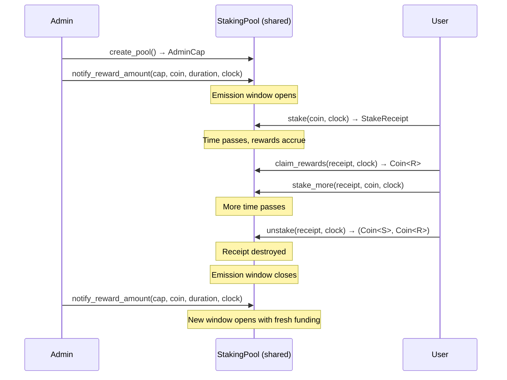

This example implements a generic staking pool where users deposit `Coin<S>` (stake token) and earn `Coin<R>` (reward token) over time, proportional to their share of the pool. It uses the Synthetix reward-per-token accumulator pattern for O(1) reward calculation regardless of how many stakers exist.

The same contract works for yield farming, liquidity mining, fee and revenue sharing, and other pro-rata, time-weighted token distribution use cases.

:::info

`Staking` in this context refers to the DeFi yield-farming pattern (deposit tokens, earn rewards), not proof-of-stake consensus staking.

:::

## When to use this pattern

Use this pattern when you need to:

- Distribute reward tokens proportionally to depositors over a configurable time window.

- Support an unbounded number of stakers without increasing gas costs per interaction.

- Give users a transferable receipt object that represents their position and can compose with other protocols (for example, as collateral).

- Provide admin controls for funding reward schedules, pausing deposits, and recovering unused rewards.

- Guarantee solvency structurally so the pool can never promise more rewards than it holds.

For token vesting (releasing tokens to specific recipients on a schedule rather than proportional distribution to a pool), see [Token vesting strategies](/onchain-finance/fungible-tokens/token-vesting-strategies).

## What you learn

This example teaches:

- **Reward-per-token accumulator:** A single number tracks total reward earned per staked token since the pool began. Each user stores a snapshot of this value when they last interacted. The difference between the current value and the snapshot determines their earnings, with no loops or iteration.

- **Bounded emission windows:** The admin funds a reward period with a specific duration. The accumulator stops advancing after the window closes, making solvency a structural guarantee rather than an operational one.

- **Receipt-based positions:** Each staker receives a `StakeReceipt` owned object that records their deposit amount and accumulator snapshot. The receipt is the position. It can be transferred, used as collateral, or composed in programmable transaction blocks.

- **Capability-gated administration:** An `AdminCap` object authorizes pool operations like funding rewards and pausing. The cap can be transferred to a multisig or burned to make the pool permanently immutable.

- **Composable function signatures:** Every public function returns its results (capabilities, receipts, coins) instead of transferring internally, making the contract fully composable in [programmable transaction blocks](/develop/transactions/ptbs/prog-txn-blocks).

## Architecture

The contract creates three onchain object types with distinct ownership models.

| Object | Abilities | Ownership | Created by | Destroyed by |
|--------|-----------|-----------|------------|--------------|
| `StakingPool<S, R>` | `key` | Shared | `create_pool` | Never |
| `StakeReceipt<S, R>` | `key`, `store` | Owned (transferable) | `stake` | `unstake`, `emergency_unstake` |
| `AdminCap<S, R>` | `key`, `store` | Owned (transferable) | `create_pool` | `destroy_admin_cap` |

The `StakingPool` is a shared object that holds all staked balances, the reward balance, the emission schedule, and the reward-per-token accumulator. The `StakeReceipt` is an owned object given to each staker, recording their deposit amount and a snapshot of the accumulator. The `AdminCap` authorizes administrative operations and is bound to a specific pool by ID.

The following diagram shows the lifecycle of a staking pool.



### How the accumulator works

The core challenge in reward distribution is calculating each staker's share without iterating through all stakers on every interaction. The accumulator solves this with a single number called `reward_per_token` (RPT) that answers: "For every single token staked in this pool, how much total reward has been earned since the beginning?"

Every time someone interacts with the pool (stake, unstake, claim), the contract updates this number:

```
new_RPT = old_RPT + (time_elapsed × reward_rate / total_staked)
```

To calculate how much a specific user earned, subtract their snapshot from the current value:

```
user_reward = user_staked_amount × (current_RPT − user_snapshot_RPT)
```

This is O(1) regardless of how many stakers exist.

Because Move has no floating-point numbers, all RPT math is scaled by a precision factor of 10<sup>18</sup>. The contract multiplies by this factor before dividing, then divides by it when converting back to token amounts. This gives 18 decimal places of accuracy in pure integer arithmetic.

### Emission window and solvency

Accrual is bounded by an explicit emission window `[start_timestamp, stop_timestamp]`. Outside this window, the accumulator stops advancing. The window is set by `notify_reward_amount(coin, duration_ms)`, which derives `reward_rate = (coin_amount + leftover) / duration_ms` and asserts `rate × duration ≤ reward_balance`. This makes solvency structural: any rewards the math can accrue, the pool can pay.

## Prerequisites

<Tabs className="tabsHeadingCentered--small">
<TabItem value="prereq" label="Prerequisites">

- [x] [Install the latest version of Sui](/getting-started/onboarding/sui-install).

- [x] [Configure the Sui client](/getting-started/onboarding/configure-sui-client).

- [x] [Create a Sui address](/getting-started/onboarding/get-address).

- [x] [Get SUI Testnet tokens](/getting-started/onboarding/get-coins).

- [x] Download and install an IDE. The following are recommended, as they offer Move extensions:

    - [VSCode](https://code.visualstudio.com/), corresponding [Move extension](https://marketplace.visualstudio.com/items?itemName=mysten.move)

    - [Emacs](https://www.gnu.org/software/emacs/), corresponding [Move extension](https://github.com/amnn/move-mode)

    - [Vim](https://www.vim.org/download.php), corresponding [Move extension](https://github.com/yanganto/move.vim)

    - [Zed](https://zed.dev/), corresponding [Move extension](https://github.com/Tzal3x/move-zed-extension)

        Alternatively, you can use the [Move web IDE](https://www.playmove.dev/), which does not require a download. It does not support all functions necessary for this guide, however.

- [x] [Download and install Git](https://git-scm.com/downloads).

</TabItem>
</Tabs>

## Setup

Follow these steps to set up the example locally.

##### Step 1: Clone the repo

```bash
$ git clone https://github.com/MystenLabs/staking-contract-template.git
$ cd staking-contract-template/staking
```

##### Step 2: Build and test

```bash
$ sui move build
$ sui move test
```

All tests should pass, confirming the accumulator math, receipt lifecycle, and admin operations work correctly.

##### Step 3: Publish to Testnet

```bash
$ sui client switch --env testnet
$ sui client publish --gas-budget 100000000
```

The package uses implicit framework dependencies (empty `[dependencies]` in `Move.toml`), so the correct Sui framework version resolves from the active environment automatically. Take note of your package ID and the `StakingPool` and `AdminCap` object IDs from the output.

## Run the example

Every entry point is a `public fun` that returns its objects instead of transferring them internally. This makes the module composable in programmable transaction blocks, but it also means plain `sui client call` fails with `UnusedValueWithoutDrop`. Use `sui client ptb` and transfer the results explicitly.

### Create a pool

Create a new staking pool and receive the `AdminCap`. Replace `PKG` with your package ID, and `STAKE_TYPE` and `REWARD_TYPE` with the full type identifiers for your stake and reward tokens.

```bash
$ sui client ptb \
  --move-call PKG::staking::create_pool '<STAKE_TYPE,REWARD_TYPE>' \
  --assign cap \
  --transfer-objects '[cap]' @YOUR_ADDRESS
```

### Fund the reward schedule

Fund the pool with reward tokens and start the emission window. Replace `ADMIN_CAP_ID`, `POOL_ID`, and `REWARD_COIN_ID` with the relevant object IDs. `DURATION_MS` is the emission window length in milliseconds.

```bash
$ sui client ptb \
  --move-call PKG::staking::notify_reward_amount '<STAKE_TYPE,REWARD_TYPE>' \
    @ADMIN_CAP_ID @POOL_ID @REWARD_COIN_ID DURATION_MS @0x6
```

### Stake tokens

Deposit tokens and receive a `StakeReceipt`.

```bash
$ sui client ptb \
  --move-call PKG::staking::stake '<STAKE_TYPE,REWARD_TYPE>' \
    @POOL_ID @STAKE_COIN_ID @0x6 \
  --assign receipt \
  --transfer-objects '[receipt]' @YOUR_ADDRESS
```

### Claim rewards

Withdraw earned rewards while keeping your position open.

```bash
$ sui client ptb \
  --move-call PKG::staking::claim_rewards '<STAKE_TYPE,REWARD_TYPE>' \
    @POOL_ID @RECEIPT_ID @0x6 \
  --assign reward \
  --transfer-objects '[reward]' @YOUR_ADDRESS
```

### Unstake

Fully exit your position. The function consumes the receipt, and you receive your principal and any accrued rewards.

```bash
$ sui client ptb \
  --move-call PKG::staking::unstake '<STAKE_TYPE,REWARD_TYPE>' \
    @POOL_ID @RECEIPT_ID @0x6 \
  --assign out \
  --transfer-objects '[out.0, out.1]' @YOUR_ADDRESS
```

## Key code highlights

<CodeWalkthrough source="staking/sources/staking.move" org="MystenLabs" repo="staking-contract-template" language="move">
  <Step lines="36-47" title="`StakingPool` shared object">
    The pool is a shared object parameterized on `<S, R>` (stake and reward token types). It holds the total staked amount, the reward-per-token accumulator (`reward_per_token_stored`), the emission rate and window (`reward_rate`, `start_timestamp`, `stop_timestamp`), and both token balances. The `paused` flag lets the admin halt new deposits without locking existing principal.
  </Step>
  <Step lines="70-76" title="`StakeReceipt` owned object">
    Each staker receives a receipt recording their staked `amount`, the pool's accumulator value at their last interaction (`reward_per_token_paid`), and any checkpointed `pending_rewards`. The `pool: ID` field binds the receipt to its pool, preventing cross-pool attacks. The `key + store` abilities make the receipt transferable, enabling composability (for example, using it as collateral in another protocol).
  </Step>
  <Step lines="109-121" title="Accumulator calculation">
    The `calculate_reward_per_token` function is the core of the Synthetix pattern. If nobody is staking, the accumulator does not advance (avoids division by zero). Otherwise, it computes time elapsed since the last update, multiplied by the reward rate and the precision factor, divided by total staked. The result accumulates onto the stored value. The `last_applicable_time` helper clamps the current time to the emission window so accrual stops when the window closes.
  </Step>
  <Step lines="238-287" title="Funding the emission schedule">
    `notify_reward_amount` is the admin's primary operation. It finalizes accrual at the old rate, joins the new reward coin into the pool, and computes a new rate that covers both fresh funding and any leftover from an active period. The solvency assertion `rate × duration ≤ reward_balance` structurally prevents the pool from ever promising more than it holds. This function replaces the emission schedule each time it is called, rolling leftover into the new window.
  </Step>
  <Step lines="361-390" title="Staking and receipt creation">
    The `stake` function checks the pool is not paused, updates the accumulator, adds the user's tokens to both the pool balance and `total_staked`, and creates a receipt with the current accumulator as its snapshot. The receipt is returned (not transferred), so it composes in programmable transaction blocks.
  </Step>
  <Step lines="533-560" title="Emergency unstake escape hatch">
    `emergency_unstake` guarantees principal recovery by skipping all reward math. It takes no `Clock` reference and never touches the reward balance, so it works even in a hypothetically underfunded state. The user forfeits any accrued rewards in exchange for a guaranteed exit. This follows the MasterChef `emergencyWithdraw` pattern.
  </Step>
</CodeWalkthrough>

## Worked example

The following walkthrough shows how two stakers interact with a pool, demonstrating how the accumulator distributes rewards fairly.

**Setup:** An admin creates a pool and funds it with 1,000,000 reward tokens over a 10,000ms window, giving a reward rate of 100 tokens per millisecond.

| Time | Action | RPT calculation | Result |
|------|--------|----------------|--------|
| T=0 | Alice stakes 400 | RPT = 0 | Alice snapshot = 0, total staked = 400 |
| T=1000 | Bob stakes 600 | RPT = 0 + (1000 × 100 / 400) = 250 | Bob snapshot = 250, total staked = 1000 |
| T=2000 | Both check earnings | RPT = 250 + (1000 × 100 / 1000) = 350 | Alice: 400 × (350 − 0) = 140,000. Bob: 600 × (350 − 250) = 60,000 |

**Verification:** Total rewards distributed = 2,000ms × 100/ms = 200,000. Alice gets 140,000 (100% of period 1 + 40% of period 2). Bob gets 60,000 (60% of period 2). The math is fair automatically: Alice earns more because she staked alone during the first period.

## Security considerations

The following security properties are important when deploying or extending this contract.

- **Flash-stake risk:** A staker could deposit a large amount and claim in the same programmable transaction block. Consider adding a minimum lock period for production deployments.

- **Permissionless pool creation:** Anyone can call `create_pool` for any `<S, R>` pair. The ID-binding makes impostor pools harmless to real ones, but frontends must pin the exact pool object ID they trust. Never resolve a pool by its type arguments alone.

- **Receipt transfer footgun:** Receipts are transferable by design, but a transfer carries accounting state with it. Any rewards accrued but not yet checkpointed go to the new owner. Senders should call `claim_rewards` immediately before transferring.

- **Admin cap lifecycle:** Burning the `AdminCap` through `destroy_admin_cap` makes the pool permanently immutable. Verify the pool is unpaused and holds no surplus you need to recover before burning.

- **Rounding behavior:** Accumulator increments floor at each update. With an extremely low reward rate against a very large total stake, per-update increments can floor to zero. Keep the reward rate (per-ms, in base units) comfortably above `total_staked / 10^18`.

For a hands-on exercise exploring what happens when a staking contract gets the accumulator pattern wrong, see [Staking with time-accumulation](/getting-started/examples/staking-ctf).

## Common modifications

- **Add a minimum lock period:** Store the stake timestamp on the receipt and enforce a minimum elapsed time before allowing `unstake` or `claim_rewards`. This prevents flash-stake attacks.

- **Multiple reward tokens:** Replace the single `Balance<R>` with a `Bag` of reward balances keyed by type, and maintain a separate accumulator per reward stream. This enables distributing multiple reward tokens from one pool (similar to MasterChef V2).

- **Vesting rewards:** Instead of paying rewards immediately on `claim_rewards`, create a vesting schedule that releases them over time. Combine with [token vesting strategies](/onchain-finance/fungible-tokens/token-vesting-strategies).

- **Cancel reward schedule:** Add a `cancel_schedule` admin function that freezes accrual at the current time and returns unallocated rewards, without requiring all stakers to unstake first.

- **Receipt as NFT with Display:** Add an [Object Display](/develop/objects/display/using-display) that renders the receipt as an NFT showing the staked amount, pool name, and accrued rewards.

## Function reference

### Admin functions

| Function | Parameters | Returns | Description |
|----------|-----------|---------|-------------|
| `create_pool<S, R>` | `ctx` | `AdminCap<S, R>` | Create and share a new pool. Returns the `AdminCap`. Permissionless. |
| `notify_reward_amount` | `cap`, `pool`, `reward_coin`, `duration_ms`, `clock` | (none) | Fund the pool and start or restart the emission window. Derives the rate from amount and duration. Solvency-checked. |
| `admin_withdraw_unused_rewards` | `cap`, `pool`, `clock`, `ctx` | `Coin<R>` | Recover leftover reward tokens after the emission window ends and all stakers unstake. |
| `set_paused` | `cap`, `pool`, `paused` | (none) | Pause or unpause the pool. Pausing blocks `stake` and `stake_more` but keeps `unstake`, `unstake_partial`, and `claim_rewards` open. |
| `destroy_admin_cap` | `cap` | (none) | Burn the cap permanently. The pool becomes immutable. |

### User functions

| Function | Parameters | Returns | Description |
|----------|-----------|---------|-------------|
| `stake` | `pool`, `coin`, `clock`, `ctx` | `StakeReceipt<S, R>` | Deposit tokens. Returns the receipt. |
| `stake_more` | `pool`, `receipt`, `coin`, `clock` | (none) | Add tokens to an existing position. Checkpoints rewards first. |
| `claim_rewards` | `pool`, `receipt`, `clock`, `ctx` | `Coin<R>` | Withdraw earned rewards. Receipt stays active. |
| `unstake` | `pool`, `receipt`, `clock`, `ctx` | `(Coin<S>, Coin<R>)` | Full withdrawal. Consumes the receipt. |
| `unstake_partial` | `pool`, `receipt`, `amount`, `clock`, `ctx` | `(Coin<S>, Coin<R>)` | Partial withdrawal. Returns freed principal and accrued rewards. Receipt stays active. |
| `emergency_unstake` | `pool`, `receipt`, `ctx` | `Coin<S>` | Recover principal only, forfeiting rewards. Works even in underfunded state. |

### View functions

| Function | Returns | Description |
|----------|---------|-------------|
| `receipt_pool_id` | `ID` | Pool this receipt is bound to. |
| `staked_amount` | `u64` | Tokens staked in this receipt. |
| `earned_rewards` | `u64` | Current unclaimed rewards. |
| `total_staked` | `u64` | Total tokens staked across all users. |
| `available_rewards` | `u64` | Reward tokens available in the pool. |
| `reward_rate` | `u64` | Distribution rate (tokens per millisecond). |
| `start_timestamp` | `u64` | Start of the emission window (ms). |
| `stop_timestamp` | `u64` | End of the emission window (ms). |

## Error codes

| Code | Name | Meaning |
|------|------|---------|
| 0 | `EWrongAdminCap` | The `AdminCap` does not bind to this pool. |
| 1 | `EInsufficientStake` | `unstake_partial` called with `amount ≥` staked balance. Use `unstake` for full exits. |
| 2 | `EZeroAmount` | Zero-amount operation (staking 0, claiming with nothing pending). |
| 3 | `EInsufficientRewards` | Pool cannot cover the reward payment. Structurally unreachable after `notify_reward_amount` solvency check. |
| 4 | `EInvalidDuration` | `notify_reward_amount` called with `duration_ms = 0`. |
| 5 | `EPoolNotIdle` | `admin_withdraw_unused_rewards` called while the period is active or stakers remain. |
| 6 | `EPaused` | `stake` or `stake_more` called while the pool is paused. |
| 7 | `EWrongPool` | A `StakeReceipt` was passed to a pool other than the one that minted it. |
| 8 | `EDurationOverflow` | `duration_ms` so large that `now + duration_ms` overflows `u64`. |
| 9 | `EZeroRewardRate` | Non-zero coin provided but derived rate floors to 0. Use a shorter duration or larger amount. |

## Troubleshooting

The following sections address common issues with this example.

### `UnusedValueWithoutDrop` when calling functions

**Symptom:** `sui client call` fails with `UnusedValueWithoutDrop`.

**Cause:** Every public function returns objects instead of transferring them. Plain `sui client call` does not consume the return values.

**Fix:** Use `sui client ptb` and explicitly transfer the returned objects. See the [Run the example](#run-the-example) section for the correct syntax.

### `EZeroRewardRate` when funding the pool

**Symptom:** `notify_reward_amount` aborts with error code 9.

**Cause:** The reward coin amount divided by `duration_ms` floors to zero. Because `duration_ms` is in milliseconds, a small reward amount with a long duration can produce a zero rate.

**Fix:** Use a shorter duration or a larger reward amount. For example, 1,000 tokens over 10,000,000ms (about 2.8 hours) gives a rate of 0, but 1,000 tokens over 1,000ms gives a rate of 1.

### `EWrongPool` when using a receipt

**Symptom:** A user function aborts with error code 7.

**Cause:** A different pool minted the `StakeReceipt` than the one being called. This can happen when multiple pools share the same `<S, R>` type pair.

**Fix:** Verify the receipt's pool ID matches the pool you are interacting with. Use `receipt_pool_id` to check.

### `EPoolNotIdle` when withdrawing unused rewards

**Symptom:** `admin_withdraw_unused_rewards` aborts with error code 5.

**Cause:** Either the emission window has not ended yet, or there are still stakers in the pool.

**Fix:** Wait until the current time is past `stop_timestamp` and all stakers have unstaked. Check `total_staked` and `stop_timestamp` using the view functions.
