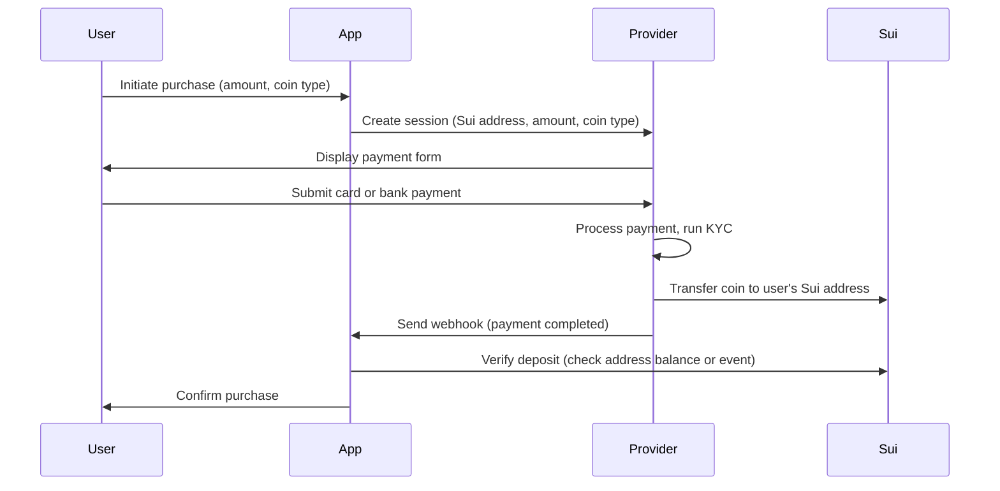
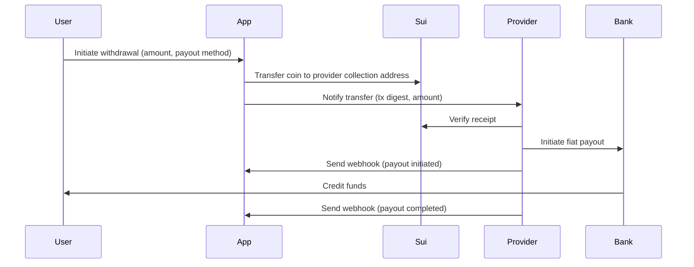

Fiat integration connects traditional payment rails (credit cards, bank transfers, mobile payments) to Sui through third-party providers. Your application manages the onchain leg: wallet addresses, coin types, and transaction verification. The provider handles everything on the fiat side: payment collection, KYC, fraud detection, and bank settlement.

This page covers the integration patterns, lifecycle flows, and error handling for both on-ramps (fiat to crypto) and off-ramps (crypto to fiat).

## Provider integration patterns

Fiat providers such as MoonPay and Transak offer hosted checkout widgets or redirect flows that your application embeds. The provider manages the full fiat payment lifecycle while your application supplies the Sui address and desired coin type.

### Responsibility split

| Provider handles | Your application handles |
|---|---|
| Card and bank payment processing | Target Sui wallet address |
| KYC and identity verification | Desired coin type and amount |
| Fraud detection and prevention | Onchain deposit or withdrawal verification |
| Fiat settlement and banking | User session and transaction state |
| Regulatory compliance for fiat leg | Onchain compliance (deny lists, PAS policies) |

### Integration approaches

Most providers offer two integration models:

- **Embedded widget.** The provider renders a payment form inside your application (typically an iframe or web component). The user completes the purchase without leaving your app. The provider delivers crypto to the Sui address you specify.

- **Redirect flow.** Your application redirects the user to the provider's hosted checkout. After the user completes payment, the provider redirects back to your application and delivers crypto to the specified address.

Both models follow the same backend pattern: your server creates a session with the provider, specifies the target Sui address and coin type, and receives webhook notifications when the payment completes.

## On-ramp: fiat to onchain

The on-ramp flow converts fiat currency into onchain assets. The provider collects the fiat payment, purchases or mints the target coin, and delivers it to the user's Sui address.

### Lifecycle



### Verifying deposits

After the provider reports a successful payment, verify the deposit onchain before confirming to the user. Query the recipient's [address balance](/onchain-finance/asset-custody/address-balances/using-address-balances) or check for a matching deposit event:

```typescript
import { SuiGrpcClient } from '@mysten/sui/grpc';

const client = new SuiGrpcClient({
  baseUrl: 'https://fullnode.mainnet.sui.io:443',
  network: 'mainnet',
});

// Check balance after webhook notification.
const { balance } = await client.getBalance({
  owner: userSuiAddress,
});

console.log('Current balance:', balance.balance);
```

:::caution

Never trust webhook data alone. Always verify the deposit against onchain state before crediting the user's account in your application. Webhooks can be replayed, delayed, or spoofed.

:::

## Off-ramp: onchain to fiat

The off-ramp flow converts onchain assets into fiat currency. Your application transfers the coin to the provider's collection address, and the provider initiates a fiat payout to the user's bank account or card.

### Lifecycle



### Sending funds for off-ramp

Use [address balances](/onchain-finance/asset-custody/address-balances/using-address-balances) to transfer the withdrawal amount to the provider's collection address:

```typescript
import { Transaction } from '@mysten/sui/transactions';

const tx = new Transaction();

tx.moveCall({
  target: '0x2::balance::send_funds',
  typeArguments: ['0x2::sui::SUI'],
  arguments: [
    tx.balance({ balance: withdrawalAmount }),
    tx.pure.address(providerCollectionAddress),
  ],
});

const result = await client.signAndExecuteTransaction({
  signer: userKeypair,
  transaction: tx,
});

// Send the transaction digest to the provider for reconciliation.
await notifyProvider({ digest: result.digest, amount: withdrawalAmount });
```

For more structured off-ramp payments, use [Payment Kit](/onchain-finance/payment-kit) registry payments with the provider as the receiver. This adds duplicate prevention and receipt generation to the flow.

## Webhook and reconciliation

Fiat providers communicate payment status changes through webhooks. Your backend receives these notifications, verifies them, and reconciles against onchain state.

### Webhook handling pattern

Follow this three-step pattern for every webhook:

1. **Verify the webhook signature.** Each provider includes a cryptographic signature in the webhook headers. Validate it against the provider's public key or shared secret to confirm authenticity.

2. **Check onchain state.** Query Sui to verify that the onchain transaction matches the webhook data (correct address, correct amount, correct coin type).

3. **Update application state.** Only after both verifications pass should you update your application's ledger or credit the user's account.

<ImportContent source="examples/regulated-payments/src/webhook-handler.ts" mode="code" tag="webhook-handler" />

### Reconciliation

Run periodic reconciliation to catch any discrepancies between your application ledger and onchain state:

- **Event-based reconciliation.** Subscribe to payment events through [gRPC](/develop/accessing-data/grpc/using-grpc) and compare against your application's payment records.
- **Balance-based reconciliation.** Periodically query [address balances](/onchain-finance/asset-custody/address-balances/using-address-balances) for your collection and payout addresses and compare against expected totals.
- **Provider statement reconciliation.** Match the provider's settlement reports against both your application ledger and onchain records.

For event subscription patterns, see [Using Events](/develop/accessing-data/using-events).

## Error handling: refunds and chargebacks

Sui transactions are final and irreversible. Once a coin transfer executes onchain, no protocol mechanism can reverse it. This has important implications for refund and chargeback handling.

### Chargebacks

When a user disputes a card payment with their bank, the chargeback process is entirely offchain:

1. The user's bank reverses the fiat payment to the provider.
2. The provider notifies your application through a webhook.
3. Your application must decide how to handle the onchain side.

**Options for handling chargebacks:**

- **Absorb the loss.** If the onchain assets have already moved beyond your control, you may need to absorb the chargeback cost. Factor this into your pricing model.
- **Freeze the address.** If you control a `DenyCapV2` for the coin type, you can [freeze the recipient's address](/onchain-finance/regulated-payments#freeze-an-address) to prevent further movement of the disputed funds.
- **Recover through agreement.** If your terms of service allow it, request the user to return the funds. You cannot force this onchain unless you use [PAS clawback](/onchain-finance/pas/pas-workflows) capabilities.

### Refunds

For voluntary refunds (not chargebacks), your application initiates a separate onchain transfer from your treasury back to the user:

<ImportContent source="examples/regulated-payments/src/refund.ts" mode="code" tag="refund" />

:::caution

Build dispute resolution and chargeback policies into your provider agreement, not into your smart contract. Onchain enforcement (deny lists, PAS clawback) supplements your legal agreements but does not replace them.

:::

### Reducing chargeback risk

- Require provider-side KYC before processing payments.
- Use [Payment Kit](/onchain-finance/payment-kit) duplicate prevention to avoid processing the same payment twice.
- Hold funds in a provider-controlled address for a settlement window before releasing to the user.
- Monitor for velocity patterns (many small purchases followed by chargebacks) and flag them to your provider.
