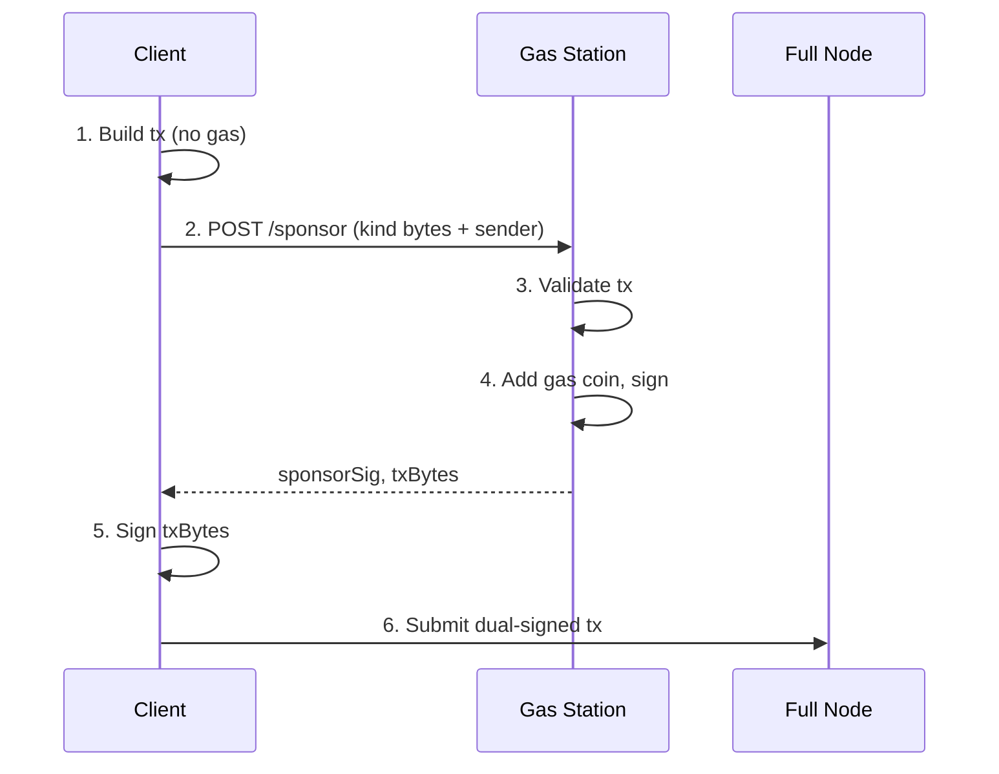

A gas station is a backend service that pays gas on behalf of users or agents. There is no official `sui-gas-station` crate. Build your gas station using the [TypeScript SDK](/develop/transactions/ptbs/building-ptb) and the [sponsored transaction protocol](/develop/transaction-payment/sponsor-txn).

## How it works

The sponsor handshake has five steps:

1. **Client builds a transaction without gas.** The client sets `sender` but omits gas payment, gas budget, and gas owner.

2. **Client sends the transaction bytes to the gas station.** The serialized `Transaction` is sent over HTTPS (or any transport).

3. **Gas station validates the transaction.** The service inspects the transaction kind, checks it against allowlists and budget caps, and rejects anything outside policy.

4. **Gas station adds gas payment and signs.** The service sets `gasOwner`, `gasBudget`, and `gasPayment` (a coin from its pool), builds the final bytes, and signs them with the sponsor keypair.

5. **Client adds its own signature and submits.** The client signs the same bytes and submits the dual-signed transaction to a full node.

## Gas coin pool

The sponsor address needs a pool of SUI coins to fund transactions. Two inflight transactions cannot use a single coin simultaneously. If you try, one transaction fails due to an object version conflict.

### Pre-splitting coins

Split a single large coin into many smaller coins so multiple transactions can be sponsored concurrently:

<ImportContent source="examples/onchain-finance/gas-station/src/split-coins.ts" mode="code" tag="split-coins" />

### Pool management

Track available gas coins in memory. When you use a coin for sponsorship, mark it as reserved until the transaction finalizes. The network always charges gas (even when a transaction fails), so the coin version changes in both cases. After finalization, re-fetch the coin to get its updated version before reusing it.

<ImportContent source="examples/onchain-finance/gas-station/src/pool.ts" mode="code" tag="pool" />

### Replenishment

Monitor pool size. When the number of available coins drops below a threshold, split more coins from a reserve. Automate this with a periodic check or trigger it when `acquire()` returns `null`.

## Validation policies

Before sponsoring a transaction, validate it against your policies. Inspect the transaction commands to enforce:

- **Package allowlist:** Only sponsor transactions that call functions from approved packages.
- **Budget cap:** Reject transactions that request more gas than your per-request limit.
- **Rate limit:** Limit the number of sponsored transactions per sender address per time window.
- **Sender identity:** For agents, verify an API key, a capability object, or a signed challenge.

## Gas station server

The following Express.js server implements the full sponsor flow. The client sends serialized transaction bytes, the server validates, adds gas, signs, and returns the sponsor signature.

### Setup

<ImportContent source="examples/onchain-finance/gas-station/src/server.ts" mode="code" tag="server-setup" />

### Sponsor endpoint

<ImportContent source="examples/onchain-finance/gas-station/src/server.ts" mode="code" tag="sponsor-endpoint" />

### Confirm endpoint

<ImportContent source="examples/onchain-finance/gas-station/src/server.ts" mode="code" tag="confirm-endpoint" />

## Client integration

The client builds a transaction, sends it to the gas station, adds its own signature, and submits the dual-signed transaction.

<ImportContent source="examples/onchain-finance/gas-station/src/client.ts" mode="code" tag="client-flow" />

## Sponsoring agent transactions

When sponsoring transactions for an autonomous agent rather than an interactive user, the validation flow changes:

- **Identity verification:** The agent authenticates with an API key or presents a signed challenge instead of a wallet signature.
- **Spending mandate checks:** The gas station can verify that the agent has a valid [spending mandate](/onchain-finance/agentic-payments/spending-policies) onchain before sponsoring.
- **Per-agent budgets:** Track cumulative gas spend per agent address and enforce daily or weekly caps.

<ImportContent source="examples/onchain-finance/gas-station/src/agent-sponsor.ts" mode="code" tag="agent-sponsor" />

## Monitoring and cost control

Track these metrics for your gas station:

- **Available gas coins.** Alert when the pool drops below 20% capacity.
- **Sponsorship volume.** Requests per minute, broken down by sender address.
- **Gas spend.** Total SUI spent on gas per hour. Compare against your budget.
- **Rejection rate.** Percentage of requests rejected by validation. A spike indicates possible abuse.

Set a maximum daily spend for the entire gas station. When the limit is reached, reject all new sponsorship requests until the next day or until an operator manually raises the limit.

For the protocol-level details of sponsored transactions (GasData structure, risk considerations, sequence diagrams), see [Sponsored Transactions](/develop/transaction-payment/sponsor-txn).
