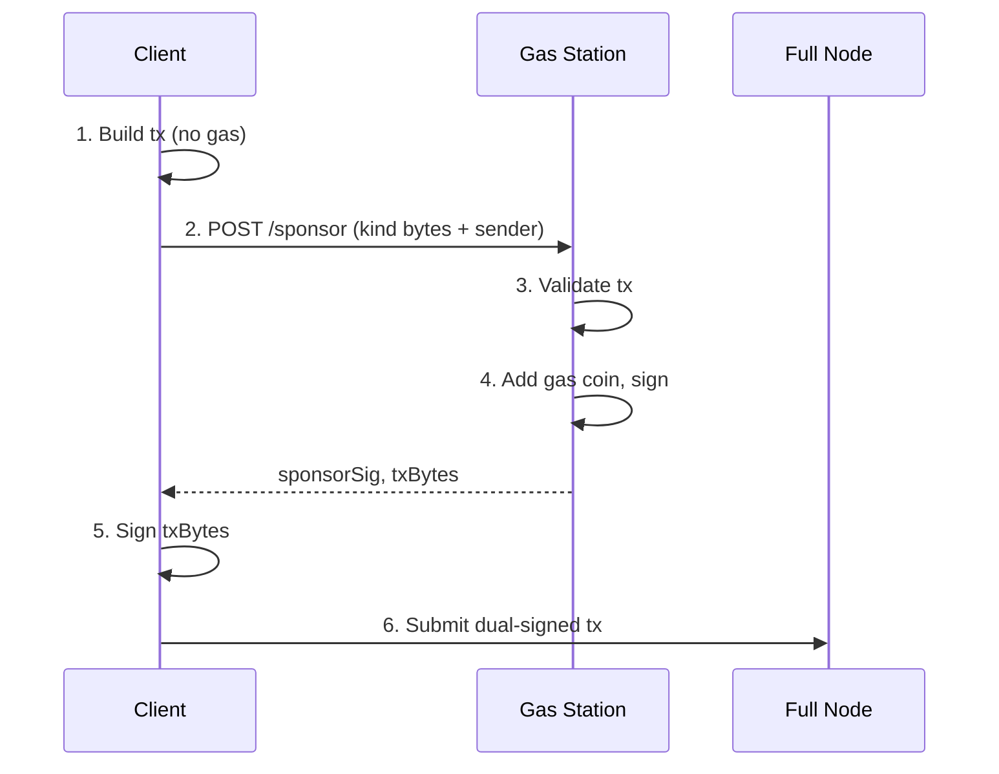

A gas station is a backend service that pays gas on behalf of users or agents. There is no official `sui-gas-station` crate. Build your gas station using the [TypeScript SDK](/develop/transactions/ptbs/building-ptb) and the [sponsored transaction protocol](/develop/transaction-payment/sponsor-txn).

## How it works

The sponsor handshake has five steps:

1. **Client builds a transaction without gas.** The client sets `sender` but omits gas payment, gas budget, and gas owner.

2. **Client sends the transaction bytes to the gas station.** The serialized `Transaction` is sent over HTTPS (or any transport).

3. **Gas station validates the transaction.** The service inspects the transaction kind, checks it against allowlists and budget caps, and rejects anything outside policy.

4. **Gas station adds gas payment and signs.** The service sets `gasOwner`, `gasBudget`, and `gasPayment` (a coin from its pool), builds the final bytes, and signs them with the sponsor key pair.

5. **Client adds its own signature and submits.** The client signs the same bytes and submits the dual-signed transaction to a full node.



## Gas coin pool

The sponsor address needs a pool of SUI coins to fund transactions. A single coin cannot be used by two inflight transactions simultaneously. If it is, one transaction fails due to an object version conflict.

### Pre-splitting coins

Split a single large coin into many smaller coins so multiple transactions can be sponsored concurrently:

```typescript
import { Transaction } from '@mysten/sui/transactions';
import { SuiGrpcClient } from '@mysten/sui/grpc';
import { Ed25519Keypair } from '@mysten/sui/keypairs/ed25519';

const client = new SuiGrpcClient({
  baseUrl: 'https://fullnode.testnet.sui.io:443',
  network: 'testnet',
});
const sponsor = new Ed25519Keypair(); // Your sponsor keypair

// Split gas coin into 100 coins of 1 SUI each
const tx = new Transaction();
const coins = tx.splitCoins(
  tx.gas,
  Array.from({ length: 100 }, () => 1_000_000_000n),
);
// Transfer all split coins back to sponsor (they become separate objects)
for (let i = 0; i < 100; i++) {
  tx.transferObjects([coins[i]], sponsor.toSuiAddress());
}

await client.signAndExecuteTransaction({ transaction: tx, signer: sponsor });
```

### Pool management

Track available gas coins in memory. When a coin is used for sponsorship, mark it as reserved until the transaction finalizes. The network always charges gas (even when a transaction fails), so the coin version changes in both cases. After finalization, re-fetch the coin to get its updated version before reusing it.

```typescript
interface GasCoin {
  objectId: string;
  version: string;
  digest: string;
  reserved: boolean;
}

class GasCoinPool {
  private coins: Map<string, GasCoin> = new Map();

  async initialize(client: SuiGrpcClient, sponsorAddress: string) {
    const ownedCoins = await client.core.listCoins({
      owner: sponsorAddress,
      coinType: '0x2::sui::SUI',
    });
    for (const coin of ownedCoins.objects) {
      this.coins.set(coin.objectId, {
        objectId: coin.objectId,
        version: coin.version,
        digest: coin.digest,
        reserved: false,
      });
    }
  }

  acquire(): GasCoin | null {
    for (const coin of this.coins.values()) {
      if (!coin.reserved) {
        coin.reserved = true;
        return coin;
      }
    }
    return null;
  }

  release(objectId: string, newVersion?: string, newDigest?: string) {
    const coin = this.coins.get(objectId);
    if (coin) {
      coin.reserved = false;
      if (newVersion) coin.version = newVersion;
      if (newDigest) coin.digest = newDigest;
    }
  }

  discard(objectId: string) {
    this.coins.delete(objectId);
  }
}
```

### Replenishment

Monitor pool size. When the number of available coins drops below a threshold, split more coins from a reserve. Automate this with a periodic check or trigger it when `acquire()` returns `null`.

## Validation policies

Before sponsoring a transaction, validate it against your policies. Inspect the transaction commands to enforce:

- **Package allowlist:** Only sponsor transactions that call functions from approved packages.
- **Budget cap:** Reject transactions that request more gas than your per-request limit.
- **Rate limit:** Limit the number of sponsored transactions per sender address per time window.
- **Sender identity:** For agents, verify an API key, a capability object, or a signed challenge.

```typescript
import { Transaction } from '@mysten/sui/transactions';

const ALLOWED_PACKAGES = new Set([
  '0xYOUR_PACKAGE_1',
  '0xYOUR_PACKAGE_2',
]);

const MAX_GAS_BUDGET = 50_000_000; // 0.05 SUI

function validateTransaction(txBytes: Uint8Array): boolean {
  // Deserialize and inspect the transaction
  const tx = Transaction.from(txBytes);

  // Check gas budget
  // Note: actual validation depends on your deserialization approach.
  // You can also validate after building by inspecting the TransactionData.

  return true; // Simplified — implement your own checks
}
```

## Gas station server

The following Express.js server implements the full sponsor flow. The client sends serialized transaction bytes, the server validates, adds gas, signs, and returns the sponsor signature.

```typescript
import express from 'express';
import { Transaction } from '@mysten/sui/transactions';
import { SuiGrpcClient } from '@mysten/sui/grpc';
import { Ed25519Keypair } from '@mysten/sui/keypairs/ed25519';
import { toBase64, fromBase64 } from '@mysten/sui/utils';

const app = express();
app.use(express.json());

const client = new SuiGrpcClient({
  baseUrl: 'https://fullnode.testnet.sui.io:443',
  network: 'testnet',
});

// Load sponsor keypair from environment (Bech32 suiprivkey1... string)
const sponsor = Ed25519Keypair.fromSecretKey(process.env.SPONSOR_SECRET_KEY!);
const sponsorAddress = sponsor.toSuiAddress();

// Initialize gas coin pool
const pool = new GasCoinPool();
await pool.initialize(client, sponsorAddress);

const GAS_BUDGET = 10_000_000; // 0.01 SUI

app.post('/sponsor', async (req, res) => {
  try {
    const { txBytes } = req.body; // Base64-encoded transaction bytes

    // 1. Deserialize the client's transaction kind bytes.
    // The client sends kind-only bytes (built with onlyTransactionKind: true),
    // so use Transaction.fromKind() — not Transaction.from() — to reconstruct them.
    const { txBytes, sender } = req.body; // sender is the user's Sui address
    const tx = Transaction.fromKind(fromBase64(txBytes));
    tx.setSender(sender);

    // 2. Acquire a gas coin from the pool
    const gasCoin = pool.acquire();
    if (!gasCoin) {
      return res.status(503).json({ error: 'No gas coins available' });
    }

    try {
      // 3. Set gas payment from the sponsor
      tx.setGasOwner(sponsorAddress);
      tx.setGasBudget(GAS_BUDGET);
      tx.setGasPayment([{
        objectId: gasCoin.objectId,
        version: gasCoin.version,
        digest: gasCoin.digest,
      }]);

      // 4. Build the final transaction bytes
      const bytes = await tx.build({ client });

      // 5. Sign with the sponsor key
      const sponsorSig = await sponsor.signTransaction(bytes);

      // 6. Return the signed bytes, sponsor signature, and coin ID
      //    The client must call POST /sponsor/confirm after submission
      //    so the pool can update the coin version and release it.
      res.json({
        txBytes: toBase64(bytes),
        sponsorSignature: sponsorSig.signature,
        gasCoinId: gasCoin.objectId,
      });
    } catch (error) {
      pool.release(gasCoin.objectId);
      throw error;
    }
  } catch (error) {
    res.status(400).json({ error: (error as Error).message });
  }
});

// Client calls this after submitting the dual-signed transaction.
// Without this callback, sponsored coins stay reserved and the pool drains.
app.post('/sponsor/confirm', async (req, res) => {
  const { gasCoinId, digest } = req.body;

  try {
    // Wait for the transaction to finalize, then re-fetch the gas coin
    // to get its updated version. Gas is always charged — even on
    // failed transactions — so the coin version changes in both cases.
    await client.waitForTransaction({ digest });

    const { object } = await client.core.getObject({
      objectId: gasCoinId,
    });

    pool.release(gasCoinId, object.version, object.digest);
    res.json({ ok: true });
  } catch {
    // RPC or indexing error — try a direct object fetch as fallback.
    try {
      const { object } = await client.core.getObject({ objectId: gasCoinId });
      pool.release(gasCoinId, object.version, object.digest);
    } catch {
      // Object fetch also failed — remove the coin from the pool.
      // A background replenishment job will replace it.
      pool.discard(gasCoinId);
    }
    res.json({ ok: true });
  }
});

app.listen(3001, () => console.log('Gas station running on :3001'));
```

## Client integration

The client builds a transaction, sends it to the gas station, adds its own signature, and submits the dual-signed transaction.

```typescript
import { Transaction } from '@mysten/sui/transactions';
import { SuiGrpcClient } from '@mysten/sui/grpc';
import { Ed25519Keypair } from '@mysten/sui/keypairs/ed25519';
import { toBase64, fromBase64 } from '@mysten/sui/utils';

const client = new SuiGrpcClient({
  baseUrl: 'https://fullnode.testnet.sui.io:443',
  network: 'testnet',
});

const user = new Ed25519Keypair();

// 1. Build the transaction without gas
const tx = new Transaction();
tx.moveCall({ target: '0xPACKAGE::module::function' });

// 2. Serialize and send to gas station
const txBytes = await tx.build({ client, onlyTransactionKind: true });
const response = await fetch('http://localhost:3001/sponsor', {
  method: 'POST',
  headers: { 'Content-Type': 'application/json' },
  body: JSON.stringify({ txBytes: toBase64(txBytes), sender: user.toSuiAddress() }),
});

const { txBytes: sponsoredBytes, sponsorSignature, gasCoinId } = await response.json();

// 3. Sign with the user's key
const finalBytes = fromBase64(sponsoredBytes);
const userSig = await user.signTransaction(finalBytes);

// 4. Submit with both signatures
const result = await client.core.executeTransaction({
  transaction: finalBytes,
  signatures: [userSig.signature, sponsorSignature],
  include: { effects: true },
});

// 5. Confirm to the gas station so it can release the coin.
//    Always confirm — even on failure — because gas is still charged.
const digest =
  result.$kind === 'Transaction'
    ? result.Transaction.digest
    : result.FailedTransaction.digest;

await fetch('http://localhost:3001/sponsor/confirm', {
  method: 'POST',
  headers: { 'Content-Type': 'application/json' },
  body: JSON.stringify({ gasCoinId, digest }),
});
```

## Sponsoring agent transactions

When sponsoring transactions for an autonomous agent rather than an interactive user, the validation flow changes:

- **Identity verification:** The agent authenticates with an API key or presents a signed challenge instead of a wallet signature.
- **Spending mandate checks:** The gas station can verify that the agent has a valid [spending mandate](/onchain-finance/agentic-payments/spending-policies) onchain before sponsoring.
- **Per-agent budgets:** Track cumulative gas spend per agent address and enforce daily or weekly caps.

```typescript
app.post('/sponsor/agent', async (req, res) => {
  const { txBytes, apiKey } = req.body;

  // Verify agent identity
  const agent = await verifyApiKey(apiKey);
  if (!agent) {
    return res.status(401).json({ error: 'Invalid API key' });
  }

  // Check per-agent daily budget
  const todaySpend = await getAgentDailySpend(agent.address);
  if (todaySpend + GAS_BUDGET > agent.dailyGasBudget) {
    return res.status(429).json({ error: 'Daily gas budget exceeded' });
  }

  // ... same sponsorship flow as above
});
```

## Monitoring and cost control

Track these metrics for your gas station:

- **Available gas coins.** Alert when the pool drops below 20% capacity.
- **Sponsorship volume.** Requests per minute, broken down by sender address.
- **Gas spend.** Total SUI spent on gas per hour. Compare against your budget.
- **Rejection rate.** Percentage of requests rejected by validation. A spike might indicate abuse.

Set a maximum daily spend for the entire gas station. When the limit is reached, reject all new sponsorship requests until the next day or until an operator manually raises the limit.

For the protocol-level details of sponsored transactions (GasData structure, risk considerations, sequence diagrams), see [Sponsored Transactions](/develop/transaction-payment/sponsor-txn).
