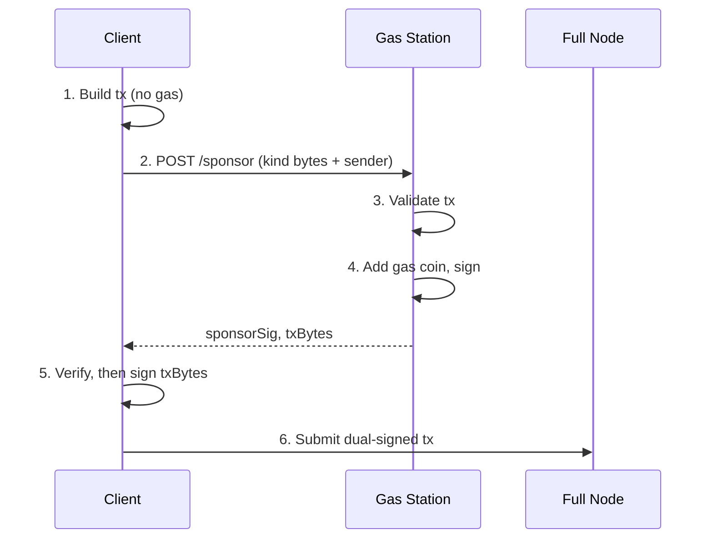

A gas station is a backend service that pays gas on behalf of users or agents.

The recommended approach is [`@mysten-incubation/sponsor`](https://www.npmjs.com/package/@mysten-incubation/sponsor), which handles gas coin management and the dual-signature flow. You must still apply an application-specific, deny-by-default transaction policy before signing. For custom requirements (non-standard validation, self-managed coin pools), see the [self-hosted gas station](#self-hosted-gas-station) section below.

## How it works

The sponsor handshake has six steps:

1. **Client builds a transaction without gas.** The client sets `sender` but omits gas payment, gas budget, and gas owner.

2. **Client sends the transaction kind bytes to the gas station.** The client sends only the transaction kind (built with `onlyTransactionKind: true`) plus its sender address, over HTTPS or any transport.

3. **Gas station validates the transaction.** The service inspects the transaction kind, checks it against allowlists and budget caps, and rejects anything outside policy.

4. **Gas station adds gas payment and signs.** The service sets `gasOwner`, `gasBudget`, and `gasPayment` (a coin from its pool), builds the final bytes, and signs them with the sponsor keypair.

5. **Client verifies what came back.** The client reconstructs the transaction and checks that the kind bytes and sender are unchanged and that the gas data is within policy, before signing anything.

6. **Client adds its own signature and submits.** The client signs the verified bytes and submits the dual-signed transaction to a full node.


```mermaid
sequenceDiagram
    participant C as Client
    participant G as Gas Station
    participant N as Full Node
    C->>C: 1. Build tx (no gas)
    C->>G: 2. POST /sponsor (kind bytes + sender)
    G->>G: 3. Validate tx
    G->>G: 4. Add gas coin, sign
    G-->>C: sponsorSig, txBytes
    C->>C: 5. Verify, then sign txBytes
    C->>N: 6. Submit dual-signed tx
```

## Using `@mysten-incubation/sponsor`

Install the package:

```sh npm2yarn
npm install @mysten-incubation/sponsor
```

Create a sponsor from a keypair. The package manages gas coin selection, splitting, and version tracking automatically:

<ImportContent
  source="examples/onchain-finance/gas-station/src/sponsor-sdk.ts"
  mode="code"
  tag="sponsor-sdk-create"
/>

To sponsor a transaction, pass the client's transaction bytes and get back signed bytes:

<ImportContent
  source="examples/onchain-finance/gas-station/src/sponsor-sdk.ts"
  mode="code"
  tag="sponsor-sdk-sponsor"
/>

The package manages gas coins and the dual-signature flow. It does not decide what is safe to sponsor. Pass a `validate` callback to enforce a deny-by-default policy before sponsoring. Without one, any caller holding your endpoint can spend the sponsor's gas coin:

<ImportContent
  source="examples/onchain-finance/gas-station/src/sponsor-sdk.ts"
  mode="code"
  tag="sponsor-sdk-validate"
/>

For full API details, see the [`@mysten-incubation/sponsor` README](https://github.com/MystenLabs/ts-sdks/tree/main/packages/sponsor).

## Self-hosted gas station

If you need full control over gas coin management (custom pool strategies, multi-tenant isolation, or non-standard validation), build a self-hosted gas station using the TypeScript SDK directly.

These examples use `SuiGrpcClient` and the Core API. JSON-RPC is deprecated and is being decommissioned; see the [JSON-RPC Migration Guide](/develop/accessing-data/json-rpc-migration).

### Gas coin pool

The sponsor address needs a pool of SUI coins to fund transactions. Two inflight transactions cannot use a single coin simultaneously. If you try, one transaction fails due to an object version conflict.

Because the pool is deliberately made up of many small coins, paginate when you load it: a single owned-objects page will not return all of them. Skip coins that cannot cover the gas budget, or the sponsor hands out a coin that only fails at simulation.

### Pre-splitting coins

Split a single large coin into many smaller coins so multiple transactions can be sponsored concurrently:

<ImportContent
	source="examples/onchain-finance/gas-station/src/split-coins.ts"
	mode="code"
	tag="split-coins"
/>

### Pool management

Track available gas coins in memory. When you use a coin for sponsorship, mark it as reserved until the transaction finalizes. The network always charges gas (even when a transaction fails), so the coin version changes in both cases. After finalization, re-fetch the coin to get its updated version before reusing it.

<ImportContent source="examples/onchain-finance/gas-station/src/pool.ts" mode="code" tag="pool" />

### Replenishment

Monitor pool size. When the number of available coins drops below a threshold, split more coins from a reserve. Automate this with a periodic check or trigger it when `acquire()` returns `null`.

## Validation policies

Before sponsoring a transaction, validate it against a deny-by-default policy:

- **Command and package allowlist:** Sponsor only explicitly approved Move calls. Reject transfers, coin splitting or merging, publish, upgrade, intents, and every use of `GasCoin`; otherwise a client can transfer the sponsor's whole gas coin.
- **Inputs:** Bound command and input counts. Validate object IDs, recipients, and pure values required by every approved call. The example rejects all object inputs.
- **Type arguments:** Bound and allowlist them. An approved generic function still reaches arbitrary code through a caller-chosen type argument.
- **Budget and expiration:** The sponsor sets a fixed gas budget and short epoch expiration.
- **Simulation:** Dry-run the final transaction after attaching gas and reject unsuccessful execution before signing.
- **Identity and rate limits:** Authenticate callers and limit each credential and each sender independently. The example issues per-client credentials so one caller cannot exhaust the shared quota; use a shared rate-limit store once you run more than one instance.

## Gas station server

The following Express.js server demonstrates this restricted flow. It authenticates and rate-limits callers, accepts only configured Move calls with pure inputs and no `GasCoin` argument, sets a capped budget and epoch expiration, dry-runs the final transaction, and then signs it. Replace the placeholder allowlist with your application's complete argument policy.

### Setup

<ImportContent
	source="examples/onchain-finance/gas-station/src/server.ts"
	mode="code"
	tag="server-setup"
/>

### Sponsor endpoint

<ImportContent
	source="examples/onchain-finance/gas-station/src/server.ts"
	mode="code"
	tag="sponsor-endpoint"
/>

### Confirm endpoint

<ImportContent
	source="examples/onchain-finance/gas-station/src/server.ts"
	mode="code"
	tag="confirm-endpoint"
/>

### Reservation reconciliation

A client might never confirm. The server therefore reconciles reservations onchain and claims each reservation before awaiting RPC calls. It reuses a coin only after observing the sponsored transaction or after its epoch expiration makes late submission invalid.

<ImportContent
	source="examples/onchain-finance/gas-station/src/server.ts"
	mode="code"
	tag="reservation-reconciliation"
/>

## Client integration

The client must not blindly sign returned bytes. It reconstructs the transaction, verifies that kind bytes and sender are unchanged, checks the sponsor identity, gas payment count and ID, budget cap, and digest, then dry-runs before signing.

<ImportContent
	source="examples/onchain-finance/gas-station/src/client.ts"
	mode="code"
	tag="client-flow"
/>

## Sponsoring agent transactions

When sponsoring transactions for an autonomous agent rather than an interactive user, the validation flow changes:

- **Identity verification:** The agent authenticates with an API key or presents a signed challenge instead of a wallet signature.
- **Spending mandate checks:** The gas station can verify that the agent has a valid [spending mandate](/onchain-finance/agentic-payments/spending-policies) onchain before sponsoring.
- **Per-agent budgets:** Track cumulative gas spend per agent address and enforce daily or weekly caps.

<ImportContent
	source="examples/onchain-finance/gas-station/src/agent-sponsor.ts"
	mode="code"
	tag="agent-sponsor"
/>

## Monitoring and cost control

Track these metrics for your gas station:

- **Available gas coins.** Alert when the pool drops below 20% capacity.
- **Sponsorship volume.** Requests per minute, broken down by sender address.
- **Gas spend.** Total SUI spent on gas per hour. Compare against your budget.
- **Rejection rate.** Percentage of requests rejected by validation. A spike indicates possible abuse.

Set a maximum daily spend for the entire gas station. When the limit is reached, reject all new sponsorship requests until the next day or until an operator manually raises the limit.

For the protocol-level details of sponsored transactions (GasData structure, risk considerations, sequence diagrams), see [Sponsored Transactions](/develop/transaction-payment/sponsor-txn).
